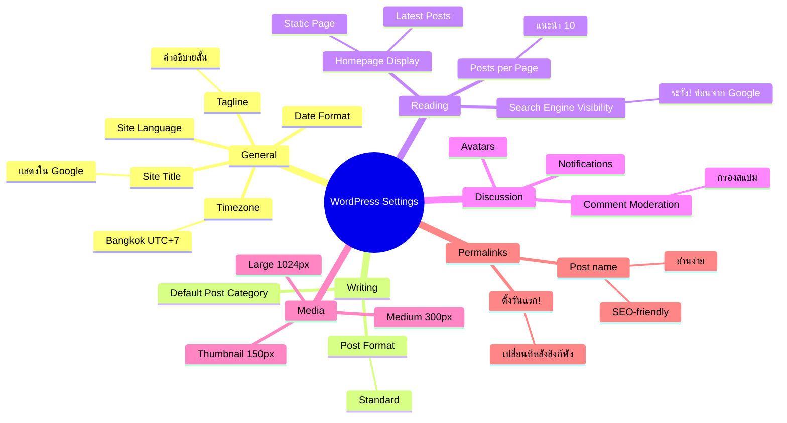

# Mind Map: วิธีการตั้งค่าต่างๆ ของ WordPress — WEB2-001
> **Format:** Mind Map (Text-based + Mermaid)
> **Source:** SWP3 Ch11 สร้างเว็บไซต์ Part 2 ตอนที่ 1
> **Production:** PinkCastle Academy | จูล่ง CTO
> **Date:** 2026-02-17

---

```
                    WordPress Settings
                     (การตั้งค่า WP)
                            |
        ┌──────┬──────┬─────┼─────┬──────┬──────┐
        |      |      |     |     |      |      |
   [General] [Writing] [Reading] [Discussion] [Media] [Permalinks]
        |      |      |     |     |      |
```

## Center Node: WordPress Settings (การตั้งค่า WordPress)

### Branch 1: General Settings (ตั้งค่าทั่วไป)
- Site Title (ชื่อเว็บไซต์)
  - แสดงใน Google Search Results
  - ใช้ชื่อแบรนด์หรือธุรกิจ
- Tagline (คำอธิบายสั้น)
  - อธิบายว่าเว็บเกี่ยวกับอะไร
  - แสดงคู่กับ Site Title ใน Google
- Timezone (เขตเวลา)
  - ไทย: Bangkok / UTC+7
  - ส่งผลต่อเวลาแสดงในบทความ
- Date Format (รูปแบบวันที่)
  - เลือกตามความถนัด
- Site Language (ภาษา)
  - เว็บไทย: เลือกภาษาไทย

### Branch 2: Writing Settings (ตั้งค่าการเขียน)
- Default Post Category
  - หมวดหมู่เริ่มต้นเมื่อลืมเลือก
  - ควรตั้งเป็นหมวดที่ใช้บ่อย
- Post Format
  - ส่วนใหญ่ใช้ Standard
  - มีหลายแบบ: Image, Video, Quote ฯลฯ

### Branch 3: Reading Settings (ตั้งค่าการอ่าน)
- Homepage Display
  - Latest Posts (เหมาะบล็อก)
  - Static Page (เหมาะเว็บธุรกิจ)
- Blog Pages Show
  - จำนวนโพสต์ต่อหน้า
  - แนะนำ 10 โพสต์
- Search Engine Visibility
  - ติ๊ก = Google ไม่จัดอันดับ
  - ต้องเอาออกเมื่อเว็บพร้อม

### Branch 4: Discussion Settings (ตั้งค่าคอมเมนต์)
- Comment Moderation
  - แนะนำเปิด — กรองสแปม
  - อนุมัติก่อนแสดง
- Avatars (รูปโปรไฟล์)
  - แสดงรูปผู้คอมเมนต์
- Notifications (การแจ้งเตือน)
  - อีเมลเมื่อมีคอมเมนต์ใหม่

### Branch 5: Media Settings (ตั้งค่ารูปภาพ)
- Thumbnail
  - 150 x 150 พิกเซล
- Medium
  - 300 x 300 พิกเซล
- Large
  - 1024 x 1024 พิกเซล
- หมายเหตุ
  - WordPress สร้าง 3 สำเนาอัตโนมัติ
  - ค่าเริ่มต้นใช้ได้ดี

### Branch 6: Permalink Settings (ตั้งค่า URL) — สำคัญที่สุด
- ตัวเลือก
  - Plain: ?p=123 (ไม่แนะนำ)
  - Day and name: /2026/02/17/title
  - Post name: /title (แนะนำมากที่สุด)
- เหตุผลที่เลือก Post name
  - URL สะอาด อ่านง่าย
  - SEO-friendly
  - Google เข้าใจเนื้อหา
- คำเตือน
  - ต้องตั้งตั้งแต่วันแรก
  - เปลี่ยนทีหลัง = ลิงก์เก่าพังทั้งหมด

---

## Mermaid Diagram



---

**จำนวน Nodes ทั้งหมด: 38 nodes**

| ระดับ | จำนวน |
|-------|-------|
| Center Node | 1 |
| Branch (ระดับ 1) | 6 |
| Sub-branch (ระดับ 2) | 17 |
| Leaf (ระดับ 3) | 14 |
| **รวม** | **38** |
