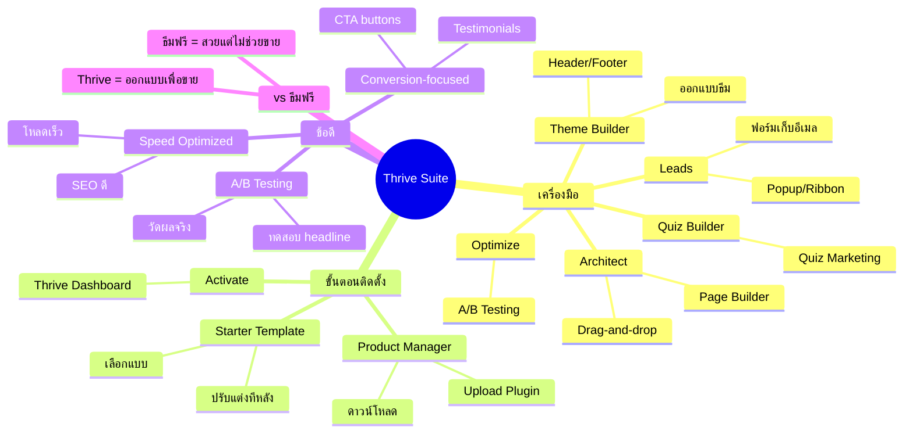

# Mind Map: วิธีการตั้ง Thrive Theme Plugin — WEB2-002
> **Format:** Mind Map (Text-based + Mermaid)
> **Source:** SWP3 Ch11 สร้างเว็บไซต์ Part 2 ตอนที่ 2
> **Production:** PinkCastle Academy | จูล่ง CTO
> **Date:** 2026-02-17

---

```
                       Thrive Theme
                      (Thrive Suite)
                            |
        ┌──────────┬────────┼────────┬──────────┐
        |          |        |        |          |
  [เครื่องมือ]  [ติดตั้ง]  [ข้อดี]  [vs ธีมฟรี] [ราคา]
        |          |        |        |          |
```

## Center Node: Thrive Theme (Thrive Suite)

### Branch 1: เครื่องมือในชุด (Suite Components)
- Thrive Theme Builder
  - ออกแบบธีมทั้งเว็บ
  - Header, Footer, Template
- Thrive Architect
  - Page Builder ลากวาง
  - Conversion elements
- Thrive Leads
  - ฟอร์มเก็บอีเมล
  - Popup, Ribbon, Slide-in
- Thrive Quiz Builder
  - Quiz Marketing
  - เก็บข้อมูลลูกค้า
- Thrive Optimize
  - A/B Testing
  - วัดผล Conversion

### Branch 2: ขั้นตอนการติดตั้ง (Installation)
- ขั้นตอนที่ 1
  - ดาวน์โหลด Thrive Product Manager
  - จาก thrivethemes.com
- ขั้นตอนที่ 2
  - Upload Plugin ใน WordPress
  - Plugins > Add New > Upload
- ขั้นตอนที่ 3
  - Activate ผ่าน Thrive Dashboard
  - เลือกเครื่องมือที่ต้องการ
- ขั้นตอนที่ 4
  - เลือก Starter Template
  - ธีมสำเร็จรูปพร้อมใช้
- ขั้นตอนที่ 5
  - ปรับแต่งผ่าน Theme Dashboard
  - ศูนย์ควบคุมหลัก

### Branch 3: ข้อดี 3 ประการ (Benefits)
- Conversion-focused
  - ทุก element ออกแบบเพื่อกระตุ้น action
  - CTA, Testimonials, Countdown
- A/B Testing
  - ทดสอบ headline, สีปุ่ม, layout
  - ตัดสินใจจากข้อมูลจริง
- Speed Optimized
  - โหลดเร็ว
  - ส่งผลดีต่อ SEO

### Branch 4: เปรียบเทียบกับธีมฟรี (Comparison)
- ธีมฟรี
  - สวยแต่ไม่ช่วยขาย
  - ไม่มี A/B Testing
  - ต้องซื้อเครื่องมือเพิ่ม
- Thrive Suite
  - ออกแบบเพื่อขาย
  - มี A/B Testing ในตัว
  - ครบจบในชุดเดียว

### Branch 5: ราคาและความคุ้มค่า (Pricing)
- จ่ายรายปี
  - รวมทุกเครื่องมือ
  - ใช้ได้หลายเว็บไซต์
- คุ้มค่ากว่าซื้อแยก
  - Page Builder + Lead Gen + A/B Test
  - แยกซื้อแพงกว่ามาก

---

## Mermaid Diagram



---

**จำนวน Nodes ทั้งหมด: 40 nodes**

| ระดับ | จำนวน |
|-------|-------|
| Center Node | 1 |
| Branch (ระดับ 1) | 5 |
| Sub-branch (ระดับ 2) | 18 |
| Leaf (ระดับ 3) | 16 |
| **รวม** | **40** |
