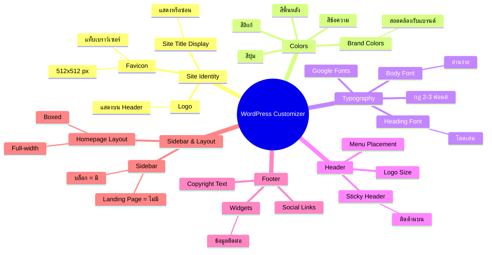

# Mind Map: วิธีการปรับแต่ง General Setting — WEB2-003
> **Format:** Mind Map (Text-based + Mermaid)
> **Source:** SWP3 Ch11 สร้างเว็บไซต์ Part 2 ตอนที่ 3
> **Production:** PinkCastle Academy | จูล่ง CTO
> **Date:** 2026-02-17

---

```
                  WordPress Customizer
                  (ปรับแต่ง General Settings)
                            |
        ┌──────┬──────┬─────┼─────┬──────┬──────┐
        |      |      |     |     |      |      |
  [Site ID] [Colors] [Typo] [Header] [Footer] [Layout]
        |      |      |     |     |      |
```

## Center Node: WordPress Customizer (ปรับแต่ง General Settings)

### Branch 1: Site Identity (ตัวตนเว็บไซต์)
- Logo (โลโก้)
  - แสดงบน Header ทุกหน้า
  - สะท้อนแบรนด์
- Site Icon / Favicon
  - รูปเล็กบนแท็บเบราว์เซอร์
  - ขนาด 512x512 พิกเซล
  - สี่เหลี่ยมจัตุรัส
- Site Title Display
  - แสดงชื่อ + Logo
  - หรือ Logo อย่างเดียว

### Branch 2: Colors (สีสัน)
- Brand Colors
  - สอดคล้องกับ Brand Identity
  - กำหนด Palette ก่อนเริ่ม
- สีที่ต้องกำหนด
  - สีพื้นหลัง (Background)
  - สีข้อความ (Text)
  - สีลิงก์ (Link)
  - สีปุ่ม (Button)

### Branch 3: Typography (ฟอนต์)
- ฟอนต์ Heading
  - สำหรับหัวข้อ
  - เลือกแบบโดดเด่น
- ฟอนต์ Body
  - สำหรับเนื้อหา
  - เลือกแบบอ่านง่าย
- กฎ: ไม่เกิน 2-3 ฟอนต์
  - เยอะเกิน = ดูรก + โหลดช้า
- แหล่ง: Google Fonts
  - ฟรี + รองรับทุกอุปกรณ์

### Branch 4: Header (ส่วนหัว)
- Menu Placement
  - ข้างโลโก้
  - ใต้โลโก้
  - Hamburger Menu
- Logo Size
  - ชัดเจนแต่ไม่บังเนื้อหา
- Sticky Header
  - ติดด้านบนตลอด
  - เข้าถึงเมนูได้ง่าย

### Branch 5: Footer (ส่วนท้าย)
- Widgets
  - ข้อมูลติดต่อ
  - เมนูลิงก์ด่วน
- Copyright Text
  - ข้อความลิขสิทธิ์
- Social Links
  - Facebook, Instagram, YouTube

### Branch 6: Sidebar & Homepage Layout
- Sidebar
  - บล็อก: มี (ด้านขวา)
  - Landing Page: ไม่มี
- Homepage Layout
  - Full-width (เต็มหน้าจอ)
  - Boxed (มีขอบ)
  - Hero Section

---

## Mermaid Diagram



---

**จำนวน Nodes ทั้งหมด: 40 nodes**

| ระดับ | จำนวน |
|-------|-------|
| Center Node | 1 |
| Branch (ระดับ 1) | 6 |
| Sub-branch (ระดับ 2) | 19 |
| Leaf (ระดับ 3) | 14 |
| **รวม** | **40** |
