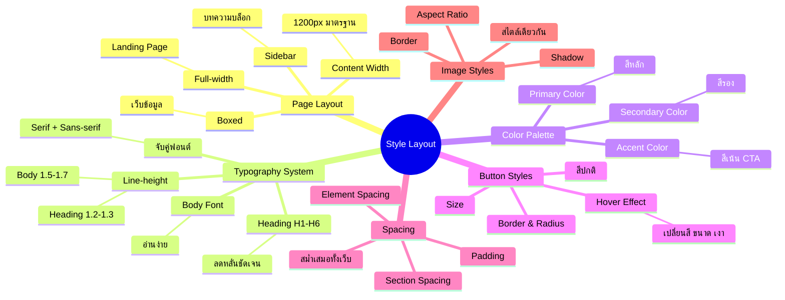

# Mind Map: วิธีการปรับแต่ง Style Layout — WEB2-004
> **Format:** Mind Map (Text-based + Mermaid)
> **Source:** SWP3 Ch11 สร้างเว็บไซต์ Part 2 ตอนที่ 4
> **Production:** PinkCastle Academy | จูล่ง CTO
> **Date:** 2026-02-17

---

```
                      Style Layout
                    (Design System)
                          |
        ┌──────┬──────┬───┼───┬──────┬──────┐
        |      |      |   |   |      |      |
   [Layout] [Typo] [Color] [Button] [Space] [Image]
        |      |      |   |   |      |
```

## Center Node: Style Layout (Design System)

### Branch 1: Page Layout (รูปแบบเลย์เอาต์)
- Full-width
  - เต็มหน้าจอ
  - เหมาะ Landing Page
- Boxed
  - มีขอบสองข้าง
  - เหมาะเว็บข้อมูล
- Sidebar Left / Right
  - มีแถบด้านข้าง
  - เหมาะบทความบล็อก
- Content Width
  - มาตรฐาน 1200px
  - สมดุลระหว่างอ่านง่ายกับพื้นที่

### Branch 2: Typography System (ระบบฟอนต์)
- Heading (H1-H6)
  - ลดหลั่นชัดเจน
  - H1 ใหญ่สุด → H6 เล็กสุด
- Body Font Size
  - อ่านง่าย ไม่เล็กเกิน
- Line-height
  - Body: 1.5-1.7
  - Heading: 1.2-1.3
- จับคู่ฟอนต์
  - Serif + Sans-serif
  - ต่างกันแต่กลมกลืน

### Branch 3: Color Palette (ระบบสี)
- Primary Color
  - สีหลักของแบรนด์
  - ใช้มากที่สุด
- Secondary Color
  - สีรอง
  - ใช้เสริมสีหลัก
- Accent Color
  - สีเน้น
  - สำหรับ CTA ปุ่ม ลิงก์

### Branch 4: Button Styles (สไตล์ปุ่ม)
- สีปกติ (Normal)
- สี Hover (เมาส์ชี้)
  - เปลี่ยนสี / ขนาด / เงา
  - บอกผู้ใช้ "คลิกได้"
- Border (ขอบ)
- Size (ขนาด)
- Border Radius (มุมปุ่ม)

### Branch 5: Spacing Standards (มาตรฐานระยะห่าง)
- Section Spacing
  - ระยะห่างระหว่าง Section
- Element Spacing
  - ระยะห่างระหว่างองค์ประกอบ
- Padding
  - ระยะห่างภายใน
- ต้องสม่ำเสมอทั้งเว็บ

### Branch 6: Image Styles (สไตล์รูปภาพ)
- Border (ขอบ)
  - มีหรือไม่มี
- Shadow (เงา)
  - มีหรือไม่มี
- Aspect Ratio
  - อัตราส่วน เช่น 16:9, 4:3
- สไตล์เดียวกันทุกรูป

---

## Mermaid Diagram



---

**จำนวน Nodes ทั้งหมด: 42 nodes**

| ระดับ | จำนวน |
|-------|-------|
| Center Node | 1 |
| Branch (ระดับ 1) | 6 |
| Sub-branch (ระดับ 2) | 21 |
| Leaf (ระดับ 3) | 14 |
| **รวม** | **42** |
