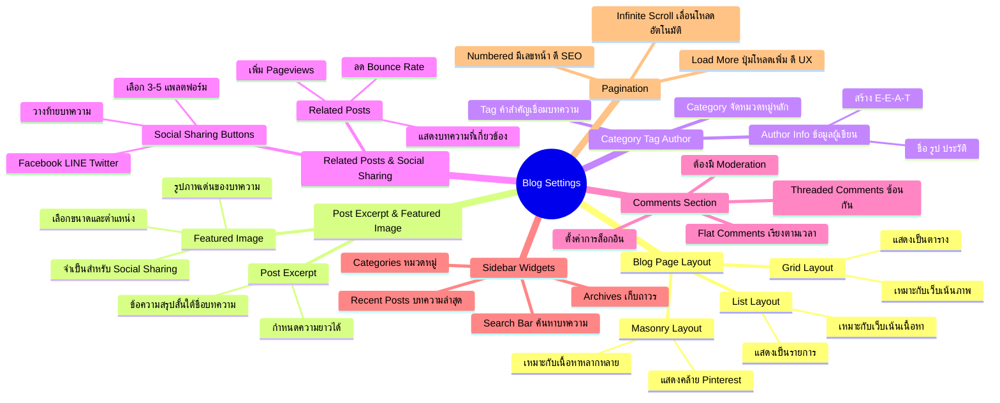

# Mind Map: วิธีปรับแต่ง Blog Settings — WEB2-005
> **Format:** Mind Map (Text-based)
> **Source:** SWP3 Ch11 สร้างเว็บไซต์ Part 2 ตอนที่ 5
> **Production:** PinkCastle Academy | จูล่ง CTO
> **Date:** 2026-02-17

---

---

## Center Node: Blog Settings

### Branch 1: Blog Page Layout
- Grid Layout
  - แสดงบทความเป็นตาราง มีรูปภาพใหญ่
  - เหมาะกับเว็บที่เน้นภาพถ่ายหรือพอร์ตโฟลิโอ
- List Layout
  - แสดงบทความเป็นรายการจากบนลงล่าง
  - เหมาะกับเว็บที่เน้นเนื้อหาเป็นหลัก
- Masonry Layout
  - แสดงคล้าย Pinterest ขนาดไม่เท่ากัน
  - เหมาะกับเนื้อหาหลากหลายขนาด

### Branch 2: Post Excerpt & Featured Image
- Post Excerpt
  - ข้อความสรุปสั้นๆ ใต้ชื่อบทความ
  - กำหนดความยาวให้เหมาะสม (20-55 คำ)
- Featured Image
  - รูปภาพเด่นประจำบทความ
  - ส่งผลต่อความสวยงามและ Social Sharing

### Branch 3: Category, Tag และ Author
- Category — หมวดหมู่หลักจัดกลุ่มบทความ
- Tag — คำสำคัญเชื่อมบทความข้ามหมวด
- Author Info — ข้อมูลผู้เขียนสร้างความน่าเชื่อถือ

### Branch 4: Related Posts & Social Sharing
- Related Posts ช่วยเพิ่ม Pageviews และลด Bounce Rate
- Social Sharing เลือก 3-5 แพลตฟอร์มวางท้ายบทความ

### Branch 5: Comments Section
- Threaded Comments สำหรับการสนทนาเป็นระเบียบ
- ต้องเปิด Moderation ป้องกัน spam

### Branch 6: Sidebar Widgets
- Search Bar, Recent Posts, Categories, Archives
- อย่าใส่เกิน 4-5 Widget

### Branch 7: Pagination
- Numbered ดีสำหรับ SEO
- Load More ดีสำหรับ UX
- Infinite Scroll เหมาะกับเว็บเน้นภาพ

---

**จำนวน Nodes ทั้งหมด: 38 nodes**

| ระดับ | จำนวน |
|-------|-------|
| Center Node | 1 |
| Branch (ระดับ 1) | 7 |
| Sub-branch (ระดับ 2) | 18 |
| Leaf (ระดับ 3) | 12 |
| **รวม** | **38** |
