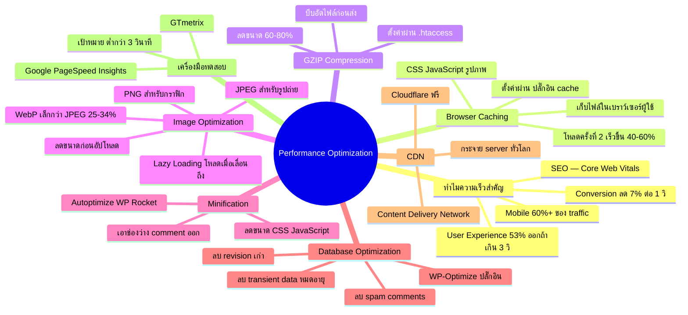

# Mind Map: วิธีปรับแต่ง Performance — WEB2-006
> **Format:** Mind Map (Text-based)
> **Source:** SWP3 Ch11 สร้างเว็บไซต์ Part 2 ตอนที่ 6
> **Production:** PinkCastle Academy | จูล่ง CTO
> **Date:** 2026-02-17

---

---

## Center Node: Performance Optimization

### Branch 1: ทำไมความเร็วสำคัญ
- SEO — Google ใช้ Core Web Vitals จัดอันดับ
- User Experience — 53% ออกจากเว็บถ้าโหลดเกิน 3 วินาที
- Conversion — ช้า 1 วินาที = เสีย Conversion 7%
- Mobile First — 60%+ ของ traffic มาจากมือถือ

### Branch 2: Browser Caching
- เก็บไฟล์ CSS, JavaScript, รูปภาพ ในเบราว์เซอร์
- ครั้งที่ 2 ไม่ต้องโหลดใหม่ เร็วขึ้น 40-60%
- ตั้งค่าผ่านปลั๊กอิน cache เช่น WP Rocket, W3 Total Cache

### Branch 3: GZIP Compression
- บีบอัดไฟล์ก่อนส่งจาก server
- ลดขนาดได้ 60-80%
- ตั้งค่าผ่าน .htaccess หรือปลั๊กอิน

### Branch 4: Image Optimization
- รูปภาพเป็นตัวการหลักทำเว็บช้า (50-80% ของขนาดหน้า)
- ใช้รูปแบบที่เหมาะสม: JPEG, PNG, WebP
- Lazy Loading โหลดเฉพาะเมื่อเลื่อนมาถึง

### Branch 5: Minification
- ลดขนาด CSS/JavaScript 10-30%
- เอาช่องว่าง, comment, line break ออก
- ใช้ Autoptimize หรือ WP Rocket

### Branch 6: Database Optimization
- ทำความสะอาดฐานข้อมูลจากข้อมูลที่ไม่จำเป็น
- ใช้ WP-Optimize เดือนละ 1-2 ครั้ง

### Branch 7: CDN
- Content Delivery Network กระจาย server ทั่วโลก
- Cloudflare ฟรี ได้ทั้ง CDN และ DDoS Protection

### Branch 8: เครื่องมือทดสอบ
- Google PageSpeed Insights — คะแนนจาก Google
- GTmetrix — รายละเอียดเชิงลึก
- เป้าหมาย: ต่ำกว่า 3 วินาที (ดีมาก: ต่ำกว่า 2 วินาที)

---

**จำนวน Nodes ทั้งหมด: 37 nodes**

| ระดับ | จำนวน |
|-------|-------|
| Center Node | 1 |
| Branch (ระดับ 1) | 8 |
| Sub-branch (ระดับ 2) | 20 |
| Leaf (ระดับ 3) | 8 |
| **รวม** | **37** |
