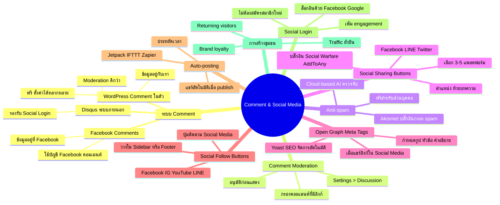

# Mind Map: วิธีการปรับแต่ง Comment Social Media — WEB2-007
> **Format:** Mind Map (Text-based)
> **Source:** SWP3 Ch11 สร้างเว็บไซต์ Part 2 ตอนที่ 7
> **Production:** PinkCastle Academy | จูล่ง CTO
> **Date:** 2026-02-17

---

---

## Center Node: Comment & Social Media

### Branch 1: ระบบ Comment
- WordPress Comment — ในตัว ข้อมูลอยู่กับเรา ฟรี
- Disqus — moderation ดี รองรับ Social Login
- Facebook Comments — ง่าย แต่ข้อมูลอยู่ที่ Facebook

### Branch 2: Comment Moderation
- ตั้งค่าที่ Settings > Discussion
- ให้คอมเมนต์ต้องอนุมัติก่อนแสดง
- กรองคอมเมนต์ที่มีลิงก์อัตโนมัติ

### Branch 3: Anti-spam
- Akismet ปลั๊กอินกรอง spam อัตโนมัติ
- ใช้ cloud-based AI ตรวจจับ แม่นเกือบ 100%
- ฟรีสำหรับเว็บไซต์ส่วนบุคคล

### Branch 4: Social Sharing Buttons
- เลือก 3-5 แพลตฟอร์มที่กลุ่มเป้าหมายใช้
- ไทย: Facebook, LINE, Twitter
- วางตำแหน่งท้ายบทความ

### Branch 5: Open Graph Meta Tags
- กำหนดรูปภาพ หัวข้อ คำอธิบายเมื่อแชร์ลิงก์
- Yoast SEO / Rank Math จัดการอัตโนมัติ

### Branch 6: Social Follow Buttons
- ปุ่มให้คนกดติดตาม Social Media ของเรา
- วางใน Sidebar หรือ Footer

### Branch 7: Auto-posting
- แชร์บทความใหม่ไป Social Media อัตโนมัติ
- ใช้ Jetpack, IFTTT หรือ Zapier

### Branch 8: Social Login
- ล็อกอินด้วยบัญชี Facebook/Google เพื่อคอมเมนต์
- ลด friction เพิ่ม engagement

### Branch 9: การสร้างชุมชน
- Comment + Share + Follow = ชุมชนรอบเว็บไซต์
- สร้าง returning visitors และ brand loyalty

---

**จำนวน Nodes ทั้งหมด: 40 nodes**

| ระดับ | จำนวน |
|-------|-------|
| Center Node | 1 |
| Branch (ระดับ 1) | 9 |
| Sub-branch (ระดับ 2) | 20 |
| Leaf (ระดับ 3) | 10 |
| **รวม** | **40** |
