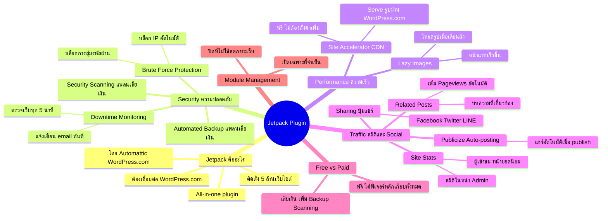

# Mind Map: วิธีตั้งค่า Plugin Jetpack — WEB2-008
> **Format:** Mind Map (Text-based)
> **Source:** SWP3 Ch11 สร้างเว็บไซต์ Part 2 ตอนที่ 8
> **Production:** PinkCastle Academy | จูล่ง CTO
> **Date:** 2026-02-17

---

---

## Center Node: Jetpack Plugin

### Branch 1: Jetpack คืออะไร
- All-in-one plugin จาก Automattic (WordPress.com)
- ติดตั้งมากกว่า 5 ล้านเว็บไซต์
- ต้องเชื่อมต่อกับบัญชี WordPress.com

### Branch 2: Security (ความปลอดภัย)
- Brute Force Protection — บล็อกการสุ่มรหัสผ่าน (ฟรี)
- Downtime Monitoring — ตรวจเว็บทุก 5 นาที (ฟรี)
- Security Scanning + Automated Backup (แพลนเสียเงิน)

### Branch 3: Performance (ความเร็ว)
- Site Accelerator (CDN) — CDN ฟรีจาก WordPress.com
- Lazy Images — โหลดรูปเมื่อเลื่อนมาถึง

### Branch 4: Traffic (สถิติและ Social)
- Site Stats — สถิติในหน้า Admin ไม่ต้องเปิด GA แยก
- Related Posts — บทความเกี่ยวข้องอัตโนมัติ
- Sharing — ปุ่มแชร์ Social Media
- Publicize — Auto-posting ไป Social Media

### Branch 5: Free vs Paid
- ฟรีได้ฟีเจอร์หลักเกือบทั้งหมด
- เสียเงินเพิ่ม Backup, Scanning, Priority Support

### Branch 6: Module Management
- เปิดเฉพาะ module ที่จำเป็น
- ปิดที่ไม่ใช้เพื่อลดภาระเว็บ

---

**จำนวน Nodes ทั้งหมด: 36 nodes**

| ระดับ | จำนวน |
|-------|-------|
| Center Node | 1 |
| Branch (ระดับ 1) | 6 |
| Sub-branch (ระดับ 2) | 17 |
| Leaf (ระดับ 3) | 12 |
| **รวม** | **36** |
