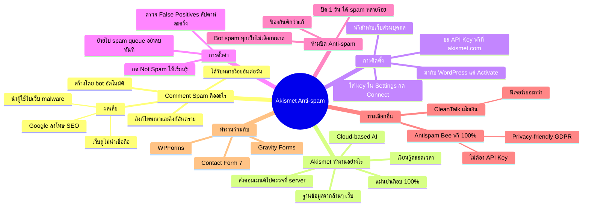

# Mind Map: วิธีตั้งค่า Plugin Akismet — WEB2-009
> **Format:** Mind Map (Text-based)
> **Source:** SWP3 Ch11 สร้างเว็บไซต์ Part 2 ตอนที่ 9
> **Production:** PinkCastle Academy | จูล่ง CTO
> **Date:** 2026-02-17

---

---

## Center Node: Akismet Anti-spam

### Branch 1: Comment Spam คืออะไร
- คอมเมนต์จาก bot มีลิงก์โฆษณาและลิงก์อันตราย
- ผลเสีย: Google ลงโทษ SEO, นำไป malware, ลดความน่าเชื่อถือ
- เว็บที่ไม่กรองอาจได้หลายร้อยอันต่อวัน

### Branch 2: Akismet ทำงานอย่างไร
- Cloud-based AI ส่งคอมเมนต์ไปตรวจสอบกับ server
- ฐานข้อมูล spam จากเว็บไซต์หลายล้านแห่ง
- แม่นยำเกือบ 100% เรียนรู้ตลอดเวลา

### Branch 3: การติดตั้ง
- มากับ WordPress แค่ Activate
- ขอ API Key ฟรีที่ akismet.com
- ใส่ key ใน Settings กด Connect ใช้ได้ทันที

### Branch 4: การตั้งค่า
- ย้ายไป spam queue (อย่าลบทันที)
- ตรวจ False Positives สัปดาห์ละครั้ง
- กด Not Spam เพื่อให้ Akismet เรียนรู้

### Branch 5: ห้ามปิด Anti-spam
- Bot ไม่สนเว็บใหญ่หรือเล็ก spam ทุกเว็บ
- ปิดแม้วันเดียวได้ spam หลายร้อยอัน

### Branch 6: ทางเลือกอื่น
- Antispam Bee — ฟรี 100% ไม่ต้อง API Key เป็น privacy-friendly
- CleanTalk — เสียเงิน แต่ฟีเจอร์เยอะกว่า

### Branch 7: ทำงานร่วมกับ
- Contact Form 7, WPForms, Gravity Forms
- กรอง spam ทั้ง comment และ form

---

**จำนวน Nodes ทั้งหมด: 35 nodes**

| ระดับ | จำนวน |
|-------|-------|
| Center Node | 1 |
| Branch (ระดับ 1) | 7 |
| Sub-branch (ระดับ 2) | 17 |
| Leaf (ระดับ 3) | 10 |
| **รวม** | **35** |
