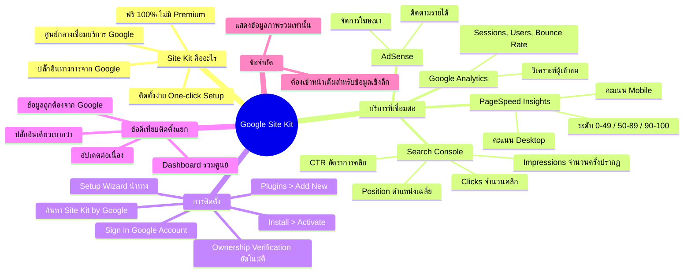

# Mind Map: วิธีตั้งค่า Plugin Site Kit — WEB2-010
> **Format:** Mind Map (Text-based)
> **Source:** SWP3 Ch11 สร้างเว็บไซต์ Part 2 ตอนที่ 10
> **Production:** PinkCastle Academy | จูล่ง CTO
> **Date:** 2026-02-17

---

---

## Center Node: Google Site Kit

### Branch 1: Site Kit คืออะไร
- ปลั๊กอิน WordPress อย่างเป็นทางการจาก Google
  - พัฒนาโดย Google โดยตรง ไม่ใช่ third-party
  - ฟรีทั้งหมด ไม่มีเวอร์ชัน Premium
- ศูนย์กลางเชื่อมต่อบริการ Google
  - รวมทุกบริการไว้ในปลั๊กอินเดียว
- ติดตั้งง่ายแบบ One-click Setup
  - ใช้ Wizard นำทางทีละขั้นตอน

### Branch 2: บริการที่เชื่อมต่อ (4 บริการ)
- Google Analytics — วิเคราะห์พฤติกรรมผู้เข้าชม
- Search Console — ติดตาม Impressions, Clicks, CTR, Position
- AdSense — จัดการโฆษณาและรายได้
- PageSpeed Insights — วัดความเร็วเว็บ Mobile/Desktop

### Branch 3: การติดตั้ง
- Plugins > Add New > "Site Kit by Google"
- Setup Wizard พาเชื่อมต่อ Google Account
- Ownership Verification ทำอัตโนมัติ
  - ไม่ต้องใส่โค้ดหรืออัปโหลดไฟล์เอง

### Branch 4: ข้อดีเทียบการติดตั้งแยก
- เบากว่า — ปลั๊กอินเดียวแทนหลายตัว
- ถูกต้อง — ข้อมูลจาก Google โดยตรง
- สะดวก — Dashboard รวมศูนย์
- ทันสมัย — Google อัปเดตให้ต่อเนื่อง

### Branch 5: ข้อจำกัด
- แสดงข้อมูลแบบ Overview สรุปภาพรวม
- ต้องเข้าหน้าเต็มของแต่ละบริการสำหรับรายงานเชิงลึก

---

**จำนวน Nodes ทั้งหมด: 36 nodes**

| ระดับ | จำนวน |
|-------|-------|
| Center Node | 1 |
| Branch (ระดับ 1) | 5 |
| Sub-branch (ระดับ 2) | 17 |
| Leaf (ระดับ 3) | 13 |
| **รวม** | **36** |
