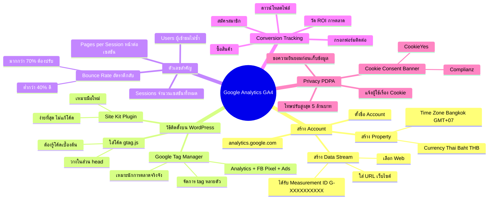

# Mind Map: วิธีติดตั้ง Google Analytics — WEB2-011
> **Format:** Mind Map (Text-based)
> **Source:** SWP3 Ch11 สร้างเว็บไซต์ Part 2 ตอนที่ 11
> **Production:** PinkCastle Academy | จูล่ง CTO
> **Date:** 2026-02-17

---

---

## Center Node: Google Analytics GA4

### Branch 1: สร้าง Account
- ไปที่ analytics.google.com > Sign in
- สร้าง Account > ใส่ชื่อธุรกิจ
- สร้าง Property
  - Time Zone: (GMT+07:00) Bangkok
  - Currency: Thai Baht (THB)
- สร้าง Data Stream (Web)
  - ใส่ URL เว็บไซต์
  - ได้ Measurement ID (G-XXXXXXXXXX)

### Branch 2: วิธีติดตั้งบน WordPress (3 วิธี)
- Site Kit Plugin — ง่ายที่สุด ไม่ต้องแก้โค้ด
- ใส่โค้ด gtag.js ด้วยตนเอง — วางในส่วน `<head>`
- Google Tag Manager — จัดการ tag หลายตัวจากที่เดียว

### Branch 3: ตัวเลขสำคัญ (Key Metrics)
- Users — ผู้เข้าชมไม่ซ้ำกัน
- Sessions — จำนวนเซสชันทั้งหมด
- Bounce Rate — อัตราตีกลับ (ยิ่งต่ำยิ่งดี)
- Pages per Session — จำนวนหน้าเฉลี่ยต่อเซสชัน

### Branch 4: Conversion Tracking
- ติดตามเป้าหมายทางธุรกิจ
  - ซื้อสินค้า / กรอกฟอร์ม / สมัครสมาชิก / ดาวน์โหลด
- เชื่อมโยง Traffic กับผลลัพธ์จริง
- วัด ROI ของทุกช่องทางการตลาด

### Branch 5: Privacy (PDPA)
- ต้องแจ้งผู้ใช้เรื่อง Cookie
- ต้องมี Cookie Consent Banner
- ปลั๊กอินแนะนำ: CookieYes, Complianz
- โทษปรับสูงสุด 5 ล้านบาท

---

**จำนวน Nodes ทั้งหมด: 40 nodes**

| ระดับ | จำนวน |
|-------|-------|
| Center Node | 1 |
| Branch (ระดับ 1) | 5 |
| Sub-branch (ระดับ 2) | 19 |
| Leaf (ระดับ 3) | 15 |
| **รวม** | **40** |
