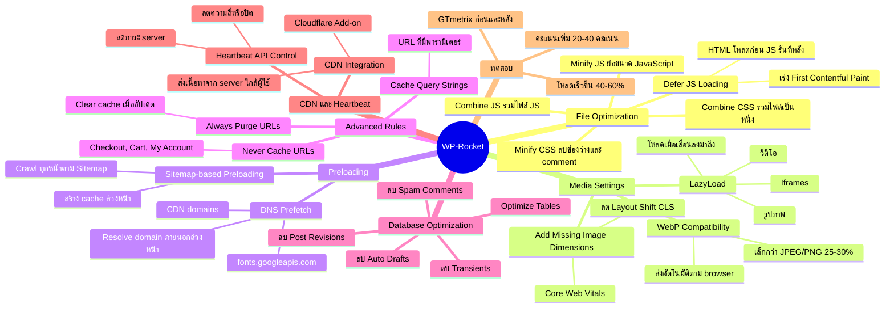

# Mind Map: วิธีการตั้งค่า WP-Rocket — WEB2-012
> **Format:** Mind Map (Text-based)
> **Source:** SWP3 Ch11 สร้างเว็บไซต์ Part 2 ตอนที่ 12
> **Production:** PinkCastle Academy | จูล่ง CTO
> **Date:** 2026-02-17

---

---

## Center Node: WP-Rocket

### Branch 1: File Optimization
- Minify CSS — ลบช่องว่าง/comment ลดขนาดไฟล์
- Combine CSS — รวมหลายไฟล์เป็นหนึ่ง (ระวังเว็บเพี้ยน)
- Minify JS / Combine JS — เช่นเดียวกับ CSS
- Defer JS Loading — HTML โหลดก่อน JS รันทีหลัง

### Branch 2: Media Settings
- LazyLoad — รูป/iframes/วิดีโอโหลดเมื่อเลื่อนลงมา
- Add Missing Image Dimensions — ลด CLS (Core Web Vitals)
- WebP Compatibility — ส่งภาพ WebP เล็กกว่า 25-30%

### Branch 3: Preloading
- Sitemap-based Preloading — สร้าง cache ล่วงหน้าทุกหน้า
- DNS Prefetch — resolve domain ภายนอกล่วงหน้า

### Branch 4: Advanced Rules
- Never Cache URLs — หน้า checkout/cart/my-account
- Always Purge URLs — clear cache เมื่ออัปเดต
- Cache Query Strings — URL ที่มีพารามิเตอร์

### Branch 5: Database Optimization
- ลบ Post Revisions, Auto Drafts, Transients, Spam Comments
- Optimize Tables ลดขนาดฐานข้อมูล

### Branch 6: CDN และ Heartbeat
- CDN Integration — ส่งเนื้อหาจาก server ใกล้ผู้ใช้
- Cloudflare Add-on
- Heartbeat API Control — ลดภาระ server

### Branch 7: ทดสอบ
- GTmetrix ก่อนและหลัง
- คะแนนเพิ่ม 20-40, โหลดเร็วขึ้น 40-60%

---

**จำนวน Nodes ทั้งหมด: 45 nodes**

| ระดับ | จำนวน |
|-------|-------|
| Center Node | 1 |
| Branch (ระดับ 1) | 7 |
| Sub-branch (ระดับ 2) | 22 |
| Leaf (ระดับ 3) | 15 |
| **รวม** | **45** |
