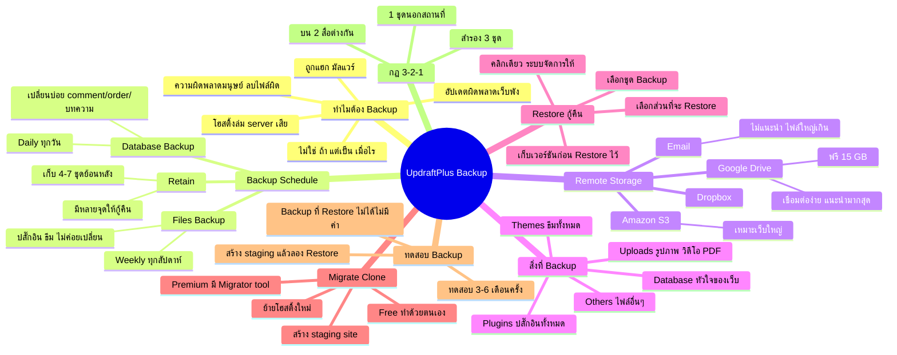

# Mind Map: วิธีการตั้งค่า UpdraftPlus — WEB2-013
> **Format:** Mind Map (Text-based)
> **Source:** SWP3 Ch11 สร้างเว็บไซต์ Part 2 ตอนที่ 13
> **Production:** PinkCastle Academy | จูล่ง CTO
> **Date:** 2026-02-17

---

---

## Center Node: UpdraftPlus Backup

### Branch 1: ทำไมต้อง Backup
- อัปเดตผิดพลาด — ปลั๊กอิน/ธีม/WordPress ทำเว็บพัง
- ถูกแฮก — เว็บ WordPress หลายหมื่นเว็บต่อปี
- ความผิดพลาดมนุษย์ — ลบไฟล์ผิด แก้โค้ดผิด
- ปัญหาโฮสติ้ง — server ล่ม ฮาร์ดดิสก์เสีย

### Branch 2: Backup Schedule
- Database Backup = Daily (เปลี่ยนบ่อย)
- Files Backup = Weekly (ไม่ค่อยเปลี่ยน)
- Retain 4-7 ชุดย้อนหลัง

### Branch 3: Remote Storage
- Google Drive (แนะนำ ฟรี 15 GB)
- Dropbox, Amazon S3
- อย่าใช้ Email (ไฟล์ใหญ่เกิน)
- อย่าเก็บบน server เดียวกับเว็บ

### Branch 4: สิ่งที่ Backup (5 ส่วน)
- Database, Plugins, Themes, Uploads, Others

### Branch 5: Restore กู้คืน
- เลือกชุด Backup > เลือกส่วน > คลิก Restore
- เก็บเวอร์ชันก่อน Restore ไว้เป็น safety net

### Branch 6: Migrate/Clone
- ย้ายโฮสติ้ง / สร้าง staging site
- Free ทำด้วยตนเอง / Premium มี Migrator tool

### Branch 7: ทดสอบ Backup
- ทดสอบ 3-6 เดือนครั้ง
- Backup ที่ Restore ไม่ได้ = ไม่มีค่า

### Branch 8: กฎ 3-2-1
- 3 ชุด / 2 สื่อต่างกัน / 1 ชุดนอกสถานที่

---

**จำนวน Nodes ทั้งหมด: 42 nodes**

| ระดับ | จำนวน |
|-------|-------|
| Center Node | 1 |
| Branch (ระดับ 1) | 8 |
| Sub-branch (ระดับ 2) | 21 |
| Leaf (ระดับ 3) | 12 |
| **รวม** | **42** |
