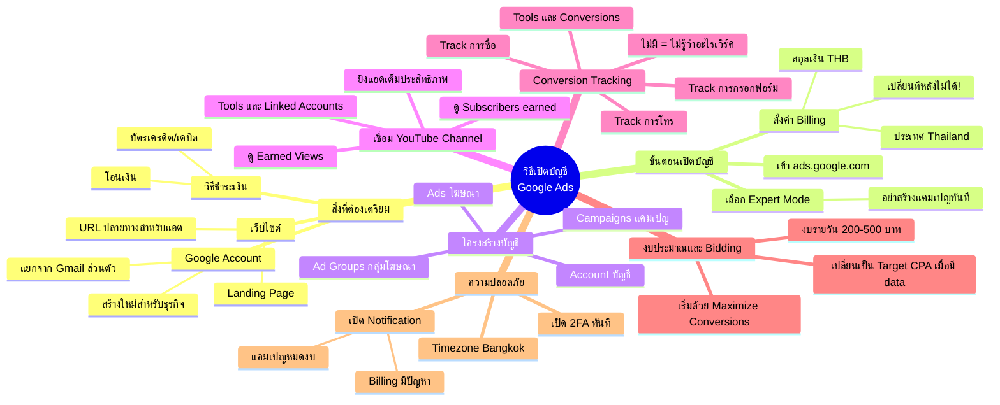

# วิธีเปิดบัญชี Google Ads — YTADS-004
> **Format:** Mind Map (Mermaid)
> **Source:** SWP3 Ch18 วิธีและทัศนคติ Youtube Ads ตอนที่ 4
> **Production:** PinkCastle Academy | จูล่ง CTO
> **Date:** 2026-02-17

---

---

**จำนวน Nodes ทั้งหมด: 37 nodes**

| ระดับ | จำนวน |
|-------|-------|
| Center Node | 1 |
| Branch (ระดับ 1) | 7 |
| Sub-branch (ระดับ 2) | 19 |
| Leaf (ระดับ 3) | 10 |
| **รวม** | **37** |
