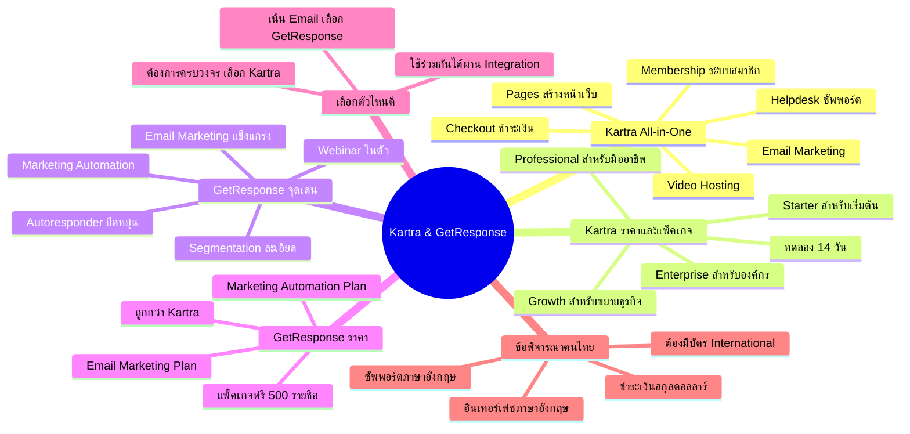

# Mind Map: แนะนำ Kartra & Getresponse — YTADS-005
> **Format:** Mind Map (Text-based)
> **Source:** SWP3 Ch18 วิธีและทัศนคติ Youtube Ads ตอนที่ 5
> **Production:** PinkCastle Academy | จูล่ง CTO
> **Date:** 2026-02-17

---

---

## Center Node: Kartra & GetResponse

### Branch 1: Kartra All-in-One
- Pages สร้างหน้าเว็บ / Landing Page
  - Template สำเร็จรูปหลายร้อยแบบ
- Email Marketing
  - ส่งอีเมลอัตโนมัติ
- Membership ระบบสมาชิก
  - สร้างคอร์สออนไลน์
- Checkout ระบบชำระเงิน
  - รับชำระเงินได้หลายช่องทาง
- Helpdesk ระบบซัพพอร์ต
  - ระบบ Ticket สำหรับลูกค้า
- Video Hosting
  - โฮสต์วิดีโอในแพลตฟอร์ม

### Branch 2: Kartra ราคาและแพ็คเกจ
- หลายแพ็คเกจให้เลือก
  - Starter → Growth → Professional → Enterprise
- ทดลองใช้ 14 วัน
  - ต้องกรอกบัตรเครดิต
  - ยกเลิกก่อนหมดไม่เสียเงิน

### Branch 3: GetResponse จุดเด่น
- Email Marketing ระดับสูง
  - Autoresponder ยืดหยุ่น
  - Segmentation แบ่งกลุ่มละเอียด
- Webinar ในตัว
  - Kartra ไม่มีฟีเจอร์นี้
- Marketing Automation
  - วางระบบอัตโนมัติซับซ้อนได้

### Branch 4: GetResponse ราคา
- แพ็คเกจฟรี (รายชื่อไม่เกิน 500 คน)
- ราคาถูกกว่า Kartra
- เหมาะผู้เริ่มต้นงบจำกัด

### Branch 5: เลือกตัวไหนดี
- ต้องการทุกอย่างในที่เดียว → Kartra
- เน้น Email + Webinar → GetResponse
- ใช้ร่วมกันได้ผ่าน Integration

### Branch 6: ข้อพิจารณาสำหรับคนไทย
- ชำระเงินสกุลดอลลาร์
- ต้องมีบัตรเครดิต International
- อินเทอร์เฟซภาษาอังกฤษ
- ฝ่ายสนับสนุนภาษาอังกฤษ

---

**จำนวน Nodes ทั้งหมด: 38 nodes**

| ระดับ | จำนวน |
|-------|-------|
| Center Node | 1 |
| Branch (ระดับ 1) | 6 |
| Sub-branch (ระดับ 2) | 19 |
| Leaf (ระดับ 3) | 12 |
| **รวม** | **38** |
