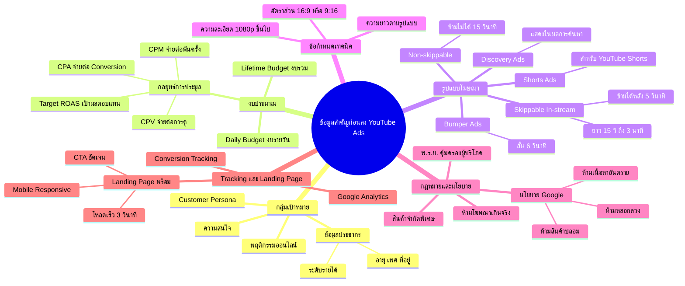

# Mind Map: ข้อมูลสำคัญก่อนลงโฆษณา — YTADS-006
> **Format:** Mind Map (Text-based)
> **Source:** SWP3 Ch18 วิธีและทัศนคติ Youtube Ads ตอนที่ 6
> **Production:** PinkCastle Academy | จูล่ง CTO
> **Date:** 2026-02-17

---

---

## Center Node: ข้อมูลสำคัญก่อนลง YouTube Ads

### Branch 1: กลุ่มเป้าหมาย
- ข้อมูลประชากร
  - อายุ เพศ ที่อยู่ ระดับรายได้
- ความสนใจและพฤติกรรมออนไลน์
  - ชอบดูอะไร สนใจเรื่องอะไร
- Customer Persona
  - สร้างตัวแทนลูกค้าในอุดมคติ

### Branch 2: งบประมาณ
- Daily Budget (งบรายวัน)
  - กำหนดวงเงินสูงสุดต่อวัน
- Lifetime Budget (งบรวมแคมเปญ)
  - กำหนดวงเงินรวมตลอดช่วงเวลา
- กลยุทธ์การประมูล 4 แบบ
  - CPV จ่ายต่อการดู
  - CPM จ่ายต่อการแสดงผลพันครั้ง
  - CPA จ่ายต่อ Conversion
  - Target ROAS เป้าผลตอบแทน

### Branch 3: รูปแบบโฆษณา
- Skippable In-stream (ข้ามได้หลัง 5 วิ)
- Non-skippable (ข้ามไม่ได้ 15 วิ)
- Bumper Ads (สั้น 6 วิ)
- Discovery Ads (ผลการค้นหา)
- Shorts Ads (YouTube Shorts)

### Branch 4: ข้อกำหนดเทคนิค
- ความละเอียด 1080p ขึ้นไป
- อัตราส่วน 16:9 (In-stream) / 9:16 (Shorts)
- ความยาวตามรูปแบบที่เลือก

### Branch 5: กฎหมายและนโยบาย
- กฎหมายไทย
  - พ.ร.บ. คุ้มครองผู้บริโภค
  - ข้อจำกัดสินค้าเฉพาะ
- นโยบาย Google
  - ห้ามสินค้าปลอม เนื้อหาอันตราย หลอกลวง

### Branch 6: Tracking และ Landing Page
- Conversion Tracking ติดตามผลลัพธ์
- Google Analytics เชื่อมต่อเว็บไซต์
- Landing Page พร้อมใช้งาน
  - โหลดเร็ว / Mobile Responsive / CTA ชัดเจน

---

**จำนวน Nodes ทั้งหมด: 42 nodes**

| ระดับ | จำนวน |
|-------|-------|
| Center Node | 1 |
| Branch (ระดับ 1) | 6 |
| Sub-branch (ระดับ 2) | 20 |
| Leaf (ระดับ 3) | 15 |
| **รวม** | **42** |
