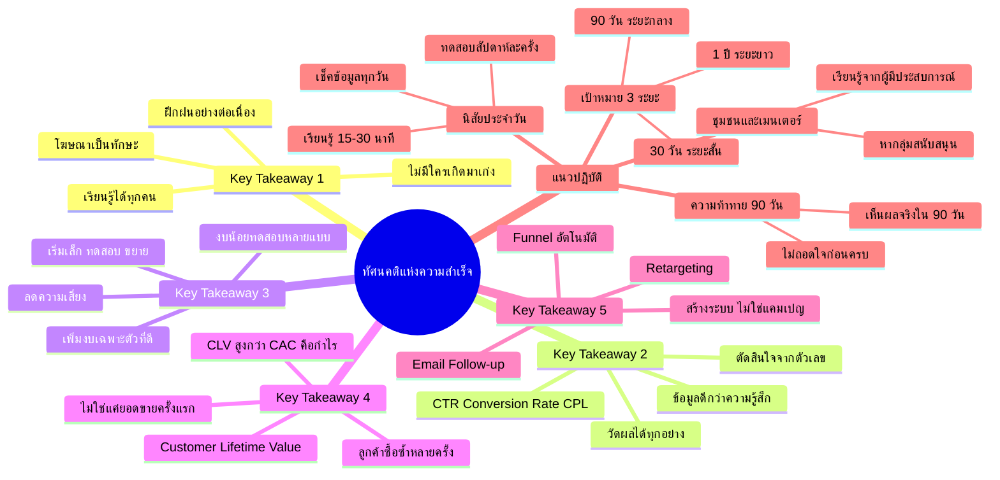

# Mind Map: บทสรุปทัศนคติแห่งความสำเร็จ — YTADS-007
> **Format:** Mind Map (Text-based)
> **Source:** SWP3 Ch18 วิธีและทัศนคติ Youtube Ads ตอนที่ 7
> **Production:** PinkCastle Academy | จูล่ง CTO
> **Date:** 2026-02-17

---

---

## Center Node: ทัศนคติแห่งความสำเร็จ

### Branch 1: Key Takeaway 1 — โฆษณาเป็นทักษะที่เรียนรู้ได้
- ไม่มีใครเกิดมาเก่ง
  - ทุกคนเริ่มจากศูนย์
- เรียนรู้และฝึกฝนได้
  - ลดแรงกดดันจากตัวเอง
- ไม่เลิกเรียนรู้คือกุญแจ

### Branch 2: Key Takeaway 2 — ข้อมูลดีกว่าความรู้สึก
- วัดผลได้ทุกอย่าง
  - CTR, Conversion Rate, Cost Per Lead
- ใช้ข้อมูลตัดสินใจ
  - ไม่ใช่สัญชาตญาณ
- ปรับปรุงแคมเปญจากตัวเลขจริง

### Branch 3: Key Takeaway 3 — เริ่มเล็ก ทดสอบ ขยาย
- เริ่มงบน้อย ทดสอบหลายแบบ
- วิเคราะห์ผลลัพธ์
- เพิ่มงบเฉพาะตัวที่ให้ผลดี
- ลดความเสี่ยงเสียเงินจำนวนมาก

### Branch 4: Key Takeaway 4 — Customer Lifetime Value
- มองภาพระยะยาว
  - ลูกค้าซื้อซ้ำหลายครั้ง
- CLV > CAC = การลงทุนคุ้มค่า
- อย่ากลัวจ่ายค่าโฆษณาเพื่อได้ลูกค้า

### Branch 5: Key Takeaway 5 — สร้างระบบ
- Funnel อัตโนมัติ
- Email Follow-up Sequence
- Retargeting ติดตามผู้สนใจ
- ระบบทำงาน 24/7 ต่อเนื่อง

### Branch 6: แนวทางปฏิบัติ
- ความท้าทาย 90 วัน
  - ทุ่มเทไม่ถอดใจ
- นิสัยประจำวัน
  - เช็คข้อมูล / เรียนรู้ / ทดสอบ / จดบันทึก
- ชุมชนและเมนเตอร์
  - อย่าทำคนเดียว
- เป้าหมาย 3 ระยะ
  - 30 วัน / 90 วัน / 1 ปี

---

**จำนวน Nodes ทั้งหมด: 40 nodes**

| ระดับ | จำนวน |
|-------|-------|
| Center Node | 1 |
| Branch (ระดับ 1) | 6 |
| Sub-branch (ระดับ 2) | 19 |
| Leaf (ระดับ 3) | 14 |
| **รวม** | **40** |
