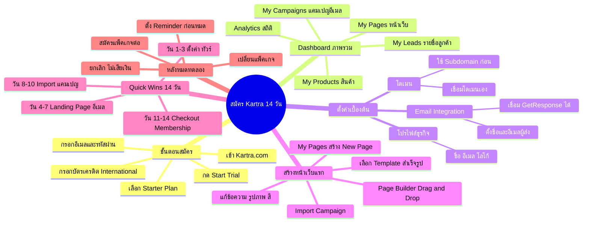

# Mind Map: วิธีสมัครใช้ Kartra 14 วัน — YTADS-008
> **Format:** Mind Map (Text-based)
> **Source:** SWP3 Ch18 วิธีและทัศนคติ Youtube Ads ตอนที่ 8
> **Production:** PinkCastle Academy | จูล่ง CTO
> **Date:** 2026-02-17

---

---

## Center Node: สมัคร Kartra 14 วัน

### Branch 1: ขั้นตอนสมัคร
- เข้า Kartra.com กด Start Trial
  - ใช้อีเมลที่ใช้งานจริง
- กรอกบัตรเครดิต International
  - Visa หรือ Mastercard
  - ยกเลิกก่อน 14 วัน ไม่เสียเงิน
- เลือก Starter Plan
  - เพียงพอสำหรับเริ่มต้น

### Branch 2: Dashboard ภาพรวม
- My Pages — จัดการหน้าเว็บ
- My Campaigns — แคมเปญอีเมล
- My Products — สินค้าและบริการ
- My Leads — รายชื่อลูกค้า
- Analytics — สถิติและรายงาน

### Branch 3: ตั้งค่าเบื้องต้น
- โปรไฟล์ธุรกิจ
  - ชื่อ อีเมลติดต่อ โลโก้
- โดเมน
  - เชื่อมโดเมนเอง หรือใช้ Subdomain
- Email Integration
  - ตั้งชื่อ/อีเมลผู้ส่ง
  - เชื่อมบริการภายนอกได้

### Branch 4: สร้างหน้าเว็บแรก
- เลือก Template สำเร็จรูป
  - Landing Page / Sales Page / Thank You
- Page Builder (Drag and Drop)
  - ไม่ต้องเขียนโค้ด
- Import Campaign
  - นำเข้าแคมเปญสำเร็จรูปพร้อมใช้

### Branch 5: Quick Wins 14 วัน
- วัน 1-3: ตั้งค่าและทัวร์ Dashboard
- วัน 4-7: สร้าง Landing Page + Email Sequence
- วัน 8-10: Import แคมเปญสำเร็จรูป
- วัน 11-14: ทดสอบ Checkout + Membership

### Branch 6: หลังหมดทดลอง
- สมัครต่อ (ถ้าพอใจ)
- ยกเลิก (ไม่ถูกเก็บเงิน)
- เปลี่ยนแพ็คเกจ
- ตั้ง Reminder ก่อนหมด 2-3 วัน

---

**จำนวน Nodes ทั้งหมด: 38 nodes**

| ระดับ | จำนวน |
|-------|-------|
| Center Node | 1 |
| Branch (ระดับ 1) | 6 |
| Sub-branch (ระดับ 2) | 19 |
| Leaf (ระดับ 3) | 12 |
| **รวม** | **38** |
