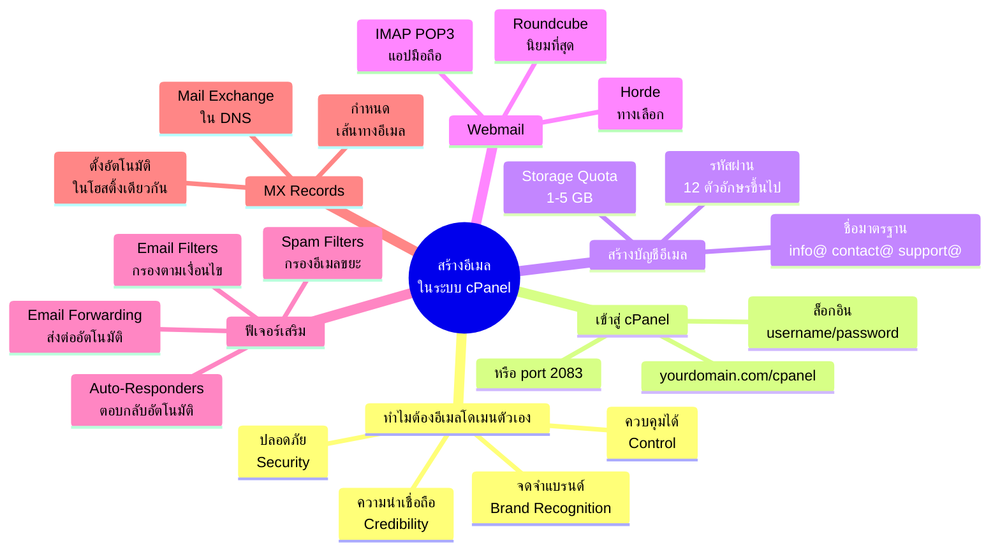

# สร้างอีเมลในระบบ cPanel — EMAIL-005
> **Format:** Mind Map (Text Structure + Mermaid)
> **Source:** SWP3 Ch21 ระบบอีเมล ตอนที่ 5
> **Production:** PinkCastle Academy | จูล่ง CTO
> **Date:** 2026-02-17

---

## Mind Map — โครงสร้างข้อความ (Text Structure)

```
สร้างอีเมลในระบบ cPanel
│
├── 1. ทำไมต้องอีเมลโดเมนตัวเอง
│   ├── ความน่าเชื่อถือ (Credibility)
│   │   └── info@company.com ดูเป็นมืออาชีพ
│   ├── การจดจำแบรนด์ (Brand Recognition)
│   │   └── ชื่อโดเมนติดไปกับทุกอีเมล
│   ├── การควบคุม (Control)
│   │   └── จัดการบัญชี/รหัสผ่าน/พื้นที่ได้เอง
│   └── ความปลอดภัย (Security)
│       └── ลบบัญชีพนักงานที่ลาออกได้ทันที
│
├── 2. เข้าสู่ cPanel
│   ├── URL: yourdomain.com/cpanel
│   ├── URL: yourdomain.com:2083
│   └── ล็อกอินด้วย username/password จากโฮสติ้ง
│
├── 3. สร้างบัญชีอีเมล
│   ├── เลือก Email Accounts
│   ├── กด Create
│   ├── ตั้งชื่ออีเมล
│   │   ├── info@ — ข้อมูลทั่วไป
│   │   ├── contact@ — ติดต่อสอบถาม
│   │   ├── support@ — ช่วยเหลือลูกค้า
│   │   └── ชื่อส่วนตัว@ — ผู้บริหาร/พนักงาน
│   ├── ตั้งรหัสผ่าน
│   │   ├── ตัวใหญ่ + ตัวเล็ก + ตัวเลข + อักขระพิเศษ
│   │   ├── 12+ ตัวอักษร
│   │   └── ใช้ Password Generator
│   └── กำหนด Storage Quota
│       ├── 1-2 GB — ใช้งานทั่วไป
│       ├── 5 GB+ — รับส่งไฟล์แนบมาก
│       └── Unlimited — ถ้าโฮสติ้งรองรับ
│
├── 4. Webmail
│   ├── URL: yourdomain.com/webmail
│   ├── Roundcube
│   │   └── นิยมที่สุด หน้าตาคล้าย Gmail
│   ├── Horde
│   │   └── มีปฏิทิน/รายชื่อในตัว
│   └── IMAP/POP3
│       └── เชื่อมต่อกับแอปมือถือ/Outlook
│
├── 5. ฟีเจอร์เสริม
│   ├── Email Forwarding
│   │   └── ส่งต่อไปบัญชีอื่นอัตโนมัติ
│   ├── Auto-Responders
│   │   └── ข้อความตอบกลับอัตโนมัติ
│   ├── Email Filters
│   │   └── กรองอีเมลตามเงื่อนไข
│   └── Spam Filters
│       └── ตั้งระดับกรองสแปม
│
└── 6. MX Records
    ├── Mail Exchange Records ใน DNS
    ├── กำหนดเส้นทางอีเมล
    ├── ตั้งค่าอัตโนมัติในโฮสติ้งเดียวกัน
    └── ต้องแก้เมื่อย้ายบริการ
        ├── Google Workspace
        └── Zoho Mail
```

---

## Mind Map — Mermaid Diagram



---

## Mind Map — Mermaid Flowchart (แบบทางเลือก)

```mermaid
graph TB
    CENTER["สร้างอีเมล<br/>ในระบบ cPanel"]

    CENTER --> WHY["ทำไมต้องอีเมล<br/>โดเมนตัวเอง"]
    WHY --> WHY1["ความน่าเชื่อถือ"]
    WHY --> WHY2["จดจำแบรนด์"]
    WHY --> WHY3["ควบคุมได้"]
    WHY --> WHY4["ปลอดภัย"]

    CENTER --> ACC["เข้า cPanel<br/>สร้างบัญชี"]
    ACC --> ACC1["Email Accounts<br/>กด Create"]
    ACC --> ACC2["ชื่อ: info@<br/>contact@ support@"]
    ACC --> ACC3["รหัสผ่าน<br/>12+ ตัวอักษร"]
    ACC --> ACC4["Storage Quota<br/>1-5 GB"]

    CENTER --> WEB["Webmail"]
    WEB --> WEB1["Roundcube"]
    WEB --> WEB2["Horde"]
    WEB --> WEB3["IMAP/POP3"]

    CENTER --> FEAT["ฟีเจอร์เสริม"]
    FEAT --> FEAT1["Forwarding"]
    FEAT --> FEAT2["Auto-Responder"]
    FEAT --> FEAT3["Filters"]
    FEAT --> FEAT4["Spam Filters"]

    CENTER --> MX["MX Records"]
    MX --> MX1["DNS เส้นทางอีเมล"]
    MX --> MX2["ตั้งค่าอัตโนมัติ"]

    style CENTER fill:#FF69B4,stroke:#FF1493,color:#fff,stroke-width:3px
    style WHY fill:#FFB6C1,stroke:#FF69B4
    style ACC fill:#FFB6C1,stroke:#FF69B4
    style WEB fill:#FFB6C1,stroke:#FF69B4
    style FEAT fill:#FFB6C1,stroke:#FF69B4
    style MX fill:#FFB6C1,stroke:#FF69B4
```



---

## สรุปโครงสร้าง Mind Map

| กิ่งหลัก | จำนวนกิ่งย่อย | ประเด็นสำคัญ |
|---------|-------------|-------------|
| ทำไมต้องอีเมลโดเมนตัวเอง | 4 | ความน่าเชื่อถือ แบรนด์ ควบคุม ปลอดภัย |
| เข้าสู่ cPanel | 3 | URL เข้าใช้งาน 2 แบบ + ล็อกอิน |
| สร้างบัญชีอีเมล | 5 | ชื่อ รหัสผ่าน Storage Quota |
| Webmail | 3 | Roundcube Horde IMAP |
| ฟีเจอร์เสริม | 4 | Forwarding Auto-Respond Filters Spam |
| MX Records | 4 | DNS เส้นทางอีเมล ตั้งค่าอัตโนมัติ |

---

> **หมายเหตุ:** Mermaid mindmap สามารถ render ได้ใน GitHub, Notion (embed), VS Code (Mermaid Preview extension)
> Flowchart แบบทางเลือกใช้ได้ในกรณีที่ platform ไม่รองรับ mindmap syntax
