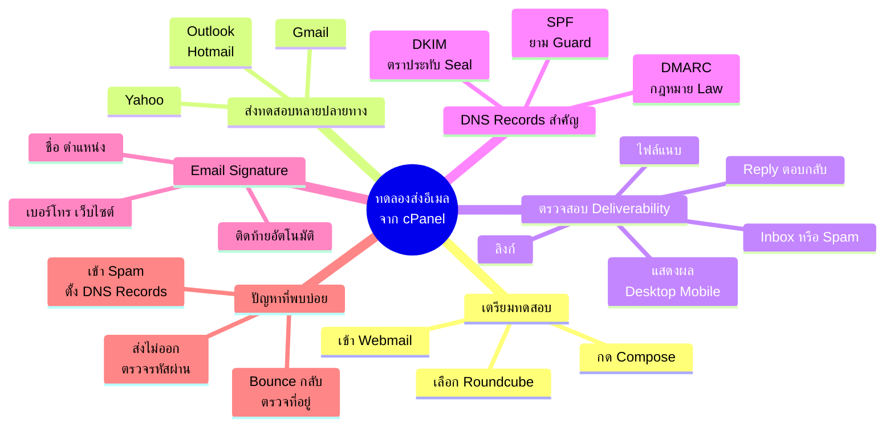

# ทดลองส่งอีเมล จากระบบ cPanel — EMAIL-006
> **Format:** Mind Map (Text Structure + Mermaid)
> **Source:** SWP3 Ch21 ระบบอีเมล ตอนที่ 6
> **Production:** PinkCastle Academy | จูล่ง CTO
> **Date:** 2026-02-17

---

## Mind Map — โครงสร้างข้อความ (Text Structure)

```
ทดลองส่งอีเมลจาก cPanel
│
├── 1. เตรียมทดสอบ
│   ├── เข้า Webmail (yourdomain.com/webmail)
│   ├── เลือก Roundcube
│   └── กด Compose สร้างอีเมลใหม่
│
├── 2. ส่งทดสอบหลายปลายทาง
│   ├── Gmail — ผู้ใช้มากที่สุด
│   ├── Outlook/Hotmail — นิยมในองค์กร
│   └── Yahoo — ผู้ใช้จำนวนมากในไทย
│
├── 3. ตรวจสอบ Deliverability
│   ├── ตำแหน่ง: Inbox หรือ Spam?
│   ├── การแสดงผล Desktop/Mobile
│   ├── ไฟล์แนบเปิดได้ไหม
│   ├── ลิงก์ทำงานไหม
│   └── Reply กลับมาถึงไหม
│
├── 4. DNS Records สำคัญ
│   ├── SPF (Sender Policy Framework)
│   │   ├── ระบุเซิร์ฟเวอร์ที่มีสิทธิ์ส่ง
│   │   └── เปรียบเหมือน "ยาม"
│   ├── DKIM (DomainKeys Identified Mail)
│   │   ├── ลายเซ็นดิจิทัลยืนยันตัวตน
│   │   └── เปรียบเหมือน "ตราประทับ"
│   └── DMARC (Domain-based Message Authentication)
│       ├── นโยบายจัดการอีเมลที่ไม่ผ่าน
│       └── เปรียบเหมือน "กฎหมาย"
│
├── 5. Email Signature
│   ├── ตั้งค่าใน Settings > Identities
│   ├── ชื่อ / ตำแหน่ง / เบอร์โทร
│   ├── เว็บไซต์ / โลโก้
│   └── ติดท้ายอีเมลอัตโนมัติ
│
└── 6. ปัญหาที่พบบ่อย
    ├── อีเมลเข้า Spam
    │   └── แก้: ตั้ง SPF/DKIM/DMARC
    ├── อีเมลส่งไม่ออก
    │   └── แก้: ตรวจรหัสผ่าน/ติดต่อโฮสติ้ง
    └── อีเมล Bounce กลับ
        └── แก้: ตรวจที่อยู่ปลายทาง
```

---

## Mind Map — Mermaid Diagram



---

## Mind Map — Mermaid Flowchart (แบบทางเลือก)

```mermaid
graph TB
    CENTER["ทดลองส่งอีเมล<br/>จาก cPanel"]

    CENTER --> PREP["เตรียมทดสอบ"]
    PREP --> PREP1["Webmail<br/>Roundcube"]
    PREP --> PREP2["Compose<br/>อีเมลใหม่"]

    CENTER --> SEND["ส่งทดสอบ"]
    SEND --> SEND1["Gmail"]
    SEND --> SEND2["Outlook"]
    SEND --> SEND3["Yahoo"]

    CENTER --> CHECK["ตรวจสอบ<br/>Deliverability"]
    CHECK --> CHECK1["Inbox vs Spam"]
    CHECK --> CHECK2["Desktop/Mobile"]
    CHECK --> CHECK3["ไฟล์แนบ/ลิงก์"]
    CHECK --> CHECK4["Reply/Forward"]

    CENTER --> DNS["DNS Records"]
    DNS --> DNS1["SPF — ยาม"]
    DNS --> DNS2["DKIM — ตราประทับ"]
    DNS --> DNS3["DMARC — กฎหมาย"]

    CENTER --> SIG["Email Signature"]
    SIG --> SIG1["ชื่อ/ตำแหน่ง"]
    SIG --> SIG2["เบอร์/เว็บ"]

    CENTER --> PROB["ปัญหาที่พบบ่อย"]
    PROB --> PROB1["เข้า Spam"]
    PROB --> PROB2["ส่งไม่ออก"]
    PROB --> PROB3["Bounce กลับ"]

    style CENTER fill:#FF69B4,stroke:#FF1493,color:#fff,stroke-width:3px
    style PREP fill:#FFB6C1,stroke:#FF69B4
    style SEND fill:#FFB6C1,stroke:#FF69B4
    style CHECK fill:#FFB6C1,stroke:#FF69B4
    style DNS fill:#FFB6C1,stroke:#FF69B4
    style SIG fill:#FFB6C1,stroke:#FF69B4
    style PROB fill:#FFB6C1,stroke:#FF69B4
```



---

## สรุปโครงสร้าง Mind Map

| กิ่งหลัก | จำนวนกิ่งย่อย | ประเด็นสำคัญ |
|---------|-------------|-------------|
| เตรียมทดสอบ | 3 | เข้า Webmail เลือก Roundcube |
| ส่งทดสอบหลายปลายทาง | 3 | Gmail Outlook Yahoo |
| ตรวจสอบ Deliverability | 5 | Inbox/Spam แสดงผล ไฟล์แนบ ลิงก์ Reply |
| DNS Records สำคัญ | 3 | SPF DKIM DMARC |
| Email Signature | 4 | ชื่อ ตำแหน่ง เบอร์ เว็บ |
| ปัญหาที่พบบ่อย | 3 | Spam ส่งไม่ออก Bounce |

---

> **หมายเหตุ:** Mermaid mindmap สามารถ render ได้ใน GitHub, Notion (embed), VS Code (Mermaid Preview extension)
> Flowchart แบบทางเลือกใช้ได้ในกรณีที่ platform ไม่รองรับ mindmap syntax
