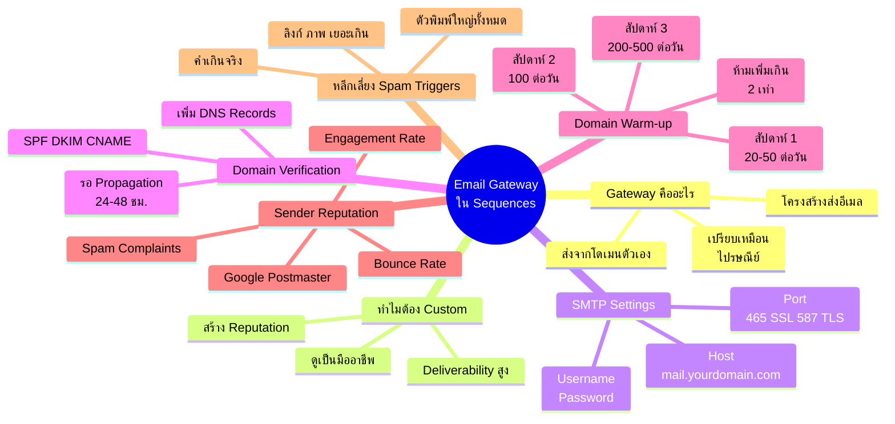

# ใส่อีเมลที่ Gateway ใน Sequences — EMAIL-007
> **Format:** Mind Map (Text Structure + Mermaid)
> **Source:** SWP3 Ch21 ระบบอีเมล ตอนที่ 7
> **Production:** PinkCastle Academy | จูล่ง CTO
> **Date:** 2026-02-17

---

## Mind Map — โครงสร้างข้อความ (Text Structure)

```
Email Gateway ใน Sequences
│
├── 1. Email Gateway คืออะไร
│   ├── โครงสร้างพื้นฐานส่งอีเมล
│   ├── เปรียบเหมือน "ไปรษณีย์"
│   └── ทำให้อีเมลส่งจากโดเมนตัวเอง
│
├── 2. ทำไมต้อง Custom Gateway
│   ├── ดูเป็นมืออาชีพ (ไม่มี "via thirdparty")
│   ├── Deliverability สูงขึ้น
│   └── สร้าง Sender Reputation ของตัวเอง
│
├── 3. SMTP Settings
│   ├── SMTP Host
│   │   └── mail.yourdomain.com
│   ├── SMTP Port
│   │   ├── 465 (SSL)
│   │   └── 587 (TLS) — แนะนำ
│   ├── Username
│   │   └── info@yourdomain.com
│   └── Password
│       └── รหัสผ่านจาก cPanel
│
├── 4. Domain Verification
│   ├── ยืนยันความเป็นเจ้าของโดเมน
│   ├── เพิ่ม DNS Records
│   │   ├── SPF
│   │   ├── DKIM
│   │   └── CNAME (เฉพาะแพลตฟอร์ม)
│   ├── รอ DNS Propagation (24-48 ชม.)
│   └── กด Verify ในแพลตฟอร์ม
│
├── 5. Domain Warm-up
│   ├── สัปดาห์ 1: 20-50 ฉบับ/วัน
│   ├── สัปดาห์ 2: 100 ฉบับ/วัน
│   ├── สัปดาห์ 3: 200-500 ฉบับ/วัน
│   ├── สัปดาห์ 4+: เพิ่มตามแผน
│   └── กฎ: ห้ามเพิ่มเกิน 2 เท่า/สัปดาห์
│
├── 6. Sender Reputation
│   ├── ชื่อเสียงโดเมนในสายตา Gmail/Outlook
│   ├── ปัจจัย
│   │   ├── Bounce Rate
│   │   ├── Spam Complaints
│   │   └── Engagement Rate
│   └── ตรวจสอบจาก Google Postmaster Tools
│
└── 7. หลีกเลี่ยง Spam Triggers
    ├── คำเกินจริง (ฟรี!!! รวยทันที!!!)
    ├── ตัวพิมพ์ใหญ่ทั้งหมด
    ├── ลิงก์มากเกินไป
    └── ภาพเยอะ ข้อความน้อย
```

---

## Mind Map — Mermaid Diagram



---

## Mind Map — Mermaid Flowchart (แบบทางเลือก)

```mermaid
graph TB
    CENTER["Email Gateway<br/>ใน Sequences"]

    CENTER --> WHAT["Gateway คืออะไร"]
    WHAT --> WHAT1["โครงสร้าง<br/>ส่งอีเมล"]
    WHAT --> WHAT2["เปรียบเหมือน<br/>ไปรษณีย์"]

    CENTER --> WHY["ทำไมต้อง Custom"]
    WHY --> WHY1["เป็นมืออาชีพ"]
    WHY --> WHY2["Deliverability สูง"]
    WHY --> WHY3["สร้าง Reputation"]

    CENTER --> SMTP["SMTP Settings"]
    SMTP --> SMTP1["Host / Port"]
    SMTP --> SMTP2["Username / Password"]

    CENTER --> VERIFY["Domain Verification"]
    VERIFY --> V1["เพิ่ม DNS Records"]
    VERIFY --> V2["SPF DKIM CNAME"]
    VERIFY --> V3["รอ Propagation"]

    CENTER --> WARM["Domain Warm-up"]
    WARM --> W1["สัปดาห์ 1: 20-50/วัน"]
    WARM --> W2["สัปดาห์ 2: 100/วัน"]
    WARM --> W3["สัปดาห์ 3: 200-500/วัน"]

    CENTER --> REP["Sender Reputation"]
    REP --> R1["Bounce Rate"]
    REP --> R2["Spam Complaints"]
    REP --> R3["Google Postmaster"]

    style CENTER fill:#FF69B4,stroke:#FF1493,color:#fff,stroke-width:3px
    style WHAT fill:#FFB6C1,stroke:#FF69B4
    style WHY fill:#FFB6C1,stroke:#FF69B4
    style SMTP fill:#FFB6C1,stroke:#FF69B4
    style VERIFY fill:#FFB6C1,stroke:#FF69B4
    style WARM fill:#FFB6C1,stroke:#FF69B4
    style REP fill:#FFB6C1,stroke:#FF69B4
```



---

## สรุปโครงสร้าง Mind Map

| กิ่งหลัก | จำนวนกิ่งย่อย | ประเด็นสำคัญ |
|---------|-------------|-------------|
| Gateway คืออะไร | 3 | โครงสร้างส่งอีเมล = ไปรษณีย์ |
| ทำไมต้อง Custom | 3 | มืออาชีพ Deliverability Reputation |
| SMTP Settings | 4 | Host Port Username Password |
| Domain Verification | 4 | DNS Records + Propagation + Verify |
| Domain Warm-up | 5 | ค่อยๆ เพิ่ม ห้ามกระโดด |
| Sender Reputation | 4 | Bounce Spam Engagement Postmaster |
| Spam Triggers | 4 | คำเกินจริง ตัวใหญ่ ลิงก์ ภาพ |

---

> **หมายเหตุ:** Mermaid mindmap สามารถ render ได้ใน GitHub, Notion (embed), VS Code (Mermaid Preview extension)
> Flowchart แบบทางเลือกใช้ได้ในกรณีที่ platform ไม่รองรับ mindmap syntax
