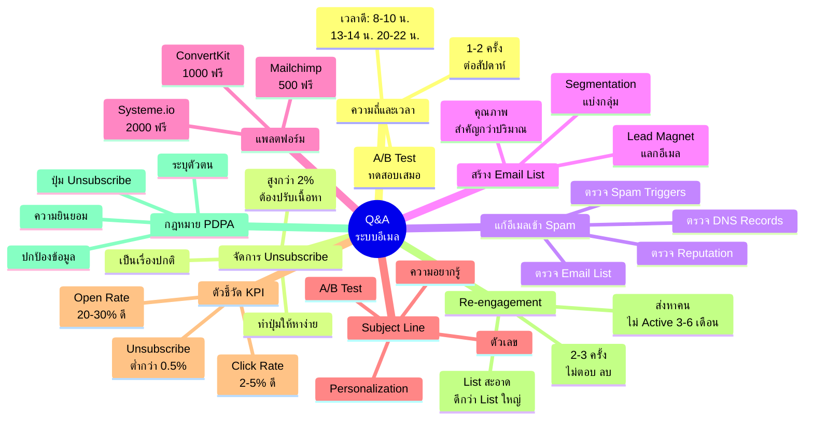

# ตอบคำถาม — EMAIL-008
> **Format:** Mind Map (Text Structure + Mermaid)
> **Source:** SWP3 Ch21 ระบบอีเมล ตอนที่ 8
> **Production:** PinkCastle Academy | จูล่ง CTO
> **Date:** 2026-02-17

---

## Mind Map — โครงสร้างข้อความ (Text Structure)

```
Q&A ระบบอีเมล
│
├── 1. ความถี่และเวลา
│   ├── ส่ง 1-2 ครั้ง/สัปดาห์ (มือใหม่)
│   ├── เวลาดีสำหรับคนไทย
│   │   ├── 8-10 น. (เริ่มงาน)
│   │   ├── 13-14 น. (หลังเที่ยง)
│   │   └── 20-22 น. (พักผ่อน)
│   └── ทดสอบด้วย A/B Test เสมอ
│
├── 2. จัดการ Unsubscribe
│   ├── เป็นเรื่องปกติ ไม่ต้องกังวล
│   ├── ทำปุ่มให้หาง่าย
│   ├── ซ่อนปุ่ม = คนกด Spam (แย่กว่า)
│   └── สูงกว่า 2% = เนื้อหาไม่ตรงกลุ่ม
│
├── 3. แก้อีเมลเข้า Spam
│   ├── ตรวจ DNS Records (SPF/DKIM/DMARC)
│   ├── ตรวจ Spam Triggers ในเนื้อหา
│   ├── ตรวจ Sender Reputation
│   └── ตรวจ Email List สะอาดไหม
│
├── 4. สร้าง Email List
│   ├── Lead Magnet
│   │   ├── eBook / PDF
│   │   ├── Checklist / Template
│   │   ├── Mini Course
│   │   └── ส่วนลดพิเศษ
│   └── Segmentation
│       ├── ตามความสนใจ
│       ├── ตามพฤติกรรม
│       └── ตามสถานะ
│
├── 5. แพลตฟอร์ม
│   ├── Mailchimp (500 ฟรี)
│   ├── Systeme.io (2,000 ฟรี)
│   ├── ConvertKit (1,000 ฟรี)
│   └── เริ่มฟรี พอใหญ่ค่อยอัปเกรด
│
├── 6. Subject Line
│   ├── สร้างความอยากรู้
│   ├── ใช้ตัวเลข
│   ├── สร้างความเร่งด่วน
│   ├── Personalization (ใส่ชื่อ)
│   └── A/B Test
│
├── 7. ตัวชี้วัด (KPI)
│   ├── Open Rate: 20-30% = ดี
│   ├── Click Rate: 2-5% = ดี
│   └── Unsubscribe Rate: ต่ำกว่า 0.5%
│
├── 8. Re-engagement
│   ├── ส่งหาคนไม่เปิดอ่าน 3-6 เดือน
│   ├── "เราคิดถึงคุณ" / โปรโมชั่นพิเศษ
│   ├── ส่ง 2-3 ครั้งไม่ตอบ = ลบ
│   └── List สะอาด > List ใหญ่
│
└── 9. กฎหมาย PDPA
    ├── ต้องได้ความยินยอม
    ├── ต้องมีปุ่ม Unsubscribe
    ├── ระบุตัวตนผู้ส่งชัดเจน
    └── เก็บรักษาข้อมูลปลอดภัย
```

---

## Mind Map — Mermaid Diagram



---

## Mind Map — Mermaid Flowchart (แบบทางเลือก)

```mermaid
graph TB
    CENTER["Q&A<br/>ระบบอีเมล"]

    CENTER --> FREQ["ความถี่/เวลา"]
    FREQ --> F1["1-2 ครั้ง/สัปดาห์"]
    FREQ --> F2["เวลาดี: 8-10, 13-14, 20-22"]
    FREQ --> F3["A/B Test"]

    CENTER --> UNSUB["Unsubscribe"]
    UNSUB --> U1["เรื่องปกติ"]
    UNSUB --> U2["ทำปุ่มให้หาง่าย"]

    CENTER --> LIST["สร้าง Email List"]
    LIST --> L1["Lead Magnet"]
    LIST --> L2["Segmentation"]

    CENTER --> SUBJ["Subject Line"]
    SUBJ --> S1["ความอยากรู้/ตัวเลข"]
    SUBJ --> S2["Personalization"]
    SUBJ --> S3["A/B Test"]

    CENTER --> KPI["ตัวชี้วัด"]
    KPI --> K1["Open Rate 20-30%"]
    KPI --> K2["Click Rate 2-5%"]

    CENTER --> RE["Re-engagement"]
    RE --> RE1["ส่ง 2-3 ครั้ง"]
    RE --> RE2["ไม่ตอบ = ลบ"]

    CENTER --> LAW["PDPA"]
    LAW --> LAW1["ยินยอม/Unsubscribe"]
    LAW --> LAW2["ระบุตัวตน/ปกป้องข้อมูล"]

    style CENTER fill:#FF69B4,stroke:#FF1493,color:#fff,stroke-width:3px
    style FREQ fill:#FFB6C1,stroke:#FF69B4
    style UNSUB fill:#FFB6C1,stroke:#FF69B4
    style LIST fill:#FFB6C1,stroke:#FF69B4
    style SUBJ fill:#FFB6C1,stroke:#FF69B4
    style KPI fill:#FFB6C1,stroke:#FF69B4
    style RE fill:#FFB6C1,stroke:#FF69B4
    style LAW fill:#FFB6C1,stroke:#FF69B4
```



---

## สรุปโครงสร้าง Mind Map

| กิ่งหลัก | จำนวนกิ่งย่อย | ประเด็นสำคัญ |
|---------|-------------|-------------|
| ความถี่และเวลา | 3 | 1-2 ครั้ง/สัปดาห์ เวลาดีสำหรับคนไทย |
| จัดการ Unsubscribe | 4 | เรื่องปกติ ทำปุ่มหาง่าย |
| แก้อีเมลเข้า Spam | 4 | DNS Records Triggers Reputation List |
| สร้าง Email List | 3 | Lead Magnet Segmentation คุณภาพ |
| แพลตฟอร์ม | 4 | เริ่มฟรี พอใหญ่ค่อยอัปเกรด |
| Subject Line | 5 | ความอยากรู้ ตัวเลข Personalization |
| ตัวชี้วัด KPI | 3 | Open 20-30% Click 2-5% |
| Re-engagement | 4 | ส่ง 2-3 ครั้ง ไม่ตอบ = ลบ |
| กฎหมาย PDPA | 4 | ยินยอม Unsubscribe ระบุตัวตน ปกป้อง |

---

> **หมายเหตุ:** Mermaid mindmap สามารถ render ได้ใน GitHub, Notion (embed), VS Code (Mermaid Preview extension)
> Flowchart แบบทางเลือกใช้ได้ในกรณีที่ platform ไม่รองรับ mindmap syntax
