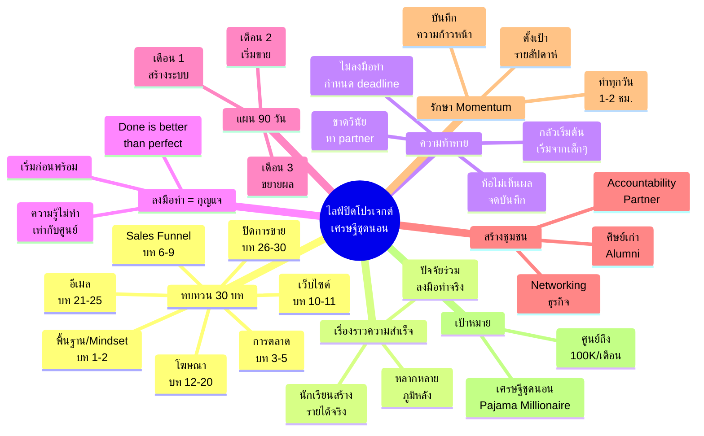

# ไลฟ์ปิดโปรเจกต์เศรษฐีชุดนอน โครงการ #1 — CLOSE-001
> **Format:** Mind Map (Text Structure + Mermaid)
> **Source:** SWP3 Ch31 ไลฟ์ปิดโปรเจกต์เศรษฐีชุดนอน
> **Production:** PinkCastle Academy | จูล่ง CTO
> **Date:** 2026-02-17

---

## Mind Map — โครงสร้างข้อความ (Text Structure)

```
ไลฟ์ปิดโปรเจกต์เศรษฐีชุดนอน
│
├── 1. ทบทวน 30 บท (Course Recap)
│   ├── พื้นฐาน/Mindset (บท 1-2)
│   │   ├── ปฐมนิเทศ
│   │   └── ปรัชญา Speed Wealth
│   ├── การตลาด (บท 3-5)
│   │   └── กลยุทธ์การตลาดออนไลน์
│   ├── Sales Funnel (บท 6-9)
│   │   ├── Funnel Design
│   │   ├── Lead Magnet
│   │   └── Trip Wire
│   ├── เว็บไซต์ (บท 10-11)
│   │   └── สร้างเว็บไซต์ธุรกิจ
│   ├── โฆษณา (บท 12-20)
│   │   ├── YouTube Ads
│   │   └── Facebook Ads
│   ├── ระบบอีเมล (บท 21-25)
│   │   └── Email Marketing & Automation
│   └── ปิดการขาย (บท 26-30)
│       └── เทคนิค Live Closing
│
├── 2. เรื่องราวความสำเร็จ (Success Stories)
│   ├── นักเรียนที่สร้างรายได้จริง
│   ├── จากคนธรรมดาสู่ผู้ประกอบการ
│   ├── หลากหลายภูมิหลัง
│   │   ├── พนักงานออฟฟิศ
│   │   ├── ฟรีแลนซ์
│   │   └── ผู้เริ่มต้นใหม่
│   └── ปัจจัยร่วม = ลงมือทำจริง
│
├── 3. ความท้าทายและวิธีเอาชนะ
│   ├── ขยันเรียนแต่ไม่ลงมือทำ
│   │   └── แก้: กำหนด deadline ทำทันที
│   ├── กลัวที่จะเริ่มต้น
│   │   └── แก้: เริ่มจากสิ่งเล็กๆ
│   ├── ท้อเมื่อยังไม่เห็นผล
│   │   └── แก้: จดบันทึกความก้าวหน้า
│   └── ขาดวินัยต่อเนื่อง
│       └── แก้: หา accountability partner
│
├── 4. ข้อความหลัก: ลงมือทำ
│   ├── ความรู้ที่ไม่ปฏิบัติ = ศูนย์
│   ├── เริ่มก่อนพร้อม
│   ├── Done is better than perfect
│   └── เส้นทางจากศูนย์ถึง 100K/เดือน
│
├── 5. แผนปฏิบัติ 90 วัน
│   ├── เดือนที่ 1: สร้างระบบ
│   │   ├── เลือกโมเดลธุรกิจ
│   │   ├── สร้าง Sales Funnel
│   │   └── ทำ Landing Page
│   ├── เดือนที่ 2: เริ่มขาย
│   │   ├── เปิดโฆษณา
│   │   ├── หาลูกค้า
│   │   └── สร้าง Email Sequence
│   └── เดือนที่ 3: ขยายผล
│       ├── วิเคราะห์ข้อมูล
│       ├── ปรับปรุงระบบ
│       └── เพิ่มช่องทาง
│
├── 6. สร้างชุมชน (Community Building)
│   ├── ชุมชนศิษย์เก่า (Alumni)
│   │   ├── กลุ่มสนทนาออนไลน์
│   │   └── แลกเปลี่ยนประสบการณ์
│   ├── Accountability Partnership
│   │   ├── จับคู่ตรวจสอบกัน
│   │   └── นัดเช็คทุกสัปดาห์
│   └── Networking
│       ├── หาพาร์ทเนอร์ธุรกิจ
│       └── สร้างเครือข่าย
│
├── 7. รักษา Momentum
│   ├── ทำงานทุกวัน แม้ 1-2 ชั่วโมง
│   ├── ตั้งเป้ารายสัปดาห์
│   ├── อย่ากลับไปใช้ชีวิตเดิม
│   └── บันทึกความก้าวหน้า
│
├── 8. การยกย่องนักเรียนดีเด่น
│   ├── ด้านยอดขาย
│   ├── ด้านการสร้าง Funnel
│   └── ด้านการช่วยเหลือเพื่อนร่วมรุ่น
│
└── 9. ก้าวต่อไป (Next Steps)
    ├── เข้าร่วมชุมชนศิษย์เก่า
    ├── หลักสูตรขั้นสูงสำหรับผู้จบแล้ว
    └── "จากคนธรรมดาสู่เศรษฐีชุดนอน"
```

---

## Mind Map — Mermaid Diagram



---

## Mind Map — Mermaid Flowchart (แบบทางเลือก)

```mermaid
graph TB
    CENTER["🎓 ไลฟ์ปิดโปรเจกต์<br/>เศรษฐีชุดนอน<br/>SWP3 บทที่ 31"]

    CENTER --> R["📚 ทบทวน 30 บท"]
    R --> R1["พื้นฐาน + Mindset<br/>บท 1-2"]
    R --> R2["การตลาด + Funnel<br/>บท 3-9"]
    R --> R3["เว็บ + โฆษณา<br/>บท 10-20"]
    R --> R4["อีเมล + ปิดขาย<br/>บท 21-30"]

    CENTER --> S["⭐ เรื่องราวความสำเร็จ"]
    S --> S1["นักเรียนสร้างรายได้จริง"]
    S --> S2["จากคนธรรมดาสู่ผู้ประกอบการ"]
    S --> S3["ปัจจัยร่วม:<br/>ลงมือทำจริง"]

    CENTER --> C["⚡ ความท้าทาย + วิธีแก้"]
    C --> C1["ไม่ลงมือทำ → deadline"]
    C --> C2["กลัวเริ่มต้น → เริ่มเล็กๆ"]
    C --> C3["ท้อ → จดบันทึก"]
    C --> C4["ขาดวินัย → partner"]

    CENTER --> A["🔥 ลงมือทำ = กุญแจ"]
    A --> A1["ความรู้ไม่ทำ = ศูนย์"]
    A --> A2["เริ่มก่อนพร้อม"]

    CENTER --> P["📋 แผน 90 วัน"]
    P --> P1["เดือน 1: สร้างระบบ"]
    P --> P2["เดือน 2: เริ่มขาย"]
    P --> P3["เดือน 3: ขยายผล"]

    CENTER --> COM["🤝 สร้างชุมชน"]
    COM --> COM1["ศิษย์เก่า Alumni"]
    COM --> COM2["Accountability Partner"]
    COM --> COM3["Networking ธุรกิจ"]

    CENTER --> G["🎯 เป้าหมาย"]
    G --> G1["ศูนย์ → 100K/เดือน"]
    G --> G2["เศรษฐีชุดนอน"]

    style CENTER fill:#FF69B4,stroke:#FF1493,color:#fff,stroke-width:3px
    style R fill:#FFB6C1,stroke:#FF69B4
    style S fill:#FFB6C1,stroke:#FF69B4
    style C fill:#FFB6C1,stroke:#FF69B4
    style A fill:#FF6B6B,stroke:#FF1493,color:#fff
    style P fill:#FFB6C1,stroke:#FF69B4
    style COM fill:#FFB6C1,stroke:#FF69B4
    style G fill:#FFD700,stroke:#FFA500,color:#000
```



---

## สรุปโครงสร้าง Mind Map

| กิ่งหลัก | จำนวนกิ่งย่อย | ประเด็นสำคัญ |
|---------|-------------|-------------|
| ทบทวน 30 บท | 7 หมวด | สรุปภาพรวมหลักสูตรทั้งหมด |
| เรื่องราวความสำเร็จ | 3 | พิสูจน์ว่าหลักสูตรได้ผลเมื่อลงมือทำ |
| ความท้าทาย + วิธีแก้ | 4 คู่ | ปัญหาที่พบบ่อยพร้อมทางออก |
| ลงมือทำ = กุญแจ | 3 | ข้อความหลักของไลฟ์ปิดโปรเจกต์ |
| แผน 90 วัน | 3 เดือน | แผนปฏิบัติที่ชัดเจนหลังจบคอร์ส |
| สร้างชุมชน | 3 | Alumni + Partner + Networking |
| รักษา Momentum | 3 | ทำทุกวัน ตั้งเป้า บันทึก |
| เป้าหมาย | 2 | ศูนย์ถึง 100K เศรษฐีชุดนอน |

---

> **หมายเหตุ:** Mermaid mindmap สามารถ render ได้ใน GitHub, Notion (embed), VS Code (Mermaid Preview extension)
> Flowchart แบบทางเลือกใช้ได้ในกรณีที่ platform ไม่รองรับ mindmap syntax
