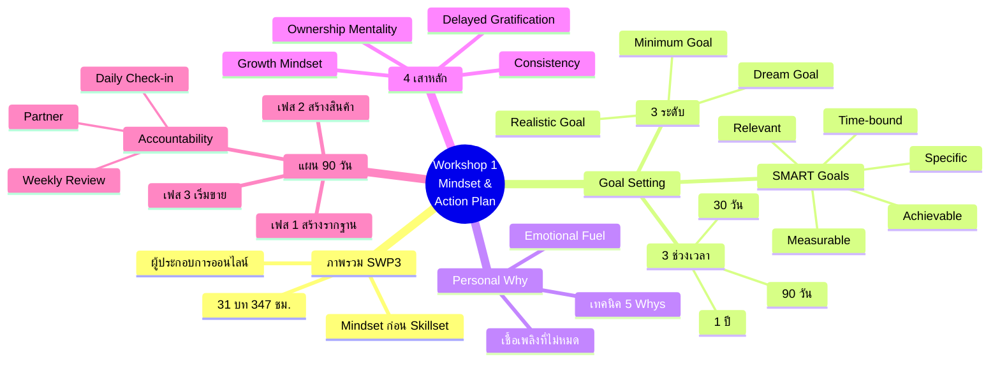
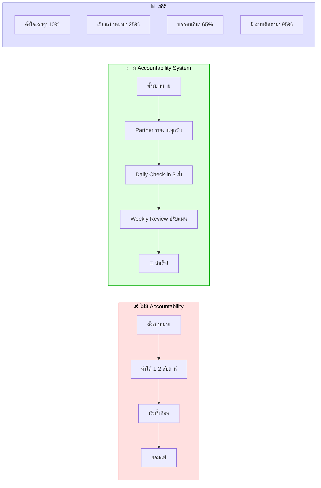
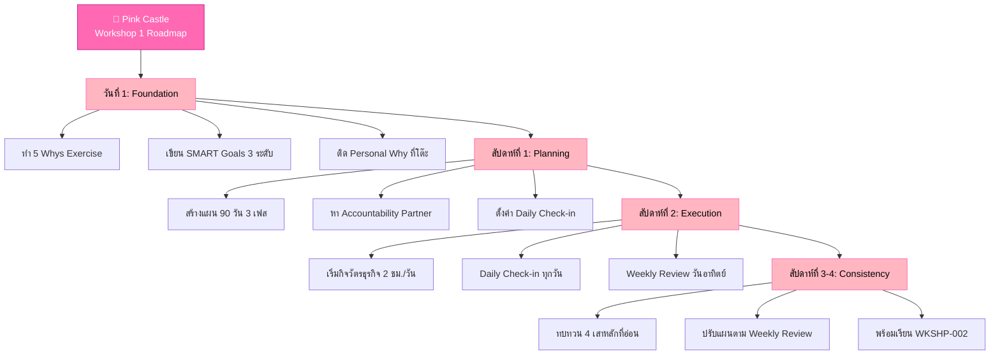

# Workshop ตอนที่ 1 — WKSHP-001 Mind Map
> Format: Mind Map (Text Tree + Mermaid mindmap + Flowchart + Summary)
> Source: SWP3 Ch4 Workshop SWP3 ครั้งที่ 1 ตอนที่ 1
> Production: PinkCastle Academy | จูล่ง CTO
> Date: 2026-02-18 | Duration: 1:16:18

---

## Part 1: Text Tree Mind Map

```
Workshop ตอนที่ 1 — Mindset & Action Plan (WKSHP-001)
├── 📌 Central Concept
│   └── วางรากฐาน Mindset + Action Plan ก่อนเรียนเทคนิคใดๆ
│
├── 📋 ภาพรวม SWP3
│   ├── จุดประสงค์
│   │   ├── สร้างผู้ประกอบการออนไลน์
│   │   ├── พร้อมทั้ง Mindset + Skillset
│   │   └── เริ่มจากรากฐานทางความคิด
│   ├── โครงสร้างหลักสูตร
│   │   ├── Phase 1: Mindset Foundation
│   │   ├── Phase 2: Digital Skills & Tools
│   │   ├── Phase 3: Business Building
│   │   └── Phase 4: Scaling & Automation
│   └── ขนาดหลักสูตร
│       ├── 31 บท
│       ├── 340 ไฟล์
│       └── 347 ชั่วโมง
│
├── 🎯 Goal Setting Workshop
│   ├── SMART Goals
│   │   ├── S — Specific (ชัดเจน)
│   │   ├── M — Measurable (วัดได้)
│   │   ├── A — Achievable (ทำได้จริง)
│   │   ├── R — Relevant (เกี่ยวข้อง)
│   │   └── T — Time-bound (มีกำหนดเวลา)
│   ├── 3 ระดับเป้าหมาย
│   │   ├── Dream Goal — ฝันสูงสุด (100K/เดือน)
│   │   ├── Realistic Goal — ทำได้จริง (30K/เดือน)
│   │   └── Minimum Goal — ขั้นต่ำ (5 ลูกค้าแรก)
│   └── 3 ช่วงเวลา
│       ├── ระยะสั้น 30 วัน — Quick Win
│       ├── ระยะกลาง 90 วัน — สร้างพื้นฐาน
│       └── ระยะยาว 1 ปี — Big Vision
│
├── 🔥 Personal Why (5 Whys)
│   ├── วิธีทำ
│   │   ├── ถาม "ทำไม" ซ้ำ 5 ครั้ง
│   │   ├── จากเหตุผลผิวเผินสู่เหตุผลที่ลึกที่สุด
│   │   └── จุดที่คำตอบทำให้ขนลุก = Personal Why
│   ├── ตัวอย่าง
│   │   ├── Why 1: อยากมีรายได้เพิ่ม
│   │   ├── Why 2: เงินไม่พอใช้
│   │   ├── Why 3: อยากหมดหนี้
│   │   ├── Why 4: อยากมีอิสระทางการเงิน
│   │   └── Why 5: อยากเห็นลูกเติบโตทุกวัน ✨
│   └── ทำไมสำคัญ
│       ├── เชื้อเพลิงที่ไม่มีวันหมด
│       ├── "อยากรวย" ไม่แข็งแรงพอ
│       └── Emotional Fuel > Financial Motivation
│
├── 🧠 Success Mindset (4 เสาหลัก)
│   ├── เสา 1: Growth Mindset
│   │   ├── "ฉันยังทำไม่ได้" (ไม่ใช่ "ทำไม่ได้")
│   │   ├── ล้มเหลว = บทเรียน
│   │   └── ความสามารถพัฒนาได้
│   ├── เสา 2: Delayed Gratification
│   │   ├── อดทนรอผลลัพธ์ระยะยาว
│   │   ├── ลงทุนเวลาวันนี้เพื่ออนาคต
│   │   └── Marshmallow Experiment
│   ├── เสา 3: Ownership Mentality
│   │   ├── รับผิดชอบ 100%
│   │   ├── ไม่โทษคนอื่น ไม่โทษสถานการณ์
│   │   └── เอาอำนาจควบคุมชีวิตกลับมา
│   └── เสา 4: Consistency
│       ├── ทำน้อยแต่ทำทุกวัน
│       ├── Compound Effect
│       └── ดีกว่าทำหนักวันเดียวแล้วหยุด
│
└── 📅 แผน 90 วัน + Accountability
    ├── 3 เฟส
    │   ├── เฟส 1 (วัน 1-30): สร้างรากฐาน
    │   │   ├── ค้นหา Niche
    │   │   ├── สร้างโปรไฟล์ออนไลน์
    │   │   └── ศึกษาตลาดและคู่แข่ง
    │   ├── เฟส 2 (วัน 31-60): สร้างสินค้า
    │   │   ├── สร้าง MVP
    │   │   ├── หาลูกค้าทดลอง
    │   │   └── รับ Feedback ปรับปรุง
    │   └── เฟส 3 (วัน 61-90): เริ่มขาย
    │       ├── ระบบขายทำงาน
    │       ├── มีรายได้แรก
    │       └── ตั้ง KPI เดือนถัดไป
    └── Accountability System
        ├── Partner — คู่หูรายงานทุกวัน
        ├── Daily Check-in — บันทึก 3 สิ่ง/วัน
        └── Weekly Review — ทบทวน KPI ทุกสัปดาห์
```

---

## Part 2: Mermaid Mind Map



---

## Part 3: Flowchart — เส้นทาง Workshop ตอนที่ 1

```mermaid
flowchart TD
    A([🧑‍🎓 ผู้เรียน SWP3]) --> B[ภาพรวมโปรแกรม<br/>เข้าใจโครงสร้างหลักสูตร]

    B --> C[Goal Setting Workshop<br/>ตั้ง SMART Goals 3 ระดับ]

    C --> D{เป้าหมายชัดเจน?}
    D -->|ชัดเจน| E[ค้นหา Personal Why<br/>เทคนิค 5 Whys]
    D -->|ยังไม่ชัด| C

    E --> F{เจอ Personal Why?}
    F -->|เจอแล้ว! ✨| G[สร้าง Success Mindset<br/>4 เสาหลัก]
    F -->|ยังไม่เจอ| E

    G --> H[Growth Mindset<br/>"ฉันยังทำไม่ได้"]
    G --> I[Delayed Gratification<br/>ลงทุนวันนี้เพื่ออนาคต]
    G --> J[Ownership Mentality<br/>รับผิดชอบ 100%]
    G --> K[Consistency<br/>ทำน้อยแต่ทำทุกวัน]

    H & I & J & K --> L[วางแผน 90 วัน<br/>3 เฟส]

    L --> M[เฟส 1: สร้างรากฐาน<br/>วันที่ 1-30]
    M --> N[เฟส 2: สร้าง MVP<br/>วันที่ 31-60]
    N --> O[เฟส 3: เริ่มขาย<br/>วันที่ 61-90]

    O --> P[ตั้งระบบ Accountability]
    P --> Q[Partner + Daily Check-in<br/>+ Weekly Review]

    Q --> R([🎉 พร้อมลงมือทำ!<br/>→ WKSHP-002])

    style A fill:#FFB6C1,stroke:#FF69B4,color:#000
    style R fill:#90EE90,stroke:#228B22,color:#000
    style E fill:#FFD700,stroke:#FFA500,color:#000
    style G fill:#87CEEB,stroke:#4169E1,color:#000
    style L fill:#DDA0DD,stroke:#8B008B,color:#000
```

---

## Part 4: Accountability Impact Flowchart



---

## Part 5: Summary Table

| หัวข้อ | Core Concept | Key Metric | Action |
|--------|-------------|------------|--------|
| ภาพรวม SWP3 | Mindset ก่อน Skillset | 31 บท, 347 ชม. | เข้าใจโครงสร้างก่อนเรียน |
| Goal Setting | SMART + 3 ระดับ + 3 ช่วงเวลา | 3 Goals × 3 Timeframes | เขียนเป้าหมายลงกระดาษ |
| Personal Why | เชื้อเพลิงที่ไม่มีวันหมด | 5 Whys Deep | ทำ 5 Whys Exercise วันนี้ |
| Success Mindset | 4 เสาหลัก | 4 Pillars | ประเมินว่าเสาไหนอ่อนสุด |
| แผน 90 วัน | 3 เฟส × 30 วัน | 90 Days to Revenue | เขียนแผน + ตั้ง Milestone |
| Accountability | Partner + Check-in + Review | 10% → 95% Success Rate | หาคู่หู 1 คน |

---

## Part 6: Pink Castle Implementation Roadmap



---

## Part 7: Key Formulas

```
Success Formula (จาก Workshop 1):
━━━━━━━━━━━━━━━━━━━━━━━━━━━━━━━━━━━━━
Success = Mindset × Action × Consistency
ถ้าตัวใดตัวหนึ่งเป็น 0 ผลลัพธ์ = 0

Accountability Impact:
━━━━━━━━━━━━━━━━━━━━━━━━━━━━━━━━━━━━━
ตั้งใจเฉยๆ              →  10% สำเร็จ
เขียนเป้าหมาย           →  25% สำเร็จ  (2.5x)
บอก Accountability Partner →  65% สำเร็จ  (6.5x)
มีระบบติดตามครบ          →  95% สำเร็จ  (9.5x)

90-Day Compound Effect:
━━━━━━━━━━━━━━━━━━━━━━━━━━━━━━━━━━━━━
2 ชม./วัน × 90 วัน = 180 ชั่วโมง
180 ชม. ≈ 4.5 สัปดาห์เต็มเวลา (40 ชม./สัปดาห์)
เพียงพอสำหรับ: สร้าง Niche + MVP + First Sale

Goal Level Calculator:
━━━━━━━━━━━━━━━━━━━━━━━━━━━━━━━━━━━━━
Minimum Goal = สิ่งที่ทำได้แน่นอน 90%+
Realistic Goal = Minimum × 3-5x
Dream Goal = Realistic × 3-5x
```

---

## Summary: Workshop 1 ในประโยคเดียว

> **สูตรสำเร็จจาก Workshop ตอนที่ 1:**
>
> `SMART Goals (3 ระดับ) + Personal Why (5 Whys) + 4 เสาหลัก + แผน 90 วัน + Accountability`
> `= รากฐานที่แข็งแรงสำหรับทุกสิ่งที่จะเรียนต่อใน SWP3`
>
> Mindset มาก่อน Skillset เสมอ — สร้างฐานก่อนสร้างตึก ถ้าฐานแข็ง ตึกจะสูงได้ไม่จำกัด

---

> ทบทวนต่อ: **WKSHP-002** — Workshop SWP3 ครั้งที่ 1 ตอนที่ 2
> Series: SWP3 Ch4 Workshop
> Navigation: WKSHP-001 → [WKSHP-002]
> PinkCastle Academy © 2026
