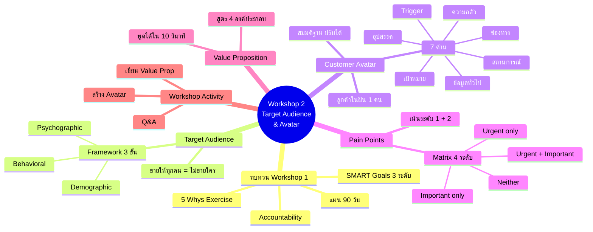
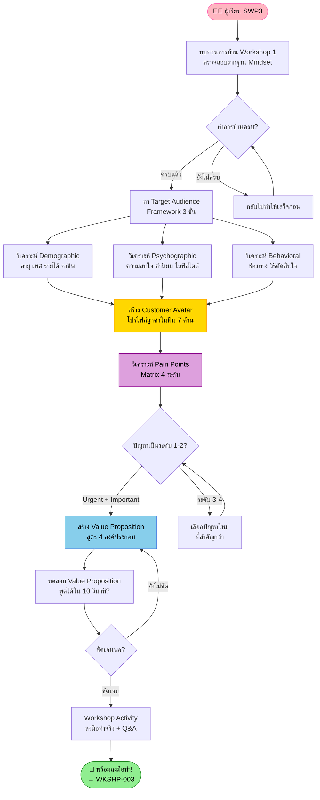
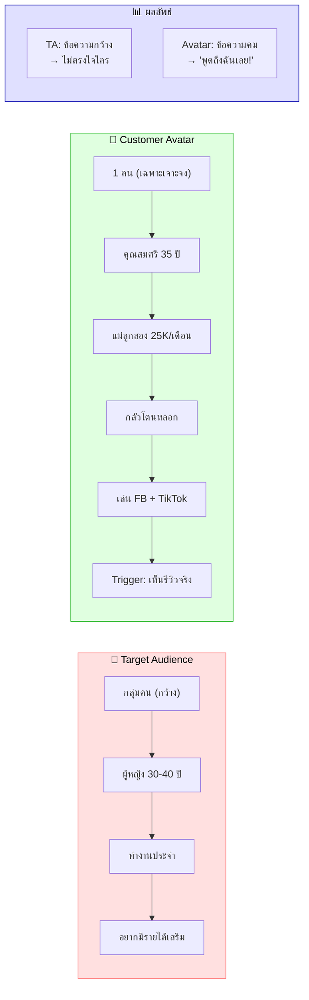
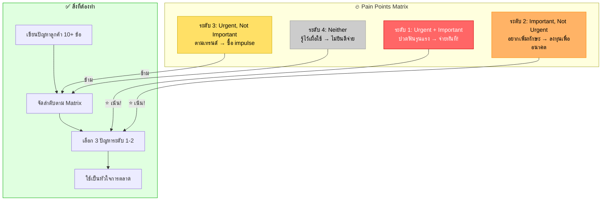
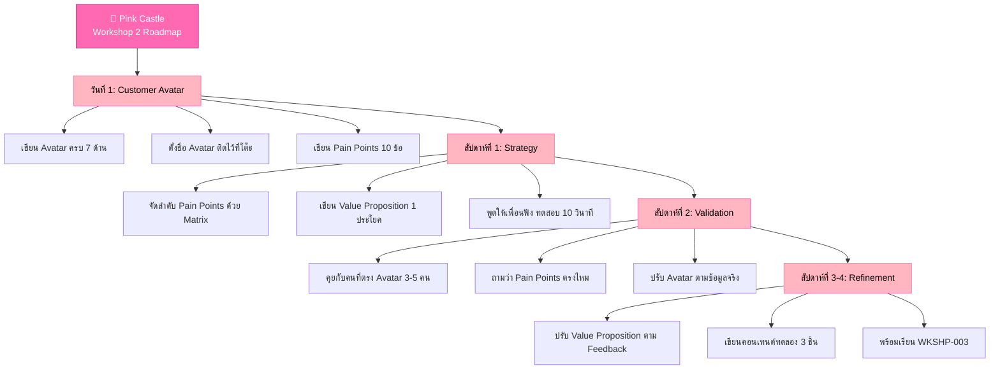

# Workshop ตอนที่ 2 — WKSHP-002 Mind Map
> Format: Mind Map (Text Tree + Mermaid mindmap + Flowchart + Summary)
> Source: SWP3 Ch04 Workshop ตอนที่ 2
> Production: PinkCastle Academy | จูล่ง CTO
> Date: 2026-02-18 | Duration: 1:24:07

---

## Part 1: Text Tree Mind Map

```
Workshop ตอนที่ 2 — Target Audience & Customer Avatar (WKSHP-002)
├── 📌 Central Concept
│   └── รู้จักลูกค้าก่อนขาย — ยิ่งเฉพาะเจาะจง ยิ่งขายได้
│
├── 📋 ทบทวนการบ้าน Workshop 1
│   ├── Checklist ที่ต้องทำครบ
│   │   ├── 5 Whys Exercise → Personal Why
│   │   ├── SMART Goals 3 ระดับ
│   │   ├── แผน 90 วัน 3 เฟส
│   │   ├── Accountability Partner
│   │   └── Daily Check-in
│   ├── Feedback จากอาจารย์
│   │   ├── เป้าหมายชัดเจนพอหรือยัง
│   │   ├── Personal Why ลึกพอหรือยัง
│   │   └── ปรับ SMART ให้เฉพาะเจาะจงมากขึ้น
│   └── หลักการ
│       └── ถ้ารากฐานไม่แข็ง → เนื้อหาถัดไปไม่มีประสิทธิภาพ
│
├── 🎯 Target Audience
│   ├── หลักการสำคัญ
│   │   ├── "ขายให้ทุกคน = ไม่ได้ขายให้ใครเลย"
│   │   ├── ยิ่งเฉพาะเจาะจง ยิ่งสื่อสารได้คม
│   │   └── ถามตัวเอง: สินค้าแก้ปัญหาอะไร? ใครมีปัญหานี้?
│   └── Framework 3 ขั้นตอน
│       ├── Demographic (ข้อมูลพื้นฐาน)
│       │   ├── อายุ, เพศ, รายได้
│       │   ├── ที่อยู่, อาชีพ
│       │   └── การศึกษา
│       ├── Psychographic (ข้อมูลจิตใจ)
│       │   ├── ความสนใจ, ค่านิยม
│       │   ├── ไลฟ์สไตล์
│       │   └── ความเชื่อ, ความกลัว
│       └── Behavioral (พฤติกรรม)
│           ├── ช่องทาง Social Media
│           ├── วิธีตัดสินใจซื้อ
│           └── ความถี่ในการซื้อ
│
├── 👤 Customer Avatar (7 ด้าน)
│   ├── ความหมาย
│   │   ├── โปรไฟล์สมมติของลูกค้าในฝัน 1 คน
│   │   ├── ละเอียดถึงขนาดตั้งชื่อให้
│   │   └── ต่างจาก Target Audience (กลุ่ม vs 1 คน)
│   ├── 7 ด้านที่ต้องเขียน
│   │   ├── 1. ข้อมูลทั่วไป — อายุ เพศ อาชีพ รายได้
│   │   ├── 2. สถานการณ์ปัจจุบัน — ทำอะไรอยู่ ปัญหาอะไร
│   │   ├── 3. เป้าหมาย — อยากได้อะไร เปลี่ยนอะไร
│   │   ├── 4. ความกลัว — กลัวอะไร ห่วงอะไร
│   │   ├── 5. ช่องทางที่ใช้ — Social Media เว็บไซต์
│   │   ├── 6. อุปสรรค — อะไรทำให้ยังไม่ลงมือ
│   │   └── 7. Trigger — อะไรทำให้ตัดสินใจซื้อ ⚡
│   ├── ตัวอย่าง: "คุณสมศรี"
│   │   ├── อายุ 35 แม่ลูกสอง พนักงานออฟฟิศ
│   │   ├── รายได้ 25,000 บ./เดือน อยากมีรายได้เสริม
│   │   ├── กลัวโดนหลอก ไม่มีเวลา
│   │   └── Trigger: เห็นคนเหมือนตัวเองสำเร็จ
│   └── สำคัญ
│       ├── Avatar = สมมติฐาน ไม่ใช่ความจริง
│       ├── ต้องทดสอบกับลูกค้าจริง
│       └── ปรับแก้ตาม Feedback → วนซ้ำ
│
├── 🔥 Pain Points Analysis
│   ├── Pain Points Matrix (4 ระดับ)
│   │   ├── ระดับ 1: Urgent + Important ⭐
│   │   │   ├── ปัญหาเร่งด่วนและสำคัญ
│   │   │   └── ลูกค้าพร้อมจ่ายทันที
│   │   ├── ระดับ 2: Important, Not Urgent
│   │   │   ├── สำคัญแต่ไม่เร่ง
│   │   │   └── ลงทุนเพื่ออนาคต
│   │   ├── ระดับ 3: Urgent, Not Important
│   │   │   ├── เร่งแต่ไม่สำคัญ
│   │   │   └── ซื้อตาม impulse
│   │   └── ระดับ 4: Neither
│   │       └── ไม่ยินดีจ่าย
│   └── หลักการ
│       ├── เน้นแก้ระดับ 1 + 2 เท่านั้น
│       └── เปรียบเทียบ: ปวดฟัน vs อยากฟันขาว
│
├── 💡 Value Proposition
│   ├── สูตร
│   │   ├── "เราช่วยให้ [กลุ่มเป้าหมาย]"
│   │   ├── "สามารถ [ผลลัพธ์ที่ต้องการ]"
│   │   ├── "โดยไม่ต้อง [Pain Points]"
│   │   └── "ด้วย [จุดแข็งของเรา]"
│   ├── ตัวอย่าง
│   │   └── "เราช่วยให้ แม่ลูกอ่อนที่ทำงานประจำ
│   │        สามารถ มีรายได้เสริม 10,000 บ./เดือน
│   │        โดยไม่ต้อง ลาออกหรือลงทุนมาก
│   │        ด้วย ระบบทำตามได้ทีละขั้นพร้อมพี่เลี้ยง"
│   └── การทดสอบ
│       └── ถ้าพูดได้ใน 10 วินาที = ชัดพอ
│
└── 🛠️ Workshop Activity + Q&A
    ├── แบบฝึกหัด
    │   ├── สร้าง Customer Avatar ครบ 7 ด้าน (15 นาที)
    │   └── เขียน Value Proposition 1 ประโยค (10 นาที)
    ├── Q&A ที่ถูกถามบ่อย
    │   ├── "มีหลายกลุ่มเป้าหมายทำไง?"
    │   │   └── เลือก 1 กลุ่มก่อน ทำให้เชี่ยวชาญ
    │   └── "ต้องแม่นยำแค่ไหน?"
    │       └── ไม่ต้อง Perfect เริ่มก่อน แล้วค่อยปรับ
    └── Feedback จากอาจารย์
        └── ตรวจทีละคน ให้คำแนะนำเฉพาะ
```

---

## Part 2: Mermaid Mind Map



---

## Part 3: Flowchart — เส้นทาง Workshop ตอนที่ 2



---

## Part 4: Customer Avatar vs Target Audience Comparison



---

## Part 5: Pain Points Matrix Flowchart



---

## Part 6: Pink Castle Implementation Roadmap



---

## Part 7: Key Formulas

```
Target Audience Formula (จาก Workshop 2):
━━━━━━━━━━━━━━━━━━━━━━━━━━━━━━━━━━━━━
Target Audience = Demographic + Psychographic + Behavioral
ขาดขั้นใดขั้นหนึ่ง = ภาพลูกค้าไม่คมชัด

Customer Avatar Precision:
━━━━━━━━━━━━━━━━━━━━━━━━━━━━━━━━━━━━━
Avatar = 7 ด้าน × ความละเอียด
ยิ่งละเอียด → ยิ่งเขียนคอนเทนต์ตรงใจ
ยิ่งตรงใจ → ยิ่ง Conversion สูง

Pain Points Priority:
━━━━━━━━━━━━━━━━━━━━━━━━━━━━━━━━━━━━━
ระดับ 1 (Urgent+Important)   → ลูกค้าพร้อมจ่ายทันที 💰💰💰
ระดับ 2 (Important)          → ลูกค้ายินดีลงทุน 💰💰
ระดับ 3 (Urgent)             → ซื้อตาม impulse 💰
ระดับ 4 (Neither)            → ไม่ยินดีจ่าย ❌

Value Proposition Template:
━━━━━━━━━━━━━━━━━━━━━━━━━━━━━━━━━━━━━
"เราช่วยให้ [กลุ่มเป้าหมาย]
 สามารถ [ผลลัพธ์ที่ต้องการ]
 โดยไม่ต้อง [Pain Points]
 ด้วย [จุดแข็งของเรา]"

ทดสอบ: พูดได้ใน 10 วินาที? → ✅ ชัดพอ
        ต้องอธิบายเพิ่ม?    → ❌ ยังไม่ชัด ปรับใหม่

Avatar Iteration Cycle:
━━━━━━━━━━━━━━━━━━━━━━━━━━━━━━━━━━━━━
เขียน Avatar (สมมติฐาน)
    → ทดสอบกับลูกค้าจริง 3-5 คน
    → ปรับแก้ตาม Feedback
    → ทดสอบอีกครั้ง
    → ปรับแก้อีกรอบ
    → Avatar แม่นยำขึ้นเรื่อยๆ
อย่ารอ Perfect → เริ่มเลย ปรับทีหลัง
```

---

## Summary: Workshop 2 ในประโยคเดียว

> **สูตรสำเร็จจาก Workshop ตอนที่ 2:**
>
> `Target Audience (3 Framework) + Customer Avatar (7 ด้าน) + Pain Points (Matrix 4 ระดับ) + Value Proposition (สูตร 4 องค์ประกอบ)`
> `= กลยุทธ์ที่คมชัดสำหรับทุกสิ่งที่จะทำต่อใน SWP3`
>
> รู้จักลูกค้าก่อนขาย — ยิ่งเฉพาะเจาะจง ยิ่งขายได้ ถ้ารู้ว่าลูกค้าคือใคร เจ็บอะไร ต้องการอะไร ก็แทบจะปิดการขายได้เองโดยอัตโนมัติ

---

> ทบทวนต่อ: **WKSHP-003** — Workshop ตอนที่ 3
> Series: SWP3 Ch04 Workshop
> Navigation: WKSHP-001 → [WKSHP-002] → WKSHP-003
> PinkCastle Academy © 2026
