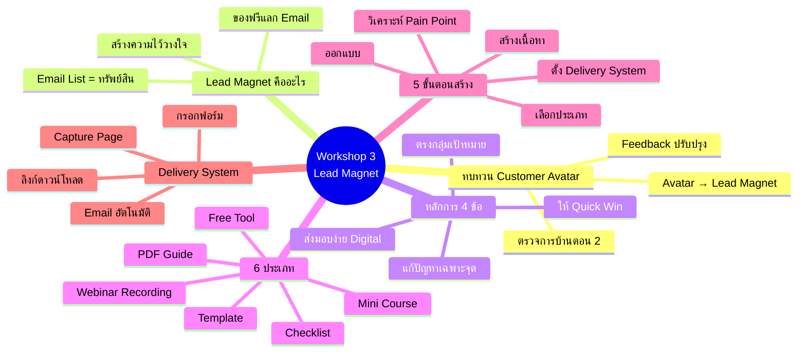
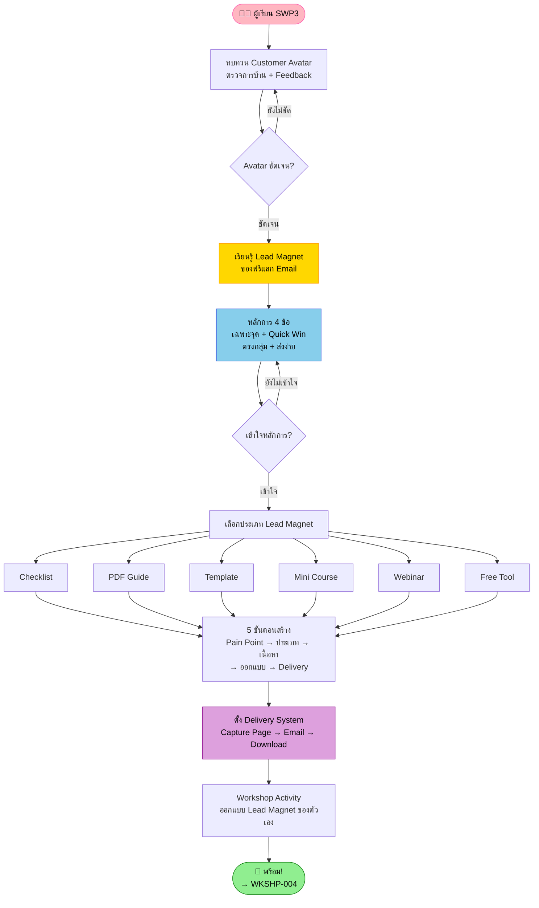
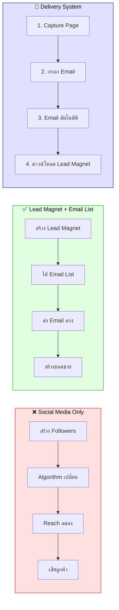
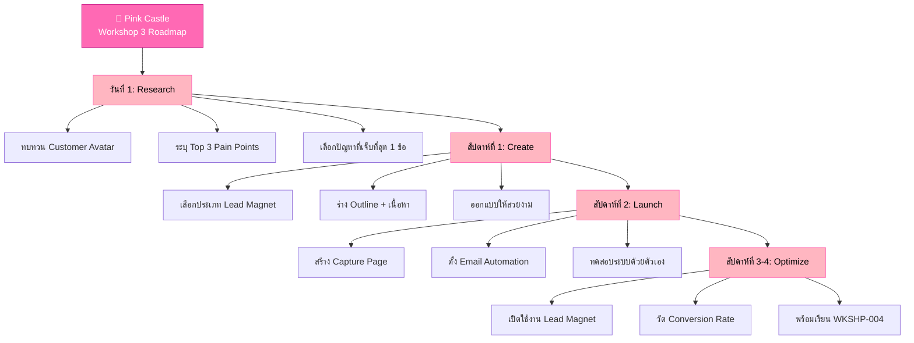

# Workshop ตอนที่ 3 — WKSHP-003 Mind Map
> Format: Mind Map (Text Tree + Mermaid mindmap + Flowchart + Summary)
> Source: SWP3 Ch04 Workshop ตอนที่ 3
> Production: PinkCastle Academy | จูล่ง CTO
> Date: 2026-02-18 | Duration: 1:17:35

---

## Part 1: Text Tree Mind Map

```
Workshop ตอนที่ 3 — Lead Magnet (WKSHP-003)
├── 📌 Central Concept
│   └── สร้าง Lead Magnet ที่ตรงกลุ่มเพื่อแลก Email → สร้าง Email List
│
├── 📋 ทบทวน Customer Avatar
│   ├── ตรวจการบ้านจากตอนที่ 2
│   │   ├── ให้ Feedback แต่ละคน
│   │   ├── ปรับปรุง Avatar ให้ชัดเจนขึ้น
│   │   └── Avatar ที่ดี ≠ แค่ "ผู้หญิง 25-35 ปี"
│   ├── ต้องมีรายละเอียด
│   │   ├── ข้อมูลประชากร (อายุ เพศ อาชีพ)
│   │   ├── Pain Points (ปัญหาที่เจ็บปวด)
│   │   ├── Fears (ความกลัว)
│   │   ├── Dreams (ความฝัน)
│   │   └── พฤติกรรมการซื้อ
│   └── เชื่อมโยงกับ Lead Magnet
│       └── Avatar → Lead Magnet → Email List → ยอดขาย
│
├── 🎁 Lead Magnet คืออะไร
│   ├── นิยาม
│   │   ├── ของฟรีที่มีค่ามากพอ
│   │   ├── แลกกับ Email ของลูกค้าเป้าหมาย
│   │   └── ตัวอย่าง: eBook, Checklist, Mini Course, Template
│   ├── ทำไมต้องมี
│   │   ├── คนไม่ซื้อจากคนแปลกหน้า
│   │   ├── สร้างความไว้วางใจก่อน (Reciprocity)
│   │   └── ได้ Email = ทรัพย์สินของเรา 100%
│   └── Email List vs Social Media
│       ├── Email = ที่ดินของเรา (ไม่มีใครยึดได้)
│       └── Social Media = ที่ดินเช่า (Algorithm เปลี่ยนได้)
│
├── ⭐ หลักการ Lead Magnet ที่ดี (4 ข้อ)
│   ├── 1. แก้ปัญหาเฉพาะจุด
│   │   ├── โฟกัสปัญหาเดียวที่เจ็บปวดที่สุด
│   │   └── ไม่ใช่แก้ทุกปัญหาในคราวเดียว
│   ├── 2. ให้ Quick Win
│   │   ├── ใช้แล้วเห็นผลเร็ว
│   │   └── Checklist 10 ข้อ > eBook 200 หน้า
│   ├── 3. ตรงกลุ่มเป้าหมาย
│   │   ├── พูดภาษาเดียวกับ Customer Avatar
│   │   └── ข้อมูลมาจาก Avatar ที่สร้างไว้
│   └── 4. ง่ายต่อการส่งมอบ
│       ├── Digital ส่งทันทีผ่าน Email
│       └── ไม่ต้องรอส่งไปรษณีย์
│
├── 📦 6 ประเภท Lead Magnet
│   ├── ง่าย
│   │   ├── 1. Checklist — รายการตรวจสอบ
│   │   ├── 2. PDF Guide / eBook — คู่มือเฉพาะเรื่อง
│   │   └── 3. Template — แม่แบบพร้อมใช้
│   └── ปานกลาง-ยาก
│       ├── 4. Mini Course — วิดีโอ 3-5 ตอน
│       ├── 5. Webinar Recording — บันทึกบรรยาย
│       └── 6. Free Tool / Calculator — เครื่องมือช่วย
│
├── 🔧 5 ขั้นตอนสร้าง Lead Magnet
│   ├── ขั้นที่ 1: วิเคราะห์ Pain Point
│   │   └── ใช้ Customer Avatar หาปัญหาที่เจ็บที่สุด
│   ├── ขั้นที่ 2: เลือกประเภท
│   │   └── เหมาะกับ Pain Point + ทักษะของเรา
│   ├── ขั้นที่ 3: สร้างเนื้อหา
│   │   └── เนื้อหาที่มีคุณค่า แก้ปัญหาได้จริง
│   ├── ขั้นที่ 4: ออกแบบ
│   │   └── สวยงาม น่าอ่าน ดูเป็นมืออาชีพ
│   └── ขั้นที่ 5: ตั้ง Delivery System
│       └── ระบบอัตโนมัติ ส่งมอบ 24/7
│
└── 📧 Delivery System + Workshop Activity
    ├── 4 ขั้นตอน Delivery
    │   ├── 1. Capture Page — หน้าเว็บรับ Email
    │   ├── 2. กรอกฟอร์ม — ลูกค้าใส่ Email
    │   ├── 3. Email อัตโนมัติ — ส่งทันทีหลังกรอก
    │   └── 4. ลิงก์ดาวน์โหลด — Lead Magnet พร้อมใช้
    ├── เครื่องมือ
    │   ├── Systeme.io
    │   └── Mailchimp
    └── Workshop Activity
        └── ลงมือออกแบบ Lead Magnet ของตัวเอง
```

---

## Part 2: Mermaid Mind Map



---

## Part 3: Flowchart — เส้นทาง Workshop ตอนที่ 3



---

## Part 4: Email List vs Social Media Comparison Flowchart



---

## Part 5: Summary Table

| หัวข้อ | Core Concept | Key Metric | Action |
|--------|-------------|------------|--------|
| ทบทวน Avatar | Avatar → Lead Magnet Pipeline | Top 3 Pain Points | ทบทวน Avatar ระบุปัญหาที่เจ็บที่สุด |
| Lead Magnet | ของฟรีแลก Email สร้างความไว้วางใจ | Conversion Rate | สร้าง Lead Magnet 1 ชิ้นที่ตรงกลุ่ม |
| หลักการ 4 ข้อ | เฉพาะจุด + Quick Win + ตรงกลุ่ม + ส่งง่าย | 4/4 Checklist | ตรวจสอบ 4 หลักการก่อนปล่อยใช้งาน |
| 6 ประเภท | Checklist ง่ายสุด → Free Tool ยากสุด | เลือก 1 ประเภท | มือใหม่เริ่มจาก Checklist หรือ PDF |
| 5 ขั้นตอน | Pain Point → ประเภท → เนื้อหา → ออกแบบ → Delivery | 5 Steps Complete | ทำตามลำดับ อย่าข้ามขั้นตอน |
| Delivery System | Capture Page → Email → Download (24/7) | ทดสอบด้วยตัวเอง | ตั้งระบบแล้วทดสอบก่อนเปิดใช้ |

---

## Part 6: Lead Magnet Creation Roadmap



---

## Part 7: Key Formulas

```
Lead Magnet Success Formula (จาก Workshop 3):
━━━━━━━━━━━━━━━━━━━━━━━━━━━━━━━━━━━━━
Lead Magnet ที่ดี = Customer Avatar + 4 หลักการ + Delivery System
ถ้าขาดตัวใดตัวหนึ่ง ผลลัพธ์จะลดลงอย่างมาก

Email List Value:
━━━━━━━━━━━━━━━━━━━━━━━━━━━━━━━━━━━━━
Email List 1,000 คน × 2% Conversion × 2,000 บาท/สินค้า
= 40,000 บาท/ต่อ 1 Email Blast
Email List คือ "ATM ส่วนตัว" ที่กดเงินได้เมื่อต้องการ

Quick Win Principle:
━━━━━━━━━━━━━━━━━━━━━━━━━━━━━━━━━━━━━
Checklist 1 หน้า (30 นาที)     → Conversion ~75%
PDF Guide 10 หน้า (2 ชม.)      → Conversion ~45%
eBook 200 หน้า (หลายวัน)       → Conversion ~15%
ยิ่งสั้นและให้ผลเร็ว ยิ่ง Convert สูง

Delivery System ROI:
━━━━━━━━━━━━━━━━━━━━━━━━━━━━━━━━━━━━━
ตั้งครั้งเดียว (3-5 ชั่วโมง) → ทำงาน 24/7 ตลอดไป
= 8,760 ชั่วโมง/ปี ที่ระบบทำงานแทนเรา
เทียบเท่า "พนักงาน" ที่ไม่เคยลา ไม่ต้องจ่ายเงินเดือน

Lead Magnet → Revenue Pipeline:
━━━━━━━━━━━━━━━━━━━━━━━━━━━━━━━━━━━━━
Customer Avatar (รู้จักลูกค้า)
  → Lead Magnet (ของฟรีแลก Email)
    → Email List (ทรัพย์สินถาวร)
      → Email Nurture (สร้างความสัมพันธ์)
        → Sales (ขายสินค้า/บริการ)
          → Repeat Customer (ลูกค้าซื้อซ้ำ)
```

---

## Summary: Workshop 3 ในประโยคเดียว

> **สูตรสำเร็จจาก Workshop ตอนที่ 3:**
>
> `Customer Avatar (ปัญหาที่เจ็บที่สุด) + Lead Magnet (4 หลักการ) + Delivery System (อัตโนมัติ 24/7)`
> `= Email List ที่มีคุณภาพ = ทรัพย์สินถาวรของธุรกิจ`
>
> ให้ก่อน แล้วรับ — Lead Magnet ที่ดีไม่ต้องซับซ้อน แค่ตรงกลุ่ม ให้ Quick Win และส่งมอบอัตโนมัติ

---

> ทบทวนต่อ: **WKSHP-004** — Workshop ตอนที่ 4
> Series: SWP3 Ch04 Workshop
> Navigation: WKSHP-003 → [WKSHP-004]
> PinkCastle Academy © 2026
