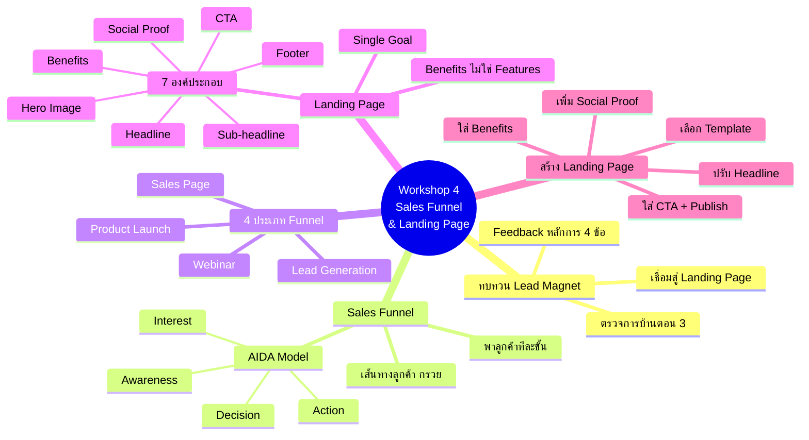
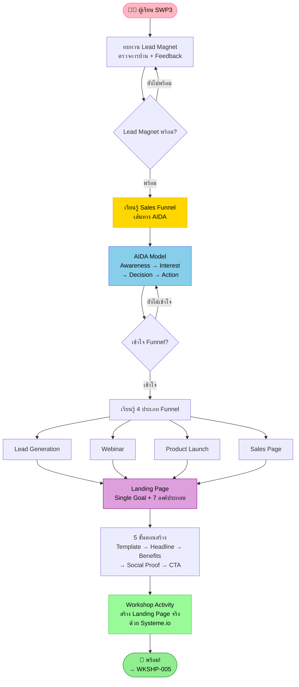
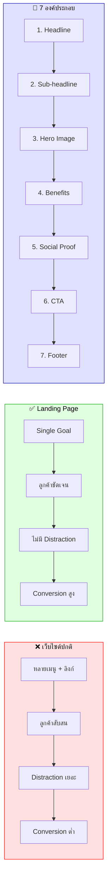
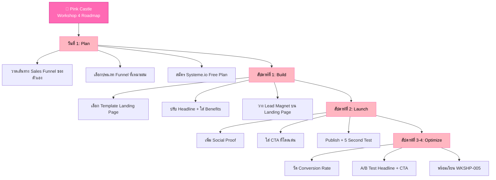

# Workshop ตอนที่ 4 — WKSHP-004 Mind Map
> Format: Mind Map (Text Tree + Mermaid mindmap + Flowchart + Summary)
> Source: SWP3 Ch04 Workshop ตอนที่ 4
> Production: PinkCastle Academy | จูล่ง CTO
> Date: 2026-02-18 | Duration: 1:00:04

---

## Part 1: Text Tree Mind Map

```
Workshop ตอนที่ 4 — Sales Funnel & Landing Page (WKSHP-004)
├── 📌 Central Concept
│   └── สร้าง Sales Funnel + Landing Page เพื่อเปลี่ยนคนสนใจให้เป็นลูกค้า
│
├── 📋 ทบทวน Lead Magnet
│   ├── ตรวจการบ้านจากตอนที่ 3
│   │   ├── ให้ Feedback แต่ละคน
│   │   ├── ตรวจหลักการ 4 ข้อ (เฉพาะจุด, Quick Win, ตรงกลุ่ม, ส่งง่าย)
│   │   └── ปรับปรุง Lead Magnet ก่อนวางบน Landing Page
│   └── เชื่อมโยงกับวันนี้
│       └── Avatar → Lead Magnet → [Landing Page] → [Funnel]
│
├── 📊 Sales Funnel คืออะไร
│   ├── นิยาม
│   │   ├── เส้นทางลูกค้าจาก "ไม่รู้จัก" สู่ "ซื้อจริง"
│   │   ├── เปรียบเหมือน "กรวย" (ด้านบนกว้าง → แคบลง)
│   │   └── ช่วย "พา" ลูกค้าเดินทีละขั้น
│   ├── AIDA Model
│   │   ├── A — Awareness (การรับรู้)
│   │   ├── I — Interest (ความสนใจ)
│   │   ├── D — Decision (การตัดสินใจ)
│   │   └── A — Action (ลงมือซื้อ)
│   └── ทำไมต้องมี Funnel
│       ├── ลูกค้าแต่ละคนอยู่คนละขั้น
│       ├── ขายตรงคนที่เพิ่ง Awareness = หนีไป
│       └── เหมือนการ "จีบ" ต้องค่อยๆ สร้างสัมพันธ์
│
├── 🔀 4 ประเภท Funnel
│   ├── 1. Lead Generation Funnel
│   │   ├── เก็บ Email ด้วย Lead Magnet
│   │   └── เหมาะ: สร้าง Email List (มือใหม่เริ่มที่นี่)
│   ├── 2. Webinar Funnel
│   │   ├── เชิญเข้า Webinar แล้วขายตอนท้าย
│   │   └── เหมาะ: สินค้าราคาสูง
│   ├── 3. Product Launch Funnel
│   │   ├── สร้างกระแสก่อน แล้วค่อยเปิดขาย
│   │   └── เหมาะ: เปิดตัวสินค้าใหม่
│   └── 4. Sales Page Funnel
│       ├── ขายตรงผ่านหน้าขายยาว
│       └── เหมาะ: สินค้าทั่วไป
│
├── 🎯 Landing Page
│   ├── นิยาม
│   │   ├── หน้าเว็บที่มีเป้าหมายเดียว (Single Goal)
│   │   ├── ตัดทุกลิงก์ เมนู Distraction ออก
│   │   └── ยิ่ง Distraction น้อย ยิ่ง Conversion สูง
│   ├── 7 องค์ประกอบ
│   │   ├── 1. Headline — หัวข้อดึงดูดสายตา
│   │   ├── 2. Sub-headline — ข้อความรองขยายความ
│   │   ├── 3. Hero Image — รูปภาพสื่อผลลัพธ์
│   │   ├── 4. Benefits — ผลประโยชน์ (ไม่ใช่ Features)
│   │   ├── 5. Social Proof — Testimonials, Reviews
│   │   ├── 6. CTA — ปุ่มชัดเจน สีโดดเด่น
│   │   └── 7. Footer — ข้อมูลเพิ่มเติม เงื่อนไข
│   ├── Benefits vs Features
│   │   ├── Features = สินค้า "มี" อะไร (ภาษาผู้ขาย)
│   │   ├── Benefits = ลูกค้า "ได้" อะไร (ภาษาลูกค้า)
│   │   └── สูตร: "[Feature] เพื่อให้คุณ [Benefit]"
│   └── เครื่องมือ
│       ├── Systeme.io — ฟรี, ง่าย, มือใหม่
│       └── Kartra — All-in-one, มีค่าใช้จ่าย, ครบวงจร
│
├── 🔧 5 ขั้นตอนสร้าง Landing Page
│   ├── ขั้นที่ 1: เลือก Template สำเร็จรูป
│   ├── ขั้นที่ 2: ปรับ Headline ให้ตรงกลุ่ม
│   ├── ขั้นที่ 3: ใส่ Benefits 3-5 ข้อ
│   ├── ขั้นที่ 4: เพิ่ม Social Proof
│   └── ขั้นที่ 5: ใส่ CTA + Publish
│
└── 🏗️ Workshop Activity
    ├── สร้าง Landing Page แรกจริง
    │   ├── ใช้ Systeme.io
    │   ├── นำ Lead Magnet จากตอนที่ 3 มาวาง
    │   └── Publish ให้คนเข้าถึงได้จริง
    └── สไตล์ SWP3
        └── เรียนแล้วต้องทำจริงทันที
```

---

## Part 2: Mermaid Mind Map



---

## Part 3: Flowchart — เส้นทาง Workshop ตอนที่ 4



---

## Part 4: Landing Page vs Website Comparison Flowchart



---

## Part 5: Summary Table

| หัวข้อ | Core Concept | Key Metric | Action |
|--------|-------------|------------|--------|
| ทบทวน Lead Magnet | Lead Magnet → Landing Page Pipeline | หลักการ 4 ข้อผ่านครบ | ปรับปรุง Lead Magnet ก่อนวางบน Landing Page |
| Sales Funnel | เส้นทาง AIDA: Awareness → Interest → Decision → Action | Conversion Rate แต่ละขั้น | วาดเส้นทาง Funnel ของธุรกิจตัวเอง |
| 4 ประเภท Funnel | Lead Gen, Webinar, Product Launch, Sales Page | เลือก 1 ประเภทที่ตรงเป้า | มือใหม่เริ่มจาก Lead Generation Funnel |
| Landing Page | หน้าเว็บเป้าหมายเดียว (Single Goal) | Conversion Rate | ตัดทุก Distraction ออก เหลือแค่เป้าหมายเดียว |
| 7 องค์ประกอบ | Headline → Sub → Image → Benefits → Proof → CTA → Footer | 7/7 Checklist | ตรวจสอบครบ 7 ข้อก่อน Publish |
| 5 ขั้นตอนสร้าง | Template → Headline → Benefits → Proof → CTA → Publish | Landing Page พร้อมใช้ | ทำตามลำดับ ใช้ Systeme.io สร้างจริง |

---

## Part 6: Sales Funnel & Landing Page Roadmap



---

## Part 7: Key Formulas

```
Sales Funnel Formula (จาก Workshop 4):
━━━━━━━━━━━━━━━━━━━━━━━━━━━━━━━━━━━━━
Sales Funnel = AIDA (Awareness → Interest → Decision → Action)
ลูกค้าแต่ละคนอยู่คนละขั้น → ต้อง "พา" ไปทีละขั้น
ขายตรงคนที่เพิ่ง Awareness = เสียลูกค้า

Landing Page Conversion Formula:
━━━━━━━━━━━━━━━━━━━━━━━━━━━━━━━━━━━━━
Conversion = (7 องค์ประกอบครบ) × (Single Goal) × (ไม่มี Distraction)
ขาดองค์ประกอบ 1 ตัว → Conversion ลด ~15-20%
มี Distraction (เมนู/ลิงก์อื่น) → Conversion ลด ~30-50%

Benefits vs Features:
━━━━━━━━━━━━━━━━━━━━━━━━━━━━━━━━━━━━━
Feature: "วิดีโอ 10 บท"     → ภาษาผู้ขาย (❌ อย่าใช้)
Benefit: "เข้าใจการตลาดใน 3 วัน" → ภาษาลูกค้า (✅ ใช้สิ่งนี้)
สูตร: "[Feature] เพื่อให้คุณ [Benefit]"

CTA Success Formula:
━━━━━━━━━━━━━━━━━━━━━━━━━━━━━━━━━━━━━
CTA ที่ดี = ข้อความชัด + สีโดดเด่น + ตำแหน่งเด่น
"ดาวน์โหลดฟรี" > "คลิกที่นี่" > "ส่ง"
ทดสอบ: 5 Second Test → ให้คนดู 5 วินาที ถามว่า "ต้องทำอะไร?"

Full Pipeline (จาก Workshop 1-4):
━━━━━━━━━━━━━━━━━━━━━━━━━━━━━━━━━━━━━
Customer Avatar (รู้จักลูกค้า) [Workshop 2]
  → Lead Magnet (ของฟรีแลก Email) [Workshop 3]
    → Landing Page (หน้ารับ Email) [Workshop 4]
      → Sales Funnel (เส้นทาง AIDA) [Workshop 4]
        → Email Nurture (สร้างสัมพันธ์)
          → Sales (ขายสินค้า/บริการ)
            → Repeat Customer (ลูกค้าซื้อซ้ำ)
```

---

## Summary: Workshop 4 ในประโยคเดียว

> **สูตรสำเร็จจาก Workshop ตอนที่ 4:**
>
> `Sales Funnel (AIDA ทีละขั้น) + Landing Page (Single Goal + 7 องค์ประกอบ)`
> `= เปลี่ยนคนสนใจให้เป็นลูกค้าจริง`
>
> พาลูกค้าเดินทีละขั้น ไม่ใช่ขอแต่งงานตั้งแต่เจอกันครั้งแรก — Landing Page ที่ดีมีเป้าหมายเดียว ครบ 7 องค์ประกอบ เน้น Benefits ไม่ใช่ Features

---

> ทบทวนต่อ: **WKSHP-005** — Workshop ตอนที่ 5
> Series: SWP3 Ch04 Workshop
> Navigation: WKSHP-004 → [WKSHP-005]
> PinkCastle Academy © 2026
