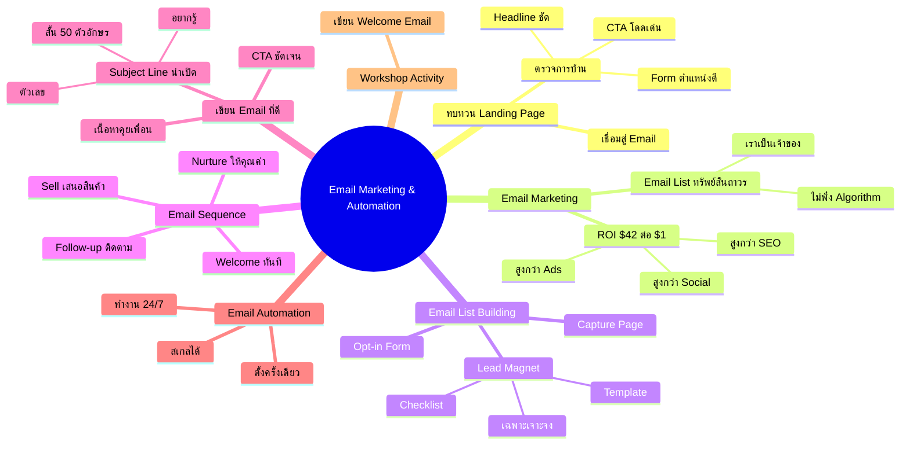
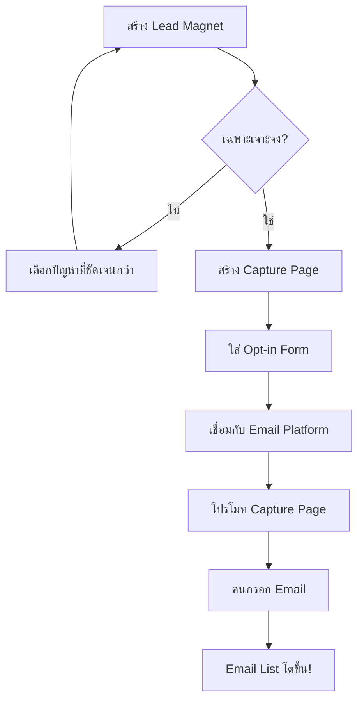
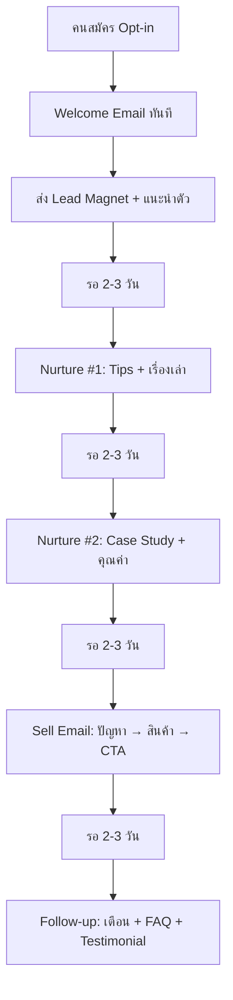
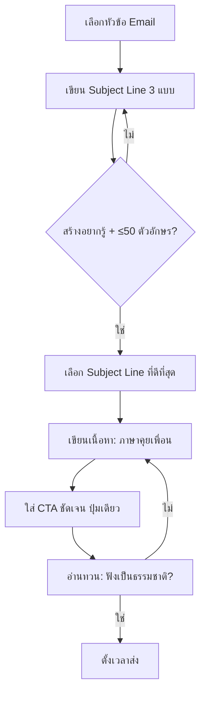
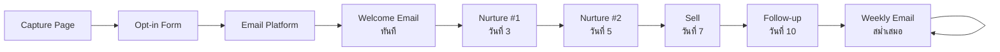

# Workshop ตอนที่ 5 — WKSHP-005 Mind Map
> Format: Mind Map (7 Parts)
> Source: SWP3 Ch04 Workshop ตอนที่ 5
> Production: PinkCastle Academy | จูล่ง CTO
> Date: 2026-02-18 | Duration: 1:43:46

---

## Part 1: Text-Based Mind Map (Tree Format)

```
EMAIL MARKETING & AUTOMATION (WKSHP-005)
│
├── 1. ทบทวน LANDING PAGE
│   ├── ตรวจการบ้านจากตอนที่แล้ว
│   │   ├── Headline ชัดเจนไหม?
│   │   ├── CTA โดดเด่นไหม?
│   │   └── Lead Capture Form ตำแหน่งดีไหม?
│   └── เชื่อมสู่ Email Marketing
│       └── Landing Page → Opt-in → Email List
│
├── 2. EMAIL MARKETING คืออะไร
│   ├── สื่อสารตรงกับลูกค้าผ่าน Email
│   ├── ROI สูงสุด: $42 ต่อ $1
│   │   ├── สูงกว่า SEO ($22)
│   │   ├── สูงกว่า Social Media ($13)
│   │   └── สูงกว่า Google Ads ($8)
│   └── Email List = ทรัพย์สินถาวร
│       ├── เราเป็นเจ้าของ 100%
│       ├── ไม่พึ่ง Algorithm
│       ├── ส่งถึงทุกคนไม่จ่ายเพิ่ม
│       └── ย้ายแพลตฟอร์มได้
│
├── 3. EMAIL LIST BUILDING
│   ├── Lead Magnet (ของฟรีแลก Email)
│   │   ├── eBook / Checklist / Template
│   │   ├── ต้องเฉพาะเจาะจง
│   │   ├── ใช้ได้ทันที
│   │   └── สั้นกระชับ 1-3 หน้า
│   ├── Capture Page (Landing Page)
│   │   ├── Headline ชัดเจน
│   │   └── แสดง Lead Magnet
│   └── Opt-in Form
│       ├── ถามข้อมูลน้อยที่สุด
│       └── ชื่อ + Email = พอ
│
├── 4. EMAIL SEQUENCE
│   ├── 1. Welcome Email (ทันที)
│   │   ├── ต้อนรับ + ส่ง Lead Magnet
│   │   ├── แนะนำตัวสั้นๆ
│   │   └── บอกสิ่งที่คาดหวังได้
│   ├── 2. Nurture Email x2-3 (ทุก 2-3 วัน)
│   │   ├── ให้คุณค่า Tips
│   │   ├── เรื่องเล่า Case Study
│   │   └── สร้างความไว้วางใจ
│   ├── 3. Sell Email (หลัง Nurture)
│   │   ├── ปัญหา → วิธีแก้
│   │   └── ข้อเสนอ → CTA
│   ├── 4. Follow-up Email (2-3 วันหลัง)
│   │   ├── เตือนข้อเสนอ
│   │   ├── FAQ
│   │   └── Social Proof / Testimonial
│   └── ⚠️ อย่าขายตั้งแต่ Email แรก!
│
├── 5. การเขียน EMAIL ที่ดี
│   ├── Subject Line น่าเปิด
│   │   ├── สร้างความอยากรู้
│   │   ├── ใช้ตัวเลข
│   │   ├── ระบุประโยชน์ชัดเจน
│   │   └── สั้น ≤ 50 ตัวอักษร
│   ├── เนื้อหา
│   │   ├── ให้คุณค่าจริง
│   │   ├── ภาษาสบายๆ เหมือนคุยเพื่อน
│   │   └── กระชับ ได้ใจความ
│   ├── CTA ชัดเจน
│   │   ├── ปุ่มเดียว ลิงก์เดียว
│   │   └── อย่าให้เยอะจนสับสน
│   └── ส่งสม่ำเสมอ
│       ├── สัปดาห์ละ 1-2 ครั้ง
│       └── ความสม่ำเสมอ > ความถี่
│
├── 6. EMAIL AUTOMATION
│   ├── ตั้งครั้งเดียว ทำงาน 24/7
│   ├── ข้อดี
│   │   ├── ประหยัดเวลา
│   │   ├── ตอบสนองทันที (ตี 3 ก็ได้!)
│   │   ├── ไม่พลาดโอกาส
│   │   └── สเกลได้ (10 → 10,000 คน)
│   └── = พนักงานขายที่ไม่เคยหลับ
│
└── 7. WORKSHOP ACTIVITY
    └── เขียน Welcome Email แรก
        ├── ทักทาย + ใช้ชื่อจริง
        ├── ส่งมอบ Lead Magnet
        ├── แนะนำตัวสั้นๆ
        ├── บอกสิ่งที่จะส่งต่อไป
        └── CTA กดดาวน์โหลด
```

---

## Part 2: Mermaid Mind Map



---

## Part 3: Mermaid Flowcharts

### Flowchart 1: Email List Building Process



### Flowchart 2: Email Sequence Flow



### Flowchart 3: Email Writing Process



### Flowchart 4: Email Automation Pipeline



---

## Part 4: Comparison Chart

### Email Marketing vs Social Media Marketing

| เปรียบเทียบ | Email Marketing | Social Media |
|-------------|----------------|--------------|
| **ROI** | $42 ต่อ $1 | $13 ต่อ $1 |
| **เจ้าของ** | เราเป็นเจ้าของ 100% | แพลตฟอร์มเป็นเจ้าของ |
| **Reach** | ส่งถึงทุกคนใน List | ขึ้นกับ Algorithm |
| **ค่าใช้จ่าย Reach** | ไม่ต้องจ่ายเพิ่ม | ต้อง Boost/จ่าย Ads |
| **Personalization** | สูงมาก (ชื่อ, พฤติกรรม) | ต่ำ |
| **ความยั่งยืน** | อยู่ตลอด ย้ายแพลตฟอร์มได้ | เสี่ยงหาย ถ้าแพลตฟอร์มเปลี่ยน |
| **เหมาะกับ** | Nurture + Sell ระยะยาว | Awareness + Engagement |
| **ข้อจำกัด** | ต้องสร้าง List ก่อน | ต้องสร้าง Content สม่ำเสมอ |

### Email Sequence 4 ขั้นตอน

| ขั้นตอน | ประเภท | เป้าหมาย | ส่งเมื่อ | ตัวอย่างเนื้อหา |
|---------|--------|----------|----------|-----------------|
| 1 | Welcome | ต้อนรับ + ส่งของ | ทันที | Lead Magnet + แนะนำตัว |
| 2-3 | Nurture | สร้างไว้ใจ | ทุก 2-3 วัน | Tips + เรื่องเล่า + Case Study |
| 4 | Sell | เสนอขาย | หลัง Nurture | ปัญหา → สินค้า → CTA |
| 5 | Follow-up | ติดตาม | 2-3 วันหลัง | เตือน + FAQ + Testimonial |

---

## Part 5: Summary Table

| # | หัวข้อ | สาระสำคัญ | Action Item |
|---|--------|----------|-------------|
| 1 | ทบทวน Landing Page | ตรวจ Headline, CTA, Form เชื่อมสู่ Email | ปรับ Landing Page ให้มี Opt-in Form ชัดเจน |
| 2 | Email Marketing ROI | $42 ต่อ $1 สูงที่สุดในทุกช่องทาง | ให้ความสำคัญ Email เป็นอันดับแรก |
| 3 | Email List = ทรัพย์สิน | เป็นเจ้าของจริง ไม่พึ่ง Algorithm | ทุกช่องทางควรนำคนเข้า Email List |
| 4 | Lead Magnet | ของฟรีเฉพาะเจาะจง ใช้ได้ทันที | สร้าง Checklist/Template 1-3 หน้า |
| 5 | Email Sequence | Welcome → Nurture → Sell → Follow-up | เขียน Sequence 5 ฉบับ ตั้ง Automation |
| 6 | Subject Line | อยากรู้ + ตัวเลข + ประโยชน์ + ≤50 ตัวอักษร | เขียน 3 แบบ เลือกที่ดีที่สุด |
| 7 | เขียน Email ดี | ภาษาคุยเพื่อน + CTA ปุ่มเดียว | อ่านออกเสียงก่อนส่ง ตรวจว่าเป็นธรรมชาติ |
| 8 | Email Automation | ตั้งครั้งเดียว ทำงาน 24/7 | ตั้ง Welcome Sequence อัตโนมัติ |
| 9 | ส่งสม่ำเสมอ | สม่ำเสมอ > ถี่ สัปดาห์ละ 1-2 ครั้ง | กำหนดวันเวลาส่งประจำ |
| 10 | Workshop Activity | เขียน Welcome Email แรก | ลงมือเขียนวันนี้เลย! |

---

## Part 6: Implementation Roadmap

```
สัปดาห์ที่ 1: SETUP
├── วันที่ 1-2: สร้าง Lead Magnet (Checklist/Template 1-3 หน้า)
├── วันที่ 3: ปรับ Landing Page ใส่ Opt-in Form
├── วันที่ 4: เชื่อม Form กับ Email Platform (Systeme.io/Mailchimp)
├── วันที่ 5: เขียน Welcome Email + ตั้ง Automation
├── วันที่ 6: เขียน Nurture Email #1
└── วันที่ 7: เขียน Nurture Email #2

สัปดาห์ที่ 2: COMPLETE SEQUENCE
├── วันที่ 1: เขียน Sell Email
├── วันที่ 2: เขียน Follow-up Email
├── วันที่ 3: ตั้ง Automation Sequence ครบ 5 ฉบับ
├── วันที่ 4: ทดสอบส่งถึงตัวเอง ตรวจทุก Email
├── วันที่ 5: โปรโมท Capture Page บน Social Media
├── วันที่ 6: เก็บสมาชิกกลุ่มแรก
└── วันที่ 7: วัดผล Open Rate + Click Rate

สัปดาห์ที่ 3: WEEKLY EMAIL
├── วันที่ 1: กำหนดตาราง Email รายสัปดาห์ (วัน+เวลา)
├── วันที่ 2-3: เขียน Email ให้คุณค่าฉบับแรก
├── วันที่ 4: ส่ง Email ตามตาราง
├── วันที่ 5-6: เขียน Email ฉบับถัดไปล่วงหน้า
└── วันที่ 7: วิเคราะห์ Open Rate + ปรับปรุง Subject Line

สัปดาห์ที่ 4: OPTIMIZE
├── วันที่ 1-2: A/B Test Subject Line (ถ้า List ใหญ่พอ)
├── วันที่ 3-4: ปรับ Lead Magnet จาก Feedback
├── วันที่ 5: วิเคราะห์ Sequence ทั้งหมด (Open/Click/Unsubscribe)
├── วันที่ 6: ปรับปรุง Email ที่ทำผลงานต่ำ
└── วันที่ 7: วางแผนเดือนถัดไป
```

---

## Part 7: Key Formulas & Frameworks

### สูตร Email List Building
```
Email List Growth = Lead Magnet (คุณค่าสูง + เฉพาะเจาะจง)
                  + Capture Page (Headline ชัด + CTA โดดเด่น)
                  + Opt-in Form (ง่ายที่สุด: ชื่อ + Email)
```

### สูตร Email Sequence
```
Sequence = Welcome (ทันที) → Nurture x2-3 (ทุก 2-3 วัน)
         → Sell (หลัง Nurture) → Follow-up (2-3 วันหลัง)
หลักคิด: ให้คุณค่าก่อน → สร้างไว้ใจ → แล้วค่อยขาย
```

### สูตร Subject Line ที่น่าเปิด
```
Subject Line = ความอยากรู้ + ตัวเลข + ประโยชน์ชัดเจน
ความยาว: ≤ 50 ตัวอักษร (มือถือตัด)
ตัวอย่าง: "3 สิ่งที่เปลี่ยนยอดขายผมภายใน 7 วัน"
          [ตัวเลข] + [อยากรู้] + [ประโยชน์ + Timeline]
```

### สูตร Email Content ที่ดี
```
Email = ภาษาคุยเพื่อน + คุณค่าจริง + CTA เดียว
       (ไม่ทางการ)   (ไม่ขายอย่างเดียว) (ปุ่มเดียว)
ความถี่: สัปดาห์ละ 1-2 ครั้ง สม่ำเสมอ
```

### สูตร Email Automation ROI
```
Automation Value = (จำนวนสมาชิก × Sequence × 24/7)
                 - (เวลาตั้งระบบครั้งเดียว)
                 = พนักงานขายที่ไม่เคยหลับ
10 คน หรือ 10,000 คน = ทำงานเท่ากัน → สเกลได้ไม่จำกัด
```

### สูตร Welcome Email
```
Welcome Email = ทักทาย (ใช้ชื่อจริง)
              + ส่ง Lead Magnet (ลิงก์ดาวน์โหลด)
              + แนะนำตัวสั้นๆ (2-3 ประโยค)
              + บอกสิ่งที่จะส่งต่อ (ตั้งความคาดหวัง)
              + CTA (กดดาวน์โหลดเลย)
```

---

> ทบทวนต่อ: **WKSHP-007** — Workshop ตอนที่ 7
> Series: SWP3 Ch04 Workshop
> PinkCastle Academy © 2026
