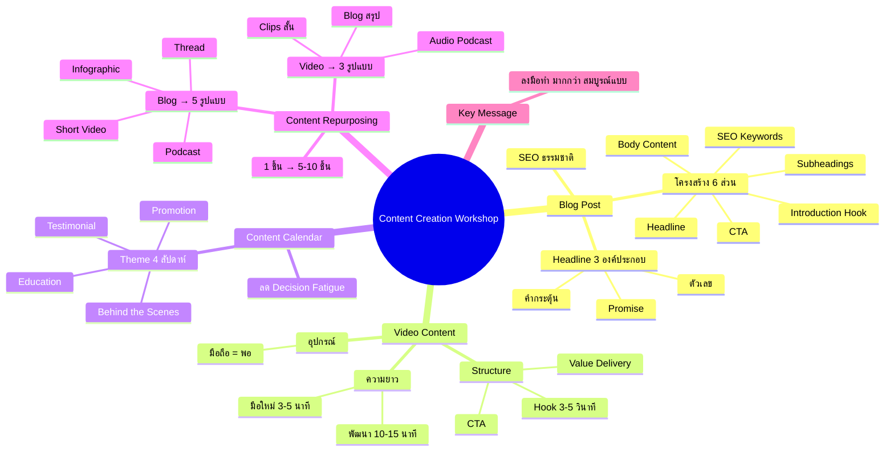
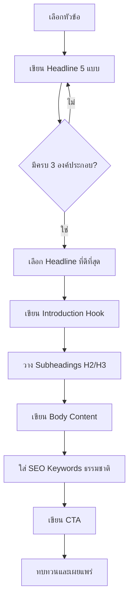
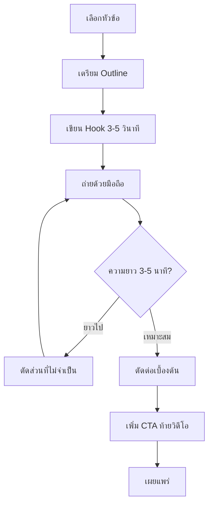
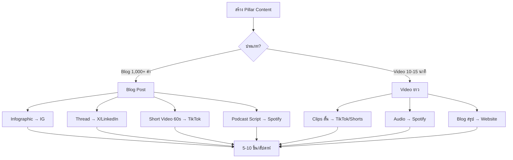
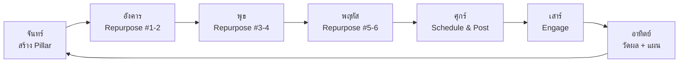

# Workshop ตอนที่ 6 — WKSHP-006 Mind Map
> Format: Mind Map (7 Parts)
> Source: SWP3 Ch4 Workshop SWP3 ครั้งที่ 1 ตอนที่ 6
> Production: PinkCastle Academy | จูล่ง CTO
> Date: 2026-02-18

---

## Part 1: Text-Based Mind Map (Tree Format)

```
CONTENT CREATION WORKSHOP (WKSHP-006)
│
├── 1. BLOG POST
│   ├── Headline 3 องค์ประกอบ
│   │   ├── ตัวเลข (เช่น "5 วิธี...")
│   │   ├── คำกระตุ้น (เช่น "ได้ผลจริง")
│   │   └── Promise (เช่น "ภายใน 30 วัน")
│   ├── โครงสร้าง 6 ส่วน
│   │   ├── Headline
│   │   ├── Introduction (Hook 2-3 บรรทัด)
│   │   ├── Subheadings (H2/H3 + Keyword)
│   │   ├── Body Content (Tips, Case Study)
│   │   ├── SEO Keywords (ธรรมชาติ)
│   │   └── Call to Action
│   └── SEO Best Practice
│       ├── ใส่ใน Title, H1, ย่อหน้าแรก
│       ├── กระจายในเนื้อหา
│       └── อย่ายัด Keyword จนแปลก
│
├── 2. VIDEO CONTENT
│   ├── Structure 3 ส่วน
│   │   ├── Hook (3-5 วินาที) ← สำคัญที่สุด
│   │   ├── Value Delivery
│   │   └── CTA
│   ├── อุปกรณ์
│   │   ├── มือถือ = เพียงพอ (HD)
│   │   └── กล้อง DSLR = ไม่จำเป็น
│   ├── การเตรียมตัว
│   │   ├── Script/Outline (ไม่ต้องคำต่อคำ)
│   │   └── หัวข้อ + ลำดับ
│   └── ความยาว
│       ├── มือใหม่: 3-5 นาที
│       └── พัฒนาแล้ว: 10-15 นาที
│
├── 3. CONTENT CALENDAR
│   ├── คืออะไร
│   │   └── ตารางวางแผน: โพสต์อะไร / เมื่อไร / แพลตฟอร์มไหน
│   ├── ช่วยแก้ปัญหา
│   │   └── ลดภาระตัดสินใจ (Decision Fatigue)
│   ├── Theme 4 สัปดาห์
│   │   ├── Week 1: Education (สอน)
│   │   ├── Week 2: Behind the Scenes (เบื้องหลัง)
│   │   ├── Week 3: Testimonial (รีวิว)
│   │   └── Week 4: Promotion (ขาย)
│   └── เครื่องมือ
│       ├── Google Sheets
│       └── Notion
│
├── 4. CONTENT REPURPOSING
│   ├── หลักคิด
│   │   └── "สร้างครั้งเดียว ใช้ได้หลายครั้ง"
│   ├── Blog → Repurpose
│   │   ├── Infographic → IG, Pinterest
│   │   ├── Thread / Carousel → X, LinkedIn
│   │   ├── Short Video 60s → TikTok, Reels
│   │   └── Podcast Script → Spotify
│   ├── Video ยาว → Repurpose
│   │   ├── Clips สั้น 3-5 ชิ้น → TikTok, Shorts
│   │   ├── Audio Podcast → Spotify
│   │   └── Blog สรุป → Website, Medium
│   └── ผลลัพธ์
│       └── 1 ชิ้น → 5-10 ชิ้น
│
└── 5. KEY MESSAGE
    └── ลงมือทำสำคัญกว่าความสมบูรณ์แบบ
        ├── เขียนวันละ 300-500 คำ
        ├── วิดีโอเริ่มที่ 3-5 นาที
        └── เริ่มวันนี้ ไม่ต้องรอ!
```

---

## Part 2: Mermaid Mind Map



---

## Part 3: Mermaid Flowcharts

### Flowchart 1: Blog Post Creation Process



### Flowchart 2: Video Content Creation Process



### Flowchart 3: Content Repurposing Pipeline



### Flowchart 4: Weekly Content Workflow



---

## Part 4: Comparison Chart

### Blog Post vs Video Content

| เปรียบเทียบ | Blog Post | Video Content |
|-------------|-----------|---------------|
| **จุดแข็ง** | SEO ดี, อยู่นาน | Engagement สูง, เข้าถึงง่าย |
| **โครงสร้าง** | 6 ส่วน (Headline→CTA) | 3 ส่วน (Hook→Value→CTA) |
| **ความยาวเริ่มต้น** | 300-500 คำ/วัน | 3-5 นาที |
| **อุปกรณ์** | คอมพิวเตอร์ | มือถือ |
| **SEO** | สำคัญมาก | สำคัญน้อยกว่า |
| **Repurpose ได้** | 4+ รูปแบบ | 3+ รูปแบบ |
| **เหมาะกับ** | เนื้อหาเชิงลึก | เนื้อหาเข้าถึงง่าย |
| **แพลตฟอร์มหลัก** | Website, Medium | YouTube, TikTok, IG |

### Content Calendar Theme 4 สัปดาห์

| สัปดาห์ | Theme | เป้าหมาย | ตัวอย่างคอนเทนต์ |
|---------|-------|----------|------------------|
| 1 | Education | ให้ความรู้ สร้างความเชี่ยวชาญ | How-to, Tips, Tutorial |
| 2 | Behind the Scenes | สร้างความใกล้ชิด ความจริงใจ | วันทำงาน, กระบวนการ, ทีม |
| 3 | Testimonial | สร้างความน่าเชื่อถือ | รีวิว, Case Study, Before/After |
| 4 | Promotion | ขายสินค้า/บริการ | โปรโมชัน, ข้อเสนอพิเศษ, CTA |

---

## Part 5: Summary Table

| # | หัวข้อ | สาระสำคัญ | Action Item |
|---|--------|----------|-------------|
| 1 | Blog Headline | ตัวเลข + คำกระตุ้น + Promise | เขียน Headline 5 แบบ เลือกที่ดีที่สุด |
| 2 | Blog Structure | 6 ส่วน: Headline→Intro→Subheadings→Body→SEO→CTA | สร้าง Template ใน Google Docs |
| 3 | SEO Keywords | ใส่ใน Title, H1, ย่อหน้าแรก อย่างธรรมชาติ | เขียนให้คนอ่านก่อน ค่อยเพิ่ม SEO |
| 4 | Video Structure | Hook (3-5 วินาที) + Value + CTA | เริ่มด้วย Hook ที่แรง ไม่ใช่ "สวัสดีครับ" |
| 5 | Video Equipment | มือถือ + Outline = เพียงพอ | ถ่ายวิดีโอแรกด้วยมือถือวันนี้ |
| 6 | Content Calendar | ตารางวางแผน + Theme 4 สัปดาห์ | สร้าง Calendar ด้วย Google Sheets/Notion |
| 7 | Repurposing | 1 ชิ้น → 5-10 ชิ้น | สร้าง Pillar Content แล้ว Repurpose |
| 8 | Pillar Content | Blog 1,000+ คำ หรือ Video 10-15 นาที | กำหนดวันสร้าง Pillar ในแต่ละสัปดาห์ |
| 9 | Weekly Workflow | จันทร์สร้าง → อ-ศ Repurpose → อา วัดผล | ทำตาม Weekly Content Workflow |
| 10 | Key Message | ลงมือทำ > ความสมบูรณ์แบบ | สร้างคอนเทนต์ชิ้นแรกเลยวันนี้ |

---

## Part 6: Implementation Roadmap

```
สัปดาห์ที่ 1: SETUP
├── วันที่ 1-2: สร้าง Blog Template + Content Calendar
├── วันที่ 3-4: เขียน Blog Post แรก (300-500 คำ)
├── วันที่ 5: ถ่ายวิดีโอแรกด้วยมือถือ (3-5 นาที)
├── วันที่ 6: ตั้งค่า Theme 4 สัปดาห์
└── วันที่ 7: ทบทวนและปรับแผน

สัปดาห์ที่ 2: PRACTICE
├── วันที่ 1: สร้าง Pillar Content ชิ้นแรก
├── วันที่ 2-5: Repurpose เป็น 5-7 ชิ้น
├── วันที่ 6: โพสต์บนแพลตฟอร์มต่างๆ
└── วันที่ 7: วัดผล + Weekly Review

สัปดาห์ที่ 3: CONSISTENCY
├── วันที่ 1: Pillar Content ชิ้นที่ 2
├── วันที่ 2-5: Repurpose + โพสต์ตาม Calendar
├── วันที่ 6: ติดตาม Metrics (Views, Engagement)
└── วันที่ 7: วัดผลเปรียบเทียบสัปดาห์ที่ 2

สัปดาห์ที่ 4: OPTIMIZE
├── วันที่ 1: Pillar Content ชิ้นที่ 3
├── วันที่ 2-5: Repurpose + ปรับปรุงจาก Feedback
├── วันที่ 6: วิเคราะห์คอนเทนต์ที่ทำผลงานดีที่สุด
└── วันที่ 7: สร้างแผนเดือนถัดไป
```

---

## Part 7: Key Formulas & Frameworks

### สูตร Headline ที่ดึงดูด
```
Headline = [ตัวเลข] + [คำกระตุ้น] + [Promise]
ตัวอย่าง: "5 วิธีเพิ่มยอดขายออนไลน์ที่ได้ผลจริงภายใน 30 วัน"
         [5] + [ได้ผลจริง] + [เพิ่มยอดขาย ภายใน 30 วัน]
```

### สูตร Video Structure
```
Video = Hook (3-5 วินาที) + Value Delivery + CTA
Hook = คำถาม | ผลลัพธ์ที่น่าตกใจ | ปัญหาที่คนเจอ
```

### สูตร Content Calendar
```
1 เดือน = 4 Theme (Education → Behind Scenes → Testimonial → Promotion)
1 สัปดาห์ = 1 Pillar Content + 5-7 Repurposed Content
```

### สูตร Repurposing
```
1 Blog (1,000+ คำ) → 4 ชิ้นใหม่ (Infographic + Thread + Video + Podcast)
1 Video (10-15 นาที) → 3 ชิ้นใหม่ (Clips + Audio + Blog สรุป)
```

### สูตร Pillar Content Strategy
```
Pillar Content → ลงลึกเรื่องหนึ่ง (Blog 1,000+ คำ หรือ Video 10-15 นาที)
Repurposed Content → ตัดแบ่ง/แปลงรูปแบบ → 5-10 ชิ้นสั้น → หลายแพลตฟอร์ม
Weekly Cycle → จันทร์สร้าง → อ-ศ Repurpose → อา วัดผล → วนซ้ำ
```

---

> ทบทวนต่อ: **WKSHP-007** — Workshop SWP3 ครั้งที่ 1 ตอนที่ 7
> Series: SWP3 Ch4 Workshop
> PinkCastle Academy © 2026
