# Workshop ตอนที่ 7 — WKSHP-007 Mind Map
> Format: Mind Map (7 Parts)
> Source: SWP3 Ch04 Workshop ตอนที่ 7
> Production: PinkCastle Academy | จูล่ง CTO
> Date: 2026-02-18 | Duration: 1:27:01

---

## Part 1: Text-Based Mind Map (Tree Format)

```
SOCIAL MEDIA MARKETING STRATEGY (WKSHP-007)
│
├── 1. ทบทวนการบ้าน EMAIL AUTOMATION
│   ├── ตรวจ Email Sequence ที่นักเรียนตั้ง
│   ├── Feedback ปรับปรุง
│   │   ├── Subject Line ยาวเกินไป → ให้สั้น
│   │   ├── ไม่มี Personalization → ใส่ First Name
│   │   └── ไม่มี Urgency → เพิ่ม Curiosity Gap
│   └── บางคนทำได้ดี: Welcome Email + Nurture Series ครบ
│
├── 2. SOCIAL MEDIA STRATEGY
│   ├── หลักการ: ไม่ต้องอยู่ทุกแพลตฟอร์ม
│   │   └── "เก่ง 2 ดีกว่าทำพอได้ 5"
│   ├── เลือก 2-3 แพลตฟอร์ม
│   │   ├── แพลตฟอร์มหลัก 1 อัน
│   │   └── แพลตฟอร์มรอง 1-2 อัน
│   └── เลือกตามกลุ่มเป้าหมาย
│       ├── B2B → LinkedIn + Facebook
│       ├── Lifestyle → Instagram + TikTok
│       ├── การศึกษา → YouTube + Facebook
│       ├── อาหาร/ร้านค้า → Instagram + TikTok
│       └── Tech/SaaS → LinkedIn + YouTube
│
├── 3. CONTENT CALENDAR
│   ├── Content Pillars 3-5 หมวด
│   │   ├── กำหนดหมวดคอนเทนต์ที่ชัดเจน
│   │   ├── ทุกโพสต์ต้องอยู่ในหมวด
│   │   └── ไม่เข้าหมวด = ไม่โพสต์
│   ├── ความสม่ำเสมอ
│   │   ├── 3 ครั้ง/สัปดาห์สม่ำเสมอ > 7 วันรวดแล้วหาย
│   │   └── Algorithm ให้รางวัลความสม่ำเสมอ
│   └── วางแผนล่วงหน้า
│       └── รายสัปดาห์/รายเดือน
│
├── 4. CONTENT TYPES (80/20)
│   ├── 80% Value Content
│   │   ├── Educational (สอน) ~30%
│   │   │   └── How-to, Tips, Tutorial, Checklist
│   │   ├── Entertaining (สนุก) ~25%
│   │   │   └── Meme, Behind the Scenes, Trend
│   │   └── Inspiring (แรงบันดาลใจ) ~25%
│   │       └── Success Story, Quote, Testimonial
│   ├── 20% Promotional
│   │   └── Offer, Product Launch, CTA
│   └── ถ้าขายทุกโพสต์ = คนเลิกติดตาม
│
├── 5. ENGAGEMENT STRATEGY
│   ├── ตอบ Comment ทุกอัน
│   │   └── ยิ่งเร็ว = Algorithm ดัน Post มากขึ้น
│   ├── ถามคำถามในโพสต์
│   │   └── "คุณเคยเจอปัญหานี้ไหม?"
│   ├── สร้าง Community
│   │   └── คนรู้สึกเป็นส่วนหนึ่ง
│   └── ใช้ Story/Reels/Short
│       ├── Reach สูงจาก Algorithm
│       └── Engagement Rate สูงกว่าโพสต์ปกติ
│
├── 6. SOCIAL MEDIA + FUNNEL
│   ├── สูตร: Post → Link in Bio → Landing Page → Email List
│   ├── Link in Bio
│   │   ├── อสังหาริมทรัพย์ที่มีค่ามาก
│   │   ├── ใช้ Linktree หรือ Landing Page
│   │   └── CTA ชัด: "รับ E-Book ฟรี คลิกลิงก์"
│   ├── Email List = ทรัพย์สินจริง
│   │   ├── ควบคุมได้ 100%
│   │   ├── ไม่ต้องพึ่ง Algorithm
│   │   └── Conversion Rate สูงกว่า Social Media
│   └── Social Media = เครื่องมือ ไม่ใช่เป้าหมาย
│
└── 7. WORKSHOP ACTIVITY
    └── วางแผน Content Calendar 1 สัปดาห์
        ├── กำหนด Content Pillars
        ├── เลือก 2-3 แพลตฟอร์ม
        ├── ใส่ Content Type ตามกฎ 80/20
        └── ทุกโพสต์มี CTA เข้า Funnel
```

---

## Part 2: Mermaid Mind Map

```mermaid
mindmap
  root((Social Media Marketing Strategy))
    ทบทวนการบ้าน
      Email Automation
        Subject Line สั้น
        Personalization
        Curiosity Gap
    เลือกแพลตฟอร์ม
      2-3 แพลตฟอร์ม
        หลัก 1 อัน
        รอง 1-2 อัน
      ตามกลุ่มเป้าหมาย
        B2B: LinkedIn + FB
        Lifestyle: IG + TikTok
        การศึกษา: YouTube + FB
    Content Calendar
      Content Pillars 3-5 หมวด
      ความสม่ำเสมอ
        3 ครั้ง/สัปดาห์
      วางแผนล่วงหน้า
    Content Types 80/20
      80% Value
        Educational สอน
        Entertaining สนุก
        Inspiring แรงบันดาลใจ
      20% Promotional
        ขายของ
    Engagement Strategy
      ตอบ Comment ทุกอัน
      ถามคำถาม
      Story/Reels/Short
      สร้าง Community
    Social Media + Funnel
      Post
      Link in Bio
      Landing Page
      Email List
    Workshop Activity
      Content Calendar 1 สัปดาห์
```



---

## Part 3: Mermaid Flowcharts

### Flowchart 1: Social Media Strategy Decision Process

```mermaid
flowchart TD
    A[วิเคราะห์กลุ่มเป้าหมาย] --> B{อยู่แพลตฟอร์มไหน?}
    B -->|มืออาชีพ/B2B| C[LinkedIn + Facebook]
    B -->|ภาพสวย/Lifestyle| D[Instagram + TikTok]
    B -->|เนื้อหาเชิงลึก| E[YouTube + Facebook]
    B -->|อาหาร/ร้านค้า| F[Instagram + TikTok]
    C --> G[เลือกหลัก 1 + รอง 1-2]
    D --> G
    E --> G
    F --> G
    G --> H[กำหนด Content Pillars 3-5 หมวด]
    H --> I[สร้าง Content Calendar]
    I --> J[โพสต์สม่ำเสมอ 3-5 ครั้ง/สัปดาห์]
```



### Flowchart 2: Content Type Selection (80/20 Rule)

```mermaid
flowchart TD
    A[สร้างคอนเทนต์ใหม่] --> B{อยู่ใน Content Pillar?}
    B -->|ไม่| C[❌ ไม่โพสต์]
    B -->|ใช่| D{เช็คสัดส่วน 80/20}
    D -->|Promo ยังไม่ถึง 20%| E{ต้องการขาย?}
    D -->|Promo เกิน 20% แล้ว| F[เปลี่ยนเป็น Value Content]
    E -->|ใช่| G[🛒 Promotional]
    E -->|ไม่| H{ประเภทไหน?}
    H -->|สอน| I[📚 Educational]
    H -->|สนุก| J[🎭 Entertaining]
    H -->|แรงบันดาลใจ| K[💡 Inspiring]
    F --> H
    G --> L[โพสต์ + CTA เข้า Funnel]
    I --> L
    J --> L
    K --> L
```



### Flowchart 3: Social Media Funnel Pipeline

```mermaid
flowchart TD
    A[สร้าง Content ดึงดูด] --> B[โพสต์บน Social Media]
    B --> C[ใส่ CTA ทุกโพสต์]
    C --> D[Link in Bio]
    D --> E[Landing Page]
    E --> F{มี Lead Magnet?}
    F -->|ไม่| G[สร้าง Lead Magnet<br>E-Book/Checklist ฟรี]
    G --> E
    F -->|มี| H[ผู้ติดตาม กรอก Email<br>แลก Lead Magnet]
    H --> I[📧 Email List]
    I --> J[Email Nurture Sequence]
    J --> K[สร้างความไว้ใจ]
    K --> L[ขายสินค้า/บริการ]
```



### Flowchart 4: Weekly Social Media Workflow

```mermaid
flowchart LR
    A[อาทิตย์<br>วางแผน Calendar] --> B[จันทร์<br>โพสต์ + Engage]
    B --> C[อังคาร<br>Story/Reels]
    C --> D[พุธ<br>โพสต์ + Engage]
    D --> E[พฤหัส<br>Story/Reels]
    E --> F[ศุกร์<br>โพสต์ + Engage]
    F --> G[เสาร์<br>วัดผล Metrics]
    G --> A
```



---

## Part 4: Comparison Chart

### Social Media Followers vs Email List

| เปรียบเทียบ | Social Media Followers | Email List |
|-------------|----------------------|------------|
| **ความเป็นเจ้าของ** | ไม่ได้เป็นของเรา | เป็นของเรา 100% |
| **การเข้าถึง** | ขึ้นกับ Algorithm | ส่งตรง 1-on-1 |
| **ความเสี่ยง** | แพลตฟอร์มปิด/เปลี่ยน | ไม่มีความเสี่ยง |
| **Conversion Rate** | ต่ำ (~1-2%) | สูง (~3-5%) |
| **ค่าใช้จ่าย** | ฟรี (แต่ Reach ลดลง) | ค่าเครื่องมือ Email |
| **ความสัมพันธ์** | ผิวเผิน | ลึกซึ้ง |
| **ควบคุม Timing** | Algorithm เลือก | เราเลือกเอง |
| **สรุป** | เครื่องมือ | ทรัพย์สิน |

### Content Types 4 ประเภท

| Content Type | สัดส่วน | เป้าหมาย | ตัวอย่าง | ผลลัพธ์ |
|-------------|---------|----------|---------|---------|
| Educational | ~30% | ให้ความรู้ สร้างความเชี่ยวชาญ | How-to, Tips, Tutorial | Trust + Authority |
| Entertaining | ~25% | ดึงดูดความสนใจ เพิ่ม Reach | Meme, BTS, Trend | Awareness + Reach |
| Inspiring | ~25% | กระตุ้นอารมณ์ สร้างแรงจูงใจ | Success Story, Quote | Connection + Loyalty |
| Promotional | ~20% | ขายสินค้า/บริการ | Offer, Launch, CTA | Revenue + Conversion |

---

## Part 5: Summary Table

| # | หัวข้อ | สาระสำคัญ | Action Item |
|---|--------|----------|-------------|
| 1 | ทบทวน Email Automation | Subject Line สั้น + Personalization + Urgency | กลับไปปรับ Email Sequence ของตัวเอง |
| 2 | เลือกแพลตฟอร์ม | 2-3 อัน ตามกลุ่มเป้าหมาย ไม่ต้องอยู่ทุกที่ | วิเคราะห์กลุ่มเป้าหมาย เลือกวันนี้ |
| 3 | Content Pillars | 3-5 หมวดกำหนดทิศทาง ไม่เข้าหมวด = ไม่โพสต์ | เขียน Pillars ของธุรกิจตัวเอง |
| 4 | Content Types 80/20 | 80% Value + 20% Promotional | นับสัดส่วนใน Calendar ทุกสัปดาห์ |
| 5 | ความสม่ำเสมอ | 3 ครั้ง/สัปดาห์ > 7 วันรวดแล้วหาย | กำหนดวันโพสต์ตายตัว ไม่ skip |
| 6 | Engagement | ตอบ Comment + ถามคำถาม + Story/Reels | นั่งตอบ Comment 15-30 นาทีหลังโพสต์ |
| 7 | Social Media Funnel | Post → Link in Bio → Landing Page → Email List | ตั้ง Link in Bio + Landing Page |
| 8 | Email List = ทรัพย์สิน | ควบคุมได้ 100% ไม่พึ่ง Algorithm | ตั้งเป้า Email Subscribers รายสัปดาห์ |
| 9 | Link in Bio | อสังหาริมทรัพย์ที่มีค่า + CTA ชัดเจน | สร้าง Lead Magnet + CTA ใน Bio |
| 10 | Content Calendar 1 สัปดาห์ | การบ้าน: Pillar + Type + แพลตฟอร์ม + CTA | ทำให้เสร็จก่อน WKSHP-008 |

---

## Part 6: Implementation Roadmap

```
สัปดาห์ที่ 1: SETUP
├── วันที่ 1: วิเคราะห์กลุ่มเป้าหมาย เลือก 2-3 แพลตฟอร์ม
├── วันที่ 2: กำหนด Content Pillars 3-5 หมวด
├── วันที่ 3: สร้าง Content Calendar 1 สัปดาห์
├── วันที่ 4: ตั้ง Link in Bio + Landing Page
├── วันที่ 5: สร้าง Lead Magnet (E-Book/Checklist)
├── วันที่ 6: โพสต์ชิ้นแรก + CTA เข้า Funnel
└── วันที่ 7: ทบทวน + ปรับแผน

สัปดาห์ที่ 2: EXECUTE
├── วันที่ 1: โพสต์ตาม Calendar (Educational)
├── วันที่ 2: Story/Reels + ตอบ Comment
├── วันที่ 3: โพสต์ตาม Calendar (Entertaining)
├── วันที่ 4: Story/Reels + ตอบ Comment
├── วันที่ 5: โพสต์ตาม Calendar (Inspiring หรือ Promo)
├── วันที่ 6: วัดผล Metrics (Reach, Engagement, Click-through)
└── วันที่ 7: วางแผนสัปดาห์ถัดไป

สัปดาห์ที่ 3: ENGAGE
├── วันที่ 1-5: โพสต์ตาม Calendar + ตอบ Comment 15-30 นาที
├── วันที่ 6: วัดผล Email Subscribers จาก Social Media
└── วันที่ 7: ปรับปรุง Content Type ที่ได้ผลดี

สัปดาห์ที่ 4: OPTIMIZE
├── วันที่ 1-5: โพสต์ + Engage + ทดลอง Content Type ใหม่
├── วันที่ 6: วิเคราะห์ว่า Pillar ไหนได้ผลดีที่สุด
└── วันที่ 7: สร้างแผนเดือนถัดไป + ขยายแพลตฟอร์มถ้าพร้อม
```

---

## Part 7: Key Formulas & Frameworks

### สูตรเลือกแพลตฟอร์ม
```
แพลตฟอร์มที่เหมาะ = กลุ่มเป้าหมายอยู่ที่ไหน + ทักษะที่มี + ประเภทคอนเทนต์
จำนวน = แพลตฟอร์มหลัก 1 + รอง 1-2 = รวม 2-3
หลักคิด = "เก่ง 2 ดีกว่าทำพอได้ 5"
```

### สูตร Content Calendar
```
Content Pillars = 3-5 หมวดที่สอดคล้องกับธุรกิจ
Content Mix = 80% Value (Edu + Ent + Ins) + 20% Promo
ความถี่ = 3-5 ครั้ง/สัปดาห์ แบบสม่ำเสมอ
```

### สูตร 80/20 Content Types
```
10 โพสต์ = 3 Educational + 2-3 Entertaining + 2-3 Inspiring + 2 Promotional
ทุก 5 โพสต์ต้องมี Value ≥ 4 + Promo ≤ 1
```

### สูตร Engagement
```
Engagement = ตอบ Comment (ทุกอัน, เร็ว) + ถามคำถาม + Story/Reels + Community
หลังโพสต์ = นั่งตอบ Comment 15-30 นาที
Story/Reels = อย่างน้อย 3 ครั้ง/สัปดาห์
```

### สูตร Social Media Funnel
```
Post (ดึงดูดด้วย Value) → CTA → Link in Bio → Landing Page (Lead Magnet) → Email List
เป้าหมาย = เปลี่ยน Follower → Subscriber
วัดผล = Email Subscribers/สัปดาห์ (ไม่ใช่แค่ Followers)
Social Media = เครื่องมือ | Email List = ทรัพย์สิน
```

---

> ทบทวนต่อ: **WKSHP-008** — Workshop ตอนที่ 8
> Series: SWP3 Ch04 Workshop
> PinkCastle Academy © 2026
