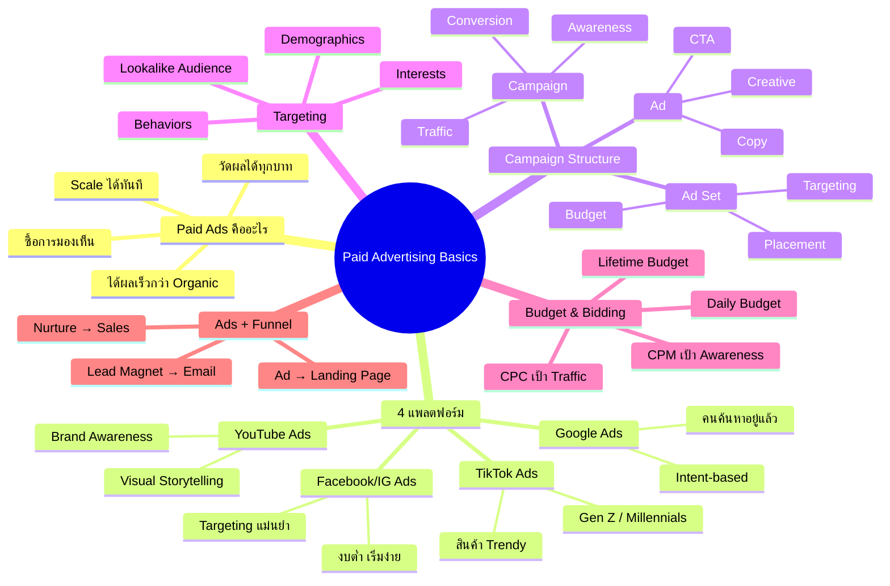
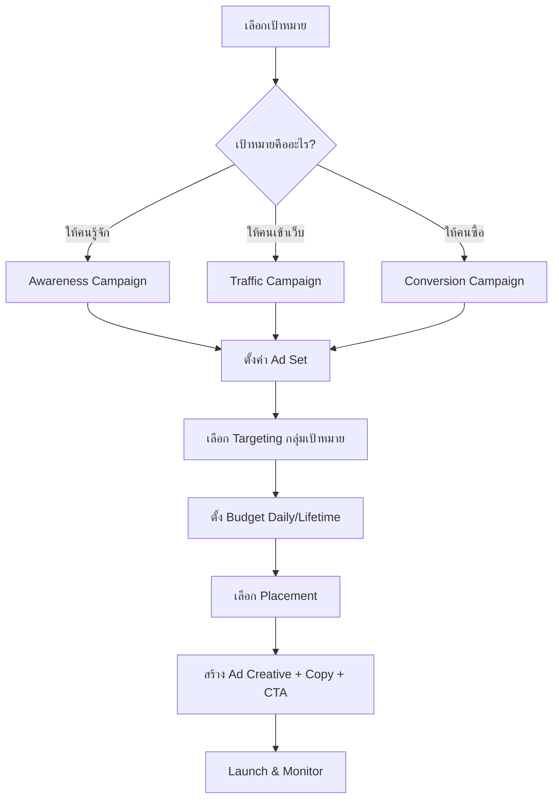
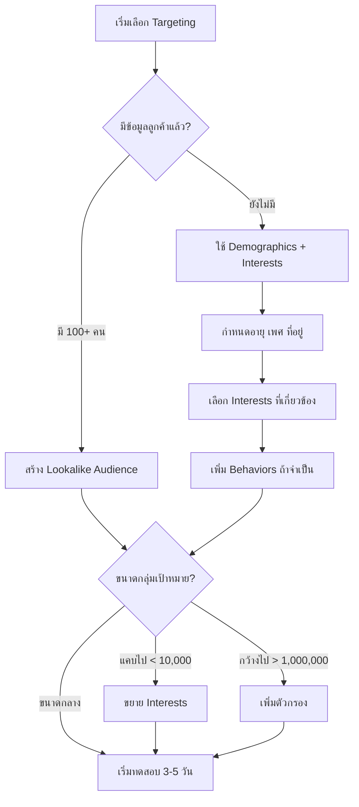
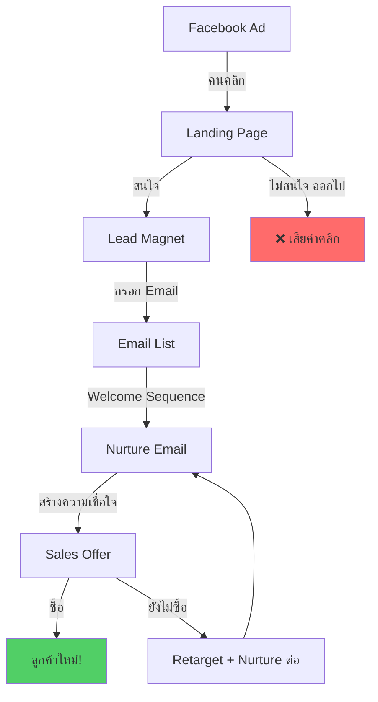
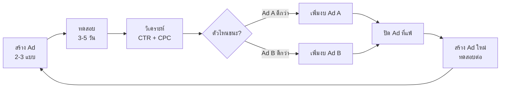

# Workshop ตอนที่ 8 — WKSHP-008 Mind Map
> Format: Mind Map (7 Parts)
> Source: SWP3 Ch04 Workshop ตอนที่ 8
> Production: PinkCastle Academy | จูล่ง CTO
> Date: 2026-02-18 | Duration: 1:04:08

---

## Part 1: Text-Based Mind Map (Tree Format)

```
PAID ADVERTISING BASICS (WKSHP-008)
│
├── 1. ทบทวน SOCIAL MEDIA
│   ├── ตรวจ Content Calendar ของนักเรียน
│   ├── Feedback: Theme รายสัปดาห์ดี
│   └── สิ่งที่ขาด: Paid Strategy เสริม Organic
│
├── 2. PAID ADS คืออะไร
│   ├── จ่ายเงินซื้อการมองเห็น
│   ├── ได้ผลเร็วกว่า Organic (วันแรก!)
│   ├── ข้อดี 4 ประการ
│   │   ├── เร็ว
│   │   ├── เลือกกลุ่มเป้าหมายได้
│   │   ├── วัดผลได้ทุกบาท
│   │   └── Scale ได้ทันที
│   └── Organic + Paid = ทรงพลังที่สุด
│
├── 3. แพลตฟอร์มโฆษณา 4 ตัว
│   ├── Facebook/Instagram Ads ⭐ มือใหม่แนะนำ
│   │   ├── Targeting แม่นยำ
│   │   ├── เข้าถึงกว้าง (B2C)
│   │   └── งบเริ่มต้นต่ำ
│   ├── Google Ads
│   │   ├── Intent-based
│   │   └── คนค้นหาอยู่แล้ว
│   ├── YouTube Ads
│   │   ├── Visual Storytelling
│   │   └── Brand Awareness
│   └── TikTok Ads
│       ├── Gen Z / Millennials
│       └── สินค้า Trendy
│
├── 4. FACEBOOK ADS STRUCTURE
│   ├── Campaign (ชั้นบนสุด)
│   │   └── เป้าหมาย: Awareness / Traffic / Conversion
│   ├── Ad Set (ชั้นกลาง)
│   │   ├── Targeting (ใครเห็น)
│   │   ├── Budget (งบเท่าไร)
│   │   └── Placement (Feed / Stories / Reels)
│   └── Ad (ชั้นล่าง)
│       ├── Creative (รูป/วิดีโอ)
│       ├── Copy (ข้อความ)
│       └── CTA (ปุ่มกด)
│
├── 5. TARGETING
│   ├── Demographics
│   │   └── อายุ, เพศ, ที่อยู่, ภาษา
│   ├── Interests
│   │   └── ธุรกิจ, การตลาด, เทคโนโลยี
│   ├── Behaviors
│   │   └── ซื้อของออนไลน์, ใช้สมาร์ทโฟน
│   ├── Lookalike Audience ⭐
│   │   ├── Algorithm หาคนคล้ายลูกค้าปัจจุบัน
│   │   └── ต้องมีข้อมูล 100+ คนก่อน
│   └── เคล็ดลับ
│       └── เริ่มจากกลุ่มขนาดกลาง
│
├── 6. BUDGET & BIDDING
│   ├── Budget
│   │   ├── Daily Budget (รายวัน) ⭐ มือใหม่แนะนำ
│   │   │   └── เริ่ม 100-300 บาท/วัน
│   │   └── Lifetime Budget (ทั้งแคมเปญ)
│   │       └── เช่น 6,000/30 วัน
│   ├── Bidding
│   │   ├── CPC (Cost Per Click) → Traffic
│   │   └── CPM (Cost Per Mille) → Awareness
│   └── ทดสอบ 3-5 วัน ดูผลก่อนเพิ่มงบ
│
├── 7. ADS + FUNNEL
│   ├── Pipeline 5 ขั้นตอน
│   │   ├── โฆษณา → ดึงดูดความสนใจ
│   │   ├── Landing Page → รวบรวม Lead
│   │   ├── Lead Magnet → แลก Email
│   │   ├── Email List → Nurture สร้างความสัมพันธ์
│   │   └── Sales → ปิดการขาย
│   └── Ads ไม่มี Funnel = เผาเงิน!
│
└── 8. WORKSHOP ACTIVITY
    ├── ออกแบบ Ad แรก
    │   ├── Headline (ดึงดูดสายตา)
    │   ├── Image/Video (สื่อสารชัด)
    │   ├── Ad Copy (≤ 3 บรรทัด)
    │   └── CTA (ปุ่มกด)
    └── A/B Testing
        └── สร้างหลายแบบ ทดสอบ ปรับปรุง
```

---

## Part 2: Mermaid Mind Map



---

## Part 3: Mermaid Flowcharts

### Flowchart 1: Facebook Ads Campaign Setup Process



### Flowchart 2: Targeting Decision Flow



### Flowchart 3: Ads + Funnel Pipeline



### Flowchart 4: A/B Testing Cycle



---

## Part 4: Comparison Chart

### Organic vs Paid Advertising

| เปรียบเทียบ | Organic Marketing | Paid Advertising |
|-------------|-------------------|------------------|
| **ค่าใช้จ่าย** | ฟรี (ค่าเวลา) | จ่ายเงินให้แพลตฟอร์ม |
| **ความเร็ว** | ช้า (เป็นสัปดาห์-เดือน) | เร็ว (ผลวันแรก) |
| **ความยั่งยืน** | ยั่งยืน ผลสะสม | หยุดจ่าย = หยุดเห็น |
| **การ Targeting** | ควบคุมไม่ได้มาก | แม่นยำมาก |
| **Scalability** | Scale ยาก | Scale ง่าย เพิ่มงบได้ |
| **การวัดผล** | วัดยาก | วัดได้ทุกบาท |
| **ตัวอย่าง** | SEO, Content, Social Posts | FB Ads, Google Ads, TikTok Ads |
| **แนะนำ** | ทำเสมอ สร้างรากฐาน | เสริม Organic เร่งการเติบโต |

### เปรียบเทียบ CPC vs CPM

| เปรียบเทียบ | CPC (Cost Per Click) | CPM (Cost Per Mille) |
|-------------|---------------------|---------------------|
| **จ่ายเมื่อ** | คนคลิกโฆษณา | แสดงครบ 1,000 ครั้ง |
| **เหมาะกับ** | Traffic (ให้คนเข้าเว็บ) | Awareness (ให้คนเห็น) |
| **ค่าเฉลี่ยไทย** | 2-5 บาท/คลิก | 50-150 บาท/1,000 ครั้ง |
| **ข้อดี** | จ่ายเฉพาะเมื่อมีคนสนใจ | เข้าถึงคนจำนวนมาก |
| **ข้อเสีย** | เข้าถึงน้อยกว่า | จ่ายแม้ไม่มีคนคลิก |
| **แนะนำเมื่อ** | ต้องการดึงคนเข้าเว็บ/Landing Page | ต้องการสร้างการรับรู้แบรนด์ |

---

## Part 5: Summary Table

| # | หัวข้อ | สาระสำคัญ | Action Item |
|---|--------|----------|-------------|
| 1 | Paid Ads พื้นฐาน | ซื้อการมองเห็น ได้ผลเร็ว วัดผลได้ | วางแผนใช้ Paid Ads เสริม Organic |
| 2 | 4 แพลตฟอร์ม | FB/IG, Google, YouTube, TikTok | เริ่มจาก Facebook Ads |
| 3 | Campaign Structure | Campaign → Ad Set → Ad 3 ระดับ | จดจำ 3 ระดับ ตั้งค่าจากบนลงล่าง |
| 4 | Targeting | Demographics, Interests, Behaviors, Lookalike | เริ่มกลุ่มขนาดกลาง ค่อยปรับ |
| 5 | Lookalike Audience | Algorithm หาคนคล้ายลูกค้า | สะสม Email List + ติดตั้ง Pixel |
| 6 | Budget | Daily vs Lifetime, เริ่ม 100-300 บาท/วัน | ใช้ Daily Budget ทดสอบ 3-5 วัน |
| 7 | Bidding | CPC → Traffic, CPM → Awareness | เลือกให้ตรงเป้าหมาย |
| 8 | Ads + Funnel | Ad → Landing → Lead Magnet → Email → Sales | สร้าง Landing Page ก่อนลงโฆษณา |
| 9 | A/B Testing | สร้างหลายแบบ ทดสอบ เลือกตัวที่ชนะ | สร้าง Ad อย่างน้อย 2-3 แบบทุกครั้ง |
| 10 | Ad 4 องค์ประกอบ | Headline + Image + Copy + CTA | ออกแบบ Ad แรกเลยวันนี้ |

---

## Part 6: Implementation Roadmap

```
สัปดาห์ที่ 1: SETUP
├── วันที่ 1: สมัคร Facebook Business Manager + Ad Account
├── วันที่ 2: ติดตั้ง Facebook Pixel บนเว็บไซต์
├── วันที่ 3-4: สร้าง Landing Page + Lead Magnet
├── วันที่ 5: ออกแบบ Ad แรก (Headline + Image + Copy + CTA)
├── วันที่ 6: ตั้งค่า Campaign (เลือก Objective + Targeting + Budget)
└── วันที่ 7: Review ก่อน Launch

สัปดาห์ที่ 2: TEST
├── วันที่ 1: Launch Ad 2-3 แบบ (A/B Testing)
├── วันที่ 2-3: Monitor CTR, CPC, Conversion
├── วันที่ 4: วิเคราะห์ผล → ปิดตัวที่แพ้
├── วันที่ 5: เพิ่มงบตัวที่ชนะ
├── วันที่ 6: ตรวจสอบ Funnel (Landing Page → Email)
└── วันที่ 7: สรุป Week 1 Performance

สัปดาห์ที่ 3: OPTIMIZE
├── วันที่ 1: สร้าง Ad ใหม่ตาม Data ที่ได้
├── วันที่ 2-3: ทดสอบ Targeting ใหม่
├── วันที่ 4: ปรับ Landing Page ตาม Conversion Rate
├── วันที่ 5: ทดสอบ Daily Budget ที่สูงขึ้น
├── วันที่ 6: วิเคราะห์ Cost per Lead
└── วันที่ 7: สรุป Week 2 Performance

สัปดาห์ที่ 4: SCALE
├── วันที่ 1: สร้าง Lookalike Audience (ถ้ามี data พอ)
├── วันที่ 2-3: ขยาย Ad ที่ได้ผลดี เพิ่มงบ
├── วันที่ 4: ทดสอบแพลตฟอร์มอื่น (Google/TikTok)
├── วันที่ 5: ตรวจสอบ ROI รวม (ค่าโฆษณา vs รายได้)
├── วันที่ 6: สร้าง Email Nurture Sequence
└── วันที่ 7: สร้างแผนเดือนถัดไป
```

---

## Part 7: Key Formulas & Frameworks

### สูตร Campaign Structure
```
Campaign = เป้าหมาย (Awareness | Traffic | Conversion)
Ad Set   = Targeting + Budget + Placement
Ad       = Creative + Copy + CTA
```

### สูตร Targeting ที่ดี
```
Good Targeting = Demographics + Interests + Behaviors
                 (ขนาดกลาง ไม่แคบเกินไป ไม่กว้างเกินไป)
Best Targeting = Lookalike Audience (ต้องมี data 100+ คน)
```

### สูตร Budget สำหรับมือใหม่
```
เริ่มต้น  = Daily Budget 100-300 บาท/วัน
ทดสอบ    = 3-5 วัน ดู CTR (>1% = ดี) + CPC
ปรับ     = ได้ผล → เพิ่มงบ 50-100/วัน | ไม่ได้ผล → หยุด/ปรับ
```

### สูตร Bidding
```
ต้องการ Traffic (คนเข้าเว็บ)    → CPC (จ่ายเมื่อคลิก)
ต้องการ Awareness (คนเห็นเยอะ) → CPM (จ่ายต่อ 1,000 views)
```

### สูตร Ads + Funnel Pipeline
```
ROI สูง = Ad → Landing Page → Lead Magnet → Email List → Sales
ROI ต่ำ = Ad → ??? → คนออกไป → เสียเงินเปล่า
```

### สูตร A/B Testing
```
สร้าง Ad 2-3 แบบ → ทดสอบ 3-5 วัน → วิเคราะห์ CTR + CPC
→ ปิดตัวที่แพ้ → เพิ่มงบตัวที่ชนะ → สร้าง Ad ใหม่ → วนซ้ำ
```

### สูตร Ad 4 องค์ประกอบ
```
Ad = Headline (ดึงดูดสายตา)
   + Image/Video (สื่อสารชัด)
   + Ad Copy (≤ 3 บรรทัด, บอก Value)
   + CTA (ปุ่มบอกให้ทำอะไร)
```

---

> ทบทวนต่อ: **WKSHP-009** — Workshop ตอนที่ 9
> Series: SWP3 Ch04 Workshop
> PinkCastle Academy © 2026
