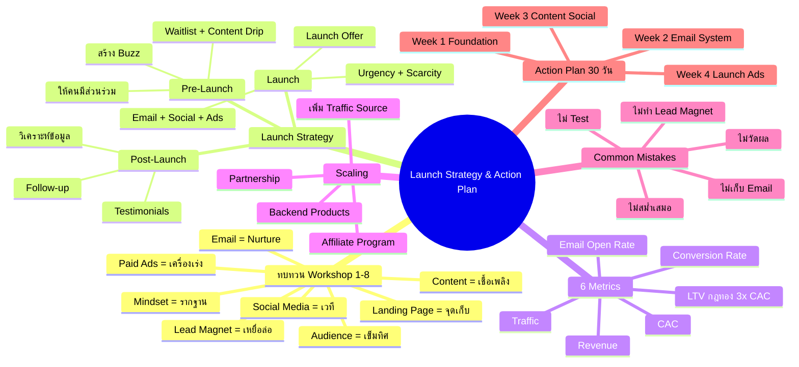
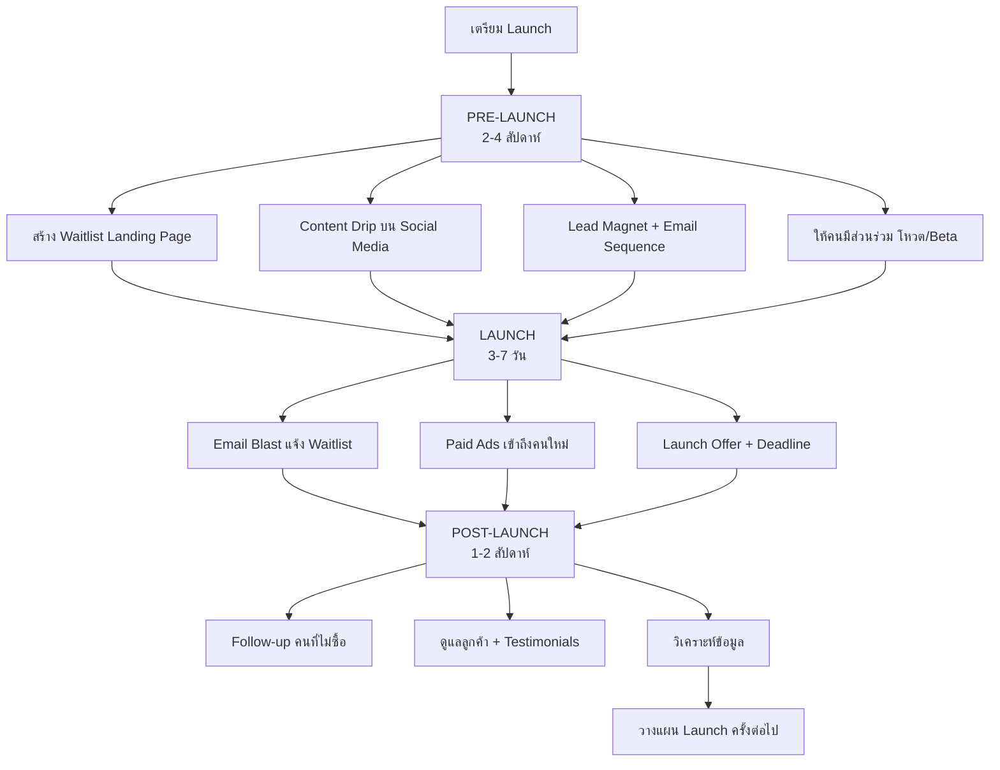
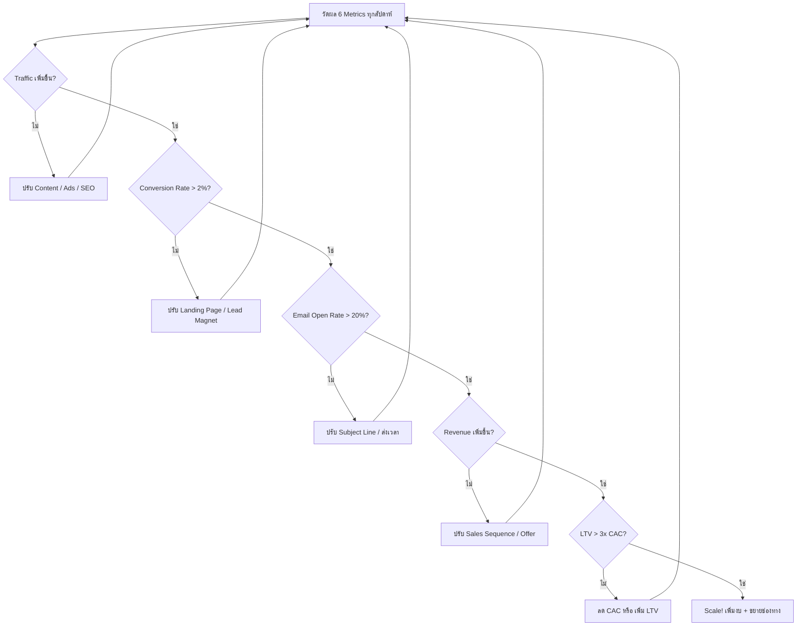
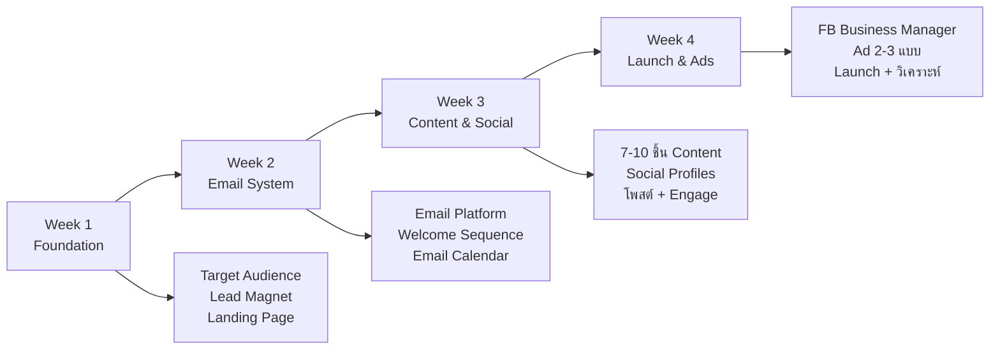
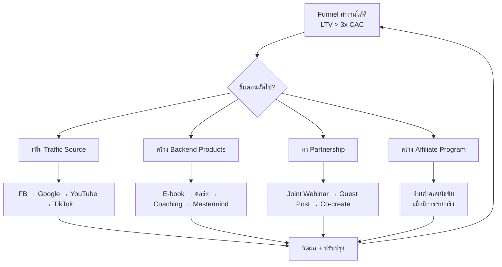

# Workshop ตอนที่ 9 — WKSHP-009 Mind Map
> Format: Mind Map (7 Parts)
> Source: SWP3 Ch04 Workshop ตอนที่ 9
> Production: PinkCastle Academy | จูล่ง CTO
> Date: 2026-02-18 | Duration: 1:26:56

---

## Part 1: Text-Based Mind Map (Tree Format)

```
LAUNCH STRATEGY & ACTION PLAN (WKSHP-009 FINAL)
│
├── 1. ทบทวน WORKSHOP 1-8
│   ├── 1. Mindset + Goals = รากฐาน
│   ├── 2. Target Audience = เข็มทิศ
│   ├── 3. Lead Magnet = เหยื่อล่อ
│   ├── 4. Landing Page = จุดเก็บ Lead
│   ├── 5. Email Marketing = ระบบ Nurture
│   ├── 6. Content Creation = เชื้อเพลิง
│   ├── 7. Social Media = เวที
│   ├── 8. Paid Ads = เครื่องเร่ง
│   └── ทุกชิ้นเชื่อมต่อกัน ขาดไม่ได้
│
├── 2. LAUNCH STRATEGY 3 เฟส
│   ├── Pre-Launch (2-4 สัปดาห์)
│   │   ├── เป้าหมาย: สร้าง Buzz
│   │   ├── Waitlist Landing Page เก็บ Email
│   │   ├── Lead Magnet ที่เกี่ยวข้องกับสินค้า
│   │   ├── Content Drip บน Social Media
│   │   ├── Email Sequence แจ้งความคืบหน้า
│   │   └── ให้คนมีส่วนร่วม (โหวต / Beta)
│   ├── Launch (3-7 วัน)
│   │   ├── เป้าหมาย: เปิดขาย
│   │   ├── Urgency + Scarcity
│   │   ├── Launch Offer (Early Bird / Bonus / Bundle)
│   │   ├── Deadline ชัดเจน
│   │   ├── Email Blast แจ้ง Waitlist
│   │   ├── Social Media ทุกช่องทาง
│   │   └── Paid Ads เข้าถึงคนใหม่
│   └── Post-Launch (1-2 สัปดาห์)
│       ├── เป้าหมาย: Follow-up
│       ├── Email คนที่ไม่ซื้อ
│       ├── ดูแลลูกค้าที่ซื้อแล้ว
│       ├── ขอ Testimonials + Reviews
│       └── วิเคราะห์ข้อมูล
│
├── 3. METRICS 6 ตัว
│   ├── Traffic
│   │   └── จำนวนคนเข้าเว็บ (GA4)
│   ├── Conversion Rate
│   │   └── % คนที่ Convert (ควร > 2%)
│   ├── Email Open Rate
│   │   └── % คนเปิดอ่าน (ค่าดี 20-30%)
│   ├── Revenue
│   │   └── รายได้ - ต้นทุน = กำไร
│   ├── CAC (Customer Acquisition Cost)
│   │   └── เงินตลาดทั้งหมด / ลูกค้าใหม่
│   ├── LTV (Lifetime Value)
│   │   └── ค่าเฉลี่ย x ซื้อ/ปี x จำนวนปี
│   └── กฎทอง: LTV > 3x CAC ⭐
│
├── 4. SCALING STRATEGY 4 วิธี
│   ├── เพิ่ม Traffic Source
│   │   └── กระจาย FB → Google → YouTube → TikTok
│   ├── Backend Products
│   │   └── ขายเพิ่มลูกค้าเดิม (E-book → คอร์ส → Coaching)
│   ├── Partnership
│   │   └── Joint Webinar / Guest Post / Co-create
│   └── Affiliate Program
│       └── ให้คนอื่นช่วยขาย จ่ายค่าคอมมิชชัน
│
├── 5. COMMON MISTAKES 5 ข้อ
│   ├── ❌ ไม่ทำ Lead Magnet (ขายตรง)
│   ├── ❌ ไม่เก็บ Email (เสียโอกาสติดตาม)
│   ├── ❌ ไม่ทำ A/B Test (ไม่รู้ว่าอะไรดี)
│   ├── ❌ ไม่วัดผล (ปรับปรุงไม่ได้)
│   └── ❌ ไม่สม่ำเสมอ (หายไปหลังสัปดาห์แรก)
│
├── 6. ACTION PLAN 30 วัน
│   ├── Week 1: Foundation
│   │   ├── วัน 1-2: ทบทวน Target Audience
│   │   ├── วัน 3-4: สร้าง Lead Magnet
│   │   └── วัน 5-7: สร้าง Landing Page
│   ├── Week 2: Email System
│   │   ├── วัน 8-9: ตั้งค่า Email Platform
│   │   ├── วัน 10-11: เขียน Welcome Sequence 3-5 ฉบับ
│   │   └── วัน 12-14: สร้าง Email Calendar
│   ├── Week 3: Content & Social
│   │   ├── วัน 15-16: สร้างคอนเทนต์ 7-10 ชิ้น
│   │   ├── วัน 17-18: ตั้งค่า Social Profiles
│   │   └── วัน 19-21: โพสต์ + Engage
│   └── Week 4: Launch & Ads
│       ├── วัน 22-23: สมัคร FB Business Manager
│       ├── วัน 24-25: ออกแบบ Ad 2-3 แบบ
│       ├── วัน 26-28: Launch Ads 100-300 บาท/วัน
│       └── วัน 29-30: วิเคราะห์ผล + วางแผนเดือนต่อไป
│
└── 7. Q&A + GRADUATION
    ├── เริ่มจาก Lead Magnet + Landing Page ก่อนเสมอ
    ├── เริ่มต้นด้วยเงินน้อยได้ (ลงทุน = เวลา + ความสม่ำเสมอ)
    └── "ความรู้ที่ไม่ลงมือทำ ก็แค่ข้อมูลในหัว"
```

---

## Part 2: Mermaid Mind Map



---

## Part 3: Mermaid Flowcharts

### Flowchart 1: Launch Strategy 3 เฟส



### Flowchart 2: 6 Metrics Decision Flow



### Flowchart 3: Action Plan 30 วัน



### Flowchart 4: Scaling Decision Tree



---

## Part 4: Comparison Chart

### Launch Strategy เปรียบเทียบ 3 เฟส

| เปรียบเทียบ | Pre-Launch | Launch | Post-Launch |
|-------------|-----------|--------|-------------|
| **ระยะเวลา** | 2-4 สัปดาห์ | 3-7 วัน | 1-2 สัปดาห์ |
| **เป้าหมาย** | สร้าง Buzz + Waitlist | เปิดขาย + Urgency | Follow-up + เก็บ Feedback |
| **กิจกรรมหลัก** | Content Drip, Waitlist, Beta | Email Blast, Ads, Launch Offer | Follow-up, Testimonials, วิเคราะห์ |
| **ช่องทาง** | Social Media + Email | ทุกช่องทาง (All-out) | Email + Social Media |
| **งบ** | ต่ำ (Organic เป็นหลัก) | สูง (Paid Ads เต็มที่) | ต่ำ (Email เป็นหลัก) |
| **Metrics** | Email Signups, Engagement | Revenue, Conversion Rate | Retention, Testimonials |
| **คนส่วนใหญ่ข้าม?** | ข้ามบ่อย (รีบ Launch) | ไม่ค่อยข้าม | ข้ามบ่อยมาก (คิดว่าจบแล้ว) |

### เปรียบเทียบ CAC vs LTV

| เปรียบเทียบ | CAC (Customer Acquisition Cost) | LTV (Lifetime Value) |
|-------------|------|------|
| **คำจำกัดความ** | ต้นทุนหาลูกค้าใหม่ 1 คน | มูลค่ารวมที่ลูกค้าจ่ายตลอดชีวิต |
| **สูตร** | ค่าการตลาดรวม / ลูกค้าใหม่ | ค่าเฉลี่ย x ซื้อ/ปี x จำนวนปี |
| **ตัวอย่าง** | 10,000 / 50 = 200 บาท | 500 x 4 x 2 = 4,000 บาท |
| **ค่าที่ดี** | ยิ่งต่ำยิ่งดี | ยิ่งสูงยิ่งดี |
| **วิธีปรับปรุง** | ปรับ Targeting, เพิ่ม Organic | Upsell, Backend Products, Retention |
| **กฎทอง** | LTV ต้อง > 3x CAC | |

---

## Part 5: Summary Table

| # | หัวข้อ | สาระสำคัญ | Action Item |
|---|--------|----------|-------------|
| 1 | ทบทวน Workshop 1-8 | 8 ชิ้นส่วนจิ๊กซอว์ที่เชื่อมต่อกัน | ประเมินจุดอ่อน เสริมชิ้นที่ยังไม่แข็งแรง |
| 2 | Pre-Launch | สร้าง Buzz 2-4 สัปดาห์ Waitlist + Content Drip | สร้าง Waitlist Landing Page + Lead Magnet |
| 3 | Launch | เปิดขาย 3-7 วัน Urgency + Launch Offer | เตรียม Launch Offer + Deadline ชัดเจน |
| 4 | Post-Launch | Follow-up 1-2 สัปดาห์ Testimonials + วิเคราะห์ | วางแผน Email Follow-up + เก็บ Testimonials |
| 5 | 6 Metrics | Traffic, CR, Open Rate, Revenue, CAC, LTV | ติดตั้ง GA4 + ดู Dashboard ทุกสัปดาห์ |
| 6 | กฎทอง LTV > 3x CAC | ยั่งยืนเมื่อ LTV มากกว่า CAC 3 เท่า | คำนวณ CAC + LTV ปรับถ้าไม่ถึงเกณฑ์ |
| 7 | Scaling 4 วิธี | Traffic Source, Backend, Partnership, Affiliate | เริ่ม Scale เมื่อ Funnel ทำงานดีแล้ว |
| 8 | 5 Common Mistakes | ไม่ทำ LM, ไม่เก็บ Email, ไม่ Test, ไม่วัด, ไม่สม่ำเสมอ | ทำ Checklist 5 ข้อตรวจทุกสัปดาห์ |
| 9 | Action Plan 30 วัน | 4 สัปดาห์: Foundation→Email→Content→Launch | เริ่ม Week 1 วันนี้เลย |
| 10 | ข้อคิดสำคัญ | ลงมือทำทันที อย่ารอสมบูรณ์แบบ | "ความรู้ที่ไม่ลงมือทำ ก็แค่ข้อมูลในหัว" |

---

## Part 6: Implementation Roadmap

```
เดือนที่ 1: BUILD FOUNDATION (Action Plan 30 วัน)
├── สัปดาห์ที่ 1: Foundation
│   ├── วันที่ 1-2: ทบทวน Target Audience + Customer Avatar
│   ├── วันที่ 3-4: สร้าง Lead Magnet (E-book/Checklist/Template)
│   └── วันที่ 5-7: สร้าง/ปรับปรุง Landing Page (Conversion > 2%)
├── สัปดาห์ที่ 2: Email System
│   ├── วันที่ 8-9: ตั้งค่า Email Marketing Platform
│   ├── วันที่ 10-11: เขียน Welcome Sequence 3-5 ฉบับ
│   └── วันที่ 12-14: สร้าง Email Calendar รายสัปดาห์
├── สัปดาห์ที่ 3: Content & Social
│   ├── วันที่ 15-16: สร้างคอนเทนต์ 7-10 ชิ้นล่วงหน้า
│   ├── วันที่ 17-18: ตั้งค่า Social Media Profiles
│   └── วันที่ 19-21: โพสต์ + Engage กับ Community
└── สัปดาห์ที่ 4: Launch & Ads
    ├── วันที่ 22-23: สมัคร FB Business Manager + Ad Account
    ├── วันที่ 24-25: ออกแบบ Ad 2-3 แบบ (A/B Testing)
    ├── วันที่ 26-28: Launch Ads 100-300 บาท/วัน
    └── วันที่ 29-30: วิเคราะห์ผล + วางแผนเดือนต่อไป

เดือนที่ 2: PRE-LAUNCH
├── สัปดาห์ที่ 1: สร้าง Waitlist Landing Page
├── สัปดาห์ที่ 2: Content Drip + Email Sequence
├── สัปดาห์ที่ 3: Beta + ให้คนมีส่วนร่วม
└── สัปดาห์ที่ 4: เตรียม Launch Offer + Deadline

เดือนที่ 3: LAUNCH + POST-LAUNCH
├── สัปดาห์ที่ 1: LAUNCH (3-7 วัน)
│   ├── Email Blast แจ้ง Waitlist
│   ├── Social Media ทุกช่องทาง
│   └── Paid Ads เต็มที่
├── สัปดาห์ที่ 2: POST-LAUNCH
│   ├── Follow-up คนที่ไม่ซื้อ
│   ├── ขอ Testimonials + Reviews
│   └── วิเคราะห์ 6 Metrics
├── สัปดาห์ที่ 3: OPTIMIZE
│   └── ปรับปรุงจากข้อมูลจริง
└── สัปดาห์ที่ 4: SCALE PLANNING
    └── เลือก Scaling Strategy (Traffic/Backend/Partnership/Affiliate)
```

---

## Part 7: Key Formulas & Frameworks

### สูตร 8 ชิ้นส่วนจิ๊กซอว์
```
Mindset (รากฐาน) + Audience (เข็มทิศ) + Lead Magnet (เหยื่อล่อ)
+ Landing Page (จุดเก็บ) + Email (Nurture) + Content (เชื้อเพลิง)
+ Social Media (เวที) + Paid Ads (เครื่องเร่ง) = ระบบครบวงจร
```

### สูตร Launch Strategy
```
Pre-Launch (2-4 สัปดาห์): Buzz + Waitlist + Content Drip + มีส่วนร่วม
Launch (3-7 วัน):         Urgency + Scarcity + Launch Offer + Deadline
Post-Launch (1-2 สัปดาห์): Follow-up + Testimonials + วิเคราะห์ข้อมูล
```

### สูตร 6 Metrics
```
Traffic          = จำนวนคนเข้าเว็บ (Google Analytics)
Conversion Rate  = (Conversions / Visitors) x 100  [ควร > 2%]
Email Open Rate  = (Opens / Sent) x 100            [ค่าดี 20-30%]
Revenue          = รายได้ - ต้นทุน = กำไร
CAC              = ค่าการตลาดรวม / ลูกค้าใหม่
LTV              = ค่าเฉลี่ย x ซื้อ/ปี x จำนวนปี  [ต้อง > 3x CAC]
```

### สูตร Scaling
```
Step 1: Funnel ทำงาน + LTV > 3x CAC
Step 2: เพิ่ม Traffic Source (FB → Google → YouTube → TikTok)
Step 3: สร้าง Backend Products (ขายเพิ่มลูกค้าเดิม)
Step 4: Partnership (ร่วมมือเข้าถึงคนใหม่)
Step 5: Affiliate Program (ให้คนอื่นช่วยขาย)
```

### สูตร Action Plan 30 วัน
```
Week 1: Foundation  = Target Audience + Lead Magnet + Landing Page
Week 2: Email       = Platform + Welcome Sequence + Calendar
Week 3: Content     = 7-10 ชิ้น + Social Profiles + โพสต์ + Engage
Week 4: Launch      = FB Business Manager + Ad 2-3 แบบ + Launch + วิเคราะห์
```

### สูตร ข้อผิดพลาด (Anti-patterns)
```
❌ ไม่ทำ Lead Magnet  → ขายตรงไม่สร้างความสัมพันธ์ → Conversion ต่ำ
❌ ไม่เก็บ Email      → เสียโอกาสติดตาม → ต้องหาลูกค้าใหม่ตลอด
❌ ไม่ A/B Test       → ไม่รู้ว่าอะไรดีกว่า → เสียเงินกับสิ่งที่ไม่ดี
❌ ไม่วัดผล           → ปรับปรุงไม่ได้ → ไม่เติบโต
❌ ไม่สม่ำเสมอ        → คนลืม → ต้องเริ่มใหม่ทุกครั้ง
```

### สูตรความสำเร็จ
```
ความสำเร็จ = ความรู้ (Workshop 1-9)
           + ลงมือทำ (Action Plan 30 วัน)
           + วัดผล (6 Metrics)
           + สม่ำเสมอ (ทุกวัน ทุกสัปดาห์ ทุกเดือน)
           + ปรับปรุง (จากข้อมูลจริง ไม่ใช่สัญชาตญาณ)
```

---

> จบ Chapter 4: Workshop — 9 ตอน
> Series: SWP3 Ch04 Workshop
> PinkCastle Academy © 2026
