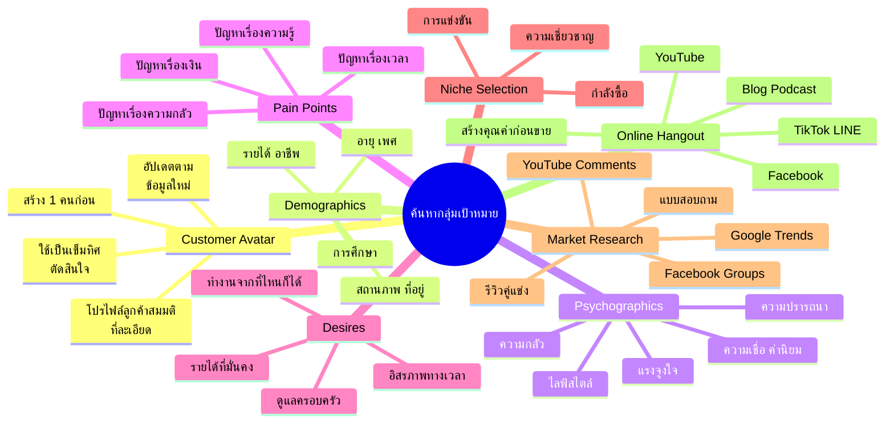

# ขั้นตอนที่ 1 ค้นหากลุ่มเป้าหมาย — BIZ-001
> **Format:** Mind Map (Text Structure + Mermaid)
> **Source:** SWP3 Ch5 วิธีสร้างธุรกิจออนไลน์ ตอนที่ 1
> **Production:** PinkCastle Academy | จูล่ง CTO
> **Date:** 2026-02-17

---

## Mind Map — โครงสร้างข้อความ (Text Structure)

```
ขั้นตอนที่ 1 ค้นหากลุ่มเป้าหมาย
│
├── 1. Customer Avatar (ภาพลูกค้าในฝัน)
│   ├── โปรไฟล์สมมติที่ละเอียด
│   ├── ใช้เป็นเข็มทิศตัดสินใจ
│   ├── ต้องอัปเดตตามข้อมูลใหม่
│   └── สร้าง 1 คนก่อน อย่ากระจาย
│
├── 2. Demographics (ข้อมูลประชากรศาสตร์)
│   ├── อายุ
│   ├── เพศ
│   ├── รายได้
│   ├── อาชีพ
│   ├── การศึกษา
│   ├── สถานภาพ
│   └── ที่อยู่อาศัย
│
├── 3. Psychographics (ข้อมูลจิตวิทยา)
│   ├── ความเชื่อและค่านิยม
│   ├── ไลฟ์สไตล์
│   ├── ความกลัว
│   ├── ความปรารถนา
│   ├── แรงจูงใจในการซื้อ
│   └── อุปสรรคที่ทำให้ลังเล
│
├── 4. Pain Points (ปัญหาที่อยากหนี)
│   ├── ปัญหาเรื่องเวลา
│   ├── ปัญหาเรื่องเงิน
│   ├── ปัญหาเรื่องความรู้
│   ├── ปัญหาเรื่องความกลัว
│   └── ปัญหาเรื่องจิตใจ
│
├── 5. Desires (ผลลัพธ์ที่อยากได้)
│   ├── อิสรภาพทางเวลา
│   ├── รายได้ที่มั่นคง
│   ├── ทำงานจากที่ไหนก็ได้
│   ├── ความภูมิใจในตัวเอง
│   └── ดูแลครอบครัวได้ดีขึ้น
│
├── 6. Niche Selection (เลือกตลาดเฉพาะทาง)
│   ├── เกณฑ์ที่ 1: ความเชี่ยวชาญ
│   ├── เกณฑ์ที่ 2: กำลังซื้อ
│   ├── เกณฑ์ที่ 3: การแข่งขัน
│   └── จุดตัดของ 3 เกณฑ์ = Niche ที่ดี
│
├── 7. Market Research Methods
│   ├── อ่านรีวิวคู่แข่ง
│   ├── เข้ากลุ่ม Facebook
│   ├── ดู YouTube Comments
│   ├── ใช้ Google Trends
│   ├── ทำแบบสอบถาม
│   └── สัมภาษณ์ตรง
│
└── 8. Online Hangout (ลูกค้าอยู่ที่ไหน)
    ├── Facebook Groups
    ├── YouTube Channels
    ├── Blog/Website
    ├── LINE OA
    ├── Podcast
    └── กลยุทธ์: สร้างคุณค่าก่อน ไม่ใช่ขาย
```

---

## Mind Map — Mermaid Diagram



---

## Mind Map — Mermaid Flowchart (แบบทางเลือก)

```mermaid
graph TB
    CENTER["ขั้นตอนที่ 1<br/>ค้นหากลุ่มเป้าหมาย"]

    CENTER --> A["Customer Avatar<br/>ภาพลูกค้าในฝัน"]
    A --> A1["โปรไฟล์สมมติ<br/>ที่ละเอียด"]
    A --> A2["ใช้เป็นเข็มทิศ"]
    A --> A3["สร้าง 1 คนก่อน"]

    CENTER --> B["Demographics"]
    B --> B1["อายุ เพศ รายได้"]
    B --> B2["อาชีพ การศึกษา"]
    B --> B3["สถานภาพ ที่อยู่"]

    CENTER --> C["Psychographics"]
    C --> C1["ความเชื่อ ค่านิยม"]
    C --> C2["ความกลัว ความปรารถนา"]
    C --> C3["แรงจูงใจในการซื้อ"]

    CENTER --> D["Pain Points"]
    D --> D1["เวลา เงิน ความรู้"]
    D --> D2["ความกลัว จิตใจ"]

    CENTER --> E["Desires"]
    E --> E1["อิสรภาพ รายได้"]
    E --> E2["ครอบครัว ความภูมิใจ"]

    CENTER --> F["Niche Selection"]
    F --> F1["เชี่ยวชาญ"]
    F --> F2["กำลังซื้อ"]
    F --> F3["แข่งขันได้"]

    CENTER --> G["Market Research"]
    G --> G1["รีวิว Facebook YouTube"]
    G --> G2["Google Trends"]
    G --> G3["แบบสอบถาม สัมภาษณ์"]

    CENTER --> H["Online Hangout"]
    H --> H1["Facebook YouTube TikTok"]
    H --> H2["LINE Blog Podcast"]
    H --> H3["สร้างคุณค่าก่อนขาย"]

    style CENTER fill:#FF69B4,stroke:#FF1493,color:#fff,stroke-width:3px
    style A fill:#FFB6C1,stroke:#FF69B4
    style B fill:#FFB6C1,stroke:#FF69B4
    style C fill:#FFB6C1,stroke:#FF69B4
    style D fill:#FFB6C1,stroke:#FF69B4
    style E fill:#FFB6C1,stroke:#FF69B4
    style F fill:#FFB6C1,stroke:#FF69B4
    style G fill:#FFB6C1,stroke:#FF69B4
    style H fill:#FFB6C1,stroke:#FF69B4
```



---

## สรุปโครงสร้าง Mind Map

| กิ่งหลัก | จำนวนกิ่งย่อย | ประเด็นสำคัญ |
|---------|-------------|-------------|
| Customer Avatar | 4 | โปรไฟล์สมมติที่ใช้เป็นเข็มทิศ |
| Demographics | 7 | ข้อมูลพื้นฐานที่จับต้องได้ |
| Psychographics | 6 | ข้อมูลจิตวิทยาที่ลึกกว่า |
| Pain Points | 5 | ปัญหาที่ลูกค้าอยากหนี |
| Desires | 5 | ผลลัพธ์ที่ลูกค้าอยากได้ |
| Niche Selection | 4 | 3 เกณฑ์ในการเลือกตลาด |
| Market Research | 6 | วิธีหาข้อมูลฟรี |
| Online Hangout | 6 | หาลูกค้าและสร้างคุณค่า |

> **จำนวน node ทั้งหมด:** 52 nodes (1 root + 8 กิ่งหลัก + 43 กิ่งย่อย)

---

> **หมายเหตุ:** Mermaid mindmap สามารถ render ได้ใน GitHub, Notion (embed), VS Code (Mermaid Preview extension)
> Flowchart แบบทางเลือกใช้ได้ในกรณีที่ platform ไม่รองรับ mindmap syntax
