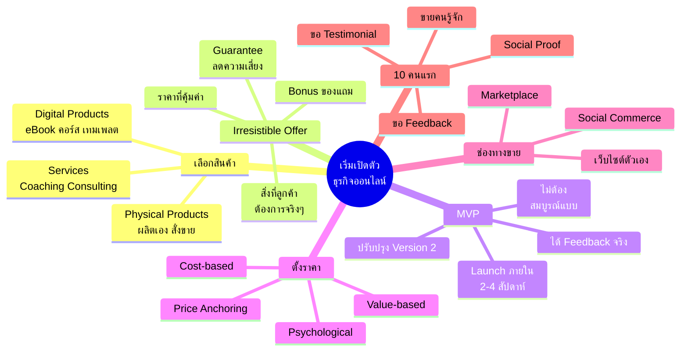
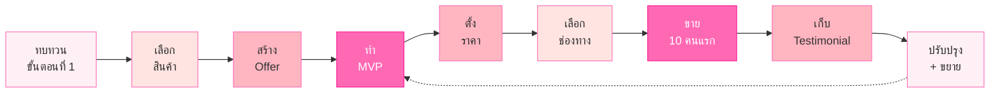
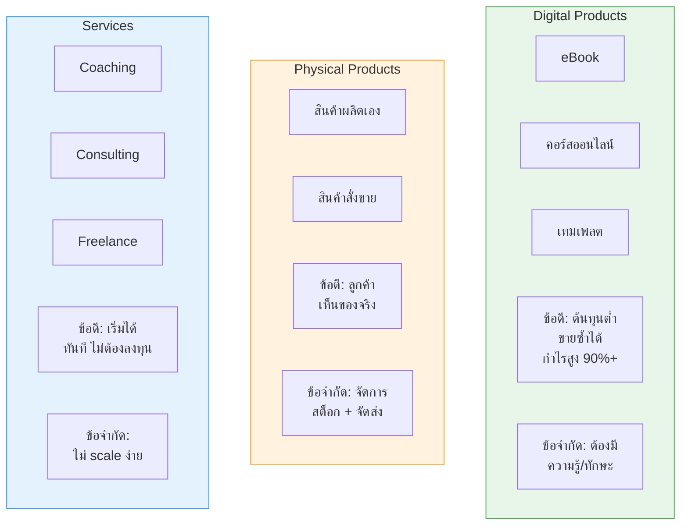
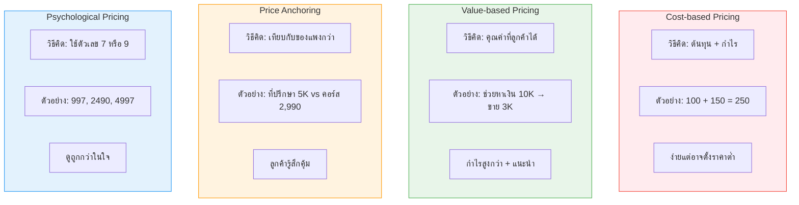

# ขั้นตอนที่ 2 เริ่มเปิดตัวธุรกิจออนไลน์ — BIZ-002 Mind Map
> Format: Mind Map (Text Structure + Mermaid)
> Source: SWP3 Ch05 วิธีสร้างธุรกิจออนไลน์ 0-100,000 บาท ตอนที่ 2
> Production: PinkCastle Academy | จูล่ง CTO
> Date: 2026-02-18 | Duration: 1:02:38

---

## Part 1: Mind Map — โครงสร้างข้อความ (Text Structure)

```
ขั้นตอนที่ 2 เริ่มเปิดตัวธุรกิจออนไลน์
│
├── 1. ทบทวนขั้นตอนที่ 1
│   ├── Customer Avatar
│   ├── Demographics + Psychographics
│   ├── Pain Points + Desires
│   ├── Niche Selection
│   └── Market Research
│
├── 2. เลือกสินค้า/บริการ
│   ├── Digital Products
│   │   ├── eBook
│   │   ├── คอร์สออนไลน์
│   │   └── เทมเพลต
│   ├── Physical Products
│   │   ├── ผลิตเอง
│   │   └── สั่งมาขายต่อ
│   └── Services
│       ├── Coaching
│       ├── Consulting
│       └── Freelance
│
├── 3. สร้าง Irresistible Offer
│   ├── สิ่งที่ลูกค้าต้องการจริงๆ
│   ├── ราคาที่คุ้มค่า
│   ├── Bonus (ของแถม)
│   └── Guarantee (ลดความเสี่ยง)
│
├── 4. MVP (Minimum Viable Product)
│   ├── ไม่ต้องสมบูรณ์แบบ 100%
│   ├── Launch ภายใน 2-4 สัปดาห์
│   ├── ได้ Feedback จากลูกค้าจริง
│   └── ปรับปรุง Version 2 ต่อ
│
├── 5. ตั้งราคา
│   ├── Cost-based Pricing (ต้นทุน + กำไร)
│   ├── Value-based Pricing (คุณค่าที่ลูกค้าได้)
│   ├── Price Anchoring (เทียบกับของแพงกว่า)
│   └── Psychological Pricing (ลงท้าย 7 หรือ 9)
│
├── 6. ช่องทางขาย
│   ├── เว็บไซต์ตัวเอง
│   │   ├── WordPress
│   │   ├── Shopify
│   │   └── Systeme.io
│   ├── Marketplace
│   │   ├── Shopee
│   │   └── Lazada
│   └── Social Commerce
│       ├── Facebook Shop
│       ├── Instagram Shop
│       └── LINE Shopping
│
└── 7. เริ่มขาย 10 คนแรก
    ├── ขายคนรู้จักก่อน
    ├── ขอ Feedback
    ├── ขอ Testimonial
    ├── สร้าง Social Proof
    └── ขยายวงด้วยคำแนะนำ
```

---

## Part 2: Mind Map — Mermaid Diagram



---

## Part 3: Mermaid Flowchart — ลำดับขั้นตอน

```mermaid
graph TB
    CENTER["ขั้นตอนที่ 2<br/>เริ่มเปิดตัวธุรกิจออนไลน์"]

    CENTER --> A["เลือกสินค้า/บริการ"]
    A --> A1["Digital Products<br/>eBook คอร์ส เทมเพลต"]
    A --> A2["Physical Products<br/>ผลิตเอง/สั่งขาย"]
    A --> A3["Services<br/>Coaching Consulting"]

    CENTER --> B["สร้าง Irresistible Offer"]
    B --> B1["สิ่งที่ลูกค้า<br/>ต้องการจริง"]
    B --> B2["ราคาคุ้มค่า<br/>+ Bonus"]
    B --> B3["Guarantee<br/>ลดความเสี่ยง"]

    CENTER --> C["MVP"]
    C --> C1["ไม่ต้อง<br/>สมบูรณ์แบบ"]
    C --> C2["Launch ภายใน<br/>2-4 สัปดาห์"]
    C --> C3["ปรับปรุงจาก<br/>Feedback"]

    CENTER --> D["ตั้งราคา"]
    D --> D1["Cost-based<br/>ต้นทุน + กำไร"]
    D --> D2["Value-based<br/>คุณค่าที่ลูกค้าได้"]
    D --> D3["Price Anchoring<br/>+ Psychological"]

    CENTER --> E["ช่องทางขาย"]
    E --> E1["เว็บไซต์ตัวเอง"]
    E --> E2["Marketplace<br/>Shopee Lazada"]
    E --> E3["Social Commerce<br/>FB IG LINE"]

    CENTER --> F["10 คนแรก"]
    F --> F1["ขายคนรู้จักก่อน"]
    F --> F2["ขอ Testimonial"]
    F --> F3["สร้าง Social Proof"]

    style CENTER fill:#FF69B4,stroke:#FF1493,color:#fff,stroke-width:3px
    style A fill:#FFB6C1,stroke:#FF69B4
    style B fill:#FFB6C1,stroke:#FF69B4
    style C fill:#FFB6C1,stroke:#FF69B4
    style D fill:#FFB6C1,stroke:#FF69B4
    style E fill:#FFB6C1,stroke:#FF69B4
    style F fill:#FFB6C1,stroke:#FF69B4
```



---

## Part 4: Mermaid Flowchart — กระบวนการ Launch ธุรกิจ



---

## Part 5: เปรียบเทียบ 3 ประเภทสินค้า (Comparison Diagram)



---

## Part 6: เปรียบเทียบกลยุทธ์ตั้งราคา (Comparison Diagram)



---

## Part 7: สรุปโครงสร้าง Mind Map

| กิ่งหลัก | จำนวนกิ่งย่อย | ประเด็นสำคัญ |
|---------|-------------|-------------|
| ทบทวนขั้นตอนที่ 1 | 5 | Customer Avatar + Niche เป็นรากฐาน |
| เลือกสินค้า/บริการ | 8 | 3 ประเภท: Digital, Physical, Services |
| Irresistible Offer | 4 | 4 องค์ประกอบสร้าง Offer ที่ขายได้ |
| MVP | 4 | Launch เร็ว ปรับจาก Feedback |
| ตั้งราคา | 4 | Value-based เป็นแนะนำหลัก |
| ช่องทางขาย | 8 | มือใหม่เริ่มจาก Social Commerce |
| 10 คนแรก | 5 | ขายคนรู้จัก + สร้าง Social Proof |

> **จำนวน node ทั้งหมด:** 46 nodes (1 root + 7 กิ่งหลัก + 38 กิ่งย่อย)

---

> ทบทวนต่อ: **BIZ-003** — ขั้นตอนที่ 3 เพิ่มขนาดธุรกิจ
> Series: SWP3 Ch05 วิธีสร้างธุรกิจออนไลน์ 0-100,000 บาท
> PinkCastle Academy © 2026

---

> **หมายเหตุ:** Mermaid mindmap สามารถ render ได้ใน GitHub, Notion (embed), VS Code (Mermaid Preview extension)
> Flowchart แบบทางเลือกใช้ได้ในกรณีที่ platform ไม่รองรับ mindmap syntax
