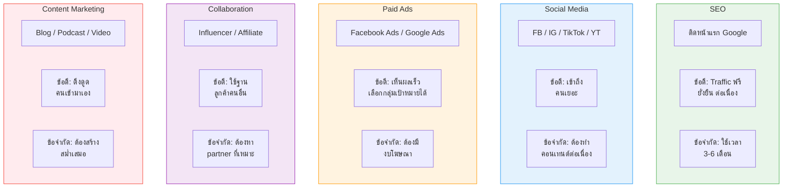

# ขั้นตอนที่ 3 เพิ่มขนาดธุรกิจ — BIZ-003 Mind Map
> Format: Mind Map (Text Structure + Mermaid)
> Source: SWP3 Ch05 วิธีสร้างธุรกิจออนไลน์ 0-100,000 บาท ตอนที่ 3
> Production: PinkCastle Academy | จูล่ง CTO
> Date: 2026-02-18 | Duration: 0:32:31

---

## Part 1: Mind Map — โครงสร้างข้อความ (Text Structure)

```
ขั้นตอนที่ 3 เพิ่มขนาดธุรกิจ (Scaling)
│
├── 1. ทบทวนขั้นตอน 1-2
│   ├── ขั้นตอนที่ 1: ค้นหากลุ่มเป้าหมาย
│   ├── ขั้นตอนที่ 2: เปิดตัวธุรกิจ
│   └── Revenue = Traffic x CR x AOV
│
├── 2. เพิ่ม Traffic
│   ├── SEO
│   │   └── ติดหน้าแรก Google (3-6 เดือน)
│   ├── Social Media
│   │   └── FB / IG / TikTok / YouTube
│   ├── Paid Ads
│   │   └── Facebook Ads / Google Ads
│   ├── Collaboration
│   │   └── Influencer / Affiliate / Cross-promo
│   └── Content Marketing
│       └── Blog / Podcast / Video
│
├── 3. เพิ่ม Conversion Rate
│   ├── ปรับ Landing Page
│   │   └── ชัดเจน สวยงาม โหลดเร็ว CTA ชัด
│   ├── A/B Testing
│   │   └── ทดสอบ 2 เวอร์ชัน ดูแบบไหนดีกว่า
│   ├── Social Proof
│   │   └── รีวิว Testimonial จำนวนลูกค้า
│   └── Urgency / Scarcity
│       └── "เหลือ 3 ที่" / "หมดภายใน 24 ชม."
│
├── 4. เพิ่ม Average Order Value
│   ├── Upsell
│   │   └── เสนอสินค้าดีกว่า ราคาสูงกว่า
│   ├── Cross-sell
│   │   └── เสนอสินค้าที่เกี่ยวข้อง
│   ├── Bundle
│   │   └── รวม Package ราคาพิเศษ
│   └── Subscription
│       └── จ่ายรายเดือน Recurring
│
├── 5. Product Ladder
│   ├── Free (0 บาท)
│   │   └── eBook ฟรี / Webinar ฟรี
│   ├── Low-ticket (100-500 บาท)
│   │   └── Mini Course
│   ├── Mid-ticket (1,000-5,000 บาท)
│   │   └── คอร์สเต็ม
│   ├── High-ticket (10,000+ บาท)
│   │   └── Coaching 1-on-1
│   └── Recurring (รายเดือน)
│       └── Membership / Subscription
│
├── 6. Customer Retention
│   ├── Email Nurturing
│   │   └── ส่งอีเมลให้คุณค่าสม่ำเสมอ
│   ├── Community
│   │   └── FB Group / LINE Group / Discord
│   ├── VIP Program
│   │   └── สิทธิพิเศษ ส่วนลด เข้าถึงก่อนใคร
│   └── สถิติ: หาใหม่แพงกว่าเดิม 5-7 เท่า
│
└── 7. วัดผล KPIs
    ├── Revenue (รายได้รวม)
    ├── Profit Margin (อัตรากำไร)
    ├── CAC (ค่าหาลูกค้าใหม่)
    ├── LTV (มูลค่าตลอดชีพ)
    │   └── ต้อง > 3x CAC
    └── Churn Rate (อัตราลูกค้าหาย)
```

---

## Part 2: Mind Map — Mermaid Diagram


---

## Part 3: Mermaid Flowchart — Revenue Formula


---

## Part 4: Mermaid Flowchart — กระบวนการ Scaling


---

## Part 5: เปรียบเทียบ 5 ช่องทาง Traffic (Comparison Diagram)



---

## Part 6: เปรียบเทียบ Product Ladder vs Single Product (Comparison Diagram)


---

## Part 7: สรุปโครงสร้าง Mind Map

| กิ่งหลัก | จำนวนกิ่งย่อย | ประเด็นสำคัญ |
|---------|-------------|-------------|
| ทบทวนขั้นตอน 1-2 | 3 | Revenue = Traffic x CR x AOV |
| เพิ่ม Traffic | 10 | 5 ช่องทาง: SEO, Social, Ads, Collab, Content |
| เพิ่ม Conversion Rate | 8 | 4 วิธี: Landing Page, A/B Test, Proof, Urgency |
| เพิ่ม Average Order Value | 8 | 4 เทคนิค: Upsell, Cross-sell, Bundle, Subscription |
| Product Ladder | 10 | 5 ขั้น: Free → Low → Mid → High → Recurring |
| Customer Retention | 7 | 3 วิธี + สถิติ: หาใหม่แพงกว่า 5-7 เท่า |
| วัดผล KPIs | 6 | 5 ตัวชี้วัด: Revenue, Margin, CAC, LTV, Churn |

> **จำนวน node ทั้งหมด:** 60 nodes (1 root + 7 กิ่งหลัก + 52 กิ่งย่อย)

---

> ทบทวนต่อ: **BIZ-004** — ตอบคำถาม
> Series: SWP3 Ch05 วิธีสร้างธุรกิจออนไลน์ 0-100,000 บาท
> PinkCastle Academy © 2026

---

> **หมายเหตุ:** Mermaid mindmap สามารถ render ได้ใน GitHub, Notion (embed), VS Code (Mermaid Preview extension)
> Flowchart แบบทางเลือกใช้ได้ในกรณีที่ platform ไม่รองรับ mindmap syntax
