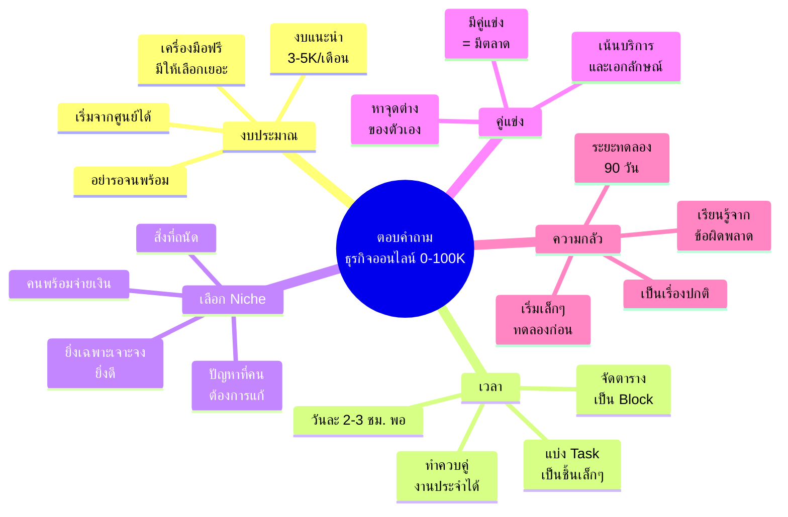
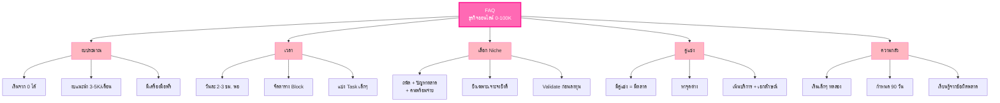

# ตอบคำถาม — BIZ-004
> **Format:** Mind Map (Text Structure + Mermaid)
> **Source:** SWP3 Ch5 วิธีสร้างธุรกิจออนไลน์ 0-100,000 บาท ตอนที่ 4
> **Production:** PinkCastle Academy | จูล่ง CTO
> **Date:** 2026-02-17

---

## Mind Map — โครงสร้างข้อความ (Text Structure)

```
ตอบคำถาม ธุรกิจออนไลน์ 0-100K
│
├── 1. คำถามเรื่องงบประมาณ
│   ├── เริ่มจากศูนย์ได้
│   ├── งบแนะนำ 3,000-5,000 บาท/เดือน
│   ├── มีเครื่องมือฟรีให้ใช้มากมาย
│   ├── อย่ารอจนมีเงินพร้อม
│   └── เริ่มด้วยสิ่งที่มี ลงทุนเพิ่มเมื่อมีรายได้
│
├── 2. คำถามเรื่องเวลา
│   ├── วันละ 2-3 ชม. เพียงพอ
│   ├── ทำควบคู่กับงานประจำได้
│   ├── จัดตารางเวลาเป็น Block
│   ├── แบ่ง Task เป็นชิ้นเล็กๆ
│   └── จัดลำดับความสำคัญ
│       ├── สร้าง Content (สำคัญมาก)
│       ├── หาลูกค้า (สำคัญมาก)
│       └── ตกแต่งเว็บ (ทำทีหลังได้)
│
├── 3. คำถามเรื่องเลือก Niche
│   ├── เทคนิค 3 จุดตัด
│   │   ├── สิ่งที่เราถนัด/สนใจ
│   │   ├── ปัญหาที่คนต้องการแก้
│   │   └── สิ่งที่คนพร้อมจ่ายเงิน
│   ├── ยิ่งเฉพาะเจาะจงยิ่งดี
│   └── Validate ก่อนลงทุนหนัก
│       ├── โพสต์ Content ทดสอบ
│       ├── ค้นหาใน Google/YouTube
│       └── ดูคู่แข่งในตลาด
│
├── 4. คำถามเรื่องคู่แข่ง
│   ├── มีคู่แข่ง = มีตลาด
│   ├── หาจุดต่างของตัวเอง
│   │   ├── มุมมองเฉพาะ
│   │   ├── ประสบการณ์ตรง
│   │   ├── วิธีสื่อสารที่เป็นตัวเรา
│   │   └── บริการที่ดีกว่า
│   └── ไม่ต้องเป็นที่ 1 ในทุกด้าน
│
└── 5. คำถามเรื่องความกลัว
    ├── ความกลัวล้มเหลวเป็นเรื่องปกติ
    ├── แก้ด้วยการเริ่มเล็กๆ
    ├── กำหนดระยะทดลอง 90 วัน
    ├── เรียนรู้จากข้อผิดพลาด
    └── อย่าเปรียบเทียบกับคนอื่น
```

---

## Mind Map — Mermaid Diagram



---

## Mind Map — Mermaid Flowchart (แบบทางเลือก)



---

## สรุปโครงสร้าง Mind Map

| กิ่งหลัก | จำนวนกิ่งย่อย | ประเด็นสำคัญ |
|---------|-------------|-------------|
| งบประมาณ | 5 | เริ่มจากศูนย์ได้ อย่ารอจนพร้อม |
| เวลา | 5 | วันละ 2-3 ชม. จัดลำดับความสำคัญ |
| เลือก Niche | 5 | ใช้ 3 จุดตัด Validate ก่อนลงทุน |
| คู่แข่ง | 4 | มีคู่แข่ง = ดี หาจุดต่างตัวเอง |
| ความกลัว | 5 | เริ่มเล็ก ทดลอง 90 วัน เรียนรู้จากข้อผิดพลาด |

> **จำนวน Node ทั้งหมด:** 30 nodes
> **หมายเหตุ:** Mermaid mindmap สามารถ render ได้ใน GitHub, Notion (embed), VS Code (Mermaid Preview extension)
> Flowchart แบบทางเลือกใช้ได้ในกรณีที่ platform ไม่รองรับ mindmap syntax
