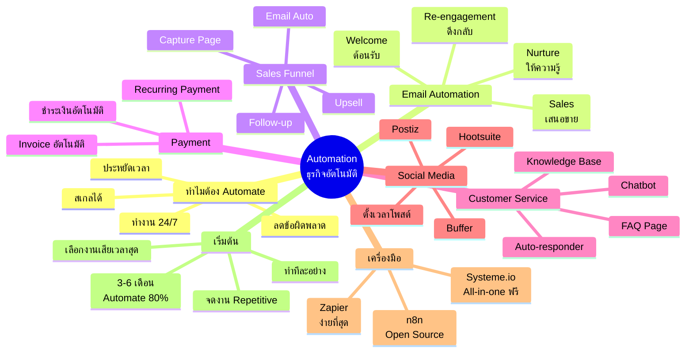
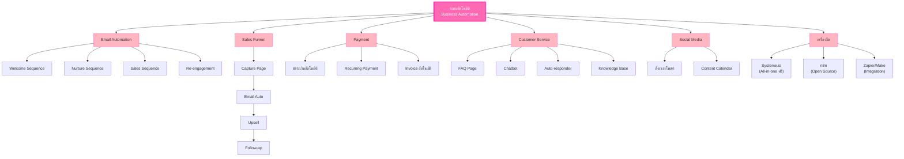
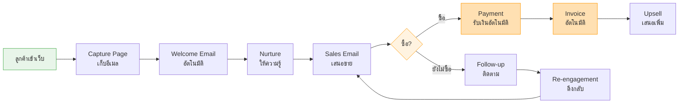
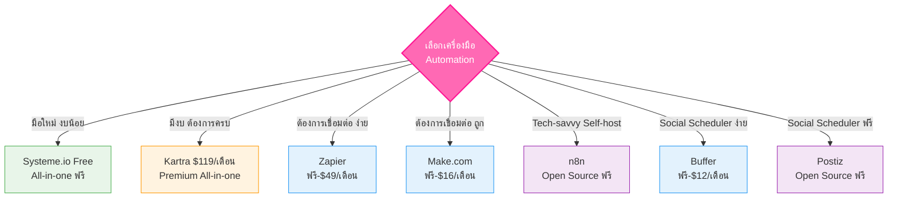

# ขั้นตอนที่ 4 ทำธุรกิจเป็นระบบอัตโนมัติ — BIZ-005 Mind Map
> **Format:** Mind Map (Text Structure + Mermaid)
> **Source:** SWP3 Ch05 วิธีสร้างธุรกิจออนไลน์ 0-100,000 บาท ตอนที่ 5
> **Production:** PinkCastle Academy | จูล่ง CTO
> **Date:** 2026-02-18 | **Duration:** 0:56:39

---

## Part 1: Mind Map — โครงสร้างข้อความ (Text Structure)

```
ขั้นตอนที่ 4: ทำธุรกิจเป็นระบบอัตโนมัติ
│
├── 1. ทำไมต้อง Automate?
│   ├── ประหยัดเวลา (3 ชม. → 3 นาที)
│   ├── ลดข้อผิดพลาด (ระบบทำถูกทุกครั้ง)
│   ├── สเกลได้ (10 → 10,000 คน)
│   └── ทำงาน 24/7 (ไม่เคยหลับ)
│
├── 2. Email Automation
│   ├── Welcome Sequence (ต้อนรับ, 3-5 อีเมล)
│   ├── Nurture Sequence (ให้ความรู้, 5-7 อีเมล)
│   ├── Sales Sequence (เสนอขาย, 3-5 อีเมล)
│   └── Re-engagement Sequence (ดึงกลับ, 2-3 อีเมล)
│
├── 3. Sales Funnel Automation
│   ├── Capture Page (เก็บอีเมล)
│   ├── Email Automation (Nurture + Sales)
│   ├── Upsell (เสนอสินค้าเพิ่ม)
│   └── Follow-up (ติดตามผล)
│
├── 4. Payment Automation
│   ├── ชำระเงินอัตโนมัติ (จ่ายปุ๊บ ได้ปั๊บ)
│   ├── Recurring Payment (ตัดบัตรรายเดือน)
│   └── Invoice อัตโนมัติ (ออกใบเสร็จเอง)
│
├── 5. Customer Service Automation
│   ├── FAQ Page (คำถามที่ถามบ่อย)
│   ├── Chatbot (ตอบ 24 ชม.)
│   ├── Auto-responder (ตอบทันที)
│   └── Knowledge Base (ห้องสมุดความรู้)
│
├── 6. Social Media Automation
│   ├── ตั้งเวลาโพสต์ล่วงหน้า
│   ├── Content Calendar Tools
│   │   ├── Buffer (มือใหม่)
│   │   ├── Hootsuite (ทีมใหญ่)
│   │   └── Postiz (Open Source)
│   └── เขียน 1 ครั้ง โพสต์ 5 แพลตฟอร์ม
│
├── 7. เครื่องมือ Automation
│   ├── All-in-one
│   │   ├── Kartra ($119/เดือน, ครบทุกอย่าง)
│   │   └── Systeme.io (ฟรี, 2,000 Contacts)
│   └── Integration
│       ├── Zapier (ง่ายที่สุด)
│       ├── Make.com (ถูกกว่า ยืดหยุ่นกว่า)
│       └── n8n (Open Source, AI Node)
│
└── 8. วิธีเริ่มต้น Automate
    ├── จดงาน Repetitive ที่ทำซ้ำทุกวัน
    ├── เลือกงานที่เสียเวลาสุด → Automate ก่อน
    ├── ทำทีละอย่าง ค่อยๆ สะสม
    └── 3-6 เดือน → Automate 70-80%
```

---

## Part 2: Mind Map — Mermaid Mindmap Diagram



---

## Part 3: Mermaid Flowchart — Automation Flow



---

## Part 4: Mermaid Flowchart — Sales Funnel Automation Flow



---

## Part 5: Mermaid Flowchart — เปรียบเทียบเครื่องมือ



---

## Part 6: ตารางเปรียบเทียบ Automation 6 ด้าน

| ด้าน | สิ่งที่ Automate | เครื่องมือแนะนำ (ฟรี) | ลดเวลาได้ | ควรทำเมื่อไร |
|------|----------------|---------------------|----------|------------|
| Email | 4 Sequences อัตโนมัติ | Systeme.io | 1-2 ชม./วัน | เดือนที่ 1 (P1) |
| Sales Funnel | Capture → Upsell → Follow-up | Systeme.io | 2-3 ชม./วัน | เดือนที่ 2 (P2) |
| Payment | ชำระเงิน + Invoice | Stripe / Systeme.io | 30 นาที/ออเดอร์ | เดือนที่ 2-3 |
| Customer Service | FAQ + Chatbot + Auto-reply | Tawk.to + Notion | 2-4 ชม./วัน | เดือนที่ 1-2 |
| Social Media | ตั้งเวลาโพสต์ล่วงหน้า | Buffer / Postiz | 1-2 ชม./วัน | เดือนที่ 3 |
| Integration | เชื่อมระบบต่างๆ | n8n | 1-2 ชม./วัน | เดือนที่ 4-5 |

---

## Part 7: สรุปโครงสร้าง Mind Map

| กิ่งหลัก | จำนวนกิ่งย่อย | ประเด็นสำคัญ |
|---------|-------------|-------------|
| ทำไมต้อง Automate | 4 | ประหยัดเวลา สเกลได้ ทำงาน 24/7 |
| Email Automation | 4 | Welcome + Nurture + Sales + Re-engagement |
| Sales Funnel | 4 | Capture → Email → Upsell → Follow-up |
| Payment | 3 | ชำระเงิน + Recurring + Invoice อัตโนมัติ |
| Customer Service | 4 | FAQ + Chatbot + Auto-responder + KB |
| Social Media | 3 | ตั้งเวลาโพสต์ Buffer/Hootsuite/Postiz |
| เครื่องมือ | 5 | All-in-one (Kartra, Systeme.io) + Integration (Zapier, Make, n8n) |
| วิธีเริ่มต้น | 4 | จดงาน Repetitive → ทำทีละอย่าง → 3-6 เดือน = 80% |

> **จำนวน Node ทั้งหมด:** 40 nodes
> **หมายเหตุ:** Mermaid mindmap สามารถ render ได้ใน GitHub, Notion (embed), VS Code (Mermaid Preview extension)
> Flowchart แบบทางเลือกใช้ได้ในกรณีที่ platform ไม่รองรับ mindmap syntax

---

> ทบทวนต่อ: **BIZ-006** — ขั้นตอนที่ 5 ขยายธุรกิจ 10 เท่า
> Series: SWP3 Ch05 วิธีสร้างธุรกิจออนไลน์ 0-100,000 บาท
> PinkCastle Academy © 2026
