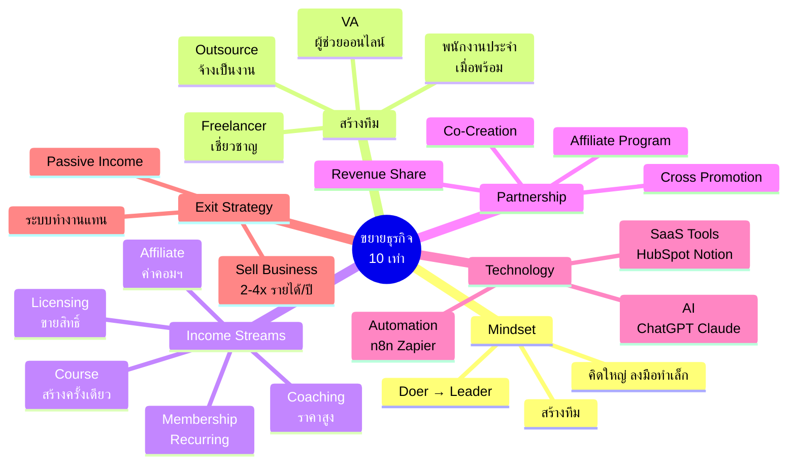
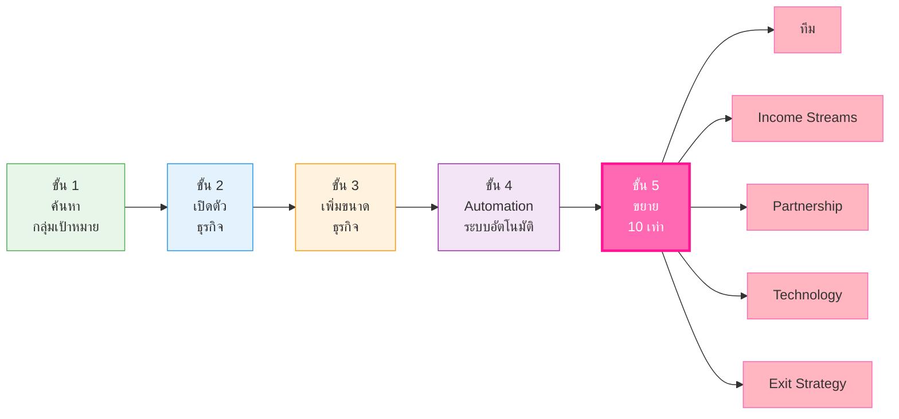
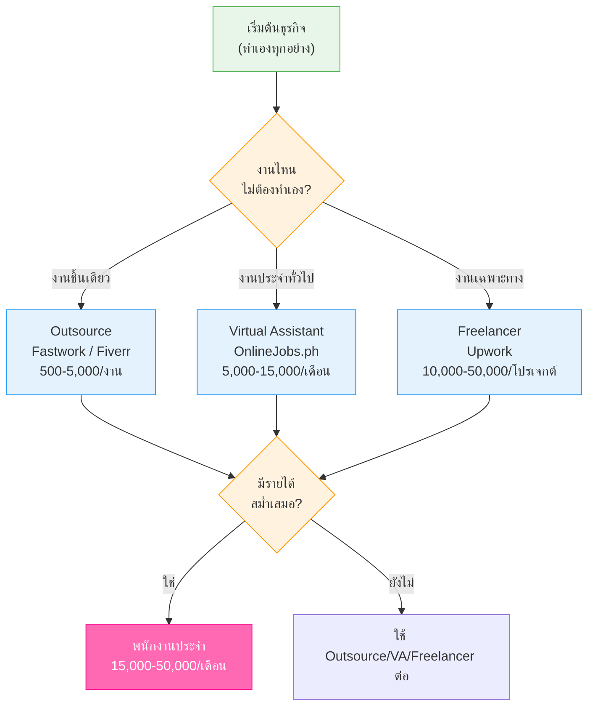
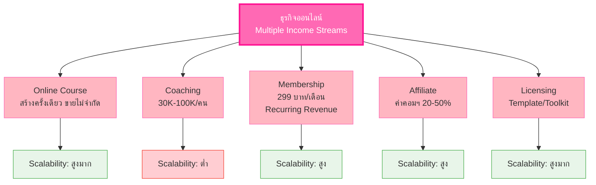
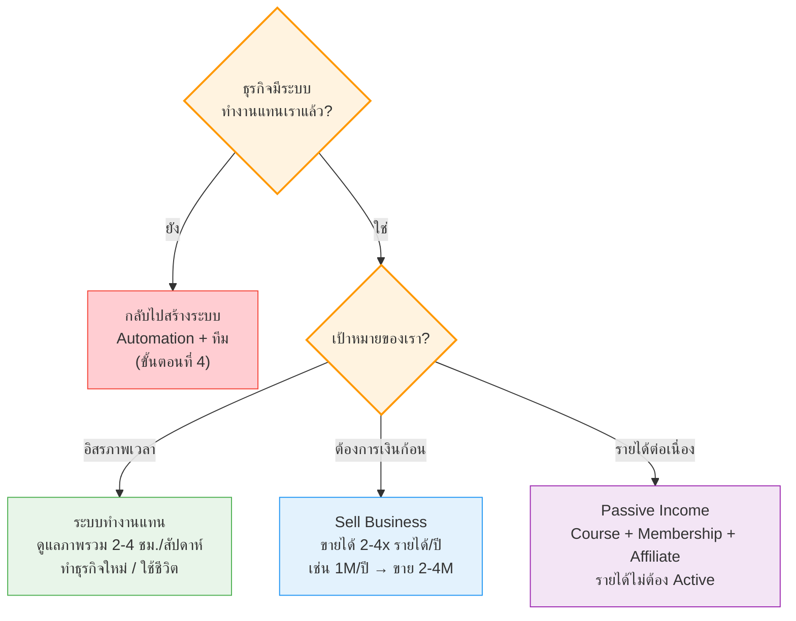

# ขั้นตอนที่ 5 ขยายธุรกิจ 10 เท่า — BIZ-006 Mind Map
> **Format:** Mind Map (Text Structure + Mermaid)
> **Source:** SWP3 Ch05 วิธีสร้างธุรกิจออนไลน์ 0-100,000 บาท ตอนที่ 6
> **Production:** PinkCastle Academy | จูล่ง CTO
> **Date:** 2026-02-18 | **Duration:** 0:41:18

---

## Part 1: Mind Map — โครงสร้างข้อความ (Text Structure)

```
ขั้นตอนที่ 5: ขยายธุรกิจ 10 เท่า
│
├── 1. สรุป 4 ขั้นตอนที่ผ่านมา
│   ├── ขั้น 1: ค้นหากลุ่มเป้าหมาย
│   ├── ขั้น 2: เปิดตัวธุรกิจ
│   ├── ขั้น 3: เพิ่มขนาดธุรกิจ
│   └── ขั้น 4: ทำระบบอัตโนมัติ (70-80%)
│
├── 2. Mindset การขยาย 10 เท่า
│   ├── คิดใหญ่ ลงมือทำเล็ก
│   ├── ไม่ต้องทำทุกอย่างเอง (Doer → Leader)
│   └── สร้างทีม (คนเดียวโต 10x ไม่ได้)
│
├── 3. สร้างทีม
│   ├── ระดับ 1: Outsource (จ้างเป็นงาน)
│   │   ├── Fastwork (คนไทย)
│   │   └── Fiverr (ต่างประเทศ ราคาถูก)
│   ├── ระดับ 2: Virtual Assistant (VA)
│   │   └── OnlineJobs.ph (หมื่นต้นๆ/เดือน)
│   ├── ระดับ 3: Freelancer (เชี่ยวชาญ)
│   │   └── Upwork (ผู้เชี่ยวชาญ)
│   └── ระดับ 4: พนักงานประจำ (เมื่อพร้อม)
│
├── 4. Multiple Income Streams
│   ├── Online Course (สร้างครั้งเดียว ขายไม่จำกัด)
│   ├── Coaching/Consulting (ราคาสูง 30K-100K)
│   ├── Membership/Subscription (Recurring Revenue)
│   ├── Affiliate Marketing (ค่าคอมมิชชัน 20-50%)
│   └── Licensing (ขายสิทธิ์ Template/Toolkit)
│
├── 5. Partnership & Joint Venture
│   ├── Revenue Share (ร่วมมือ แบ่งรายได้)
│   ├── Cross Promotion (โปรโมทให้กัน ฟรี)
│   ├── Co-Creation (สร้างสินค้าร่วมกัน)
│   └── Affiliate Program (เปิดให้คนช่วยขาย)
│
├── 6. Leverage Technology
│   ├── AI
│   │   ├── ChatGPT/Claude (เขียน Content)
│   │   ├── Canva AI/Midjourney (ทำกราฟิก)
│   │   └── CapCut AI (ตัดต่อวิดีโอ)
│   ├── Automation
│   │   └── n8n/Zapier (เชื่อมระบบทั้งหมด)
│   └── SaaS Tools
│       ├── HubSpot Free (CRM)
│       ├── ClickUp/Notion (Project Management)
│       └── Google Analytics (วิเคราะห์)
│
└── 7. Exit Strategy
    ├── ระบบทำงานแทน (อิสรภาพเวลา 2-4 ชม./สัปดาห์)
    ├── Sell Business (ขายได้ 2-4x รายได้/ปี)
    └── Passive Income (Course + Membership + Affiliate)
```

---

## Part 2: Mind Map — Mermaid Mindmap Diagram



---

## Part 3: Mermaid Flowchart — 5 ขั้นตอนธุรกิจออนไลน์ 0-100K



---

## Part 4: Mermaid Flowchart — การสร้างทีม (Team Building Path)



---

## Part 5: Mermaid Flowchart — Multiple Income Streams



---

## Part 6: Mermaid Flowchart — Exit Strategy Decision Tree



---

## Part 7: ตารางเปรียบเทียบกลยุทธ์ขยาย 10 เท่า

| กลยุทธ์ | สิ่งที่ต้องทำ | เครื่องมือ/แพลตฟอร์ม | ผลลัพธ์ | ควรเริ่มเมื่อไร |
|---------|-------------|---------------------|---------|---------------|
| Mindset Shift | เปลี่ยน Doer → Leader | - | มุ่ง High-Impact | ทันที |
| สร้างทีม | จ้าง Outsource/VA/Freelancer | Fastwork, Fiverr, Upwork | มีเวลาเพิ่ม 10-20 ชม./สัปดาห์ | สัปดาห์ที่ 1 |
| Income Streams | สร้าง Course/Membership/Affiliate | Systeme.io, Udemy | รายได้เพิ่ม 2-5 ช่องทาง | เดือนที่ 1-2 |
| Partnership | หา JV Partner/Affiliate | Social Media, Email | เข้าถึง Audience ใหม่ | เดือนที่ 2-3 |
| Technology | ใช้ AI + Automation + SaaS | ChatGPT, n8n, HubSpot | ทำงานน้อยลง ได้ผลลัพธ์มากขึ้น | ทันที |
| Exit Strategy | วางแผนระยะยาว | - | ธุรกิจมีทิศทางชัดเจน | ทันที |

---

## Part 8: สรุปโครงสร้าง Mind Map

| กิ่งหลัก | จำนวนกิ่งย่อย | ประเด็นสำคัญ |
|---------|-------------|-------------|
| สรุป 4 ขั้นตอน | 4 | ค้นหา → เปิดตัว → เพิ่มขนาด → Automation |
| Mindset | 3 | คิดใหญ่ทำเล็ก + ไม่ทำเอง + สร้างทีม |
| สร้างทีม | 4 | Outsource → VA → Freelancer → ประจำ |
| Income Streams | 5 | Course + Coaching + Membership + Affiliate + Licensing |
| Partnership | 4 | Revenue Share + Cross Promotion + Co-Creation + Affiliate |
| Technology | 3 | AI + Automation + SaaS Tools |
| Exit Strategy | 3 | ระบบทำงานแทน + Sell Business + Passive Income |

> **จำนวน Node ทั้งหมด:** 45 nodes
> **หมายเหตุ:** Mermaid mindmap สามารถ render ได้ใน GitHub, Notion (embed), VS Code (Mermaid Preview extension)
> Flowchart แบบทางเลือกใช้ได้ในกรณีที่ platform ไม่รองรับ mindmap syntax

---

> จบ Chapter 5: วิธีสร้างธุรกิจออนไลน์ 0-100,000 บาท — 6 ตอน
> Series: SWP3 Ch05 วิธีสร้างธุรกิจออนไลน์ 0-100,000 บาท
> PinkCastle Academy © 2026
