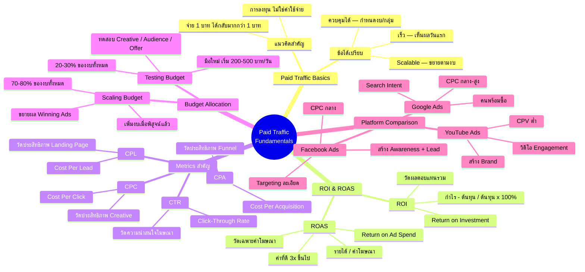

# วิธีใช้เงินทำการตลาดขั้นสูง ตอนที่ 1 — PAID-001
> **Format:** Mind Map (Mermaid)
> **Source:** SWP3 Ch16 Paid Traffic Mastery ตอนที่ 1
> **Production:** PinkCastle Academy | จูล่ง CTO
> **Date:** 2026-02-17

---

## Mermaid Mind Map



---

## Text-based Mind Map

```
                    Paid Traffic Fundamentals
                         (PAID-001)
                              |
    ┌──────────┬──────────┬───┼───┬──────────┐
    |          |          |       |          |
 [Basics]  [ROI/ROAS] [Metrics] [Budget]  [Platforms]
  Paid      การวัดผล   CPC/CPA  Testing    Google
  Traffic   ตอบแทน    CPL/CTR  vs Scale   FB / YT
```

## Center Node: Paid Traffic Fundamentals

### Branch 1: Paid Traffic Basics (พื้นฐาน)
- ข้อได้เปรียบหลัก
  - เร็ว — เห็นผลได้ภายในวันแรก
  - ควบคุมได้ — กำหนดงบ กลุ่มเป้าหมาย จังหวะเวลา
  - ขยายได้ — Scalable ตามงบประมาณ
- แนวคิดสำคัญ
  - มอง Paid Traffic เป็น "การลงทุน" ไม่ใช่ "ค่าใช้จ่าย"
  - จ่าย 1 บาท ได้กลับมามากกว่า 1 บาท

### Branch 2: ROI & ROAS (การวัดผลตอบแทน)
- ROI (Return on Investment)
  - สูตร: (กำไร - ต้นทุน) / ต้นทุน x 100%
  - วัดผลตอบแทนจากการลงทุนทั้งหมด
  - รวมต้นทุนสินค้าและค่าใช้จ่ายอื่น
- ROAS (Return on Ad Spend)
  - สูตร: รายได้จากโฆษณา / ค่าโฆษณา
  - วัดเฉพาะผลตอบแทนจากค่าโฆษณา
  - ค่าที่ดีควรอยู่ที่ 3x ขึ้นไป

### Branch 3: Metrics สำคัญ (ตัวชี้วัด)
- CPC (Cost Per Click)
  - ค่าใช้จ่ายต่อคลิก
  - บอกประสิทธิภาพ Ad Creative
- CPA (Cost Per Acquisition)
  - ค่าใช้จ่ายต่อลูกค้า 1 คน
  - บอกประสิทธิภาพ Funnel
- CPL (Cost Per Lead)
  - ค่าใช้จ่ายต่อ Lead 1 คน
  - บอกประสิทธิภาพ Landing Page
- CTR (Click-Through Rate)
  - อัตราการคลิกโฆษณา
  - บอกความน่าสนใจของโฆษณา

### Branch 4: Budget Allocation (จัดสรรงบ)
- Testing Budget (20-30%)
  - ทดสอบ Creative หลายแบบ
  - ทดสอบกลุ่มเป้าหมาย
  - มือใหม่เริ่ม 200-500 บาท/วัน
- Scaling Budget (70-80%)
  - ขยายผล Winning Ads
  - เพิ่มงบเมื่อพิสูจน์แล้วว่าได้ผล
  - ขยายกลุ่มเป้าหมายที่ทำกำไร

### Branch 5: Platform Comparison (เปรียบเทียบแพลตฟอร์ม)
- Google Ads
  - จุดแข็ง: Search Intent
  - เหมาะกับ: คนพร้อมซื้อ
  - ต้นทุน: กลาง-สูง
- Facebook Ads
  - จุดแข็ง: Targeting ละเอียด
  - เหมาะกับ: สร้าง Awareness + Lead
  - ต้นทุน: กลาง
- YouTube Ads
  - จุดแข็ง: วิดีโอ Engagement
  - เหมาะกับ: สร้าง Brand
  - ต้นทุน: กลาง-ต่ำ

---

**จำนวน Nodes ทั้งหมด: 54 nodes**

| ระดับ | จำนวน |
|-------|-------|
| Center Node | 1 |
| Branch (ระดับ 1) | 5 |
| Sub-branch (ระดับ 2) | 18 |
| Leaf (ระดับ 3) | 30 |
| **รวม** | **54** |
