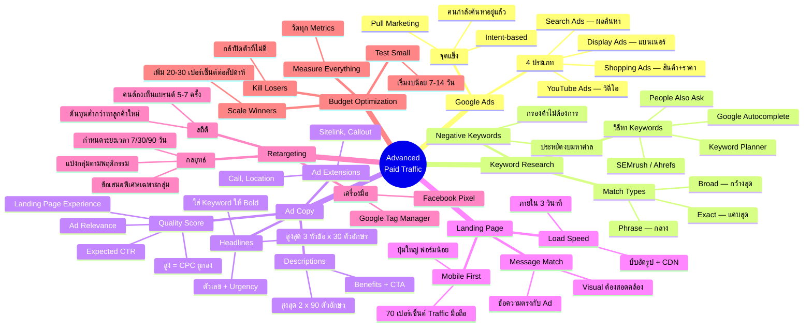

# วิธีใช้เงินทำการตลาดขั้นสูง ตอนที่ 2 — PAID-002 Mind Map
> **Format:** Mind Map (Mermaid)
> **Source:** SWP3 Ch16 Paid Traffic Mastery ตอนที่ 2
> **Production:** PinkCastle Academy | จูล่ง CTO
> **Date:** 2026-02-18 | **Duration:** 1:40:38

---

## Mermaid Mind Map



---

## Text-based Mind Map

```
                     Advanced Paid Traffic
                          (PAID-002)
                               |
    ┌──────────┬──────────┬────┼────┬──────────┬──────────┐
    |          |          |         |          |          |
 [Google    [Keyword   [Ad      [Landing   [Retarget] [Budget
  Ads]      Research]  Copy]     Page]                  Optim.]
 4 ประเภท    Match     Headlines  Message    Pixel     Test
 Intent     Types     Extensions Match      GTM       Scale
 based      Negative  Quality    Speed      5-7 ครั้ง    Kill
            Keywords  Score      Mobile
```

## Center Node: Advanced Paid Traffic

### Branch 1: Google Ads (แพลตฟอร์ม)
- 4 ประเภทหลัก
  - Search Ads — แสดงในผลค้นหา ทรงพลังที่สุด
  - Display Ads — แบนเนอร์บนเว็บต่างๆ สร้าง Awareness
  - YouTube Ads — วิดีโอโฆษณา สร้าง Brand
  - Shopping Ads — แสดงสินค้าพร้อมราคา สำหรับ E-commerce
- จุดแข็ง
  - Intent-based — คนค้นหาอยู่แล้ว (Pull Marketing)
  - เปรียบกับ Facebook Ads ที่เป็น Push Marketing

### Branch 2: Keyword Research (การวิจัยคำค้นหา)
- วิธีหา Keywords
  - Google Keyword Planner (ฟรี)
  - Google Autocomplete + People Also Ask
  - เครื่องมือ SEMrush / Ahrefs
  - ถามลูกค้าจริง
- Match Types
  - Broad Match — กว้างสุด ครอบคลุมคำเกี่ยวข้อง
  - Phrase Match — กลาง ตรงความหมาย
  - Exact Match — แคบสุด ตรงคำค้นหา
- Negative Keywords
  - คำที่ไม่อยากให้แสดงโฆษณา
  - ประหยัดงบได้มหาศาล เช่น -ราคาถูก -มือสอง -ฟรี

### Branch 3: Ad Copy (เขียนโฆษณา)
- Headlines (สูงสุด 3 x 30 ตัวอักษร)
  - ใส่ Keyword → Google Bold คำที่ตรง
  - ใส่ตัวเลข + ข้อเสนอพิเศษ
  - ใส่ Urgency + ตอบคำค้นหา
- Descriptions (สูงสุด 2 x 90 ตัวอักษร)
  - บอก Benefits + Call-to-Action
- Ad Extensions
  - Sitelink, Callout, Call, Location
  - ยิ่งใส่มาก ยิ่งกินพื้นที่โดดเด่น
- Quality Score (1-10)
  - Expected CTR + Ad Relevance + Landing Page Experience
  - QS สูง = CPC ถูกลง 50%+

### Branch 4: Landing Page (หน้ารับ Traffic)
- Message Match
  - ข้อความ + Visual ต้องตรงกับโฆษณา
  - ไม่ Match = Bounce Rate สูง + Quality Score ต่ำ
- Load Speed
  - ต้องโหลดภายใน 3 วินาที
  - ช้า = เสีย Traffic 53%
  - วิธี: บีบอัดรูป, CDN, ลดโค้ด
- Mobile First
  - 70%+ Traffic มาจากมือถือ
  - ปุ่มใหญ่ ฟอนต์อ่านง่าย ฟอร์มน้อย

### Branch 5: Retargeting (โฆษณาตามกลุ่มเป้าหมาย)
- เครื่องมือ
  - Facebook Pixel — เก็บข้อมูล สร้าง Custom Audience
  - Google Tag Manager — จัดการ Tags ทั้งหมดในที่เดียว
- กลยุทธ์
  - แบ่งกลุ่มตามพฤติกรรม (ดูสินค้า/ใส่ตะกร้า/อ่านบล็อก)
  - กำหนดระยะเวลา (7/14/30/90 วัน)
  - ข้อเสนอพิเศษกระตุ้นการตัดสินใจ
- สถิติสำคัญ
  - คนต้องเห็นแบรนด์ 5-7 ครั้งก่อนซื้อ
  - ต้นทุน Retargeting ต่ำกว่า Cold Traffic

### Branch 6: Budget Optimization (จัดการงบ)
- Test Small — เริ่มงบน้อย ทดสอบ 7-14 วัน
- Measure Everything — วัดทุกตัวเลข อย่าด่วนสรุป
- Scale Winners — เพิ่มงบ 20-30%/สัปดาห์
- Kill Losers — กล้าปิดตัวที่ไม่ดี อย่ายึดติด
- Repeat — วนซ้ำต่อเนื่อง

---

**จำนวน Nodes ทั้งหมด: 72 nodes**

| ระดับ | จำนวน |
|-------|-------|
| Center Node | 1 |
| Branch (ระดับ 1) | 6 |
| Sub-branch (ระดับ 2) | 24 |
| Leaf (ระดับ 3) | 41 |
| **รวม** | **72** |

---

> ทบทวนต่อ: **PAID-003** — วิธีใช้เงินทำการตลาดขั้นสูง ตอนที่ 3
> Series: SWP3 Ch16 Paid Traffic Mastery
> PinkCastle Academy © 2026
