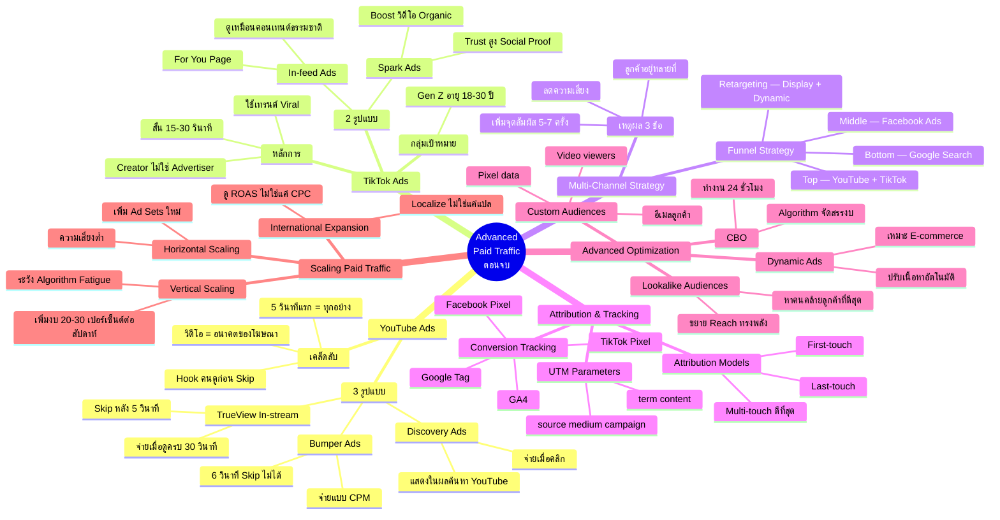

# วิธีใช้เงินทำการตลาดขั้นสูง ตอนที่ 3 — PAID-003 Mind Map
> **Format:** Mind Map (Mermaid)
> **Source:** SWP3 Ch16 Paid Traffic Mastery ตอนที่ 3
> **Production:** PinkCastle Academy | จูล่ง CTO
> **Date:** 2026-02-18 | **Duration:** 1:42:52

---

## Mermaid Mind Map



---

## Text-based Mind Map

```
                  Advanced Paid Traffic (ตอนจบ)
                           (PAID-003)
                               |
    ┌──────────┬──────────┬────┼────┬──────────┬──────────┐
    |          |          |         |          |          |
 [YouTube   [TikTok    [Multi-   [Attri-   [Advanced  [Scaling]
  Ads]       Ads]      Channel]  bution]    Optim.]
 TrueView   In-feed   ลดเสี่ยง    UTM      Custom     Horizontal
 Bumper     Spark     Funnel    Pixel     Lookalike  Vertical
 Discovery  Creator   Strategy  GA4       Dynamic    Internat.
            not Adv.            Multi-    CBO
                                touch
```

## Center Node: Advanced Paid Traffic (ตอนจบ)

### Branch 1: YouTube Ads (แพลตฟอร์มวิดีโอ)
- 3 รูปแบบหลัก
  - TrueView In-stream — Skip หลัง 5 วินาที จ่ายเมื่อดูครบ 30 วินาที/คลิก
  - Bumper Ads — 6 วินาที Skip ไม่ได้ จ่ายแบบ CPM สร้าง Awareness
  - Discovery Ads — แสดงในผลค้นหา YouTube คนคลิกเอง
- เคล็ดลับ
  - 5 วินาทีแรกเป็นตัวตัดสินว่าคนจะดูต่อหรือ Skip
  - วิดีโอคืออนาคตของโฆษณา Engagement ดีกว่า Static Ads
  - TrueView จ่ายเฉพาะคนที่สนใจจริง Skip = ไม่เสียเงิน

### Branch 2: TikTok Ads (แพลตฟอร์มเติบโตเร็วสุด)
- 2 รูปแบบ
  - In-feed Ads — วิดีโอในหน้า For You Page ดูเหมือนคอนเทนต์ธรรมชาติ
  - Spark Ads — Boost วิดีโอ Organic/Creator Trust สูง มี Social Proof
- หลักการ
  - ทำตัวเหมือน Creator ไม่ใช่ Advertiser
  - ใช้เทรนด์ Viral เพลงฮิต Challenge
  - สั้นกระชับ 15-30 วินาที CTA ชัดเจน
- กลุ่มเป้าหมายหลัก
  - Gen Z อายุ 18-30 ปี ใช้ TikTok แทน Facebook

### Branch 3: Multi-Channel Strategy (หลายช่องทาง)
- เหตุผล 3 ข้อ
  - ลดความเสี่ยง — Algorithm/นโยบายเปลี่ยน ไม่กระทบทั้งหมด
  - ลูกค้าอยู่หลายที่ — ใช้หลายแพลตฟอร์ม
  - เพิ่มจุดสัมผัส — ต้องเห็นแบรนด์ 5-7 ครั้งก่อนตัดสินใจ
- Funnel Strategy
  - Top (Awareness) — YouTube + TikTok
  - Middle (Consideration) — Facebook Ads
  - Bottom (Conversion) — Google Search + Shopping
  - Retargeting — Display + Dynamic Ads

### Branch 4: Attribution & Tracking (วัดผลข้ามช่องทาง)
- UTM Parameters
  - 5 ตัว: source, medium, campaign, term, content
  - ใส่ท้าย URL ทุกลิงก์โฆษณา
- Conversion Tracking
  - Facebook Pixel + Google Tag + TikTok Pixel + GA4
  - Track Event เดียวกันทุกช่องทาง
- Attribution Models
  - First-touch — เครดิตช่องทางแรก
  - Last-touch — เครดิตช่องทางสุดท้าย
  - Multi-touch — เครดิตทุกช่องทาง (ดีที่สุด สะท้อน Journey จริง)

### Branch 5: Advanced Optimization (เทคนิคขั้นสูง)
- Custom Audiences
  - สร้างจากข้อมูลจริง: อีเมล Pixel data Video viewers
  - ยิงโฆษณาตรงไปยังคนที่รู้จักเรา
- Lookalike Audiences
  - ระบบหาคนคล้ายลูกค้าที่ดีที่สุด เป็นล้านคน
  - วิธีขยาย Reach ที่ทรงพลังมาก
- Dynamic Ads
  - ปรับเนื้อหาอัตโนมัติตามพฤติกรรม
  - เหมาะ E-commerce สินค้าจำนวนมาก
- Campaign Budget Optimization (CBO)
  - ตั้งงบรวมที่ระดับ Campaign
  - Algorithm จัดสรรงบให้อัตโนมัติ 24 ชั่วโมง

### Branch 6: Scaling Paid Traffic (ขยายอย่างเป็นระบบ)
- Horizontal Scaling — เพิ่ม Ad Sets ใหม่ ทดสอบ Audience/Creative ความเสี่ยงต่ำ
- Vertical Scaling — เพิ่มงบ 20-30%/สัปดาห์ ให้ Algorithm ปรับตัว
- International Expansion — ขยายต่างประเทศ Localize ไม่ใช่แค่แปล ดู ROAS ไม่ใช่แค่ CPC

---

**จำนวน Nodes ทั้งหมด: 82 nodes**

| ระดับ | จำนวน |
|-------|-------|
| Center Node | 1 |
| Branch (ระดับ 1) | 6 |
| Sub-branch (ระดับ 2) | 26 |
| Leaf (ระดับ 3) | 49 |
| **รวม** | **82** |

---

> จบ Chapter 16: Paid Traffic Mastery — 3 ตอน
> Series: SWP3 Ch16 Paid Traffic Mastery
> PinkCastle Academy © 2026
