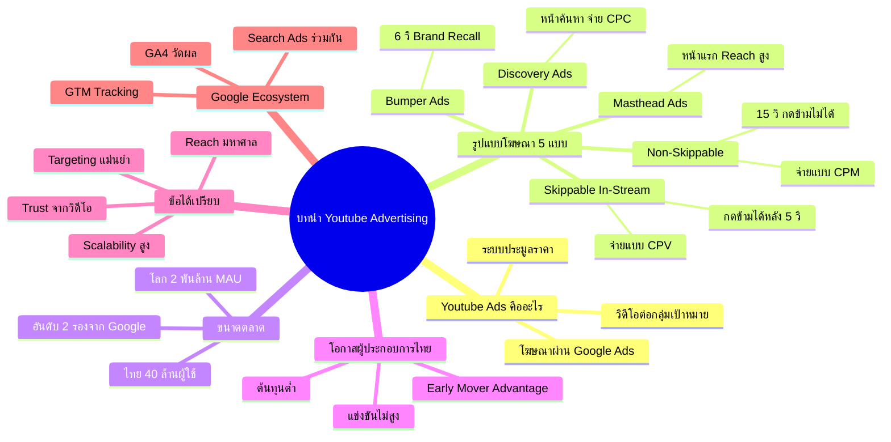

# บทนำ Youtube Advertising — YTADV-001
> **Format:** Mind Map
> **Source:** SWP3 Ch17 Youtube Advertising Mastery ตอนที่ 1
> **Production:** PinkCastle Academy | จูล่ง CTO
> **Date:** 2026-02-17

---

## Text-based Mind Map

```
บทนำ Youtube Advertising
├── Youtube Advertising คืออะไร
│   ├── การโฆษณาผ่าน Google Ads บน Youtube
│   ├── แสดงวิดีโอโฆษณาต่อกลุ่มเป้าหมาย
│   └── ระบบ Bidding (ประมูลราคา)
├── รูปแบบโฆษณา (5 แบบ)
│   ├── Skippable In-Stream Ads
│   │   ├── กดข้ามได้หลัง 5 วินาที
│   │   ├── จ่ายเมื่อดูเกิน 30 วินาที (CPV)
│   │   └── เหมาะกับ Awareness + Conversion
│   ├── Non-Skippable In-Stream Ads
│   │   ├── 15 วินาที กดข้ามไม่ได้
│   │   └── จ่ายแบบ CPM
│   ├── Bumper Ads
│   │   ├── 6 วินาที กดข้ามไม่ได้
│   │   └── เหมาะกับ Brand Recall
│   ├── Discovery Ads
│   │   ├── แสดงในหน้าค้นหา/แนะนำ
│   │   └── จ่ายเมื่อคลิก (CPC)
│   └── Masthead Ads
│       ├── แสดงหน้าแรก Youtube
│       └── Reach มหาศาล (CPD/CPM)
├── ขนาดตลาด
│   ├── ทั่วโลก: 2 พันล้าน MAU
│   ├── ไทย: 40 ล้านผู้ใช้
│   ├── อันดับ 2 รองจาก Google
│   └── ตลาดโฆษณาวิดีโอเติบโตต่อเนื่อง
├── โอกาสสำหรับผู้ประกอบการไทย
│   ├── ต้นทุนต่ำ (CPV ไม่กี่บาท)
│   ├── การแข่งขันยังไม่สูง
│   ├── Early Mover Advantage
│   └── เริ่มต้นด้วยงบหลักร้อย/วัน
├── ข้อได้เปรียบหลัก
│   ├── Reach — เข้าถึงคนมหาศาล
│   ├── Targeting — เลือกกลุ่มเป้าหมายแม่นยำ
│   ├── Trust — วิดีโอสร้างความไว้วางใจ
│   └── Scalability — ขยายงบได้ง่าย
└── Google Ecosystem
    ├── Google Analytics (วัดผล)
    ├── Google Tag Manager (Tracking)
    ├── Google Search Ads (ร่วมกัน)
    └── จัดการจากที่เดียว
```

---

## Mermaid Mind Map



---

*Node count: 35 | Depth: 3 levels*
