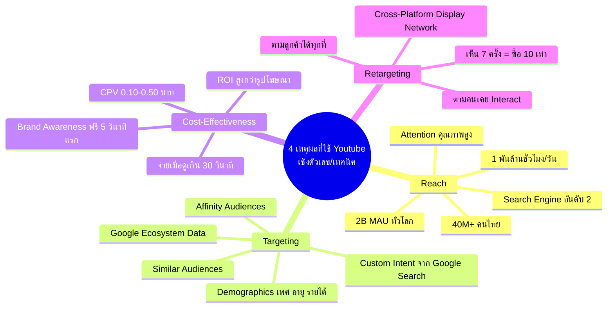
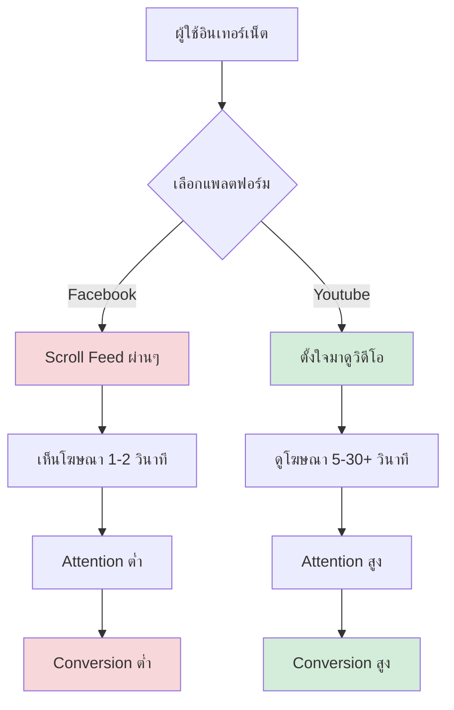
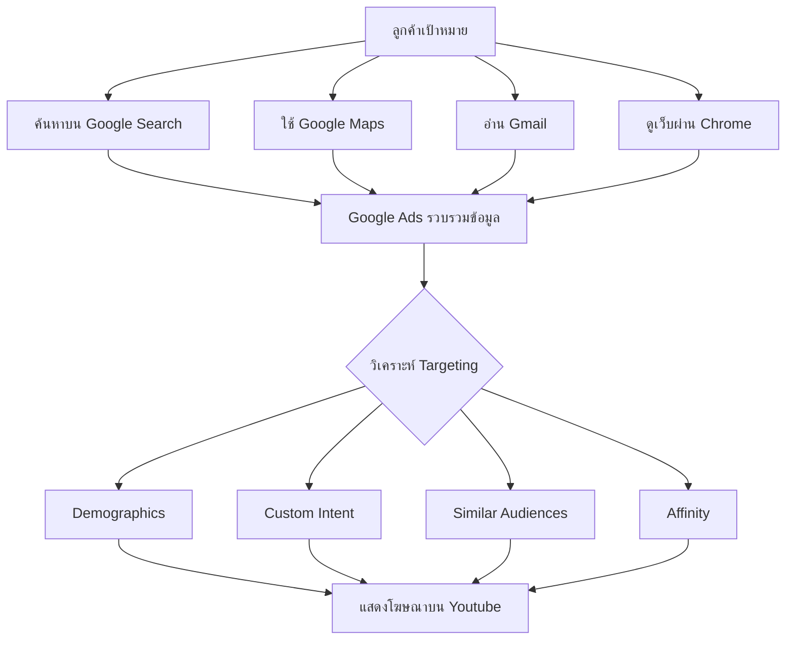
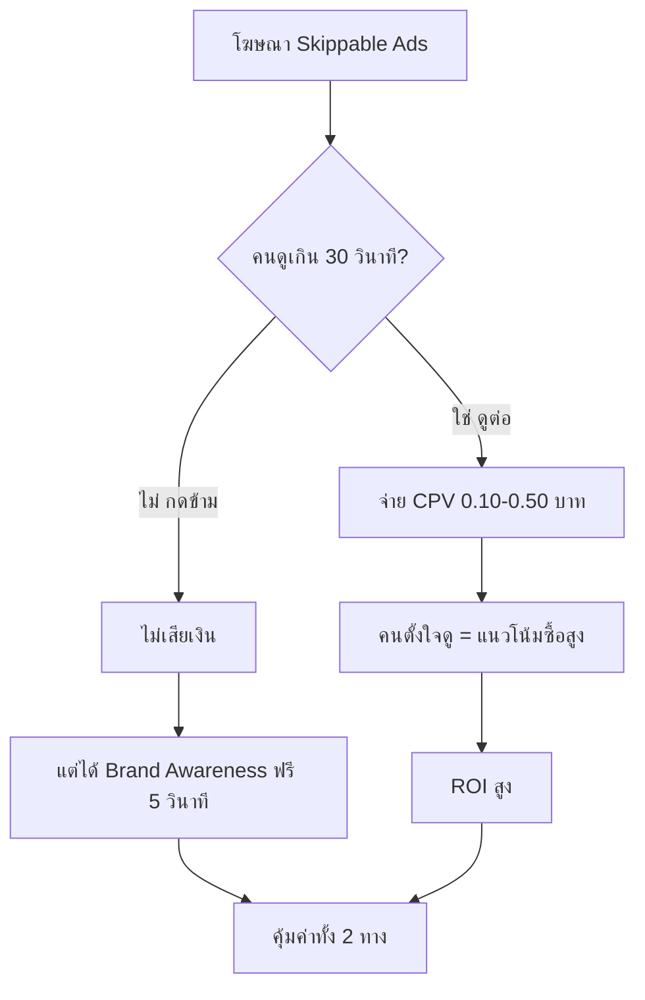
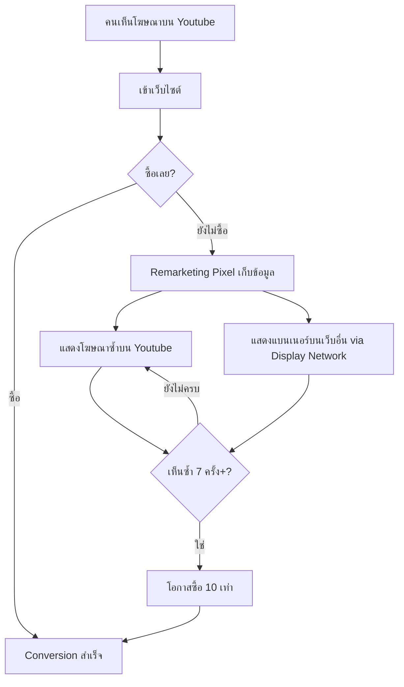

# 4 เหตุผลที่เราใช้ Youtube — YTADV-002 Mind Map
> Format: Mind Map (7 Parts)
> Source: SWP3 Ch17 Youtube Advertising Mastery ตอนที่ 2
> Production: PinkCastle Academy | จูล่ง CTO
> Date: 2026-02-18 | Duration: 0:08:21

---

## Part 1: Text-Based Mind Map (Tree Format)

```
4 เหตุผลที่เราใช้ Youtube (YTADV-002)
│
├── 1. REACH — ความสามารถในการเข้าถึง
│   ├── ตัวเลขระดับโลก
│   │   ├── 2 พันล้าน MAU (Monthly Active Users)
│   │   ├── 1 พันล้านชั่วโมง/วัน ที่คนดู
│   │   └── Search Engine อันดับ 2 ของโลก
│   ├── ตัวเลขในไทย
│   │   ├── 40+ ล้านคนใช้ Youtube
│   │   └── ครอบคลุมทุกกลุ่มอายุ (วัยรุ่น-ผู้สูงอายุ)
│   ├── คุณภาพ Reach
│   │   ├── คนตั้งใจมาดู (ไม่ใช่ Scroll ผ่าน)
│   │   ├── Attention คุณภาพสูง
│   │   └── เทียบ Facebook: Scroll ผ่านๆ = Attention ต่ำ
│   └── จุดสำคัญ
│       ├── ไม่ใช่แค่จำนวน Reach
│       └── แต่คือ Quality ของ Reach
│
├── 2. TARGETING — เลือกกลุ่มเป้าหมายแม่นยำ
│   ├── Demographics
│   │   ├── เพศ
│   │   ├── อายุ
│   │   ├── รายได้
│   │   ├── สถานะการสมรส
│   │   └── ระดับการศึกษา
│   ├── Affinity Audiences
│   │   └── ความสนใจระยะยาว
│   ├── Custom Intent Audiences
│   │   ├── คนที่เพิ่ง Search บน Google
│   │   └── ตัวอย่าง: "คอร์สเรียนทำเว็บ"
│   ├── Similar Audiences
│   │   ├── หาคนคล้ายลูกค้าปัจจุบัน
│   │   └── ขยายฐานลูกค้าอัตโนมัติ
│   └── พลังของ Google Ecosystem
│       ├── ข้อมูลจาก Google Search
│       ├── ข้อมูลจาก Google Maps
│       └── ข้อมูลจาก Gmail
│
├── 3. COST-EFFECTIVENESS — ความคุ้มค่า
│   ├── Skippable Ads
│   │   ├── จ่ายเมื่อดูเกิน 30 วินาที
│   │   └── กดข้ามก่อน = ไม่เสียเงิน
│   ├── CPV (Cost Per View)
│   │   ├── ไทย: 0.10-0.50 บาท/View
│   │   └── ถูกกว่า Facebook CPM ที่สูงขึ้นทุกปี
│   ├── ROI สูง
│   │   ├── คนดูจนจบ = แนวโน้มเป็นลูกค้าจริง
│   │   └── สูงกว่าคนเห็นรูปโฆษณาผ่านๆ
│   └── Brand Awareness ฟรี
│       ├── 5 วินาทีแรก = เห็นแบรนด์แล้ว
│       └── แม้กดข้าม ก็ได้ Awareness ฟรี
│
└── 4. RETARGETING — ตามลูกค้าจนปิดการขาย
    ├── Target ได้หลายกลุ่ม
    │   ├── คนเคยเข้าเว็บเรา
    │   ├── คนเคยดูวิดีโอเรา
    │   └── คนเพิ่มสินค้าลงตะกร้าแต่ยังไม่ซื้อ
    ├── สถิติที่น่าทึ่ง
    │   ├── เห็นโฆษณาซ้ำ 7 ครั้ง+
    │   └── โอกาสซื้อสูงกว่า 10 เท่า
    └── Cross-Platform
        ├── จาก Youtube → Google Display Network
        └── แสดงแบนเนอร์บนเว็บอื่นๆ ทั่วอินเทอร์เน็ต
```

---

## Part 2: Mermaid Mind Map



---

## Part 3: Mermaid Flowcharts

### Flowchart 1: Reach Quality Comparison



### Flowchart 2: Google Ecosystem Targeting



### Flowchart 3: Cost-Effectiveness Model



### Flowchart 4: Retargeting Funnel



---

## Part 4: Comparison Chart

### Youtube vs Facebook Ads เปรียบเทียบ 4 เหตุผล

| เปรียบเทียบ | Youtube Ads | Facebook Ads |
|-------------|------------|-------------|
| **Reach Quality** | ตั้งใจดู = Attention สูง | Scroll ผ่าน = Attention ต่ำ |
| **ผู้ใช้ทั่วโลก** | 2B MAU | 3B MAU (จำนวนมากกว่า) |
| **Attention** | 5-30+ วินาที | 1-2 วินาที |
| **Targeting Source** | Google Ecosystem ทั้งหมด | Facebook + Instagram Data |
| **Custom Intent** | ใช้ Google Search Data | ไม่มี (ไม่มี Search Engine) |
| **รูปแบบจ่ายเงิน** | CPV จ่ายเมื่อดูจริง | CPM จ่ายต่อ 1,000 Impressions |
| **CPV/CPM ไทย** | 0.10-0.50 บาท/View | CPM สูงขึ้นทุกปี |
| **Brand Awareness ฟรี** | ได้จาก 5 วินาทีแรก | ไม่มี (จ่ายทุก Impression) |
| **Retargeting** | Youtube + Display Network | Facebook + Instagram |
| **Cross-Platform** | ตามไปเว็บอื่นๆ ทั่วอินเทอร์เน็ต | จำกัดแค่ Facebook/IG |

### Targeting Options เปรียบเทียบ

| วิธี Targeting | Youtube (Google Ads) | Facebook Ads |
|---------------|---------------------|-------------|
| Demographics | เพศ อายุ รายได้ การศึกษา | เพศ อายุ ที่อยู่ |
| Interest-Based | Affinity Audiences | Interest Targeting |
| Search Intent | Custom Intent (จาก Google Search) | ไม่มี |
| Lookalike | Similar Audiences | Lookalike Audiences |
| Remarketing | Youtube + Display Network | Facebook Pixel |
| Life Events | แต่งงาน จบมหาลัย ย้ายบ้าน | จำกัดกว่า |

### 4 เหตุผลสรุป

| เหตุผล | ข้อได้เปรียบ Youtube | ผลลัพธ์ |
|--------|-------------------|---------|
| 1. Reach | Attention คุณภาพสูง ครอบคลุมทุกกลุ่ม | เข้าถึงลูกค้าที่ "ตั้งใจรับสาร" |
| 2. Targeting | Google Ecosystem + Custom Intent | โฆษณาตรงกลุ่มลด Waste |
| 3. Cost | CPV ถูก จ่ายเมื่อดูจริง | ROI สูง งบเริ่มต้นน้อย |
| 4. Retargeting | Cross-Platform ผ่าน Display Network | ตามลูกค้าได้ทุกที่บนอินเทอร์เน็ต |

---

## Part 5: Summary Table

| # | หัวข้อ | สาระสำคัญ | Action Item |
|---|--------|----------|-------------|
| 1 | Reach มหาศาล | 2B MAU, 1 พันล้านชั่วโมง/วัน | วางแผนเข้าถึงกลุ่มเป้าหมายบน Youtube |
| 2 | Attention คุณภาพสูง | คนตั้งใจดู ไม่ใช่ Scroll ผ่าน | เน้นวิดีโอที่ดึงดูดใน 5 วินาทีแรก |
| 3 | Search Engine อันดับ 2 | 40M+ คนไทยใช้ค้นหาข้อมูล | ทำ Keyword Research สำหรับ Youtube |
| 4 | Google Ecosystem | ข้อมูลจาก Search Maps Gmail | ใช้ Custom Intent Target คนจาก Google |
| 5 | Custom Intent | Target คนที่เพิ่ง Search คำเฉพาะ | เลือก High-Value Keywords |
| 6 | Similar Audiences | หาคนคล้ายลูกค้าอัตโนมัติ | อัพโหลด Customer List เข้า Google Ads |
| 7 | Skippable Ads CPV | 0.10-0.50 บาท/View จ่ายเมื่อดูจริง | เริ่มด้วย Skippable Ads งบน้อย |
| 8 | Brand Awareness ฟรี | 5 วินาทีแรก เห็นแบรนด์แม้กดข้าม | ออกแบบ 5 วินาทีแรกให้แบรนด์ชัด |
| 9 | Retargeting 10 เท่า | เห็นซ้ำ 7 ครั้ง+ โอกาสซื้อ 10x | ตั้ง Remarketing Pixel ทันที |
| 10 | Cross-Platform | Youtube + Display Network ตามทุกที่ | เชื่อม Campaign กับ Display Network |

---

## Part 6: Implementation Roadmap

```
สัปดาห์ที่ 1: วางรากฐาน REACH + TARGETING
├── ศึกษากลุ่มเป้าหมายบน Youtube
├── ทำ Keyword Research สำหรับ Custom Intent
├── กำหนด Demographics ที่ต้องการ
└── อัพโหลด Customer List สร้าง Similar Audiences

สัปดาห์ที่ 2: ทดสอบ COST-EFFECTIVENESS
├── สร้าง Skippable Ads Campaign แรก
├── ตั้งงบ 300-500 บาท/วัน
├── ทดสอบวิดีโอ 3-5 ชิ้น
└── ติดตาม CPV และ Conversion Rate

สัปดาห์ที่ 3: ตั้งระบบ RETARGETING
├── ติดตั้ง Remarketing Pixel บนเว็บไซต์
├── สร้าง Retargeting List จากผู้เข้าชม
├── เชื่อม Youtube กับ Google Display Network
└── ตั้ง Frequency Cap 3-5 ครั้ง/สัปดาห์

สัปดาห์ที่ 4+: ปรับปรุงและขยาย
├── วิเคราะห์ผลลัพธ์ทั้ง 4 เหตุผล
├── ตัดโฆษณาที่ไม่ได้ผล
├── เพิ่มงบให้โฆษณาที่ดี
└── เตรียมเรียนรู้ 4 เหตุผลเพิ่มเติม (YTADV-003)
```

---

## Part 7: Key Formulas & Frameworks

### สูตร Reach Quality
```
Youtube Reach = จำนวนคน x คุณภาพ Attention
Facebook Reach = จำนวนคน x Scroll ผ่าน (Attention ต่ำ)
∴ Youtube Reach มีคุณค่าสูงกว่าแม้จำนวนน้อยกว่า
```

### สูตร Targeting Precision
```
Google Ecosystem = Search + Maps + Gmail + Chrome + Youtube
Targeting Precision = Demographics + Intent + Behavior + Similar
∴ ยิ่งข้อมูลมาก = ยิ่ง Target แม่นยำ = ยิ่งลด Waste
```

### สูตร Cost-Effectiveness
```
CPV (Youtube) = 0.10-0.50 บาท/View (จ่ายเมื่อดูจริง)
CPM (Facebook) = จ่ายต่อ 1,000 Impressions (ไม่ว่าจะดูหรือไม่)
∴ Youtube คุ้มค่ากว่าเพราะจ่ายเฉพาะคนที่สนใจจริง
+ Brand Awareness ฟรีจาก 5 วินาทีแรก = คุ้มค่า 2 ต่อ
```

### สูตร Retargeting
```
Retargeting = แสดงซ้ำกับคนเคย Interact
เห็น 7 ครั้ง+ = โอกาสซื้อ x 10
Youtube Retargeting + Display Network = ตามลูกค้าทุกที่
∴ Retargeting คือเครื่องมือปิดการขายที่ทรงพลังที่สุด
```

### สูตร 4 เหตุผล (Framework)
```
เหตุผลเชิงตัวเลข/เทคนิค (YTADV-002):
(1) Reach — เข้าถึงมหาศาล คุณภาพสูง
(2) Targeting — แม่นยำด้วย Google Data
(3) Cost-Effectiveness — จ่ายเมื่อดูจริง CPV ถูก
(4) Retargeting — ตามลูกค้าข้ามแพลตฟอร์ม

รวม 4 ข้อ = ข้อได้เปรียบเชิงโครงสร้างที่แพลตฟอร์มอื่นไม่มี
```

---

> ทบทวนต่อ: **YTADV-003** — 4 เหตุผลที่เราใช้ Youtube ตอน 2
> Series: SWP3 Ch17 Youtube Advertising Mastery
> PinkCastle Academy © 2026
