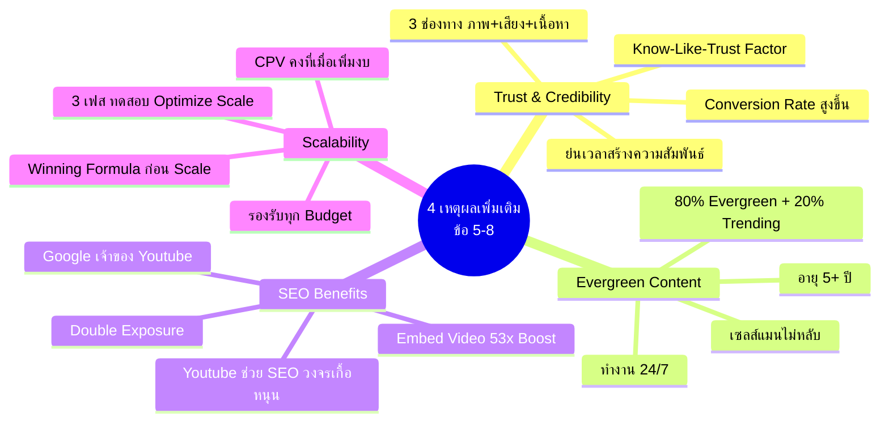
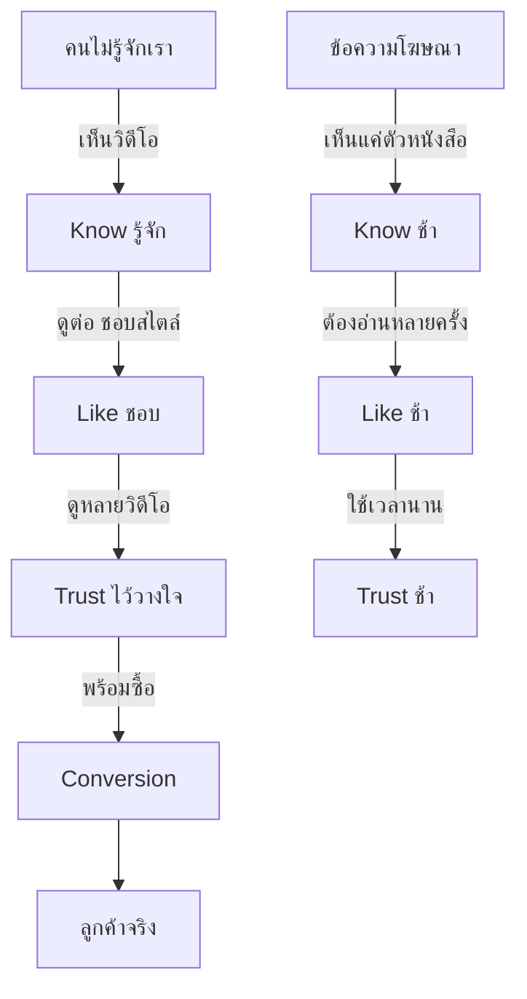
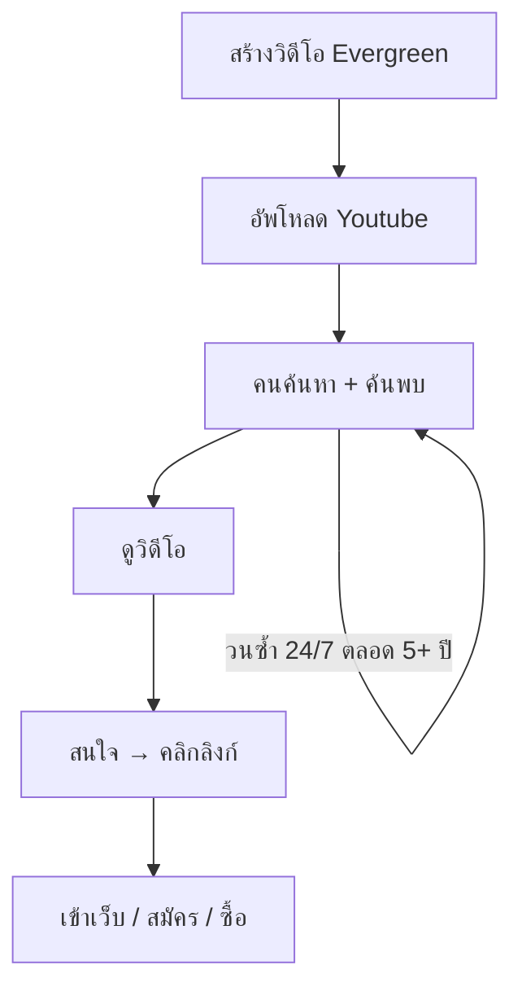
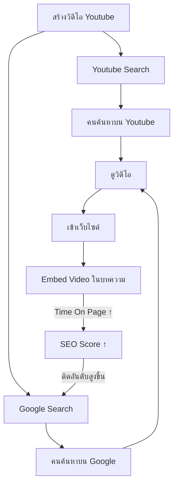
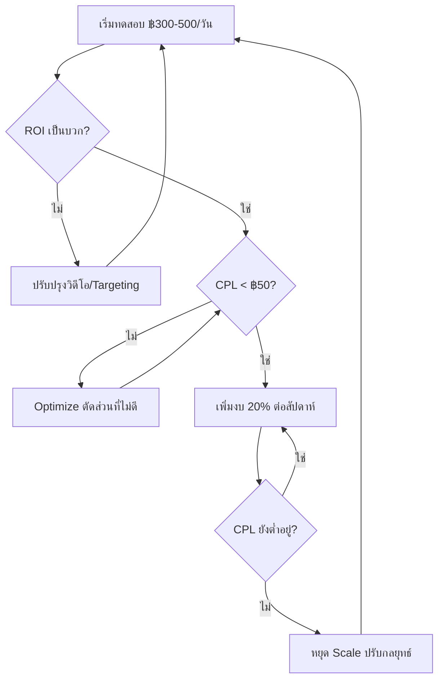

# 4 เหตุผลที่เราใช้ Youtube ตอน 2 — YTADV-003 Mind Map
> Format: Mind Map (7 Parts)
> Source: SWP3 Ch17 Youtube Advertising Mastery ตอนที่ 3
> Production: PinkCastle Academy | จูล่ง CTO
> Date: 2026-02-18 | Duration: 0:09:24

---

## Part 1: Text-Based Mind Map (Tree Format)

```
4 เหตุผลที่เราใช้ Youtube ตอน 2 (YTADV-003)
│
├── 5. TRUST & CREDIBILITY
│   ├── วิดีโอสร้างความไว้วางใจเร็วที่สุด
│   ├── Know-Like-Trust Factor
│   │   ├── Know = รู้จัก (เห็นหน้า)
│   │   ├── Like = ชอบ (สัมผัสอารมณ์)
│   │   └── Trust = ไว้วางใจ (ความจริงใจ)
│   ├── 3 ช่องทางพร้อมกัน
│   │   ├── ภาพ → เห็นหน้า ภาษากาย
│   │   ├── เสียง → น้ำเสียง อารมณ์
│   │   └── เนื้อหา → ข้อมูล ความรู้
│   └── ผลลัพธ์
│       ├── Conversion Rate สูงขึ้น
│       └── ย่นเวลาสร้างความสัมพันธ์
│
├── 6. EVERGREEN CONTENT
│   ├── ทำงาน 24/7 ไม่มีวันหยุด
│   ├── อายุ Content เปรียบเทียบ
│   │   ├── Twitter/X: 15-30 นาที
│   │   ├── Facebook: 2-5 ชม.
│   │   ├── IG Story: 24 ชม.
│   │   ├── Blog: 2-3 ปี
│   │   └── Youtube: 5+ ปี
│   ├── เปรียบเหมือนเซลส์แมนไม่หลับ
│   └── สัดส่วนที่ดี
│       ├── 80% Evergreen Topics
│       └── 20% Trending Topics
│
├── 7. SEO BENEFITS
│   ├── Google = เจ้าของ Youtube
│   ├── Double Exposure
│   │   ├── ค้นพบบน Youtube Search
│   │   └── ค้นพบบน Google Search
│   ├── Embed Video Boost
│   │   ├── โอกาสติดหน้า 1 สูงกว่า 53x
│   │   ├── เพิ่ม Time On Page
│   │   └── ลด Bounce Rate
│   └── วงจรเกื้อหนุน
│       ├── Youtube ช่วย SEO
│       └── SEO ช่วยดัน Youtube
│
└── 8. SCALABILITY
    ├── Winning Formula ก่อน Scale
    ├── Youtube รองรับทุก Budget
    │   ├── ฿100/วัน → ฿100,000/วัน
    │   └── CPV คงที่เมื่อเพิ่มงบ
    ├── ดีกว่า Facebook Scale
    │   ├── Youtube: CPV คงที่
    │   └── Facebook: CPM พุ่งสูง
    └── Scaling Plan 3 เฟส
        ├── Phase 1: ทดสอบ (฿300-500/วัน)
        ├── Phase 2: Optimize (ตัดที่ไม่ดี)
        └── Phase 3: Scale (+20%/สัปดาห์)
```

---

## Part 2: Mermaid Mind Map



---

## Part 3: Mermaid Flowcharts

### Flowchart 1: Trust Building Process



### Flowchart 2: Evergreen Content Lifecycle



### Flowchart 3: SEO Double Exposure



### Flowchart 4: Scaling Decision Flow



---

## Part 4: Comparison Chart

### เชิงตัวเลข vs เชิงกลยุทธ์

| เปรียบเทียบ | 4 เหตุผลเชิงตัวเลข/เทคนิค | 4 เหตุผลเชิงกลยุทธ์ |
|-------------|---------------------------|---------------------|
| **ตอน** | YTADV-002 | YTADV-003 |
| **เน้น** | วัดผลได้ทันที | ผลระยะยาว |
| **เหตุผล** | Reach, Targeting, Cost, Retarget | Trust, Evergreen, SEO, Scale |
| **ประโยชน์** | ลด Cost, เพิ่ม Reach | สร้างสินทรัพย์ถาวร |
| **ระยะเวลาเห็นผล** | สัปดาห์แรก | เดือน-ปี |

### อายุ Content แต่ละแพลตฟอร์ม

| แพลตฟอร์ม | อายุ Content | ลงแรง 1 ครั้ง ได้... |
|-----------|-------------|---------------------|
| Twitter/X | 15-30 นาที | แทบไม่ได้อะไร |
| Facebook Post | 2-5 ชม. | ไม่กี่ชม.ของ Reach |
| Instagram Story | 24 ชม. | 1 วันของ Reach |
| Blog Post | 2-3 ปี | Traffic หลายปี |
| **Youtube Video** | **5+ ปี** | **เซลส์แมน 24/7 ตลอดกาล** |

### Youtube vs Facebook Scale

| เปรียบเทียบ | Youtube | Facebook |
|-------------|---------|----------|
| เพิ่มงบแล้ว CPV/CPM | คงที่ | พุ่งสูง |
| ผู้ชมรองรับ | มากพอ (2B MAU) | จำกัดกว่า |
| การแข่งขัน | ปานกลาง | สูงมาก |
| ความง่ายใน Scale | ง่าย ราบรื่น | ต้องปรับบ่อย |

---

## Part 5: Summary Table

| # | หัวข้อ | สาระสำคัญ | Action Item |
|---|--------|----------|-------------|
| 1 | Trust & Credibility | วิดีโอสร้าง Know-Like-Trust ได้เร็วที่สุด 3 ช่องทางพร้อมกัน | ทำวิดีโอให้ความรู้สม่ำเสมอ |
| 2 | Know-Like-Trust Factor | คนซื้อจากคนที่รู้จัก ชอบ ไว้วางใจ | แสดงตัวตนจริง สร้างความสัมพันธ์ |
| 3 | Evergreen Content | ทำ 1 ครั้ง ได้ประโยชน์ 5+ ปี ทำงาน 24/7 | เน้นทำ Evergreen Topics 80% |
| 4 | อายุ Content | Youtube 5+ ปี vs Facebook 2-5 ชม. | จัดสรรเวลาทำวิดีโอมากขึ้น |
| 5 | SEO Double Exposure | ค้นพบทั้ง Youtube Search + Google Search | Optimize Title/Description/Tags |
| 6 | Embed Video 53x | เว็บที่มี Video ติดหน้า 1 สูงกว่า 53 เท่า | Embed Video ในทุกบทความ |
| 7 | Scalability | หา Winning Formula แล้ว Scale ได้ไม่จำกัด | เริ่มทดสอบด้วยงบน้อย |
| 8 | Scaling Plan | 3 เฟส: ทดสอบ → Optimize → Scale | วางเกณฑ์เพิ่มงบล่วงหน้า |
| 9 | Youtube vs Facebook | Youtube Scale ดีกว่า CPV คงที่ | เลือก Youtube เป็นแพลตฟอร์มหลัก |
| 10 | 8 เหตุผลครบชุด | ไม่มีแพลตฟอร์มอื่นให้ครบ 8 ข้อ | ใช้ 8 เหตุผลเป็นกรอบตัดสินใจ |

---

## Part 6: Implementation Roadmap

```
สัปดาห์ที่ 1: สร้าง TRUST
├── ทำวิดีโอ Evergreen 3-5 ชิ้น
├── เน้น Topics ที่มีคนค้นหาตลอดปี
├── แสดงตัวตนจริง สร้าง Know-Like-Trust
└── อัพโหลดขึ้น Youtube

สัปดาห์ที่ 2: เสริม SEO
├── ทำ Keyword Research (Youtube + Google)
├── Optimize Title, Description, Tags
├── Embed Youtube Video ในเว็บทุกหน้าสำคัญ
└── ตรวจ Google Search Console

สัปดาห์ที่ 3: ทดสอบโฆษณา
├── ตั้งงบ ฿300-500/วัน
├── ทดสอบวิดีโอ 3-5 ชิ้น
├── ติดตาม CPV, CPL, Conversion
└── เก็บข้อมูลหา Winning Formula

สัปดาห์ที่ 4+: SCALE
├── ตัดโฆษณาที่ไม่ได้ผล
├── เพิ่มงบให้โฆษณาที่ดี (+20%/สัปดาห์)
├── ขยายกลุ่มเป้าหมาย
└── เพิ่มวิดีโอใหม่อย่างต่อเนื่อง
```

---

## Part 7: Key Formulas & Frameworks

### สูตร Trust Building
```
วิดีโอ = ภาพ + เสียง + เนื้อหา = 3 ช่องทาง
ข้อความ = เนื้อหา = 1 ช่องทาง
∴ วิดีโอสร้าง Trust ได้เร็วกว่า 3 เท่า
```

### สูตร Content Mix
```
80% Evergreen Topics (อายุ 5+ ปี)
+ 20% Trending Topics (ดึงความสนใจช่วงสั้น)
= สมดุลที่ดีที่สุดสำหรับ Youtube Channel
```

### สูตร SEO Boost
```
Youtube Video + Embed ในเว็บ = โอกาสติดหน้า 1 × 53
Youtube Search + Google Search = Double Exposure (หน้าร้าน 2 แห่ง)
```

### สูตร Scaling
```
Phase 1: ทดสอบ ฿300-500/วัน → หา Winning Formula
Phase 2: CPL < ฿50 → เพิ่มงบ 20%/สัปดาห์
Phase 3: CPL ยังต่ำ → Scale ต่อ | CPL สูงขึ้น → หยุด ปรับกลยุทธ์
```

### สูตร 8 เหตุผลครบชุด
```
เชิงตัวเลข/เทคนิค = Reach + Targeting + Cost + Retarget
เชิงกลยุทธ์ = Trust + Evergreen + SEO + Scalability
รวม 8 ข้อ = ไม่มีแพลตฟอร์มอื่นเทียบได้
```

---

> ทบทวนต่อ: **YTADV-004** — สถานะลูกค้าในโลกจริง
> Series: SWP3 Ch17 Youtube Advertising Mastery
> PinkCastle Academy © 2026
