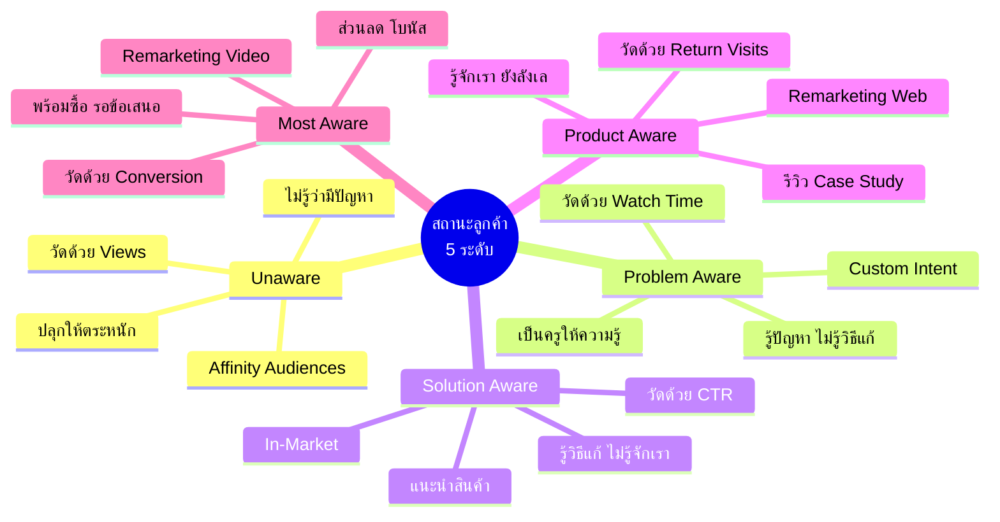
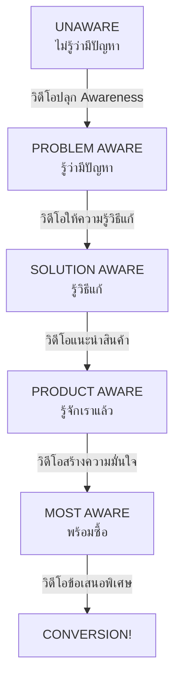
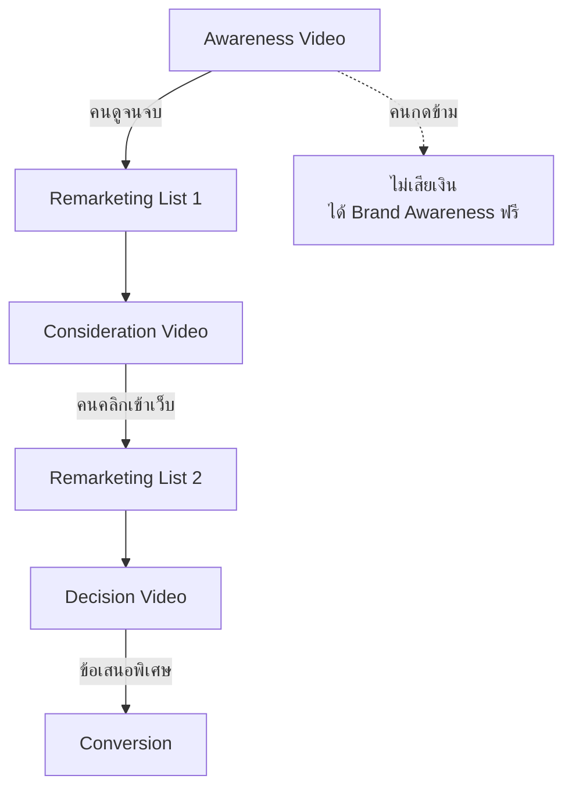
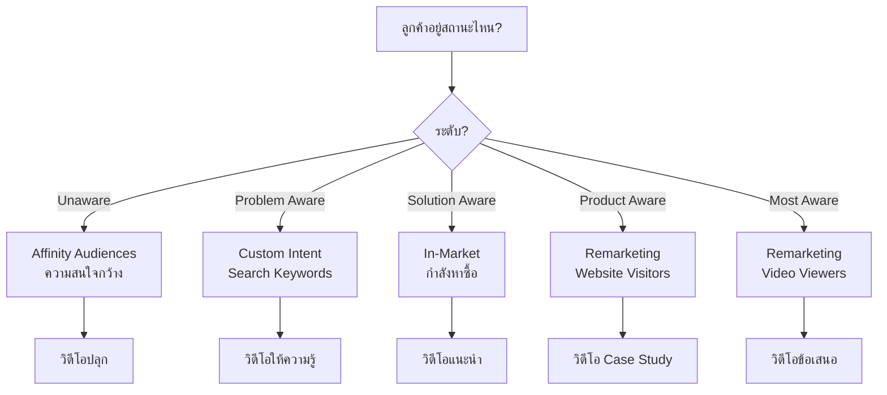
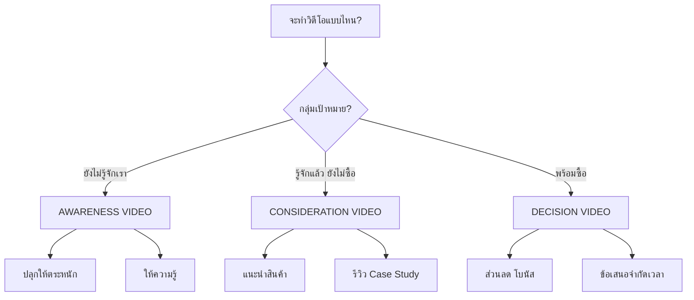

# สถานะลูกค้าในโลกจริง — YTADV-004 Mind Map
> Format: Mind Map (7 Parts)
> Source: SWP3 Ch17 Youtube Advertising Mastery ตอนที่ 4
> Production: PinkCastle Academy | จูล่ง CTO
> Date: 2026-02-18 | Duration: 0:04:59

---

## Part 1: Text-Based Mind Map (Tree Format)

```
สถานะลูกค้าในโลกจริง (YTADV-004)
│
├── 1. UNAWARE (ไม่รู้ตัว)
│   ├── ลูกค้า: ยังไม่รู้ว่ามีปัญหา
│   ├── ตัวอย่าง: ธุรกิจที่ไม่รู้ว่าโตได้ด้วย Ads
│   ├── สื่อสาร: ปลุกให้ตระหนัก (ห้ามขาย!)
│   ├── Targeting: Affinity Audiences
│   └── Metric: Views
│
├── 2. PROBLEM AWARE (รู้ปัญหา)
│   ├── ลูกค้า: รู้ปัญหา ไม่รู้วิธีแก้
│   ├── ตัวอย่าง: "ธุรกิจไม่โต ทำยังไง?"
│   ├── สื่อสาร: เป็นครูให้ความรู้
│   ├── Targeting: Custom Intent
│   └── Metric: Watch Time
│
├── 3. SOLUTION AWARE (รู้วิธีแก้)
│   ├── ลูกค้า: รู้วิธีแก้ ไม่รู้จักเรา
│   ├── ตัวอย่าง: "รู้ว่าต้องยิง Ads" ไม่รู้ว่าYT ดี
│   ├── สื่อสาร: แนะนำสินค้า/บริการ
│   ├── Targeting: In-Market Audiences
│   └── Metric: Click-Through Rate
│
├── 4. PRODUCT AWARE (รู้จักสินค้า)
│   ├── ลูกค้า: รู้จักเรา ยังลังเล
│   ├── ตัวอย่าง: กำลังเปรียบเทียบกับคู่แข่ง
│   ├── สื่อสาร: รีวิว Case Study Testimonial
│   ├── Targeting: Remarketing Website
│   └── Metric: Return Visits
│
├── 5. MOST AWARE (พร้อมซื้อ)
│   ├── ลูกค้า: เชื่อมั่น รอข้อเสนอดี
│   ├── ตัวอย่าง: ติดตามมานาน รอโปรโมชัน
│   ├── สื่อสาร: ข้อเสนอพิเศษ ส่วนลด โบนัส
│   ├── Targeting: Remarketing Video Viewers
│   └── Metric: Conversion
│
├── YOUTUBE FUNNEL
│   ├── Awareness Video → Remarketing →
│   ├── Consideration Video → Remarketing →
│   └── Decision Video → Conversion!
│
└── KEY RULES
    ├── ห้ามขายตรงให้ Unaware
    ├── ทำวิดีโออย่างน้อย 3 แบบ
    ├── จับคู่ Targeting กับ Status
    └── วัดผลตาม Metric ที่ถูกต้อง
```

---

## Part 2: Mermaid Mind Map



---

## Part 3: Mermaid Flowcharts

### Flowchart 1: Customer Awareness Journey



### Flowchart 2: Youtube Funnel with Remarketing



### Flowchart 3: Targeting Decision Flow



### Flowchart 4: Video Type Decision



---

## Part 4: Comparison Chart

### 5 สถานะลูกค้า เปรียบเทียบ

| สถานะ | ลูกค้ารู้ | ไม่รู้ | สื่อสาร | ห้ามทำ |
|-------|---------|------|---------|------|
| Unaware | — | ทุกอย่าง | ปลุกให้ตระหนัก | ขายตรง |
| Problem | มีปัญหา | วิธีแก้ | ให้ความรู้ | ขายทันที |
| Solution | วิธีแก้ | จักเรา | แนะนำสินค้า | Push เกินไป |
| Product | จักเรา | จะซื้อไหม | สร้างมั่นใจ | ให้ข้อมูลซ้ำ |
| Most Aware | ทุกอย่าง | รอจังหวะ | ให้ข้อเสนอ | ให้ข้อมูลอีก |

### Targeting กับ Metric แต่ละสถานะ

| สถานะ | Youtube Targeting | Metric วัดผล | วิดีโอที่ทำ |
|-------|------------------|-------------|------------|
| Unaware | Affinity Audiences | Views | Awareness |
| Problem Aware | Custom Intent | Watch Time | Educational |
| Solution Aware | In-Market | CTR | Product Intro |
| Product Aware | Remarketing Web | Return Visits | Case Study |
| Most Aware | Remarketing Video | Conversion | Offer |

---

## Part 5: Summary Table

| # | หัวข้อ | สาระสำคัญ | Action Item |
|---|--------|----------|-------------|
| 1 | Customer Awareness 5 ระดับ | ลูกค้ามี 5 สถานะ ต้องสื่อสารต่างกัน | จัดกลุ่มลูกค้าตาม 5 สถานะ |
| 2 | Unaware | ไม่รู้ว่ามีปัญหา ห้ามขายตรง | ทำวิดีโอปลุก Awareness |
| 3 | Problem Aware | รู้ปัญหา ไม่รู้วิธีแก้ | ทำวิดีโอให้ความรู้ |
| 4 | Solution Aware | รู้วิธีแก้ ไม่รู้จักเรา | ทำวิดีโอแนะนำสินค้า |
| 5 | Product Aware | รู้จักเรา ยังลังเล | ทำวิดีโอ Case Study/รีวิว |
| 6 | Most Aware | พร้อมซื้อ รอข้อเสนอ | ทำวิดีโอข้อเสนอพิเศษ |
| 7 | Targeting Match | จับคู่ Targeting กับ Status | ตั้ง Campaign แยกตามสถานะ |
| 8 | วิดีโอ 3 แบบขั้นต่ำ | Awareness + Consideration + Decision | ทำวิดีโอก่อนเริ่มยิงโฆษณา |
| 9 | Metric ตามสถานะ | แต่ละสถานะวัดผลด้วย Metric ต่างกัน | ตั้ง KPI ที่ตรงกับเป้าหมาย |
| 10 | Youtube Funnel | ใช้ Remarketing เชื่อมสถานะ | ออกแบบ Funnel ส่งต่อลูกค้า |

---

## Part 6: Implementation Roadmap

```
วันที่ 1: วิเคราะห์ลูกค้า
├── จัดกลุ่มลูกค้าเป้าหมายตาม 5 สถานะ
├── เขียนออกมาว่าแต่ละกลุ่มคือใคร
├── ระบุ Pain Points ของแต่ละกลุ่ม
└── กำหนดข้อความที่ตรงกับแต่ละสถานะ

วันที่ 2-3: สร้างวิดีโอ
├── วิดีโอ Awareness — ปลุกให้ตระหนักถึงปัญหา
├── วิดีโอ Consideration — แนะนำสินค้า + Case Study
├── วิดีโอ Decision — ข้อเสนอพิเศษ
└── (ถ้ามีเวลา) ทำเพิ่มให้ครบ 5 แบบ

วันที่ 4: ตั้ง Campaign
├── Campaign 1: Awareness (Affinity Targeting)
├── Campaign 2: Consideration (Custom Intent + In-Market)
├── Campaign 3: Decision (Remarketing)
├── ตั้ง KPI แยกตามสถานะ
└── กำหนดงบแต่ละ Campaign

วันที่ 5: ออกแบบ Funnel
├── สร้าง Remarketing Lists
├── เชื่อม Awareness → Consideration → Decision
├── ทดสอบ Flow ทั้งหมด
└── ✅ พร้อมเปิดแคมเปญ!
```

---

## Part 7: Key Formulas & Frameworks

### สูตร Customer Status
```
Unaware → Problem Aware → Solution Aware → Product Aware → Most Aware
(ทุกคนต้องผ่านทุกสถานะ ข้ามไม่ได้)
```

### สูตรจับคู่ Targeting
```
Unaware = Affinity Audiences (ความสนใจกว้าง)
Problem = Custom Intent (Search Keywords)
Solution = In-Market (กำลังหาซื้อ)
Product = Remarketing Website (เคยเข้าเว็บ)
Most = Remarketing Video (ดูวิดีโอหลายชิ้น)
```

### สูตรวิดีโอขั้นต่ำ
```
3 แบบ = Awareness + Consideration + Decision
5 แบบ (ถ้าทำได้) = 1 ต่อ 1 สถานะ
```

### สูตร Youtube Funnel
```
Awareness Video → [Remarketing คนดูจบ]
→ Consideration Video → [Remarketing คนคลิกเว็บ]
→ Decision Video → Conversion!
```

### สูตร Metric ตามสถานะ
```
Unaware = Views (เห็นกี่คน)
Problem = Watch Time (สนใจแค่ไหน)
Solution = CTR (คลิกกี่คน)
Product = Return Visits (กลับมากี่ครั้ง)
Most = Conversion (ซื้อกี่คน)
```

---

> ทบทวนต่อ: **YTADV-005** — โฆษณาที่สมบูรณ์แบบ
> Series: SWP3 Ch17 Youtube Advertising Mastery
> PinkCastle Academy © 2026
