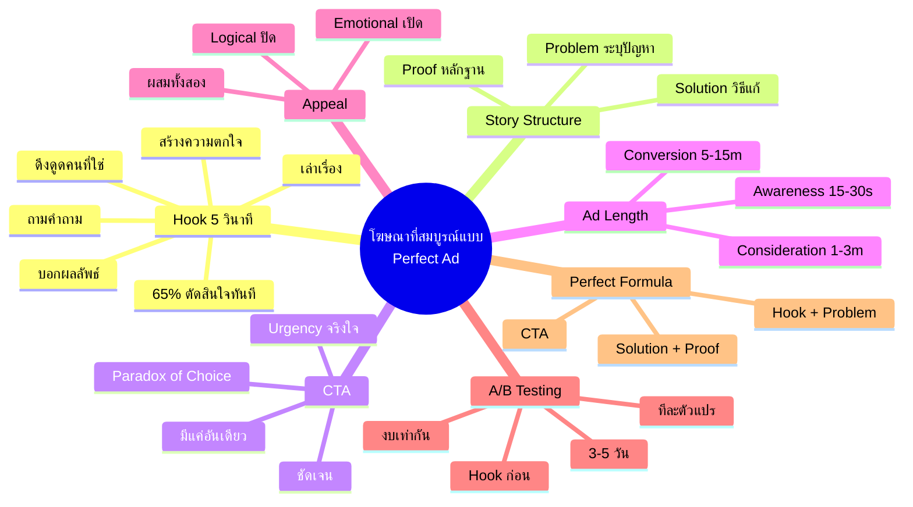
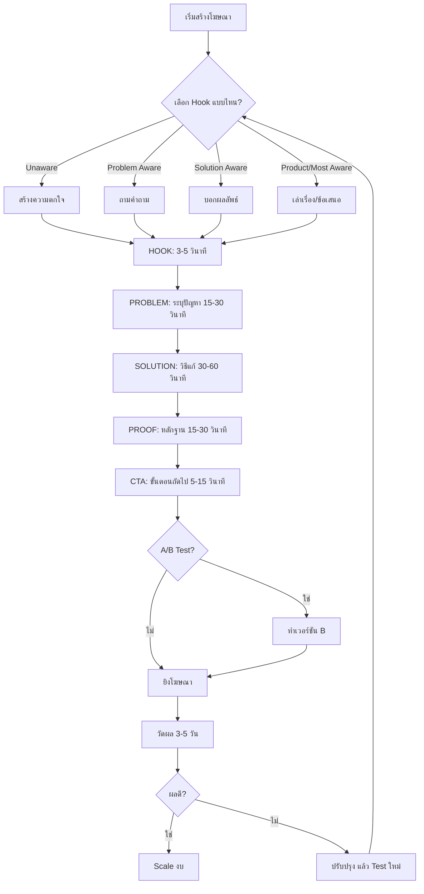
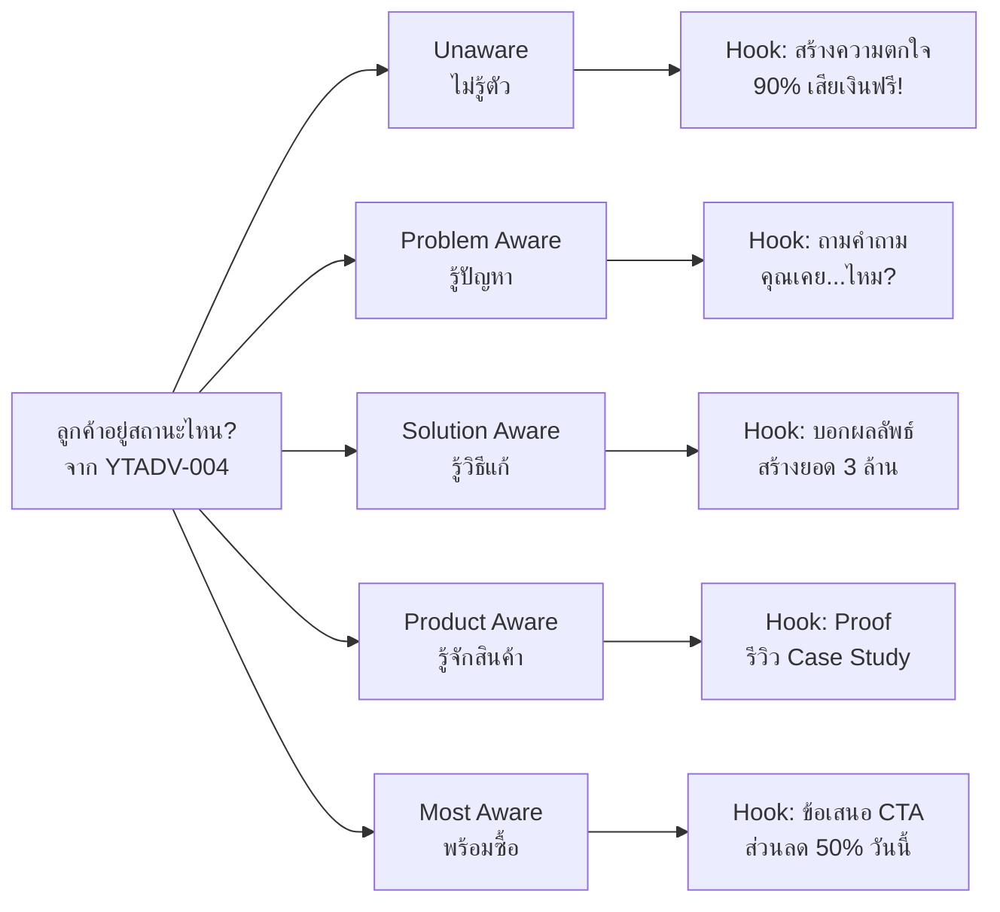
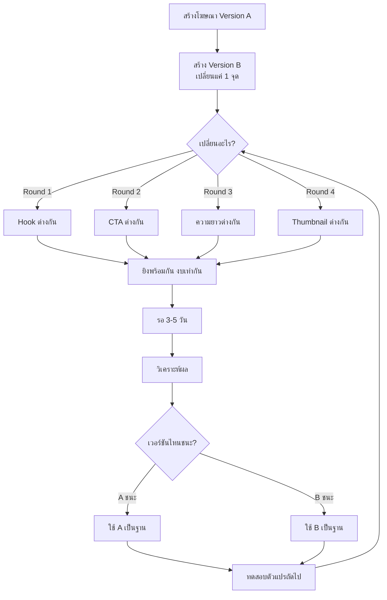
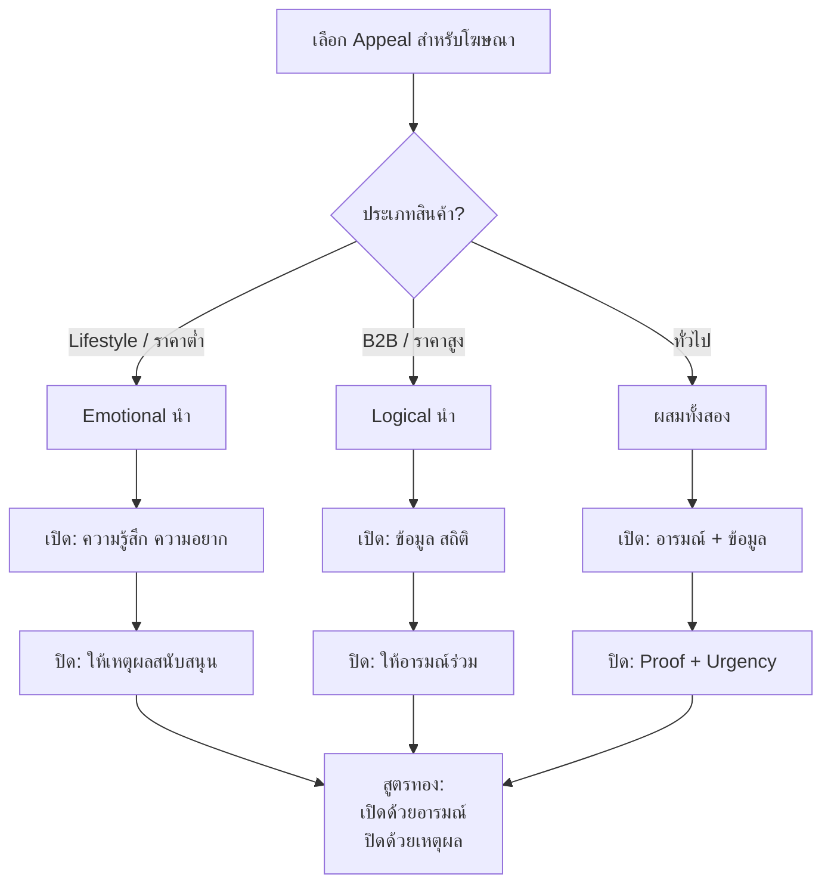

# โฆษณาที่สมบูรณ์แบบ — YTADV-005 Mind Map
> **Format:** Mind Map (7 Parts)
> **Source:** SWP3 Ch17 Youtube Advertising Mastery ตอนที่ 5
> **Production:** PinkCastle Academy | จูล่ง CTO
> **Date:** 2026-02-18 | **Duration:** 0:08:34

---

## Part 1: Text-Based Mind Map (Tree Format)

```
โฆษณาที่สมบูรณ์แบบ (YTADV-005)
│
├── 1. HOOK (5 วินาทีแรก)
│   ├── ความสำคัญ: 65% ตัดสินใจภายใน 5 วินาที
│   ├── แบบที่ 1: ถามคำถาม → เหมาะ Problem Aware
│   ├── แบบที่ 2: บอกผลลัพธ์ → เหมาะ Solution Aware
│   ├── แบบที่ 3: สร้างความตกใจ → เหมาะ Unaware
│   ├── แบบที่ 4: เล่าเรื่อง → เหมาะทุกสถานะ
│   └── หลักการ: ดึงดูด "คนที่ใช่" ไม่ใช่ทุกคน
│
├── 2. PROBLEM (ระบุปัญหา)
│   ├── พูดปัญหาที่ลูกค้ากำลังเผชิญ
│   ├── ให้คนรู้สึก "ใช่! นี่คือปัญหาของฉัน"
│   └── ใช้ Emotional Appeal เป็นหลัก
│
├── 3. SOLUTION (นำเสนอวิธีแก้)
│   ├── นำเสนอวิธีแก้ที่ชัดเจน
│   ├── ผสม Emotional + Logical
│   └── ตรงกับสถานะลูกค้า (YTADV-004)
│
├── 4. PROOF (แสดงหลักฐาน)
│   ├── รีวิวจากลูกค้าจริง
│   ├── Case Study / Testimonial
│   ├── ตัวเลขที่เป็นรูปธรรม
│   └── ใช้ Logical Appeal เป็นหลัก
│
├── 5. CTA (Call to Action)
│   ├── ต้องชัดเจน — "กดลิงก์ด้านล่าง"
│   ├── ต้องมีแค่อันเดียว (Paradox of Choice)
│   ├── ต้องมี Urgency ที่จริงใจ
│   └── ❌ อย่าหลอก = เสียความน่าเชื่อถือ
│
├── 6. ความยาวตามเป้าหมาย
│   ├── Brand Awareness: 15-30 วินาที
│   ├── Consideration: 1-3 นาที
│   ├── Conversion: 5-15 นาที
│   └── หลักการ: ยาวเท่าที่จำเป็น สั้นเท่าที่เป็นไปได้
│
├── 7. EMOTIONAL vs LOGICAL
│   ├── Emotional: ความรู้สึก ความอยาก ความกลัว
│   ├── Logical: ตัวเลข ข้อมูล เปรียบเทียบ
│   ├── สูตร: เปิดด้วยอารมณ์ ปิดด้วยเหตุผล
│   └── เหตุผล: คนซื้อด้วยอารมณ์ หาเหตุผลมาสนับสนุน
│
├── 8. A/B TESTING
│   ├── ทำ 2 เวอร์ชัน ต่างกันแค่ 1 จุด
│   ├── ลำดับ: Hook → CTA → ความยาว → Thumbnail
│   ├── งบเท่ากัน ยิง 3-5 วัน
│   └── ❌ ห้ามเปลี่ยนหลายอย่างพร้อมกัน
│
└── 9. PERFECT AD FORMULA
    └── Hook + Problem + Solution + Proof + CTA
        ├── ต้องมีครบ 5 ส่วน
        ├── ไหลลื่นเหมือนเล่าเรื่องให้เพื่อนฟัง
        └── ใช้ได้กับทุกประเภทสินค้า
```

---

## Part 2: Mermaid Mind Map



---

## Part 3: Mermaid Flowcharts

### Flowchart 1: Perfect Ad Formula Flow



### Flowchart 2: Hook Selection by Customer Status



### Flowchart 3: A/B Testing Process



### Flowchart 4: Emotional vs Logical Decision



---

## Part 4: Comparison Chart

### เปรียบเทียบ Hook 4 แบบ

| เกณฑ์ | ถามคำถาม | บอกผลลัพธ์ | สร้างความตกใจ | เล่าเรื่อง |
|-------|---------|-----------|-------------|----------|
| **วิธีใช้** | ถามตรง Pain Point | แสดงตัวเลขที่น่าทึ่ง | ใช้สถิติที่น่าตกใจ | เริ่มด้วย Conflict |
| **ตัวอย่าง** | "คุณเคย...ไหม?" | "สร้างยอด 3 ล้าน/30 วัน" | "90% เสียเงินฟรี!" | "เมื่อ 2 ปีก่อน..." |
| **Customer Status** | Problem Aware | Solution Aware | Unaware | ทุกสถานะ |
| **ความยาว** | 3-5 วินาที | 3-5 วินาที | 3-5 วินาที | 5-10 วินาที |
| **ความง่ายในการทำ** | ง่าย | ปานกลาง | ง่าย | ยาก |
| **ประสิทธิภาพ** | สูง | สูงมาก | สูงมาก | สูง |
| **ความเสี่ยง** | ต่ำ | กลาง (ดูเกินจริง) | ต่ำ | กลาง (ยาวเกิน) |
| **เหมาะกับ** | ทุกธุรกิจ | ธุรกิจที่มีผลลัพธ์ชัด | ทุกธุรกิจ | ธุรกิจที่มีเรื่องเล่า |

### เปรียบเทียบความยาวตามเป้าหมาย

| เป้าหมาย | ความยาว | เหตุผล | ตัวอย่างใช้งาน | KPI หลัก |
|----------|---------|--------|---------------|---------|
| Brand Awareness | 15-30 วินาที | สั้น กระชับ จำง่าย | แนะนำแบรนด์ ปลุก Awareness | Views, Impressions |
| Consideration | 1-3 นาที | อธิบายพอเข้าใจ | แนะนำสินค้า เปรียบเทียบ | Watch Time, CTR |
| Conversion | 5-15 นาที | ละเอียด ตอบข้อโต้แย้ง | ขายตรง Webinar | Conversion Rate |

---

## Part 5: Summary Table

| # | หัวข้อ | สาระสำคัญ | Action Item |
|---|-------|----------|-------------|
| 1 | Hook 5 วินาทีแรก | 65% ตัดสินใจภายใน 5 วินาที Hook คือส่วนที่สำคัญที่สุด | เขียน Hook 3 เวอร์ชันสำหรับโฆษณาถัดไป |
| 2 | Hook 4 แบบ | ถามคำถาม / บอกผลลัพธ์ / สร้างความตกใจ / เล่าเรื่อง | จับคู่ Hook กับ Customer Status จาก YTADV-004 |
| 3 | Story Structure | Problem → Solution → Proof ทั้ง 3 ส่วนต้องไหลลื่น | เขียน Script ตามโครงสร้าง 3 ส่วนทุกครั้ง |
| 4 | CTA 3 กฎ | ชัดเจน / แค่อันเดียว / Urgency จริงใจ | กำหนด CTA เดียวก่อนเขียน Script |
| 5 | Paradox of Choice | ทางเลือกมาก = ไม่ตัดสินใจ | ตัด CTA เหลืออันเดียว อย่าให้เลือก |
| 6 | ความยาว | Awareness=15-30s, Consideration=1-3m, Conversion=5-15m | เลือกความยาวตามเป้าหมาย Campaign ก่อนถ่าย |
| 7 | Emotional vs Logical | เปิดด้วยอารมณ์ ปิดด้วยเหตุผล | วาง Script: Hook (อารมณ์) → Proof (เหตุผล) → CTA |
| 8 | A/B Testing | ทีละตัวแปร งบเท่ากัน 3-5 วัน | เริ่ม A/B Test Hook 2 เวอร์ชันตั้งแต่โฆษณาชิ้นแรก |
| 9 | Perfect Ad Formula | Hook + Problem + Solution + Proof + CTA | ใช้เป็น Checklist ทุกครั้งก่อนยิงโฆษณา |
| 10 | ความเป็นธรรมชาติ | ต้องรู้สึกเหมือนเพื่อนแนะนำ ไม่ใช่ถูกขาย | ซ้อมพูดหลายรอบ ใช้ภาษาพูดไม่ใช่ภาษาเขียน |

---

## Part 6: Implementation Roadmap

```
IMPLEMENTATION ROADMAP — โฆษณาที่สมบูรณ์แบบ
│
├── WEEK 1: เตรียมพื้นฐาน
│   ├── Day 1-2: ศึกษา Customer Status ของกลุ่มเป้าหมาย (YTADV-004)
│   ├── Day 3-4: เขียน Hook 3 เวอร์ชัน (เลือกจาก 4 แบบ)
│   └── Day 5: เขียน Perfect Ad Script ตามสูตร 5 ส่วน
│
├── WEEK 2: สร้างโฆษณา
│   ├── Day 1-2: ถ่ายวิดีโอ Version A + Version B (ต่าง Hook)
│   ├── Day 3: ตัดต่อ ใส่ CTA ชัดเจน
│   ├── Day 4: ตรวจ Checklist 10 ข้อก่อนยิง
│   └── Day 5: ตั้ง A/B Test บน Youtube Ads
│
├── WEEK 3: ทดสอบและวัดผล
│   ├── Day 1-3: ยิง A/B Test งบเท่ากัน
│   ├── Day 4: วิเคราะห์ผล (View Rate, CTR, Conversion)
│   └── Day 5: เลือก Winner + ปรับปรุง
│
├── WEEK 4: ปรับปรุงและ Scale
│   ├── Day 1-2: A/B Test รอบ 2 (เปลี่ยน CTA)
│   ├── Day 3-4: วิเคราะห์ผลรอบ 2
│   └── Day 5: Scale งบให้โฆษณาที่ชนะ
│
└── ONGOING: ทำซ้ำ
    ├── ทดสอบ Hook ใหม่ทุก 2 สัปดาห์
    ├── อัพเดท Proof (รีวิว ตัวเลข) ทุกเดือน
    └── สร้าง Template สำเร็จรูปสำหรับทีม
```

---

## Part 7: Key Formulas & Frameworks

### Framework 1: Perfect Ad Formula

```
┌─────────────────────────────────────────────┐
│         PERFECT AD FORMULA                  │
│                                             │
│  HOOK (3-5s) → ดึงดูดความสนใจ              │
│       ↓                                     │
│  PROBLEM (15-30s) → ระบุปัญหา              │
│       ↓                                     │
│  SOLUTION (30-60s) → นำเสนอวิธีแก้          │
│       ↓                                     │
│  PROOF (15-30s) → แสดงหลักฐาน              │
│       ↓                                     │
│  CTA (5-15s) → บอกขั้นตอนถัดไป             │
│                                             │
│  รวม: 68-150 วินาที (1-2.5 นาที)           │
└─────────────────────────────────────────────┘
```

### Framework 2: Hook Selection Matrix

```
┌─────────────────────────────────────────────┐
│         HOOK SELECTION MATRIX               │
│                                             │
│  Customer Status    →    Hook Type          │
│  ─────────────────────────────────          │
│  Unaware            →    สร้างความตกใจ      │
│  Problem Aware      →    ถามคำถาม           │
│  Solution Aware     →    บอกผลลัพธ์         │
│  Product Aware      →    Proof/เล่าเรื่อง   │
│  Most Aware         →    ข้อเสนอ CTA        │
└─────────────────────────────────────────────┘
```

### Framework 3: Emotional-Logical Gradient

```
┌─────────────────────────────────────────────┐
│    EMOTIONAL-LOGICAL GRADIENT               │
│                                             │
│  เริ่มต้น ─────────────────────► จบ         │
│                                             │
│  HOOK      PROBLEM    SOLUTION   PROOF  CTA │
│  ████░░    ████░░░    ███░░░░   ██░░░░  █░░ │
│  อารมณ์    อารมณ์     ผสม       เหตุผล  เหตุ│
│  100%      80%        50%       20%     10% │
│                                             │
│  Emotional ◄──────────────────► Logical     │
└─────────────────────────────────────────────┘
```

### Framework 4: A/B Testing Ladder

```
┌─────────────────────────────────────────────┐
│         A/B TESTING LADDER                  │
│                                             │
│  ขั้นที่ 1: TEST HOOK (ผลกระทบสูงสุด)      │
│       ↓                                     │
│  ขั้นที่ 2: TEST CTA (ผลกระทบสูง)          │
│       ↓                                     │
│  ขั้นที่ 3: TEST ความยาว (ผลกระทบกลาง)     │
│       ↓                                     │
│  ขั้นที่ 4: TEST THUMBNAIL (ผลกระทบกลาง)   │
│       ↓                                     │
│  ขั้นที่ 5: TEST เนื้อหา (ปรับปรุงต่อเนื่อง)│
│                                             │
│  กฎเหล็ก: เปลี่ยนทีละ 1 ตัวแปร เท่านั้น!   │
└─────────────────────────────────────────────┘
```

### Framework 5: Ad Length Decision Tree

```
┌─────────────────────────────────────────────┐
│      AD LENGTH DECISION TREE                │
│                                             │
│  เป้าหมายคืออะไร?                           │
│  │                                          │
│  ├── Brand Awareness → 15-30 วินาที         │
│  │   └── จำง่าย ไม่ต้องอธิบายเยอะ          │
│  │                                          │
│  ├── Consideration → 1-3 นาที               │
│  │   └── อธิบายพอเข้าใจ แนะนำสินค้า        │
│  │                                          │
│  └── Conversion → 5-15 นาที                 │
│      └── ละเอียด ตอบข้อโต้แย้ง ปิดการขาย    │
│                                             │
│  หลักการ: ยาวเท่าที่จำเป็น                  │
│           สั้นเท่าที่เป็นไปได้               │
└─────────────────────────────────────────────┘
```

---

> ทบทวนต่อ: **YTADV-006** — โครงสร้างวีดีโอโฆษณาที่สมบูรณ์แบบ
> Series: SWP3 Ch17 Youtube Advertising Mastery
> PinkCastle Academy © 2026
