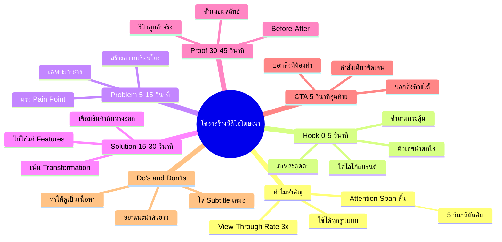

# Mind Map: โครงสร้างวีดีโอโฆษณาที่สมบูรณ์แบบ — YTADV-006
> **Format:** Mind Map (Text-based)
> **Source:** SWP3 Ch17 Youtube Advertising Mastery ตอนที่ 6
> **Production:** PinkCastle Academy | จูล่ง CTO
> **Date:** 2026-02-17

---

```
                    โครงสร้างวีดีโอโฆษณา
                   (Perfect Ad Structure)
                            |
        ┌───────────────────┼───────────────────┐
        |                   |                   |
  [ทำไมสำคัญ]         [5 องค์ประกอบ]       [Do's & Don'ts]
        |                   |                   |
        |          ┌──┬──┬──┼──┐               |
        |          |  |  |  |  |          ┌────┴────┐
        |          H  P  S  P  C          |         |
```

## Center Node: โครงสร้างวีดีโอโฆษณาที่สมบูรณ์แบบ

### Branch 1: ทำไมโครงสร้างถึงสำคัญ
- Attention Span สั้น
  - 5 วินาทีแรกตัดสินทุกอย่าง
  - คนกดข้ามถ้าไม่สนใจ
- ประสิทธิภาพสูงขึ้น 3 เท่า
  - View-Through Rate สูงกว่า 3x
  - ประหยัดงบโฆษณา
- ใช้ได้กับทุกรูปแบบ
  - Skippable Ads
  - Non-skippable Ads
  - Bumper Ads

### Branch 2: องค์ประกอบที่ 1 — Hook (เกี่ยวความสนใจ)
- ระยะเวลา: 0-5 วินาที
- เทคนิค
  - คำถามกระตุ้นความอยากรู้
  - ตัวเลข/สถิติน่าตกใจ
  - ภาพที่สะดุดตา
- ต้องทำ
  - ใส่โลโก้แบรนด์
  - ดึงความสนใจทันที

### Branch 3: องค์ประกอบที่ 2 — Problem (นำเสนอปัญหา)
- ระยะเวลา: 5-15 วินาที
- หลักการ
  - เฉพาะเจาะจง ไม่กว้าง
  - ตรง Pain Point กลุ่มเป้าหมาย
  - ให้รู้สึกว่า "นี่คือปัญหาของฉัน"

### Branch 4: องค์ประกอบที่ 3 — Solution (ทางแก้)
- ระยะเวลา: 15-30 วินาที
- หลักการ
  - เน้น Transformation ไม่ใช่ Features
  - บอกว่าชีวิตจะเปลี่ยนอย่างไร
  - เชื่อมโยงสินค้ากับทางออก

### Branch 5: องค์ประกอบที่ 4 — Proof (หลักฐาน)
- ระยะเวลา: 30-45 วินาที
- ประเภทหลักฐาน
  - รีวิวจากลูกค้าจริง
  - ตัวเลขผลลัพธ์จริง
  - รางวัล/การรับรอง
  - Before-After

### Branch 6: องค์ประกอบที่ 5 — CTA (Call to Action)
- ระยะเวลา: 5 วินาทีสุดท้าย
- หลักการ
  - CTA เดียว ชัดเจน
  - บอกว่าต้องทำอะไร
  - บอกว่าจะได้อะไร

### Branch 7: Do's (สิ่งที่ควรทำ)
- ใส่โลโก้ใน 5 วินาทีแรก
- ใช้ภาษาของกลุ่มเป้าหมาย
- ใส่ Subtitle เสมอ
- ทำให้ดูเป็นเนื้อหา ไม่ใช่โฆษณา

### Branch 8: Don'ts (สิ่งที่ไม่ควรทำ)
- อย่าแนะนำตัวยาวๆ ตอนเปิด
- อย่าใช้เพลงเปิดยาวเกิน 2 วินาที
- อย่าพูดยืดเยื้อ ตัดสิ่งไม่จำเป็นออก
- อย่ามีหลาย CTA ในวีดีโอเดียว

---



---

**จำนวน Nodes ทั้งหมด: 35 nodes**

| ระดับ | จำนวน |
|-------|-------|
| Center Node | 1 |
| Branch (ระดับ 1) | 8 |
| Sub-branch (ระดับ 2) | 16 |
| Leaf (ระดับ 3) | 10 |
| **รวม** | **35** |
