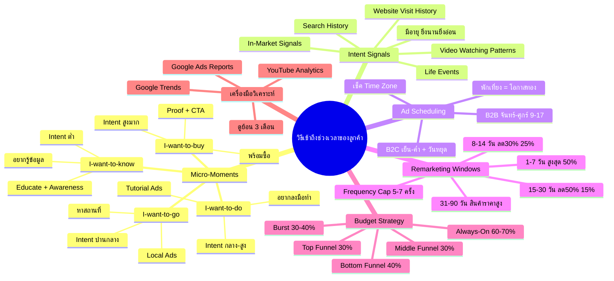
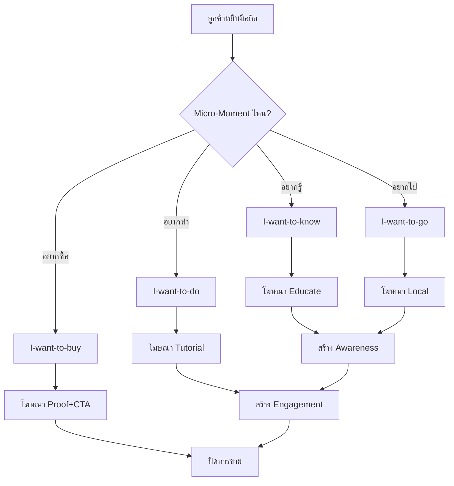
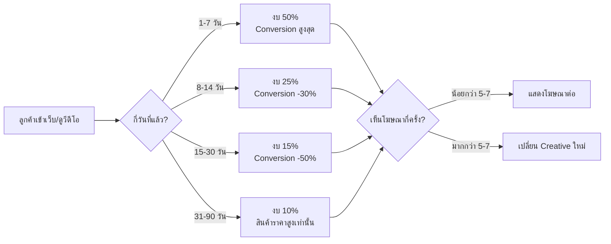
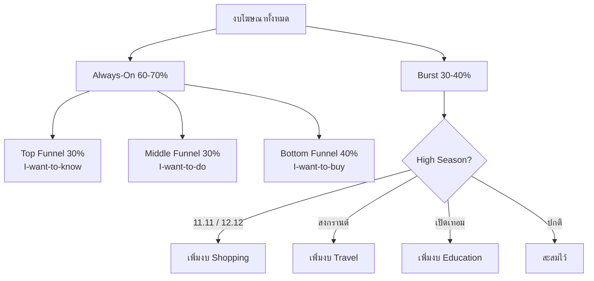
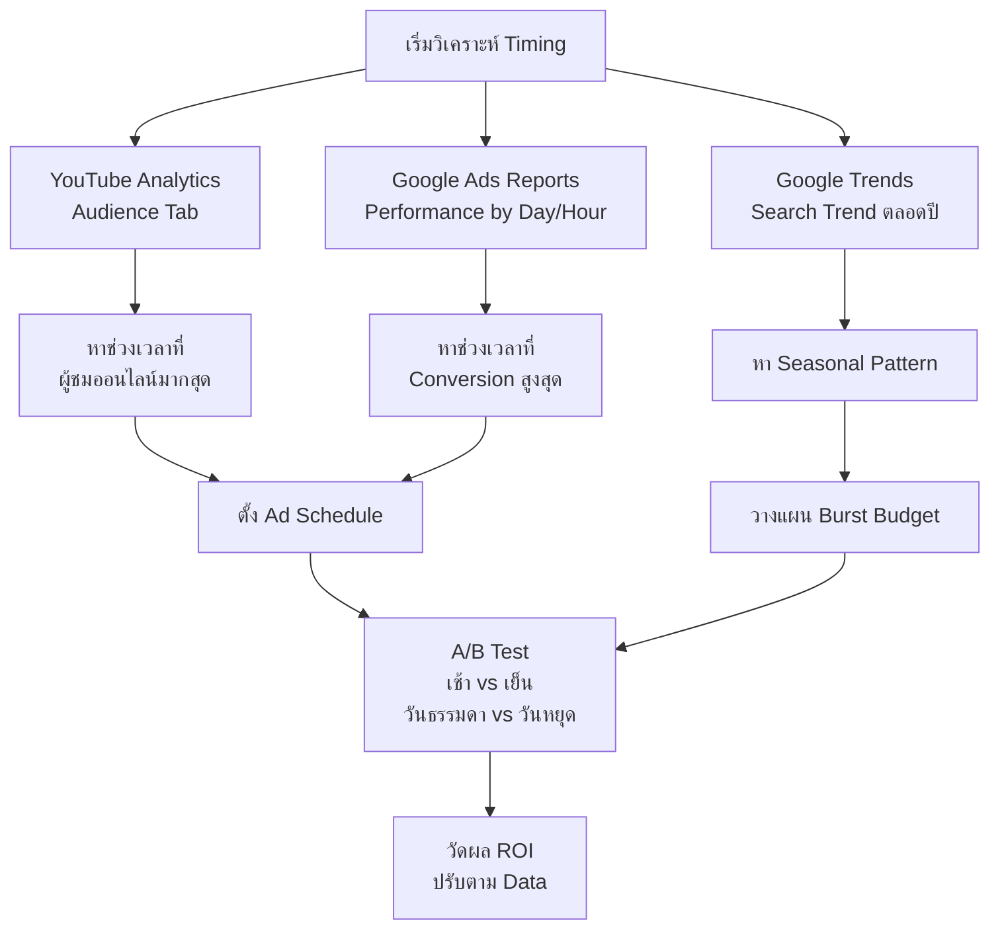

# วิธีเข้าถึงช่วงเวลาของลูกค้า — YTADV-007 Mind Map
> **Format:** Mind Map (7 Parts)
> **Source:** SWP3 Ch17 Youtube Advertising Mastery ตอนที่ 7
> **Production:** PinkCastle Academy | จูล่ง CTO
> **Date:** 2026-02-18 | **Duration:** 0:13:58

---

## Part 1: Text Tree (โครงสร้างต้นไม้)

```
วิธีเข้าถึงช่วงเวลาของลูกค้า (Customer Moment Strategy)
│
├── 1. Micro-Moments (4 ประเภท)
│   ├── I-want-to-know (อยากรู้)
│   │   ├── Intent: ต่ำ
│   │   ├── ตัวอย่าง: "YouTube Ads ทำยังไง"
│   │   └── กลยุทธ์: Educate + Brand Awareness
│   ├── I-want-to-go (อยากไป)
│   │   ├── Intent: ปานกลาง
│   │   ├── ตัวอย่าง: "ร้านกาแฟใกล้ BTS อโศก"
│   │   └── กลยุทธ์: Local Ads + Location Extension
│   ├── I-want-to-do (อยากทำ)
│   │   ├── Intent: ปานกลาง-สูง
│   │   ├── ตัวอย่าง: "วิธีตั้งค่า Google Ads"
│   │   └── กลยุทธ์: How-to Content + Tutorial Ads
│   └── I-want-to-buy (อยากซื้อ)
│       ├── Intent: สูงมาก
│       ├── ตัวอย่าง: "ซื้อ iPhone 16 ที่ไหนถูกสุด"
│       └── กลยุทธ์: Proof + CTA + Urgency
│
├── 2. Intent Signals (5 สัญญาณ)
│   ├── Search History
│   │   └── ประวัติค้นหาใน Google
│   ├── Video Watching Patterns
│   │   └── รูปแบบการดูวีดีโอบน YouTube
│   ├── Website Visit History
│   │   └── ประวัติเข้าเว็บไซต์
│   ├── Life Events
│   │   └── แต่งงาน / ย้ายบ้าน / จบ ม. / มีลูก
│   └── In-Market Signals
│       └── พฤติกรรมพร้อมซื้อ (Google วิเคราะห์)
│
├── 3. Ad Scheduling (ตารางเวลา)
│   ├── B2B: จันทร์-ศุกร์ 9:00-17:00 น.
│   ├── B2C: เย็น-ค่ำ 18:00-22:00 น. + เสาร์-อาทิตย์
│   ├── พักเที่ยง 12:00-13:00 น. = โอกาสทอง
│   └── อย่าลืม Time Zone ถ้าขายหลายประเทศ
│
├── 4. Remarketing Windows
│   ├── Window 1: 1-7 วัน → Conversion สูงสุด (งบ 50%)
│   ├── Window 2: 8-14 วัน → ลดลง 30% (งบ 25%)
│   ├── Window 3: 15-30 วัน → ลดลง 50% (งบ 15%)
│   ├── Window 4: 31-90 วัน → ต่ำมาก (งบ 10%)
│   └── Frequency Capping: สูงสุด 5-7 ครั้ง
│
├── 5. Seasonal Timing
│   ├── High Season: 11.11, 12.12, สงกรานต์, เปิดเทอม
│   ├── Search Intent พุ่ง 300-500%
│   ├── CPC สูงขึ้น (คู่แข่งเพิ่มงบ)
│   └── เตรียม Creative ล่วงหน้า 2 สัปดาห์
│
├── 6. Budget Strategy
│   ├── Always-On + Burst
│   │   ├── Always-On: 60-70% (รักษา Awareness)
│   │   └── Burst: 30-40% (เพิ่มช่วง High Season)
│   └── Budget by Funnel Stage
│       ├── Top (Know): 30%
│       ├── Middle (Do): 30%
│       └── Bottom (Buy): 40%
│
└── 7. เครื่องมือวิเคราะห์
    ├── YouTube Analytics → Audience Tab
    ├── Google Ads Reports → Performance by Day/Hour
    ├── Google Trends → Seasonal Pattern
    └── ดูย้อนหลัง 3 เดือน + Test อย่างต่อเนื่อง
```

---

## Part 2: Mermaid Mindmap



---

## Part 3: Mermaid Flowcharts

### Flowchart 1: Micro-Moment Decision Flow



### Flowchart 2: Remarketing Window Strategy



### Flowchart 3: Budget Allocation Flow



### Flowchart 4: Timing Analysis Process



---

## Part 4: Comparison Chart

### Micro-Moments vs Customer Awareness Level

| Micro-Moment | Awareness Level (YTADV-004) | Intent | โฆษณาที่เหมาะ | ตัวอย่าง CTA |
|---|---|---|---|---|
| I-want-to-know | Unaware / Problem Aware | ต่ำ | Educational, Brand Video | "เรียนรู้เพิ่มเติม" |
| I-want-to-go | Problem Aware / Solution Aware | ปานกลาง | Local, Map Extension | "ดูเส้นทาง" |
| I-want-to-do | Solution Aware | ปานกลาง-สูง | Tutorial, How-to | "ดูวิธีทำ" |
| I-want-to-buy | Product Aware / Most Aware | สูงมาก | Offer, Proof, Urgency | "สั่งซื้อตอนนี้" |

### Real-time vs Planned Campaigns

| มิติ | Real-time (Reactive) | Planned (Proactive) |
|---|---|---|
| **ลักษณะ** | ตอบสนองต่อเหตุการณ์ที่เกิดขึ้น | วางแผนล่วงหน้า |
| **ตัวอย่าง** | ข่าวดัง, Trend ใหม่, เหตุการณ์ไม่คาดคิด | Seasonal, เทศกาล, Product Launch |
| **ข้อดี** | Relevance สูงมาก, Viral Potential | ควบคุมได้, เตรียม Creative ดี |
| **ข้อเสีย** | ต้องตอบสนองเร็ว, Creative อาจไม่ดี | อาจพลาดโอกาสเฉพาะหน้า |
| **งบ** | จาก Burst Budget | จาก Always-On + Planned Burst |
| **สัดส่วนแนะนำ** | 10-20% ของ Burst | 80-90% ของ Burst |

---

## Part 5: Summary Table (10 Rows)

| # | หัวข้อ | สาระสำคัญ | ตัวเลขที่ต้องจำ | ลำดับความสำคัญ |
|---|--------|-----------|----------------|---------------|
| 1 | Micro-Moments | 4 ประเภท: Know, Go, Do, Buy — แต่ละแบบต้องใช้โฆษณาคนละรูปแบบ | 91% ค้นหาขณะทำกิจกรรมอื่น | สูงมาก |
| 2 | Intent Signals | 5 สัญญาณ: Search, Video, Website, Life Events, In-Market — มีอายุ ยิ่งนานยิ่งอ่อน | Signal เก่า 30 วัน อ่อนมาก | สูงมาก |
| 3 | Custom Intent Audience | สร้าง Audience จาก Keywords ที่ค้นหา — เจาะคนที่มี Intent จริง | ดีกว่า Demographics Targeting | สูงมาก |
| 4 | Ad Scheduling | B2B: จันทร์-ศุกร์ 9-17 / B2C: เย็น-ค่ำ + วันหยุด | พักเที่ยง 12-13 น. = โอกาสทอง | สูง |
| 5 | Remarketing Windows | 4 Windows: 1-7, 8-14, 15-30, 31-90 วัน — ยิ่งเร็วยิ่งดี | Window 1-7 วัน = งบ 50% | สูง |
| 6 | Frequency Capping | จำกัดจำนวนครั้งที่แสดงโฆษณาซ้ำ — ป้องกันความรำคาญ | สูงสุด 5-7 ครั้ง | สูง |
| 7 | Seasonal Timing | High Season มี Demand สูง แต่ CPC ก็สูง | Search Intent +300-500% | ปานกลาง-สูง |
| 8 | Always-On + Burst | สมดุลระหว่างยิงตลอดกับเพิ่มช่วงพิเศษ | 60-70% : 30-40% | ปานกลาง |
| 9 | Budget by Funnel | แบ่งงบตามระดับ Funnel: Top 30, Mid 30, Bot 40 | Bottom Funnel = 40% | ปานกลาง |
| 10 | เครื่องมือวิเคราะห์ | YouTube Analytics, Google Ads Reports, Google Trends | ดูย้อนหลัง 3 เดือนขึ้นไป | ปานกลาง |

---

## Part 6: Implementation Roadmap

```
สัปดาห์ที่ 1: Foundation
├── วันที่ 1-2: วิเคราะห์ข้อมูล
│   ├── เปิด YouTube Analytics → Audience Tab
│   ├── ดู Google Ads Reports → Performance by Day/Hour
│   └── ดู Google Trends → Seasonal Pattern
│
├── วันที่ 3-4: ตั้งค่า Remarketing
│   ├── สร้าง Remarketing List: Window 1-7 วัน
│   ├── สร้าง Remarketing List: Window 8-14 วัน
│   ├── สร้าง Remarketing List: Window 15-30 วัน
│   ├── สร้าง Remarketing List: Window 31-90 วัน
│   └── ตั้ง Frequency Capping: 5-7 ครั้ง
│
└── วันที่ 5: ตั้งค่า Targeting
    ├── สร้าง Custom Intent Audience
    └── เลือก In-Market Audience ที่เกี่ยวข้อง

สัปดาห์ที่ 2: Scheduling
├── วันที่ 1-2: ตั้ง Ad Schedule
│   ├── กำหนดช่วงเวลาตามข้อมูล Analytics
│   ├── แยก B2B / B2C ถ้ามีหลายแคมเปญ
│   └── ตั้ง Time Zone ให้ถูกต้อง
│
└── วันที่ 3-5: วางแผนงบ
    ├── แบ่ง Always-On (60-70%) vs Burst (30-40%)
    ├── แบ่งตาม Funnel Stage (30-30-40)
    └── วางปฏิทิน Seasonal ตลอดปี

สัปดาห์ที่ 3-4: Testing & Optimization
├── A/B Test: เช้า vs เย็น
├── A/B Test: วันธรรมดา vs วันหยุด
├── A/B Test: Remarketing Window ต่างๆ
├── วัดผล ROI แต่ละ Segment
└── ปรับ Budget Allocation ตามผลจริง

ทุกสัปดาห์: Maintenance
├── ดู Performance Reports
├── ปรับ Bid ตามช่วงเวลาที่ดีที่สุด
├── เปลี่ยน Creative เมื่อ Frequency สูง
└── เตรียม Creative สำหรับ Seasonal ล่วงหน้า 2 สัปดาห์
```

---

## Part 7: Key Formulas

### สูตรที่ 1: ROI ตาม Moment
```
ROI by Moment = (Revenue จาก Moment นั้น - งบที่ใช้กับ Moment นั้น) / งบที่ใช้กับ Moment นั้น x 100
```
ใช้เพื่อเปรียบเทียบว่า Moment ไหนให้ ROI ดีที่สุด แล้วจัดสรรงบตาม

### สูตรที่ 2: Effective Reach Rate
```
Effective Reach = (จำนวนคนที่เห็นโฆษณา 2-5 ครั้ง / จำนวนคนทั้งหมดที่เห็น) x 100
```
คนที่เห็น 1 ครั้งอาจยังไม่จำ คนที่เห็นมากกว่า 7 ครั้งจะรำคาญ 2-5 ครั้งคือ Sweet Spot

### สูตรที่ 3: Remarketing Decay Rate
```
Expected Conversion Rate = Base Conversion Rate x (1 - Decay Rate)^จำนวนวัน
```
Decay Rate โดยทั่วไปอยู่ที่ 3-5% ต่อวัน ยิ่งนานจาก Touch Point แรก Conversion ยิ่งลดลง

### สูตรที่ 4: Optimal Budget Split
```
งบ Always-On = งบทั้งหมด x 0.65 (ค่าเฉลี่ย)
งบ Burst = งบทั้งหมด x 0.35
งบ Top Funnel = งบ Always-On x 0.30
งบ Middle Funnel = งบ Always-On x 0.30
งบ Bottom Funnel = งบ Always-On x 0.40
```

### สูตรที่ 5: Timing Score
```
Timing Score = (Audience Online % ช่วงนั้น) x (Historical Conversion Rate ช่วงนั้น) x (1 - CPC Premium %)
```
ใช้เปรียบเทียบว่าช่วงเวลาไหนให้ค่าคุ้มค่าที่สุด ช่วงที่ Score สูงสุดคือช่วงที่ควรยิงโฆษณาหนักที่สุด

---

## Node Summary

| ระดับ | จำนวน |
|-------|-------|
| Center Node | 1 |
| Branch (ระดับ 1) | 7 |
| Sub-branch (ระดับ 2) | 28 |
| Leaf (ระดับ 3) | 45 |
| **รวม** | **81** |

---

*จำนวน Parts ทั้งหมด: 7 | Flowcharts: 4 | Formulas: 5*

> ทบทวนต่อ: **YTADV-008** — ตัวอย่างวีดีโอที่สมบูรณ์แบบ
> Series: SWP3 Ch17 Youtube Advertising Mastery
> PinkCastle Academy © 2026
