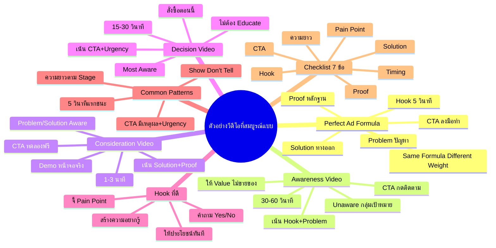
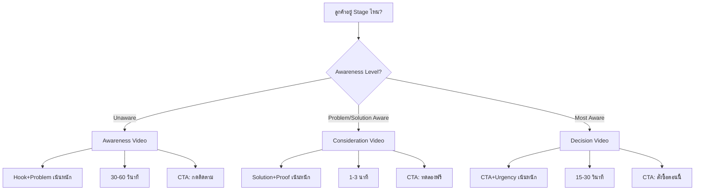
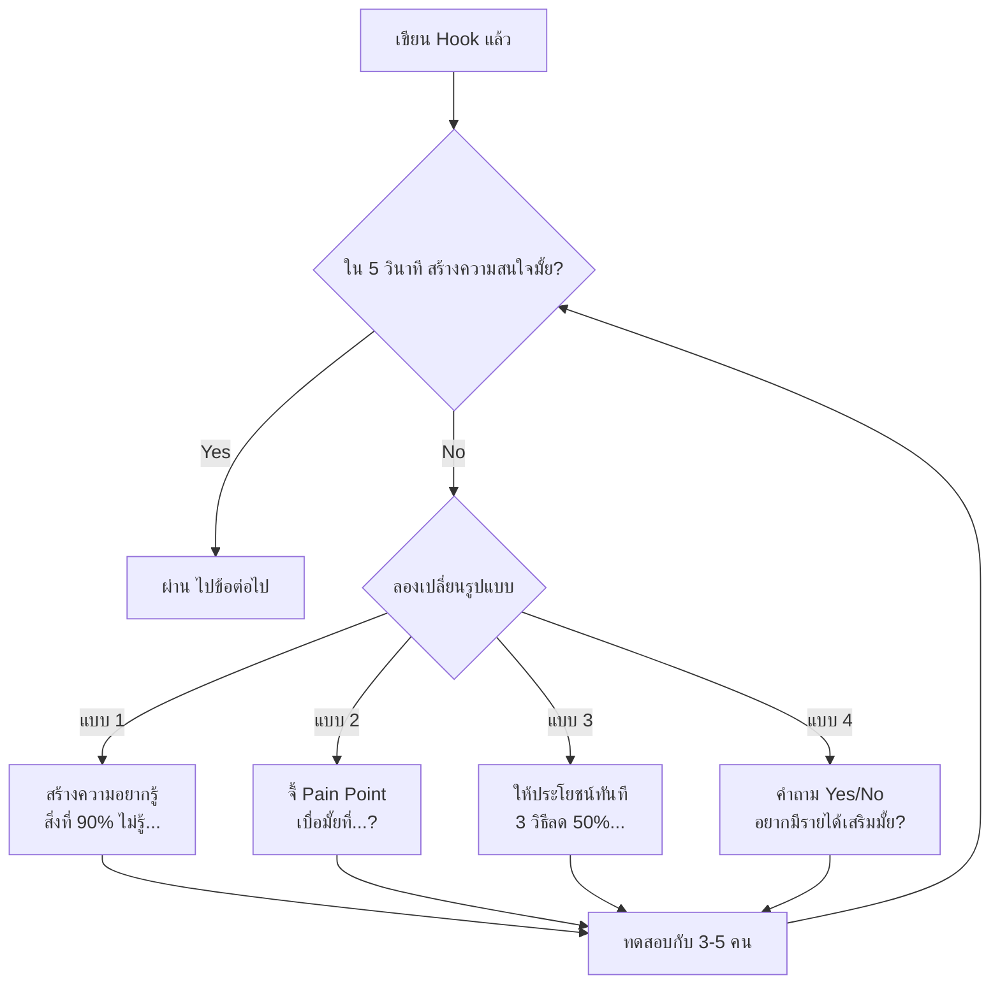
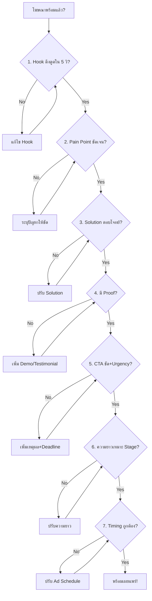
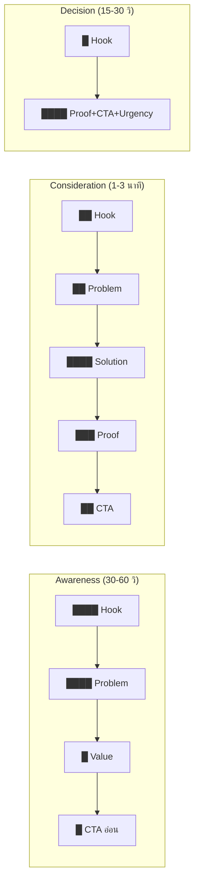

# ตัวอย่างวีดีโอที่สมบูรณ์แบบ — YTADV-008 Mind Map
> **Format:** Mind Map (7 Parts)
> **Source:** SWP3 Ch17 Youtube Advertising Mastery ตอนที่ 8
> **Production:** PinkCastle Academy | จูล่ง CTO
> **Date:** 2026-02-18 | **Duration:** 0:04:03

---

## Part 1: Text Tree (โครงสร้างต้นไม้)

```
ตัวอย่างวีดีโอที่สมบูรณ์แบบ (Perfect Video Ad Examples)
│
├── 1. ทบทวน Perfect Ad Formula (YTADV-005)
│   ├── Hook — ดึงดูดความสนใจใน 5 วินาที
│   ├── Problem — ระบุปัญหาของกลุ่มเป้าหมาย
│   ├── Solution — นำเสนอทางออก
│   ├── Proof — หลักฐานสนับสนุน
│   ├── CTA — เรียกร้องให้ลงมือทำ
│   └── หลักการ: Same Formula, Different Weight
│
├── 2. ตัวอย่างวีดีโอ Awareness
│   ├── กลุ่มเป้าหมาย: Unaware
│   ├── ความยาว: 30-60 วินาที
│   ├── เน้น: Hook + Problem
│   ├── ตัวอย่าง Hook: "เคยรู้สึกมั้ยว่าทำงานหนักแต่เงินไม่พอใช้?"
│   ├── ให้ Value ไม่ขายของ
│   └── CTA อ่อนๆ: "กดติดตาม"
│
├── 3. ตัวอย่างวีดีโอ Consideration
│   ├── กลุ่มเป้าหมาย: Problem/Solution Aware
│   ├── ความยาว: 1-3 นาที
│   ├── เน้น: Solution + Proof
│   ├── ตัวอย่าง Hook: "กำลังเปรียบเทียบเครื่องมือสร้างเว็บ ดูตรงนี้ 30 วินาที"
│   ├── Proof: Demo หน้าจอจริง
│   └── CTA: "ทดลองฟรี 14 วัน"
│
├── 4. ตัวอย่างวีดีโอ Decision
│   ├── กลุ่มเป้าหมาย: Most Aware
│   ├── ความยาว: 15-30 วินาที
│   ├── เน้น: CTA + Urgency
│   ├── ไม่ต้อง Educate — รู้จักเราแล้ว
│   ├── Urgency: "วันนี้วันสุดท้าย" / "เหลือ 50 ที่"
│   └── CTA: "สั่งซื้อตอนนี้"
│
├── 5. Hook ที่ดี vs ไม่ดี
│   ├── ไม่ดี: "สวัสดีครับ จะแนะนำผลิตภัณฑ์..."
│   │   └── ฟังเป็นโฆษณา → กด Skip ทันที
│   ├── ดี 3 รูปแบบ:
│   │   ├── สร้างความอยากรู้: "สิ่งที่ 90% ไม่รู้..."
│   │   ├── จี้ Pain Point: "เบื่อมั้ยที่...?"
│   │   └── ให้ประโยชน์ทันที: "3 วิธีลดค่าโฆษณา 50%"
│   └── Bonus: ถามคำถาม Yes/No ที่ตอบ Yes ในใจ
│
├── 6. Common Patterns (4 ข้อ)
│   ├── Pattern 1: 5 วินาทีแรกต้องชนะ
│   ├── Pattern 2: แสดง ไม่ใช่แค่บอก (Show Don't Tell)
│   │   ├── Demo หน้าจอจริง
│   │   ├── Before / After
│   │   └── Testimonial จริง
│   ├── Pattern 3: CTA ชัดเจน + มีเหตุผล
│   │   ├── ทำไมต้องคลิก? (Benefit)
│   │   └── ทำไมต้องตอนนี้? (Urgency)
│   └── Pattern 4: ความยาวตาม Stage
│
└── 7. Checklist 7 ข้อก่อนเผยแพร่
    ├── 1. Hook ใน 5 วินาทีสร้างความสนใจ?
    ├── 2. ระบุ Pain Point / Desire ชัดเจน?
    ├── 3. Solution ตอบโจทย์จริง?
    ├── 4. มี Proof / หลักฐาน?
    ├── 5. CTA ชัดเจน + มีเหตุผล?
    ├── 6. ความยาวเหมาะกับ Stage?
    └── 7. Timing ถูกต้อง (YTADV-007)?
```

---

## Part 2: Mermaid Mindmap



---

## Part 3: Mermaid Flowcharts

### Flowchart 1: เลือกรูปแบบวีดีโอตาม Awareness Level



### Flowchart 2: วิเคราะห์ Hook ก่อนเผยแพร่



### Flowchart 3: Checklist ก่อนเผยแพร่



### Flowchart 4: Perfect Ad Formula ในทางปฏิบัติ



---

## Part 4: Comparison Chart

### วีดีโอ 3 ระดับ เปรียบเทียบ

| มิติ | Awareness | Consideration | Decision |
|---|---|---|---|
| **กลุ่มเป้าหมาย** | Unaware | Problem/Solution Aware | Most Aware |
| **ความยาว** | 30-60 วินาที | 1-3 นาที | 15-30 วินาที |
| **เน้นองค์ประกอบ** | Hook + Problem | Solution + Proof | CTA + Urgency |
| **ตัวอย่าง Hook** | "ทำงานหนักแต่เงินไม่พอใช้?" | "กำลังเปรียบเทียบเครื่องมือ?" | "สำหรับคนที่รอโปร" |
| **Proof** | ไม่จำเป็น (ให้ Value) | Demo หน้าจอ / ตัวเลข | ราคา / ส่วนลด |
| **CTA** | "กดติดตาม" (อ่อน) | "ทดลองฟรี 14 วัน" (กลาง) | "สั่งซื้อตอนนี้" (แรง) |
| **วัดผลด้วย** | View Rate, Subscribers | CTR, Free Trial Sign-ups | Conversion Rate, Revenue |

### Hook ที่ดี vs ไม่ดี

| มิติ | Hook ที่ไม่ดี | Hook ที่ดี |
|---|---|---|
| **เปิดตัว** | พูดถึงตัวเอง/สินค้า | พูดถึงปัญหา/ความต้องการของคนดู |
| **ความรู้สึก** | "นี่มันโฆษณา" | "อยากรู้ต่อ" |
| **ตัวอย่าง** | "สวัสดีครับ ผมจะแนะนำ..." | "เบื่อมั้ยที่ยิงโฆษณาแล้วไม่ได้ผล?" |
| **ผลลัพธ์** | กด Skip ทันที | ดูต่อจนจบ |
| **หลักการ** | Brand-centric | Customer-centric |

---

## Part 5: Summary Table (10 Rows)

| # | หัวข้อ | สาระสำคัญ | ตัวเลข/ข้อมูลที่ต้องจำ | ลำดับความสำคัญ |
|---|--------|-----------|------------------------|---------------|
| 1 | Perfect Ad Formula | 5 องค์ประกอบ: Hook+Problem+Solution+Proof+CTA ใช้ได้ทุก Stage | สูตรเดียว ปรับน้ำหนัก | สูงมาก |
| 2 | 5 วินาทีแรกตัดสินทุกอย่าง | Hook ไม่ดี = กด Skip ทันที ต้องลงทุนกับ 5 วินาทีแรกมากที่สุด | 5 วินาที = จุดเป็นจุดตาย | สูงมาก |
| 3 | Awareness Video | เน้น Hook+Problem ให้ Value ไม่ขายของ CTA อ่อน สร้าง Brand Awareness | ความยาว 30-60 วินาที | สูงมาก |
| 4 | Consideration Video | เน้น Solution+Proof ใช้ Demo จริง ระบุกลุ่มเป้าหมายชัดเจน | ความยาว 1-3 นาที | สูง |
| 5 | Decision Video | เน้น CTA+Urgency ตรงไปตรงมา ไม่ต้อง Educate เพราะเขารู้จักเราแล้ว | ความยาว 15-30 วินาที | สูง |
| 6 | Hook 3 รูปแบบ | (1) อยากรู้ (2) จี้ Pain Point (3) ให้ประโยชน์ทันที + Bonus: ถามคำถาม Yes/No | เตรียมอย่างน้อย 3 แบบต่อโฆษณา | สูง |
| 7 | Show Don't Tell | โชว์ Demo, Before/After, Testimonial จริง แทนการพูดลอยๆ ว่า "สินค้าดี" | ทุกวีดีโอต้องมี 1+ Proof Element | ปานกลาง-สูง |
| 8 | CTA ที่มีประสิทธิภาพ | ต้องมี 2 ส่วน: เหตุผล (Benefit) + Urgency ไม่ใช่แค่ "คลิกลิงก์ด้านล่าง" | ตอบ Why + Why Now | ปานกลาง |
| 9 | Common Patterns | 4 ข้อ: (1) 5 วิแรกชนะ (2) Show Don't Tell (3) CTA มีเหตุผล (4) ความยาวตาม Stage | 4 Patterns ท่องจำ | ปานกลาง |
| 10 | Checklist 7 ข้อ | Hook, Pain Point, Solution, Proof, CTA, ความยาว, Timing — Yes ครบ 7 = พร้อม Publish | 7 ข้อ ก่อนทุก Campaign | ปานกลาง |

---

## Part 6: Implementation Roadmap

```
วันที่ 1: ศึกษาและวิเคราะห์
├── ดูตัวอย่างโฆษณาที่ได้ผล 5-10 ตัว บน YouTube
├── วิเคราะห์แต่ละตัวว่าใช้ Hook แบบไหน
├── จดว่าตัวไหนมี Show Don't Tell ที่ดี
└── สังเกตความยาวและ CTA ของแต่ละตัว

วันที่ 2-3: สร้างโฆษณาชุดแรก
├── เขียน Hook 3 แบบสำหรับแต่ละ Stage
│   ├── Awareness: Hook จี้ Pain Point
│   ├── Consideration: Hook ระบุกลุ่มเป้าหมาย
│   └── Decision: Hook ตรงไปตรงมา
├── เขียน Script ตามสูตร H+P+S+P+CTA
│   ├── Awareness Script (30-60 วินาที)
│   ├── Consideration Script (1-3 นาที)
│   └── Decision Script (15-30 วินาที)
└── ใส่ Proof Element อย่างน้อย 1 ตัวต่อวีดีโอ

วันที่ 4: ตรวจสอบด้วย Checklist
├── ตรวจ Checklist 7 ข้อกับทุกวีดีโอ
│   ├── □ Hook □ Pain Point □ Solution
│   ├── □ Proof □ CTA □ ความยาว □ Timing
│   └── ถ้ายัง No ข้อไหน → แก้ไขก่อน
├── ทดสอบ Hook กับคนรอบข้าง 3-5 คน
└── ปรับ Script ตาม Feedback

วันที่ 5: เผยแพร่และวัดผล
├── เผยแพร่โฆษณาทั้ง 3 ชุด
├── ตั้ง Ad Schedule ตาม YTADV-007
├── วัดผล: View Rate, CTR, Conversion
└── A/B Test Hook แบบต่างๆ

สัปดาห์ที่ 2+: ปรับปรุงอย่างต่อเนื่อง
├── วิเคราะห์ว่า Hook แบบไหนได้ผลดีที่สุด
├── ปรับ CTA ตาม Conversion Data
├── เปลี่ยน Proof Element ถ้า Creative เริ่มเก่า
└── สร้างโฆษณาชุดใหม่โดยใช้บทเรียนจาก Data
```

---

## Part 7: Key Formulas

### สูตรที่ 1: Perfect Ad Formula
```
Perfect Ad = Hook (5 วิ) + Problem + Solution + Proof + CTA
```
สูตรสากลที่ใช้ได้กับทุก Awareness Stage โดยปรับน้ำหนักขององค์ประกอบแต่ละตัว

### สูตรที่ 2: Weight Distribution by Stage
```
Awareness Weight  = Hook(40%) + Problem(30%) + Value(20%) + CTA(10%)
Consideration Weight = Hook(15%) + Problem(15%) + Solution(30%) + Proof(25%) + CTA(15%)
Decision Weight   = Hook(10%) + Proof(30%) + CTA(35%) + Urgency(25%)
```
น้ำหนักโดยประมาณของเวลาที่ควรให้แต่ละองค์ประกอบในแต่ละ Stage

### สูตรที่ 3: Hook Effectiveness Score
```
Hook Score = (View Rate ของวีดีโอ / Average View Rate ของ Channel) x 100
```
ถ้า Score > 100 = Hook ดีกว่าค่าเฉลี่ย, < 100 = ต้องปรับปรุง Hook

### สูตรที่ 4: Video Length by Stage
```
Awareness Length  = 30-60 วินาที (เน้น Hook + Problem)
Consideration Length = 60-180 วินาที (เน้น Solution + Proof)
Decision Length   = 15-30 วินาที (เน้น CTA + Urgency)
```
ยิ่งคนพร้อมซื้อมากเท่าไหร่ วีดีโอยิ่งสั้นได้

### สูตรที่ 5: Checklist Pass Rate
```
Pass Rate = (จำนวนข้อที่ตอบ Yes / 7) x 100%
```
เป้าหมาย: 100% (7/7) ก่อน Publish | ผ่านขั้นต่ำ: 86% (6/7) โดยข้อที่ Fail ต้องไม่ใช่ข้อ 1 (Hook) หรือข้อ 5 (CTA)

---

## Node Summary

| ระดับ | จำนวน |
|-------|-------|
| Center Node | 1 |
| Branch (ระดับ 1) | 7 |
| Sub-branch (ระดับ 2) | 26 |
| Leaf (ระดับ 3) | 38 |
| **รวม** | **72** |

---

*จำนวน Parts ทั้งหมด: 7 | Flowcharts: 4 | Formulas: 5*

> ทบทวนต่อ: **YTADV-009** — ตรวจการบ้าน
> Series: SWP3 Ch17 Youtube Advertising Mastery
> PinkCastle Academy © 2026
