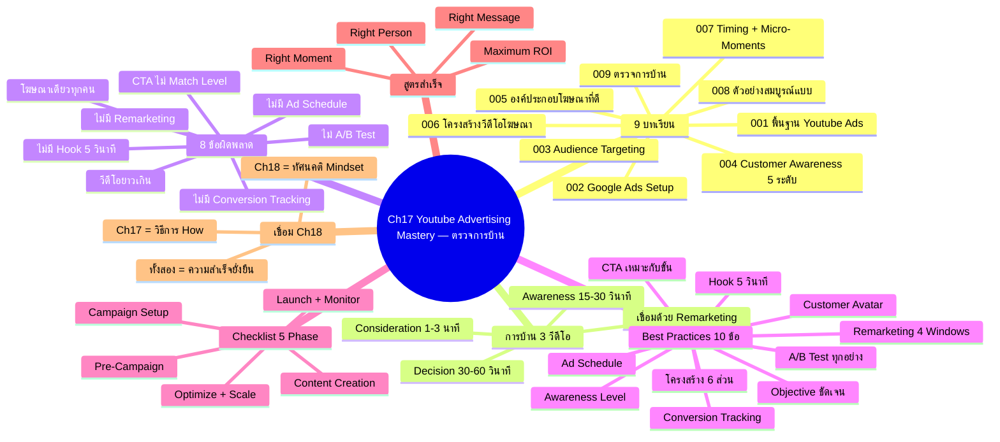
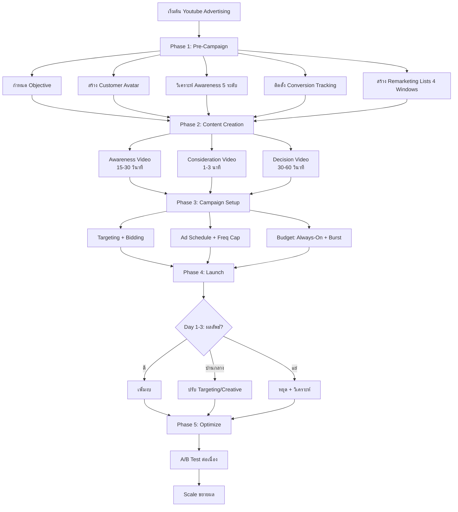
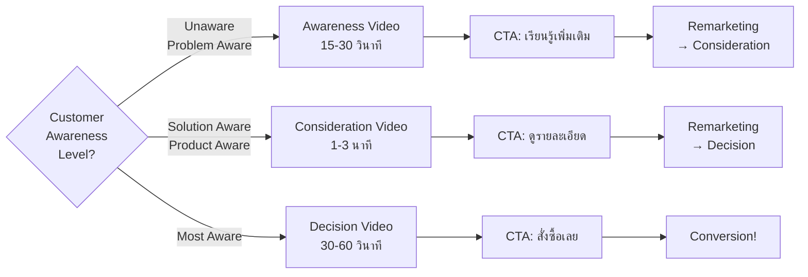
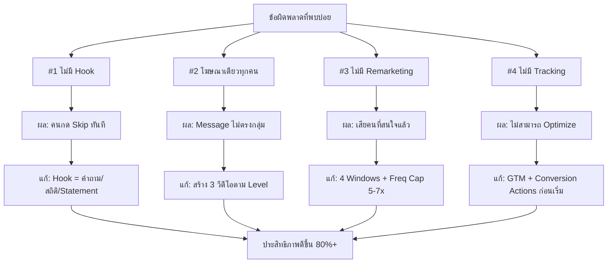
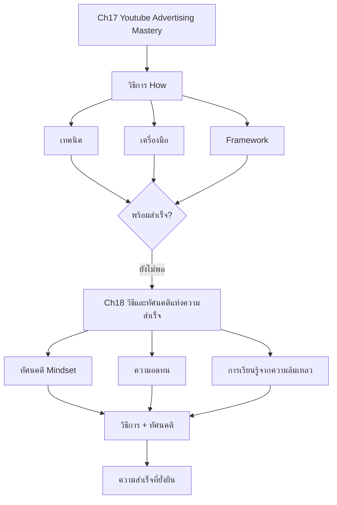

# ตรวจการบ้าน — YTADV-009 Mind Map
> **Format:** Mind Map (7 Parts)
> **Source:** SWP3 Ch17 Youtube Advertising Mastery ตอนที่ 9
> **Production:** PinkCastle Academy | จูล่ง CTO
> **Date:** 2026-02-18 | **Duration:** 2:04:20

---

## Part 1: Text Tree (โครงสร้างต้นไม้ — Ch17 ทั้งหมด)

```
Ch17 Youtube Advertising Mastery — ตรวจการบ้าน (Grand Finale)
│
├── 1. ทบทวน 9 บทเรียน
│   ├── YTADV-001: พื้นฐาน Youtube Ads
│   │   ├── ทำไมต้อง Youtube (2B+ users, Targeting, Low CPV)
│   │   └── ประเภท: Skippable, Non-Skippable, Bumper, Discovery
│   ├── YTADV-002: Google Ads Setup
│   │   ├── โครงสร้าง: Account > Campaign > Ad Group > Ad
│   │   └── Bidding: Maximize Conversions → Target CPA
│   ├── YTADV-003: Audience Targeting
│   │   ├── Demographics, Interests, Custom Audiences
│   │   └── Similar Audiences, Remarketing Lists
│   ├── YTADV-004: Customer Awareness 5 ระดับ ★
│   │   ├── Unaware > Problem Aware > Solution Aware
│   │   ├── > Product Aware > Most Aware
│   │   └── แต่ละระดับต้องใช้โฆษณาคนละแบบ
│   ├── YTADV-005: องค์ประกอบโฆษณาที่ดี ★
│   │   └── Hook > Problem > Agitation > Solution > Proof > CTA
│   ├── YTADV-006: โครงสร้างวีดีโอโฆษณา ★
│   │   └── AIDA Framework, PAS Framework, Scripting
│   ├── YTADV-007: วิธีเข้าถึงช่วงเวลาของลูกค้า ★
│   │   ├── Micro-Moments (Know, Go, Do, Buy)
│   │   ├── Remarketing Windows (1-7-14-30-90 วัน)
│   │   └── Always-On 65% + Burst 35%
│   ├── YTADV-008: ตัวอย่างวีดีโอที่สมบูรณ์แบบ
│   │   └── วิเคราะห์ Case Studies จริงทีละองค์ประกอบ
│   └── YTADV-009: ตรวจการบ้าน (วันนี้)
│       └── ทบทวน + ตรวจงาน + Checklist + เชื่อม Ch18
│
├── 2. การบ้าน: 3 วีดีโอ
│   ├── Awareness Video (15-30 วินาที)
│   │   ├── กลุ่มเป้าหมาย: คนยังไม่รู้จัก
│   │   └── CTA: "เรียนรู้เพิ่มเติม"
│   ├── Consideration Video (1-3 นาที)
│   │   ├── กลุ่มเป้าหมาย: คนกำลังพิจารณา
│   │   └── CTA: "ดูรายละเอียด"
│   └── Decision Video (30-60 วินาที)
│       ├── กลุ่มเป้าหมาย: คนพร้อมซื้อ
│       └── CTA: "สั่งซื้อเลย"
│
├── 3. ข้อผิดพลาด 8 อันดับ
│   ├── Critical
│   │   ├── #1 ไม่มี Hook ใน 5 วินาทีแรก
│   │   ├── #2 ใช้โฆษณาเดียวกับทุกกลุ่ม
│   │   ├── #3 ไม่มีแผน Remarketing
│   │   └── #4 ไม่ตั้ง Conversion Tracking
│   └── High
│       ├── #5 CTA ไม่เหมาะกับ Awareness Level
│       ├── #6 ไม่ตั้ง Ad Schedule
│       ├── #7 วีดีโอ Awareness ยาวเกินไป
│       └── #8 ไม่ทำ A/B Test
│
├── 4. Best Practices 10 ข้อ
│   ├── กำหนด Objective ชัดเจน
│   ├── ทำ Customer Avatar
│   ├── วิเคราะห์ Awareness Level
│   ├── Hook ใน 5 วินาทีแรก
│   ├── โครงสร้างครบ 6 องค์ประกอบ
│   ├── CTA เหมาะสมกับแต่ละขั้น
│   ├── ตั้ง Remarketing ตั้งแต่เริ่ม
│   ├── ตั้ง Conversion Tracking ก่อนเริ่ม
│   ├── ตั้ง Ad Schedule ตามพฤติกรรม
│   └── A/B Test ทุกอย่าง
│
├── 5. Complete Checklist 5 Phase
│   ├── Phase 1: Pre-Campaign (เตรียมตัว)
│   ├── Phase 2: Content Creation (สร้างเนื้อหา)
│   ├── Phase 3: Campaign Setup (ตั้งค่า)
│   ├── Phase 4: Launch & Monitor (เปิดตัว+ติดตาม)
│   └── Phase 5: Optimize & Scale (ปรับปรุง+ขยาย)
│
├── 6. สูตรสำเร็จ
│   ├── Right Message (YTADV-005, 006)
│   ├── + Right Person (YTADV-003, 004)
│   ├── + Right Moment (YTADV-007)
│   └── = Maximum ROI
│
└── 7. เชื่อม Ch18
    ├── Ch17 = วิธีการ (How)
    ├── Ch18 = ทัศนคติ (Mindset)
    └── ทั้งสองต้องไปด้วยกัน
```

---

## Part 2: Mermaid Mindmap



---

## Part 3: Mermaid Flowcharts

### Flowchart 1: Complete Youtube Advertising Workflow (Ch17 ทั้งหมด)



### Flowchart 2: Customer Awareness → Video Type → CTA Matching



### Flowchart 3: ข้อผิดพลาด → ผลกระทบ → วิธีแก้



### Flowchart 4: Ch17 → Ch18 Bridge



---

## Part 4: Comparison Charts

### เปรียบเทียบ 3 วีดีโอตาม Customer Journey

| มิติ | Awareness Video | Consideration Video | Decision Video |
|------|----------------|--------------------|--------------|
| **วัตถุประสงค์** | สร้างการรับรู้ | ให้ข้อมูลเพื่อพิจารณา | กระตุ้นการตัดสินใจ |
| **ความยาว** | 15-30 วินาที | 1-3 นาที | 30-60 วินาที |
| **กลุ่มเป้าหมาย** | Unaware + Problem Aware | Solution + Product Aware | Most Aware |
| **เนื้อหาหลัก** | ปัญหา + ทางออก (กว้างๆ) | ข้อมูลเชิงลึก + Proof | Offer + Urgency + CTA |
| **CTA** | "เรียนรู้เพิ่มเติม" | "ดูรายละเอียด" | "สั่งซื้อเลย" |
| **Bidding** | Maximize Views / CPV | Maximize Clicks / CPC | Maximize Conversions |
| **Remarketing** | → ส่งไป Consideration | → ส่งไป Decision | → Conversion |
| **ข้อผิดพลาดที่พบ** | ยาวเกินไป / ไม่มี Hook | ข้อมูลไม่พอ / ไม่มี Proof | CTA ไม่ชัด / ไม่มี Urgency |

### เปรียบเทียบ Critical Mistakes vs Best Practices

| ข้อผิดพลาด (Don't) | Best Practice (Do) | บทเรียนที่มา |
|---------------------|--------------------|--------------|
| เริ่มด้วย "สวัสดีครับ ผมชื่อ..." | เริ่มด้วย Hook ที่กระตุ้น Curiosity | YTADV-005 |
| ใช้โฆษณาเดียวกับทุกคน | สร้าง 3 ตัวตาม Awareness Level | YTADV-004 |
| ไม่ตาม Remarketing | 4 Windows + งบ 50% ใน 1-7 วัน | YTADV-007 |
| ไม่มี Conversion Tracking | ติดตั้ง GTM ก่อนเริ่มยิง | YTADV-002 |
| ใช้ "ซื้อเลย" กับคน Unaware | จับคู่ CTA กับ Awareness Level | YTADV-004, 005 |
| ยิง 24 ชม. ทุกวัน | Ad Schedule ตามกลุ่มเป้าหมาย | YTADV-007 |
| Awareness Video 5-10 นาที | Awareness 15-30 วินาทีเท่านั้น | YTADV-006 |
| สร้าง 1 ตัวแล้วหวัง | A/B Test อย่างน้อย 2 Variants | YTADV-008 |

---

## Part 5: Summary Table (10 Rows)

| # | หัวข้อ | สาระสำคัญ | ตัวเลขที่ต้องจำ | ลำดับความสำคัญ |
|---|--------|-----------|----------------|---------------|
| 1 | Ch17 Overview | 9 ตอน ครอบคลุมทุกมิติ Youtube Advertising ตั้งแต่พื้นฐานจนถึงขั้นสูง | 9 ตอน, 2+ ชม. session สุดท้าย | สูงมาก |
| 2 | การบ้าน 3 วีดีโอ | สร้าง Awareness (15-30s) + Consideration (1-3m) + Decision (30-60s) เชื่อมด้วย Remarketing | 3 ตัว, 3 ระดับ, 3 CTA ต่างกัน | สูงมาก |
| 3 | Hook = จุดอ่อนอันดับ 1 | ข้อผิดพลาดที่พบมากที่สุด 5 วินาทีแรกตัดสินทุกอย่าง | 5 วินาที = ชี้เป็นชี้ตาย | สูงมาก |
| 4 | แยกวีดีโอตาม Awareness | ห้ามใช้โฆษณาเดียวกับทุกกลุ่ม แต่ละระดับต้องใช้ Message คนละแบบ | 5 ระดับ Awareness, อย่างน้อย 3 วีดีโอ | สูงมาก |
| 5 | Remarketing ถูกมองข้าม | เกือบครึ่งไม่มีแผน Remarketing ทั้งที่ Window 1-7 วันให้ Conversion สูงสุด | งบ 50% ใน Window 1-7 วัน | สูงมาก |
| 6 | สูตรสำเร็จ | Right Message + Right Person + Right Moment = Maximum ROI | 3 องค์ประกอบ ขาดไม่ได้ | สูง |
| 7 | Best Practices 10 ข้อ | ครอบคลุม Pre-Campaign, Content, Setup, Optimize | 10 ข้อ จาก YTADV-001 ถึง 009 | สูง |
| 8 | Checklist 5 Phase | Pre-Campaign > Content > Setup > Launch > Optimize | 5 Phase, 30+ checklist items | สูง |
| 9 | ข้อผิดพลาด 8 อันดับ | 4 Critical + 4 High แก้ได้ = ดีขึ้น 80%+ | 8 ข้อผิดพลาด = 8 วิธีแก้ | ปานกลาง-สูง |
| 10 | Ch17 → Ch18 | Ch17 = วิธีการ (How) Ch18 = ทัศนคติ (Mindset) ทั้งสองต้องไปด้วยกัน | How + Mindset = ความสำเร็จยั่งยืน | ปานกลาง |

---

## Part 6: Implementation Roadmap

```
สัปดาห์ที่ 1: แก้ไข Critical Mistakes
├── วันที่ 1: ทบทวนข้อผิดพลาด 8 ข้อ
│   ├── ตรวจสอบวีดีโอโฆษณาปัจจุบัน
│   ├── ระบุว่าพลาดข้อไหนบ้าง
│   └── จัดลำดับความสำคัญในการแก้ไข
│
├── วันที่ 2-3: แก้ Hook + แยกวีดีโอ
│   ├── เขียน Hook ใหม่ 5 แบบ
│   ├── เขียน Script Awareness Video (15-30s)
│   ├── เขียน Script Consideration Video (1-3m)
│   └── เขียน Script Decision Video (30-60s)
│
├── วันที่ 4-5: ตั้งระบบ Tracking + Remarketing
│   ├── ติดตั้ง Google Tag Manager
│   ├── ตั้ง Conversion Actions
│   ├── สร้าง Remarketing Lists 4 Windows
│   └── ตั้ง Frequency Capping 5-7 ครั้ง
│
สัปดาห์ที่ 2: ผลิตวีดีโอ + ตั้งค่า Campaign
├── วันที่ 1-3: ผลิต 3 วีดีโอ
│   ├── ถ่ายทำตาม Script
│   ├── ตัดต่อ + เพิ่ม Subtitle
│   └── สร้าง Thumbnail ดึงดูด
│
├── วันที่ 4-5: ตั้งค่า Campaign
│   ├── โครงสร้าง: Account > Campaign > Ad Group > Ad
│   ├── ตั้ง Targeting ตาม Customer Avatar
│   ├── ตั้ง Bidding Strategy
│   ├── ตั้ง Ad Schedule
│   ├── กำหนดงบ Always-On vs Burst
│   └── สร้าง A/B Test Variants
│
สัปดาห์ที่ 3: Launch + Monitor
├── วันที่ 1: เปิดตัวแคมเปญ
│   └── ตรวจว่า Tracking ทำงานถูกต้อง
│
├── วันที่ 2-4: ติดตามผลทุกวัน
│   ├── CTR, View Rate, CPC, Conversions
│   ├── เปรียบเทียบ A/B Test
│   └── ปรับ Bid ตามผลลัพธ์
│
└── วันที่ 5: สรุปสัปดาห์แรก
    ├── วิเคราะห์อะไร Work / อะไรไม่ Work
    └── วางแผนปรับปรุง

สัปดาห์ที่ 4+: Optimize & Scale
├── ปิดโฆษณาที่ไม่ Work
├── เพิ่มงบโฆษณาที่ Work
├── ทดสอบ Creative ใหม่
├── ขยาย Audience
└── เตรียม Seasonal Burst
```

---

## Part 7: Key Formulas จาก Ch17 ทั้งหมด

### สูตรที่ 1: สูตรสำเร็จหลัก (Master Formula)
```
ROI = f(Right Message, Right Person, Right Moment)

Right Message   = Hook (5s) + Structure (HAPSC) + CTA
Right Person    = Customer Avatar × Awareness Level × Targeting
Right Moment    = Micro-Moment × Intent Signal × Ad Schedule × Remarketing Window
```
ทั้ง 3 ตัวแปรต้องทำงานร่วมกัน ขาดตัวใดตัวหนึ่ง ROI จะลดลงอย่างมาก

### สูตรที่ 2: Budget Allocation
```
งบทั้งหมด = Always-On (65%) + Burst (35%)

Always-On Budget:
  Top Funnel (Awareness)     = Always-On × 0.30
  Middle Funnel (Consideration) = Always-On × 0.30
  Bottom Funnel (Decision)   = Always-On × 0.40

Remarketing Budget (ส่วนหนึ่งของ Always-On):
  Window 1-7 วัน    = Remarketing Budget × 0.50
  Window 8-14 วัน   = Remarketing Budget × 0.25
  Window 15-30 วัน  = Remarketing Budget × 0.15
  Window 31-90 วัน  = Remarketing Budget × 0.10
```

### สูตรที่ 3: Video Length by Funnel Stage
```
Awareness Video:    15-30 วินาที  (สร้างการรับรู้)
Consideration Video: 60-180 วินาที (ให้ข้อมูลเชิงลึก)
Decision Video:     30-60 วินาที  (กระตุ้นซื้อ)
```
ความยาวต้อง Match กับ Intent ของผู้ชม ยิ่ง Awareness ต่ำ วีดีโอต้องยิ่งสั้น

### สูตรที่ 4: CTA Match Matrix
```
Awareness Level → CTA Strength

Unaware / Problem Aware → CTA อ่อน: "เรียนรู้เพิ่มเติม" / "ดูวีดีโอ"
Solution / Product Aware → CTA ปานกลาง: "ดูรายละเอียด" / "เปรียบเทียบ"
Most Aware              → CTA แรง: "สั่งซื้อเลย" / "รับส่วนลด 20%"

ข้อห้าม: อย่าใช้ CTA แรง กับ Awareness Level ต่ำ
```

### สูตรที่ 5: Improvement Impact Estimate
```
แก้ Hook (5 วินาที)         → View Rate +50-100%
แยกวีดีโอตาม Awareness     → Conversion Rate +40-60%
เพิ่ม Remarketing 4 Windows → Remarketing Conv +40-70%
ตั้ง Conversion Tracking    → Optimization Ability: 0% → 100%
ตั้ง Ad Schedule            → Budget Savings 20-30%
A/B Test 2+ Variants        → Performance +15-25%

รวม: แก้ทั้งหมด = ประสิทธิภาพดีขึ้น 80%+
```

---

## Node Summary

| ระดับ | จำนวน |
|-------|-------|
| Center Node | 1 |
| Branch (ระดับ 1) | 7 |
| Sub-branch (ระดับ 2) | 35 |
| Leaf (ระดับ 3) | 62 |
| **รวม** | **105** |

---

*จำนวน Parts ทั้งหมด: 7 | Flowcharts: 4 | Formulas: 5 | ครอบคลุม: Ch17 ทั้ง 9 ตอน*

> จบ **Ch17 Youtube Advertising Mastery** — ต่อ Ch18: วิธีและทัศนคติแห่งความสำเร็จ Youtube Ads
> Series: SWP3 Ch17 Youtube Advertising Mastery
> PinkCastle Academy © 2026
